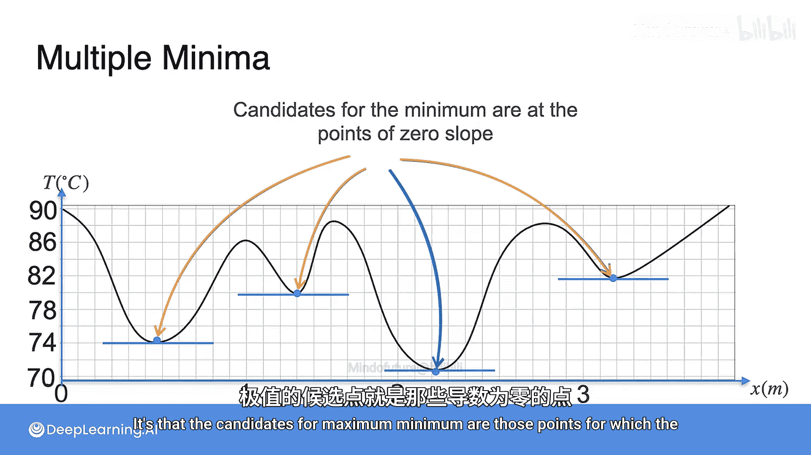

# 022：优化导论

在本节课中，我们将要学习导数在机器学习中的一个核心应用：**优化**。我们将了解如何利用导数来寻找函数的最大值或最小值，这是构建和训练机器学习模型的关键步骤。

## 概述：为什么优化很重要？

到目前为止，我们已经掌握了处理导数的多种工具。但问题是，除了计算变化率，导数还有什么用？更具体地说，为什么它们在机器学习中如此重要？

导数在机器学习中的主要应用是**优化**。优化是指寻找一个函数的**最大值**或**最小值**。这在机器学习中至关重要，因为我们的目标是找到一个能最好地拟合数据集的模型。为了找到这个模型，我们会计算一个**误差函数**，它告诉我们当前模型与理想模型之间的差距。当我们能够最小化这个误差函数时，我们就得到了最佳模型。

## 一个直观的例子：寻找桑拿房中最凉爽的位置

让我们通过一个例子来直观理解优化过程。想象你坐在桑拿房的长凳上，感觉太热了，于是你想换个位置，找到长凳上最凉爽的点。你带着一个温度计，当前读数是85摄氏度。你开始四处移动，寻找温度更低的地方。

你首先尝试向左移动，温度计显示90摄氏度，温度反而升高了，这不是好方向。于是你尝试向另一个方向移动，温度计显示80摄氏度，这好多了。你继续朝这个方向移动，因为最凉爽的点似乎就在那边。你不断移动，记录到的温度越来越低，直到到达一个点：无论你朝哪个方向移动，温度都会升高。于是你得出结论，这里一定是桑拿房中最凉爽的位置。

## 用函数和导数分析

现在，让我们用数学的眼光来看待这个过程。下图中的曲线代表了长凳上每个点的温度。

*   **A点**是你的初始位置。
*   **B点**是你第一次尝试向左移动的位置，温度更高了。
*   **C点**是你第二次尝试向右移动的位置，温度降低了。
*   你从C点继续向右移动，温度持续降低。
*   最终，你到达了**D点**，在这里，无论朝哪个方向移动，温度都会升高，因此你认为这是最凉爽的点。

这与导数有什么关系呢？让我们观察这些点上切线的斜率。

*   在所有**向右移动能到达更凉爽点**的位置（如C点），切线的斜率**小于0**。
*   在所有**向左移动能到达更凉爽点**的位置（如B点），切线的斜率**大于0**。
*   在最凉爽的点（D点），无论朝哪个方向移动都会变热，该点的切线斜率**等于0**。

这是一个关于最大值和最小值点非常有趣的性质：**在这些点上，切线的斜率（即导数）总是0**。

## 局部最优与全局最优

上一节我们介绍了导数在寻找最值点中的应用，本节中我们来看看一个重要的细节：并非所有导数为零的点都是我们最终要找的全局最优点。

请看下面这个更复杂的桑拿房温度曲线。

最冷的点（全局最小值）在图中靠右的位置。但曲线上有好几个点的导数都为0。不幸的是，你必须检查所有这些点，才能确定哪个是实际最冷的点。因此，这些点都是**候选点**，但至少你将搜索范围缩小到了少数几个点上。

这些导数为零的候选最小值点被称为**局部最小值**。而整个函数上最低的那个点被称为**全局最小值**。

## 核心概念总结

所以，当你想要优化一个函数（无论是最大化还是最小化），如果该函数在每一点都可导，那么你可以确定一件事：**函数取得最大值或最小值的候选点，就是那些导数为0的点**。

用公式表示这个核心思想：
> 若函数 `f(x)` 在点 `x*` 处取得局部极值（最大值或最小值），且 `f(x)` 在 `x*` 处可导，则 `f'(x*) = 0`。

## 本节课总结

在本节课中，我们一起学习了：
1.  **优化的定义**：寻找函数的最大值或最小值。
2.  **优化在机器学习中的重要性**：通过最小化误差函数来找到最佳模型。
3.  **导数与最优点的关系**：函数在局部最优点处的导数为零（`f'(x) = 0`）。
4.  **局部最优与全局最优的区别**：导数为零的点是候选极值点（局部最优），我们需要从中找出真正的全局最优点。

理解导数如何帮助我们找到这些关键点，是掌握机器学习算法（如梯度下降）工作原理的基础。在接下来的课程中，我们将学习如何利用这一原理，系统地寻找复杂函数的最优解。