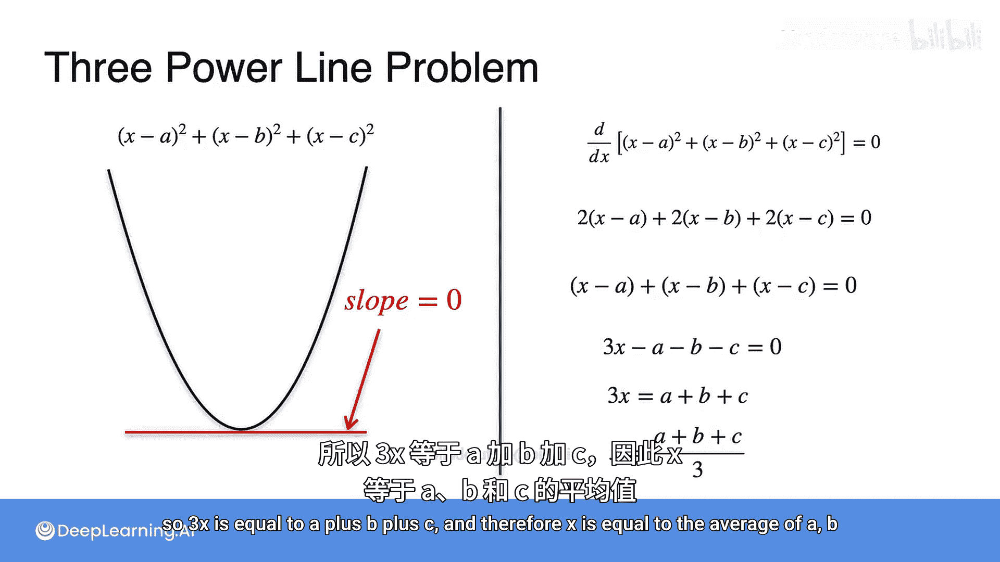
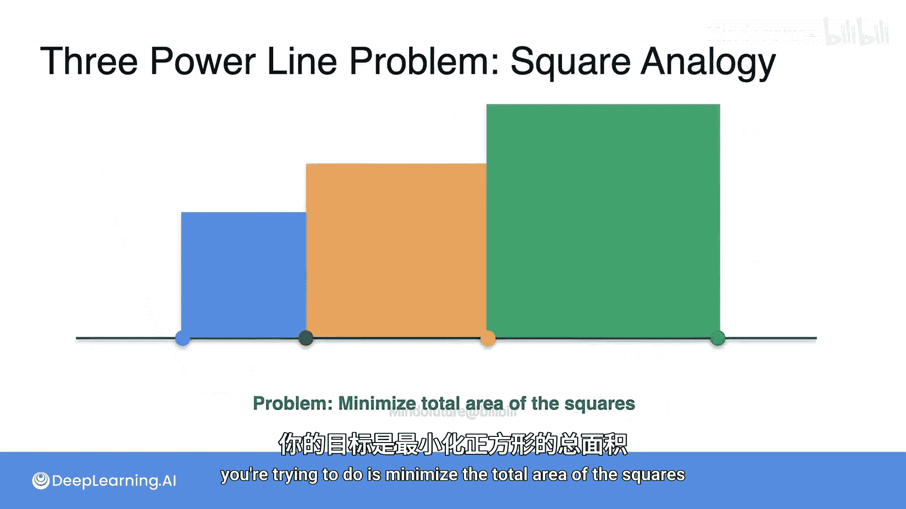
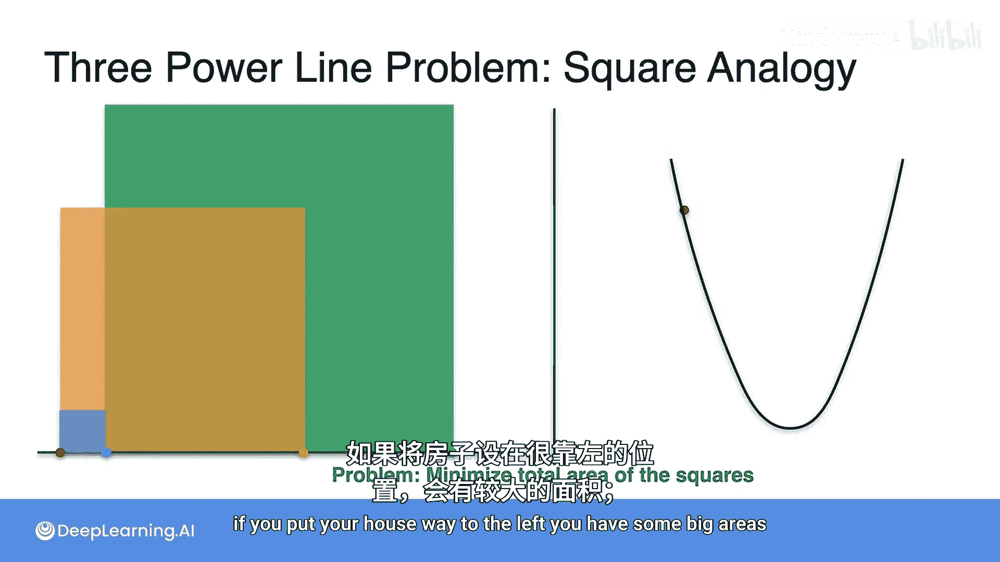
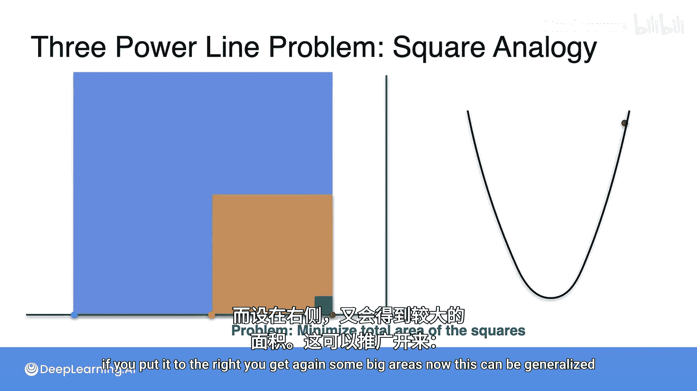
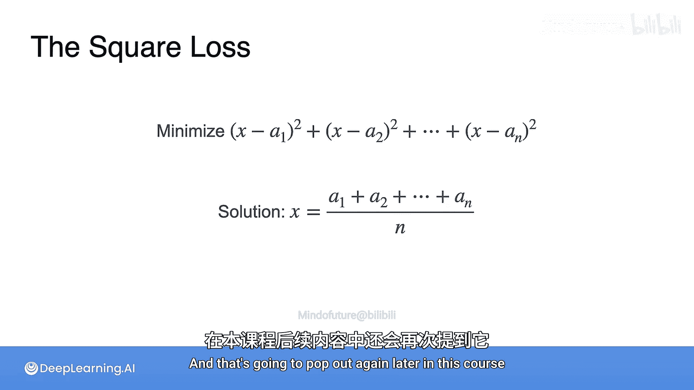

# 025：平方损失优化-三输电线问题


在本节课中，我们将学习如何将平方损失函数应用于一个更复杂的问题：为三根输电线定位房屋，以最小化连接成本。我们将通过几何和代数两种方法来理解最优解。

上一节我们介绍了为两根输电线定位房屋的问题，本节中我们来看看当问题扩展到三根输电线时，解决方案会发生什么变化。

## 问题定义

现在问题变得更复杂，因为有三根输电线，第三根位于距离原点 `C` 的位置。问题依然是：房屋应该建在哪里，才能使连接成本最小化？

回忆一下，房屋到三根输电线的距离分别是：
*   到第一根线（坐标 `a`）：`x - a`
*   到第二根线（坐标 `b`）：`x - b`
*   到第三根线（坐标 `c`）：`x - c`

我们无需担心是 `x - b` 还是 `b - x`，因为当我们对这些差值取平方时，结果总是正数。`(b - x)^2` 与 `(x - b)^2` 是相等的。

## 几何视角：面积表示

我们可以将成本可视化为正方形的面积。每个正方形的边长是房屋到对应输电线的距离，其面积代表连接到该输电线的成本。

*   **蓝色正方形**：面积为 `(x - a)^2`，代表连接到第一根（蓝色）输电线的成本。
*   **橙色正方形**：面积为 `(x - b)^2`，代表连接到第二根（橙色）输电线的成本。
*   **绿色正方形**：面积为 `(x - c)^2`，代表连接到第三根（绿色）输电线的成本。这个成本通常更高，因为第三根线通常更远。

我们的目标是**最小化连接的总成本**，这等价于**最小化这三个正方形的总面积**。

## 构建成本函数

以下是整个问题的成本函数：
```
总成本 = (x - a)^2 + (x - b)^2 + (x - c)^2
```
这个函数就是三个正方形面积的总和。问题转化为：我们应该将 `x`（房屋位置）设置在何处，才能最小化这个总成本？

## 代数求解：寻找最优x

为了找到使成本最小的 `x`，我们需要找到成本函数的导数（即斜率）为零的点。

1.  **求导**：
    成本函数 `f(x) = (x - a)^2 + (x - b)^2 + (x - c)^2` 的导数为：
    `f'(x) = 2(x - a) + 2(x - b) + 2(x - c)`

2.  **设导数为零**（寻找最小点）：
    `2(x - a) + 2(x - b) + 2(x - c) = 0`

3.  **简化方程**：
    两边同时除以2：`(x - a) + (x - b) + (x - c) = 0`
    合并同类项：`3x - (a + b + c) = 0`
    因此：`3x = a + b + c`

4.  **得出最优解**：
    `x = (a + b + c) / 3`



**结论**：最优的房屋位置 `x` 是三个输电线坐标 `a`, `b`, `c` 的算术平均值。



## 几何验证与推广



从面积角度看，如果将房屋放在最左边，某些正方形的面积会非常大；放在中间，所有正方形的面积都相对较小；放在最右边，同样会出现大面积的正方形。最优位置（平均值点）实现了总面积的全局最小化。



这个结论可以推广到更多输电线的情况。如果有 `n` 根输电线，坐标分别为 `a1, a2, ..., an`，那么最小化平方和损失的最优解就是将房屋放在所有坐标的平均值处：
```
最优 x = (a1 + a2 + ... + an) / n
```
这个“平方损失”函数在机器学习中极其重要，我们将在后续课程中再次遇到它。

---



本节课中我们一起学习了如何利用平方损失函数解决多目标（三输电线）的优化问题。我们通过构建成本函数、求导并设为零，推导出最优解是所有目标点坐标的平均值。这个方法不仅适用于三根输电线，还可以推广到任意数量的目标点，是理解机器学习中回归问题基础原理的重要一步。