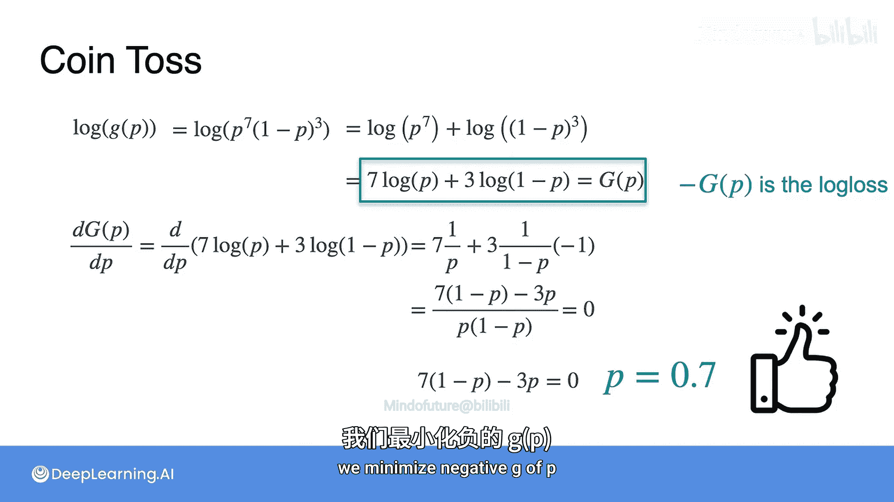

# 026：对数损失优化第一部分

## 概述
在本节课程中，我们将通过一个抛硬币游戏的例子，学习机器学习中一个非常重要的概念——**对数损失**。我们将看到如何通过微积分来优化一个概率模型，并理解为何取对数可以极大地简化计算过程。

---

## 从平方损失到对数损失
上一节我们介绍了一个使用**平方损失**进行优化的例子。现在，我们将探讨机器学习中另一个极其重要的函数——**对数损失**。同样，我们将通过一个具体的例子来理解它。

我倾向于用抛硬币的例子来解释机器学习和统计学中的大多数概念。让我们来玩一个游戏。

## 抛硬币游戏
我将抛一枚硬币10次，并观察结果。如果结果是**7次正面**，然后是**3次反面**，那么你将赢得一大笔钱。否则，你将一无所获。赢得游戏的概率看起来相当渺茫，但你可以**选择你想使用的硬币**，并且这可以是一枚有偏见的硬币。

以下是三枚硬币：
*   **硬币1**：正面朝上的概率为 **70%**，反面朝上的概率为 **30%**。
*   **硬币2**：一枚公平的硬币，正反面概率均为 **50%**。
*   **硬币3**：一枚有偏见的硬币，与硬币1相反，正面朝上的概率为 **30%**，反面朝上的概率为 **70%**。

现在有一个问题：为了最大化你赢得游戏的机会，你会选择三枚硬币中的哪一枚？请记住，要赢得游戏，你必须让硬币**连续7次正面朝上**，然后**连续3次反面朝上**。

## 计算获胜概率
为了选择最好的硬币，我们来计算使用每枚硬币赢得游戏的概率。

*   **对于硬币1**：正面概率 `p = 0.7`，反面概率 `1-p = 0.3`。连续7次正面的概率是 `0.7^7`，连续3次反面的概率是 `0.3^3`。由于这些事件是独立的，总概率是它们的乘积：
    `P(赢 | 硬币1) = 0.7^7 * 0.3^3 ≈ 0.00222`

*   **对于硬币2**：`p = 0.5`。
    `P(赢 | 硬币2) = 0.5^7 * 0.5^3 = 0.5^10 ≈ 0.00097`

*   **对于硬币3**：`p = 0.3`。
    `P(赢 | 硬币3) = 0.3^7 * 0.7^3 ≈ 0.00008`

如你所见，**硬币1**是最好的选择，它能让我们以最高的概率赢得游戏。

## 寻找全局最优解
然而，这里有一个更深层次的问题：硬币1是所有可能创造的硬币中**最好的那一枚**吗？为了回答这个问题，我们需要用到微积分。

让我们定义一枚通用硬币，其正面朝上的概率为 `p`，反面朝上的概率为 `1-p`（因为概率总和必须为1）。我们的目标是找到能最大化获胜概率的**最优 `p` 值**。

首先，获胜概率函数 `g(p)` 是：
`g(p) = p^7 * (1-p)^3`

我们需要使用微积分来最大化 `g(p)`。方法是对 `g(p)` 求导并令其等于零。

以下是求导过程：
1.  应用乘积法则：`d/dp [u*v] = u'*v + u*v'`，其中 `u = p^7`，`v = (1-p)^3`。
    `g'(p) = (7p^6) * (1-p)^3 + p^7 * [3*(1-p)^2 * (-1)]`
    （注意：对 `(1-p)^3` 求导使用了链式法则，内层导数 `-1` 来自 `d(1-p)/dp`）

2.  整理并提取公因式：
    `g'(p) = p^6 * (1-p)^2 * [7(1-p) - 3p]`

3.  令导数等于零：`g'(p) = 0`。
    一个乘积为零意味着至少有一个因子为零：
    *   `p^6 = 0` => `p = 0`
    *   `(1-p)^2 = 0` => `p = 1`
    *   `7(1-p) - 3p = 0` => `7 - 7p - 3p = 0` => `7 = 10p` => `p = 0.7`

`p = 0` 和 `p = 1` 没有意义，因为硬币总是反面或总是正面，无法产生所需的序列。因此，**最优解是 `p = 0.7`**。这证实了硬币1确实是我们能选择的最佳硬币。

## 更简单的方法：取对数
上面的计算过程有些繁琐。有没有更简单的方法呢？答案是肯定的，而且这个方法在机器学习中非常常用。

这个技巧就是：对概率函数 `g(p)` **取自然对数**。因为如果 `g(p)` 在某个点取得最大值，那么 `ln(g(p))` 也在同一点取得最大值。所以最大化 `ln(g(p))` 等价于最大化 `g(p)`。

让我们定义 `G(p) = ln(g(p))`：
`G(p) = ln( p^7 * (1-p)^3 )`

利用对数的性质：
1.  积的对数等于对数的和：`ln(a*b) = ln(a) + ln(b)`
2.  幂的对数等于指数乘以对数的底：`ln(a^b) = b * ln(a)`

应用这些性质：
`G(p) = ln(p^7) + ln((1-p)^3) = 7 * ln(p) + 3 * ln(1-p)`

现在，我们最大化这个简化后的函数 `G(p)`。对其求导：
`G'(p) = 7 * (1/p) + 3 * (1/(1-p)) * (-1)`
（注意：对 `ln(1-p)` 求导使用了链式法则，内层导数为 `-1`）

令导数等于零：
`7/p - 3/(1-p) = 0`

通分并求解：
`[7(1-p) - 3p] / [p(1-p)] = 0`
由于我们已经排除了 `p=0` 和 `p=1` 的情况，分母不为零。因此，只需令分子为零：
`7(1-p) - 3p = 0`
`7 - 7p - 3p = 0`
`7 = 10p`
`p = 0.7`

我们得到了与之前完全相同的解，但计算过程**简单得多**。

## 从对数概率到对数损失
在机器学习中，取对数的技巧非常流行。**概率的对数**（log-probability）非常常见且有用。

实际上，我们通常关心的不是 `G(p)`，而是它的**负值**，即 **`-G(p)`**。这个函数被称为**对数损失**（Log Loss），是机器学习分类问题中一个非常有用的损失函数。

我们取负值的原因在于：当概率 `p` 在0和1之间时，`ln(p)` 是一个负数。取负号后，`-ln(p)` 就变成了正数。并且，我们通常的优化目标从**最大化概率**（或对数概率），转变为**最小化损失**。因此，我们最终的目标是**最小化负的对数似然**，即最小化对数损失。

对于一个数据点，如果其真实标签为 `y`（例如1代表正面），模型预测为正面的概率为 `p`，那么该点的对数损失通常定义为：
`Loss = - [ y * ln(p) + (1-y) * ln(1-p) ]`

---

## 总结
在本节课中，我们一起学习了：
1.  通过一个抛硬币游戏的例子，引入了**优化概率模型**的问题。
2.  使用传统微积分方法（求导）找到了能最大化获胜概率的最优硬币偏差 `p = 0.7`。
3.  学习了通过**取对数**来简化优化过程的强大技巧，将复杂的乘积求导转化为简单的求和求导。
4.  引出了机器学习中的核心概念——**对数损失**，它本质上是**负的对数似然**，是分类模型常用的优化目标。

理解对数损失及其背后的数学原理，对于掌握逻辑回归等分类算法至关重要。在下一节中，我们将更深入地探讨对数损失在具体机器学习模型中的应用。