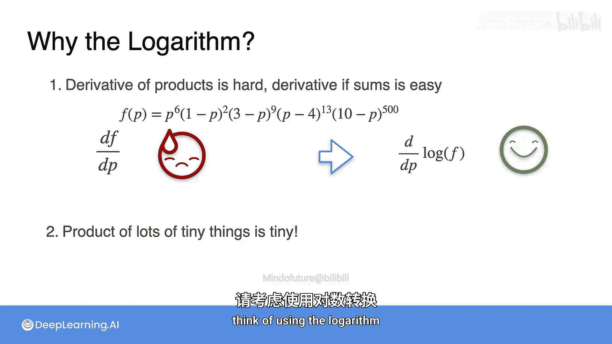

# 027：对数损失优化第二部分

## 概述

在本节课中，我们将深入探讨为什么在机器学习中，尤其是在优化模型参数时，我们倾向于使用对数损失函数，而不是直接处理原始的概率乘积。我们将从数学和计算两个角度来理解对数的优势。

## 回顾：寻找最优模型

在上一节视频中，我们通过优化对数损失函数，找到了最能拟合数据（10次抛硬币，7次正面，3次反面）的模型参数 `P`（硬币正面朝上的概率）。我们得出的最优解是 `P = 0.7`。

这个过程本质上就是机器学习：我们有一个数据集（抛硬币结果），一个模型（参数为 `P` 的硬币），并通过最小化损失函数来找到最可能产生该数据集的模型参数。

## 为什么使用对数损失？

我们找到了最优的 `P`，但一个自然的问题是：为什么我们要使用带有**对数**的损失函数？为什么不能直接对原始的概率乘积求导来优化呢？

### 原因一：简化求导过程

直接对概率乘积求导非常复杂。让我们来看看原因。

假设我们的似然函数是多个概率的乘积，例如：
`L(P) = P^7 * (1-P)^3`

这个函数的导数计算起来很繁琐。对于两个项的乘积，我们可以使用乘积法则。但对于三个、四个，甚至像这里一样多个项的乘积，就需要反复应用乘积法则，过程会变得极其混乱。

**相比之下**，如果我们先对这个乘积取对数，就将其转化为了求和的形式：
`log(L(P)) = 7*log(P) + 3*log(1-P)`

现在，对这个对数似然函数求导就变得非常简单：
`d/dP [log(L(P))] = 7/P - 3/(1-P)`

虽然我们因此引入了分母（这是对数函数 `log(x)` 的导数为 `1/x` 的性质决定的），但这是一个很小的代价。与处理左边那个复杂的乘积导数公式相比，对数和的形式要清晰、易处理得多。

### 原因二：避免数值下溢

使用对数的另一个重要原因是计算上的。概率是介于0和1之间的数。当我们需要计算大量（例如成千上万个）概率的乘积时，结果会变得极其微小。

例如，1000个介于0和1之间的数的乘积，其结果可能小到计算机无法精确表示（这种现象称为“数值下溢”）。

**然而**，如果我们取对数，情况就不同了。一个非常小的数的对数，会变成一个非常大的负数（例如，`log(0.0000001) ≈ -16.1`）。计算机可以轻松地处理和存储这些大数值的负数，从而避免了数值下溢的问题。

## 核心要点总结

以下是我们在机器学习中使用对数变换的两个关键原因：

1.  **数学简化**：将对数应用于概率乘积，可以将复杂的乘法运算转化为简单的加法运算，极大简化了后续的求导和优化过程。
2.  **数值稳定**：对数变换可以将极小的概率值映射为可管理的数值范围，有效防止在计算大量概率乘积时出现数值下溢，保证了计算的稳定性和精度。

## 总结

本节课中，我们一起学习了在机器学习优化问题中使用对数损失函数的深层原因。我们了解到，对数不仅是一个数学技巧，能将棘手的乘积求导转化为简单的求和求导，更是一个计算工具，能确保我们的算法在面临大量微小概率时依然稳定运行。因此，**任何在机器学习中遇到复杂概率乘积的情况，都应考虑使用对数进行简化**，这通常会带来巨大的便利，尤其是在进行求导优化时。