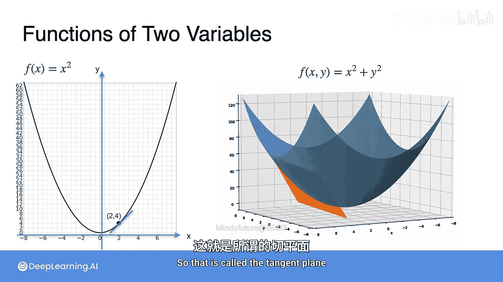
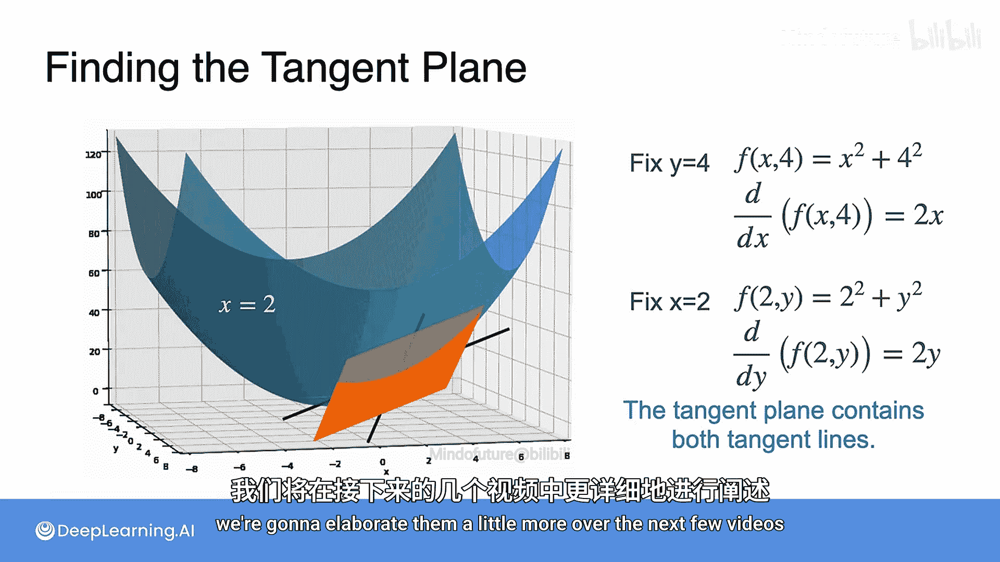

# 029：切平面导论 🧮

在本节课中，我们将学习多变量函数的核心概念，特别是如何将单变量函数的导数思想推广到两个或更多变量的情况。我们将重点介绍**切平面**的概念，这是理解多变量函数变化率的基础。

上一节我们回顾了单变量函数的导数，本节中我们来看看当函数输入变为两个时，情况会发生怎样的变化。

## 从切线到切平面

在第一周，我们学习了单变量函数的导数。例如，函数 **f(x) = x²** 的图像是一条抛物线。在视觉上，我们可以将每一点的导数理解为该点切线的斜率。例如，在点 **(2, 4)** 处，切线的斜率是 **4**。

那么，如果我们有一个双变量函数呢？让我们考虑一个简单的例子：**f(x, y) = x² + y²**。这个函数有两个输入和一个输出，因此需要在三维空间中绘制。其中，X 和 Y 是地板平面上的两个水平轴，Z（即 f(x, y)）被绘制为高度。

此时，“切线”不再是线，而是**平面**，如下图所示。这个平面被称为**切平面**。

## 如何得到切平面？

本质上，其原理与单变量情况相同，只是我们需要考虑两个方向。我们必须通过平面来“切割”空间，然后分别计算这些平面上的切线。

例如，我们固定 **y = 4**。这意味着我们在此处切割空间，得到一条红色的抛物线。接着，我们固定 **x = 2** 再次切割空间，得到另一条红色的抛物线。在这两条抛物线上，我们分别可以找到一条切线。一旦有了两条相交的切线，它们就唯一确定了一个平面，这个平面就是切平面。

以下是具体的计算步骤：
1.  当固定 **y = 4** 时，函数变为 **f(x, 4) = x² + 4²**。我们对此函数关于 **x** 求导，得到导数为 **2x**。这就是其中一条切线的斜率。
2.  当固定 **x = 2** 时，函数变为 **f(2, y) = 2² + y²**。我们对此函数关于 **y** 求导，得到导数为 **2y**。这就是另一条切线的斜率。

通过这两条切线，我们就能确定切平面。

## 核心概念与后续内容

上述计算可能看起来有些令人困惑，但请不要担心。在接下来的几个视频中，我们将详细阐述这些概念，并介绍一种名为**梯度下降**的强大方法，它能帮助我们在多变量情况下更高效地进行优化，这在机器学习中至关重要。

本节课中我们一起学习了双变量函数切平面的基本概念。我们看到了如何通过固定一个变量、考察另一个变量的变化（即求**偏导数**）来构建切平面。这是理解多变量微积分的基石，也是后续学习优化算法（如梯度下降）的关键准备。