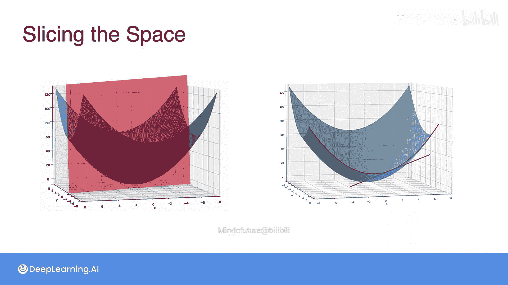
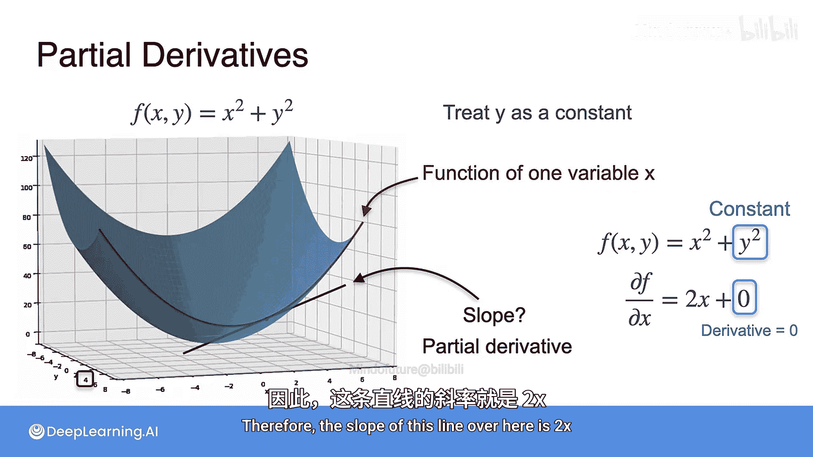
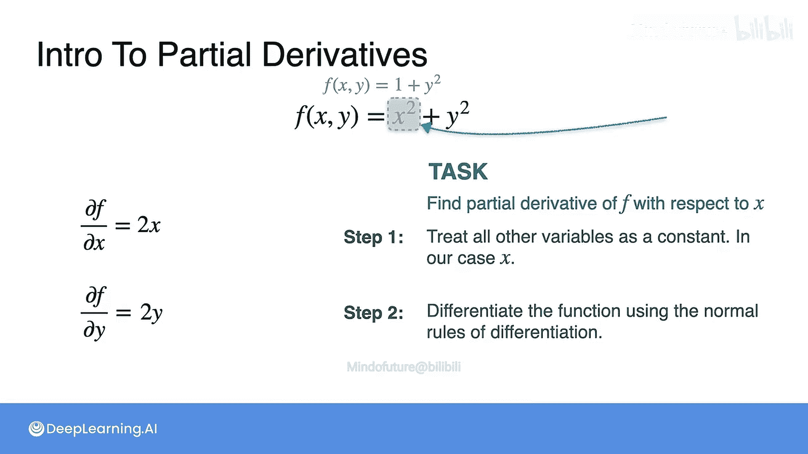

# 030：偏导数第一部分

## 概述
在本节课中，我们将要学习**偏导数**的概念。偏导数是多变量函数微积分中的核心工具，它帮助我们理解当只改变一个变量而保持其他变量不变时，函数的变化率。这对于理解机器学习中复杂的模型如何随参数变化至关重要。

## 偏导数的几何直观

上一节我们介绍了多变量函数，本节中我们来看看如何从几何角度理解偏导数。

想象一个在三维空间中绘制的二元函数图像。如果我们用一个平面去“切割”这个曲面，会得到一条曲线。例如，用一个平行于x-z平面的平面去切割，会得到一条红色的抛物线。在这条抛物线上，我们可以画一条黑色的切线。这条切线的斜率，就是函数在特定点关于x的**偏导数**。

同样，我们也可以用平行于y-z平面的平面去切割曲面，得到另一条红色抛物线，其上的切线斜率就是函数关于y的偏导数。

## 如何计算偏导数

理解了偏导数的几何意义后，我们来看看如何具体计算它。

计算偏导数的过程非常简单，遵循两个核心步骤。以下是计算步骤：

1.  **固定其他变量**：将除了要对其求导的那个变量之外的所有其他变量都视为常数。
2.  **常规求导**：将函数视为仅关于该变量的单变量函数，并应用常规的求导法则。

让我们通过一个具体例子来演示。假设我们有一个函数：
`f(x, y) = x² + y²`

**计算关于x的偏导数 (∂f/∂x)**：
*   **步骤1**：将 `y` 视为常数。此时 `y²` 就是一个常数项。
*   **步骤2**：对 `x` 求导。`x²` 的导数是 `2x`，常数项 `y²` 的导数是 `0`。
*   **结果**：`∂f/∂x = 2x`

**计算关于y的偏导数 (∂f/∂y)**：
*   **步骤1**：将 `x` 视为常数。此时 `x²` 就是一个常数项。
*   **步骤2**：对 `y` 求导。常数项 `x²` 的导数是 `0`，`y²` 的导数是 `2y`。
*   **结果**：`∂f/∂y = 2y`

## 偏导数的符号表示

对于一个二元函数 `f(x, y)`，我们有两种常见的偏导数符号表示方法：

*   **关于x的偏导数**：
    *   莱布尼茨记号：`∂f/∂x`
    *   下标记号：`f_x`
*   **关于y的偏导数**：
    *   莱布尼茨记号：`∂f/∂y`
    *   下标记号：`f_y`

可以想象，如果一个函数有10个变量（例如 `f(x₁, x₂, ..., x₁₀)`），那么我们就可以求出10个偏导数，每个都是固定其他9个变量后，对其中一个变量求导的结果。

## 总结
本节课中我们一起学习了**偏导数**。我们首先通过三维图像的“切割”获得了其几何直观：它代表了在多变量函数中，仅沿一个坐标轴方向变化时的瞬时变化率（切线斜率）。然后，我们掌握了计算偏导数的两步法：**1) 固定其他变量为常数；2) 对目标变量应用单变量求导法则**。最后，我们熟悉了偏导数的两种常用符号表示（`∂f/∂x` 和 `f_x`）。理解偏导数是学习梯度、方向导数以及后续优化算法的基础。