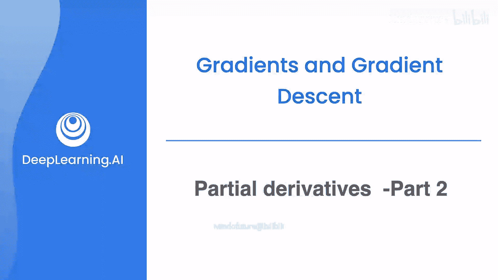
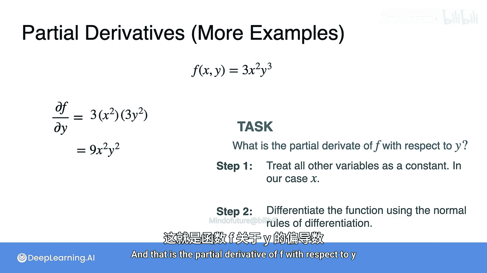

# 031：偏导数第二部分

在本节课中，我们将通过一个具体的例子来巩固偏导数的概念。我们将学习如何计算一个包含两个变量的函数的偏导数，并分别对每个变量进行求导。

## 概述

上一节我们介绍了偏导数的基本概念。本节中，我们来看看如何应用这些概念来计算一个具体函数 `f(x, y) = 3x²y³` 的偏导数。我们将分别计算函数关于 `x` 和关于 `y` 的偏导数。

## 计算关于 x 的偏导数

我们的任务是计算函数 `f(x, y) = 3x²y³` 关于变量 `x` 的偏导数，记作 `∂f/∂x`。

计算过程遵循两个核心步骤。

以下是计算步骤：

1.  **将其他变量视为常数**：因为我们要对 `x` 求导，所以需要将另一个变量 `y` 视为常数。这意味着表达式 `y³` 是一个常数。
2.  **应用常规微分法则**：现在，函数可以看作常数 `3`、`x²` 和常数 `y³` 的乘积。我们应用标量乘法法则和幂法则进行求导。

根据上述步骤，计算如下：
*   常数 `3` 保留。
*   `x²` 关于 `x` 的导数是 `2x`。
*   常数 `y³` 保留。

因此，偏导数 `∂f/∂x` 为：
`∂f/∂x = 3 * 2x * y³ = 6xy³`

## 计算关于 y 的偏导数

接下来，我们计算同一个函数 `f(x, y) = 3x²y³` 关于变量 `y` 的偏导数，记作 `∂f/∂y`。

计算逻辑与之前完全相同，只是角色互换。

以下是计算步骤：

1.  **将其他变量视为常数**：这次是对 `y` 求导，因此需要将变量 `x` 视为常数。这意味着表达式 `x²` 是一个常数。
2.  **应用常规微分法则**：函数现在是常数 `3`、常数 `x²` 和 `y³` 的乘积。我们应用相同的微分法则。

根据上述步骤，计算如下：
*   常数 `3` 保留。
*   常数 `x²` 保留。
*   `y³` 关于 `y` 的导数是 `3y²`。

因此，偏导数 `∂f/∂y` 为：
`∂f/∂y = 3 * x² * 3y² = 9x²y²`

## 总结

本节课中我们一起学习了如何计算二元函数的偏导数。我们通过函数 `f(x, y) = 3x²y³` 的例子，实践了计算偏导数的两个关键步骤：首先将非目标变量视为常数，然后应用基本的微分法则。我们分别得出了 `∂f/∂x = 6xy³` 和 `∂f/∂y = 9x²y²`。掌握这个方法对于理解机器学习中多变量函数的优化至关重要。