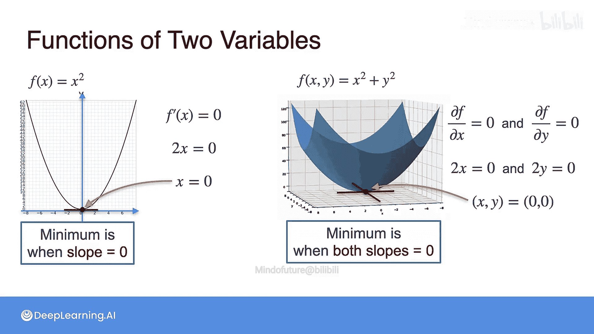

# 033：梯度与极值

在本节课中，我们将学习如何使用梯度来最小化两个或更多变量的函数，这与我们使用导数最小化单变量函数的方式非常相似。

上一节我们介绍了梯度的概念，本节中我们来看看如何利用梯度寻找多元函数的极值点。

## 从单变量函数到多变量函数

首先，让我们回顾一个单变量函数的例子：`f(x) = x²`。当我们想要最小化这个函数时，最小值点位于导数为零的位置。具体来说，我们计算导数 `f'(x) = 2x`，然后解方程 `2x = 0`，得到解 `x = 0`，这就是函数的最小值点。

现在，让我们转向我们一直在研究的二元函数：`f(x, y) = x² + y²`。这个函数的最小值点位于原点 `(0, 0)`。观察这个点，你会发现该点处的切平面与底面（xy平面）平行。事实上，对于任何局部极小值或极大值点，其切平面都是平行于底面的。

## 偏导数与极值条件

由于我们处理的是偏导数，让我们画出两个方向上的切线。在最小值点处，这两条切线（分别对应x方向和y方向）的斜率都为零，因为它们都平行于底面。

换句话说，右侧函数 `f(x, y)` 的最小值出现在两个偏导数给出的切线斜率都为零的时候。如果你有一个包含更多变量的函数，比如12个变量，那么你需要确保所有12个偏导数对应的斜率都为零。

以下是寻找极值点的数学步骤：

对于单变量函数 `f(x) = x²`：
1.  我们希望斜率为零，即导数 `f'(x) = 0`。
2.  计算导数：`f'(x) = 2x`。
3.  解方程 `2x = 0`，得到 `x = 0`。

对于多变量函数 `f(x, y) = x² + y²`：
1.  我们希望两个偏导数都为零：`∂f/∂x = 0` 且 `∂f/∂y = 0`。
2.  计算偏导数：`∂f/∂x = 2x`，`∂f/∂y = 2y`。
3.  解方程组：`2x = 0` 和 `2y = 0`。
4.  得到解：`(x, y) = (0, 0)`。

## 核心方法总结

有时解方程组可能需要一些计算，但基本方法是明确的：

**要找到多元函数的局部极小值或极大值点，只需将所有偏导数设为零，然后求解该方程组。**

本节课中我们一起学习了如何将单变量函数求极值的导数方法，推广到多变量函数的梯度方法。关键在于理解，在多维空间中，极值点出现在所有方向上的“坡度”（偏导数）都为零的位置，这对应于梯度向量为零向量。通过求解所有偏导数等于零的方程组，我们就能找到这些潜在的极值点。