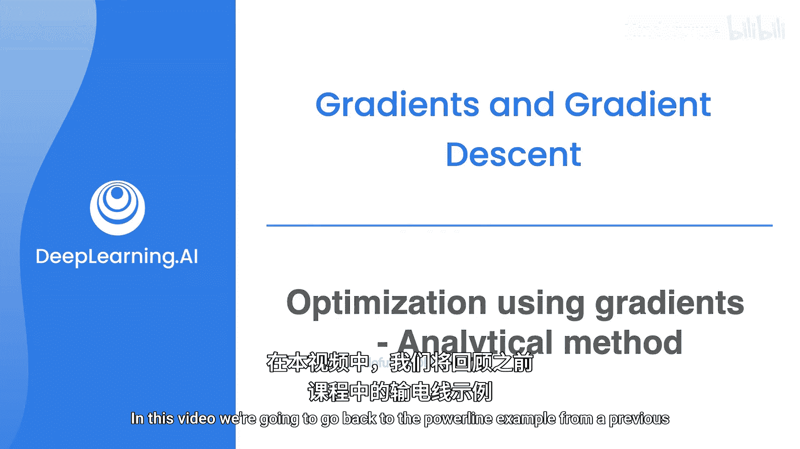
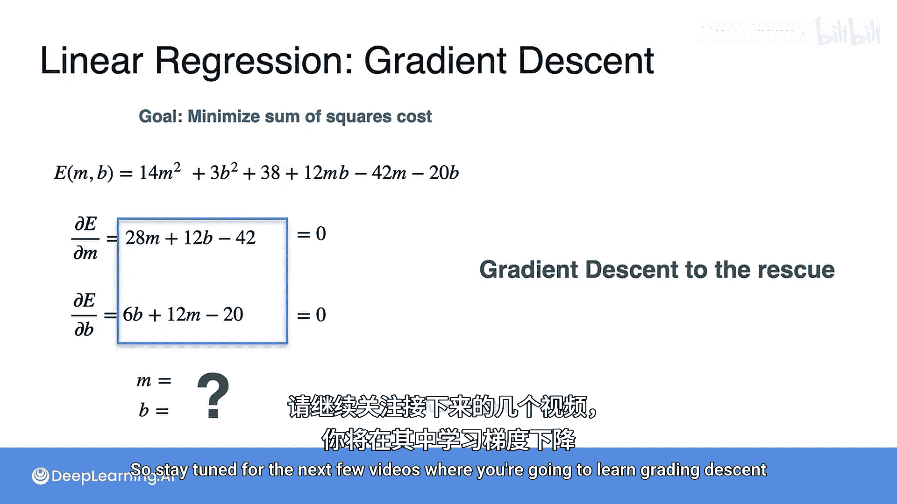

# 035：梯度优化解析法 📈

在本节课中，我们将学习如何通过解析方法解决一个二维优化问题。我们将回顾电力线连接的例子，但这次问题将扩展到二维平面，并引入机器学习中一个极其重要的模型——线性回归。我们将看到如何通过优化技术找到最佳拟合线。

## 从一维到二维的电力线问题 🔌

上一节我们介绍了一维的电力线连接问题，目标是找到连接三个电力线成本最低的位置。本节中，我们来看看一个类似但更复杂的问题：在二维平面上寻找最优的直线连接。

假设三个电力线位于XY平面上，坐标分别为 (1,2)、(2,5) 和 (3,3)。我们的目标是找到一条直线（光纤线），使得从这三个点到该直线的垂直连接线（平行于Y轴）的总成本最低。每条连接线的成本是其长度的平方。

以下是连接示意图：

## 构建成本函数 📊

现在，我们的任务是将这个问题转化为一个数学优化问题。光纤线可以用直线方程 `y = mx + b` 表示，其中 `m` 是斜率，`b` 是Y轴截距。我们的目标是找到最优的 `m` 和 `b`，以最小化三个连接线长度的平方和。

让我们具体计算每个点的成本：
*   对于蓝色电力线 (1,2)：连接点在直线上的Y坐标为 `m*1 + b`，距离为 `(m + b - 2)`，成本为 `(m + b - 2)^2`。
*   对于黄色电力线 (2,5)：成本为 `(2m + b - 5)^2`。
*   对于绿色电力线 (3,3)：成本为 `(3m + b - 3)^2`。

因此，总成本函数 `E(m, b)` 是这三个平方项的和：
`E(m, b) = (m + b - 2)^2 + (2m + b - 5)^2 + (3m + b - 3)^2`

展开并合并同类项后，我们得到：
`E(m, b) = 14m^2 + 3b^2 + 12mb - 42m - 20b + 38`

我们的目标就是最小化这个关于 `m` 和 `b` 的二元函数。

## 通过偏导数求解最优解 🧮

我们已经知道，要找到多元函数的最小值点，需要计算其偏导数并令其为零。这为我们提供了一个方程组。

以下是计算步骤：
首先，计算 `E` 对 `m` 的偏导数：
`∂E/∂m = 28m + 12b - 42`

接着，计算 `E` 对 `b` 的偏导数：
`∂E/∂b = 6b + 12m - 20`

为了找到最小值点，我们令这两个偏导数同时为零，得到方程组：
1.  `28m + 12b - 42 = 0`
2.  `6b + 12m - 20 = 0`

## 解方程组得到最优参数 🔍

现在，我们来解这个二元一次方程组。我们可以使用代入法或消元法。

将第二个方程乘以2，得到：`12b + 24m - 40 = 0`
用第一个方程减去这个新方程：`(28m + 12b - 42) - (12b + 24m - 40) = 0`，化简得 `4m - 2 = 0`。
解得：`m = 0.5`。

将 `m = 0.5` 代入第二个原方程：`6b + 12*(0.5) - 20 = 0`，即 `6b + 6 - 20 = 0`。
解得：`b = 14/6 = 7/3 ≈ 2.333`。

因此，最优参数为 `m = 0.5`，`b = 7/3`。对应的最优直线方程为：
`y = 0.5x + 7/3`

将参数代入成本函数，可计算出最小成本约为 `E(0.5, 7/3) ≈ 4.167`。在图中，这条直线确实能很好地拟合三个点，使得连接线的平方和最小。

## 总结与展望 🚀

本节课中，我们一起学习了如何通过解析法解决一个二维优化问题。我们具体完成了以下步骤：
1.  将实际问题（寻找最佳光纤线）转化为数学优化问题。
2.  构建了以斜率 `m` 和截距 `b` 为变量的成本函数 `E(m, b)`。
3.  通过计算偏导数 `∂E/∂m` 和 `∂E/∂b`，并令其为零，建立了方程组。
4.  解方程组得到了最优参数 `m = 0.5` 和 `b = 7/3`。

这个问题本质上就是**线性回归**——机器学习中最基础且重要的模型之一，其目标正是找到一条直线，使得所有数据点到该直线距离的平方和最小。

然而，我们注意到，当变量数量很多时（例如有成千上万个特征），求解庞大的方程组会非常耗时且计算成本高昂。那么，有没有更高效的方法呢？

答案是肯定的。在接下来的课程中，我们将学习一种名为**梯度下降**的迭代优化算法。它能够以更快的速度逼近函数的最小值点，是解决大规模机器学习优化问题的核心工具。敬请关注后续内容。