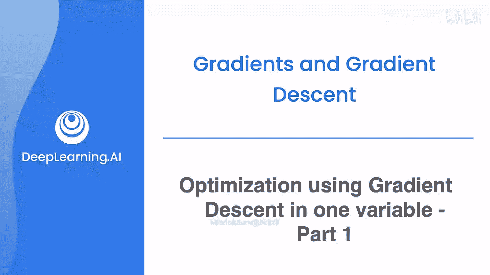
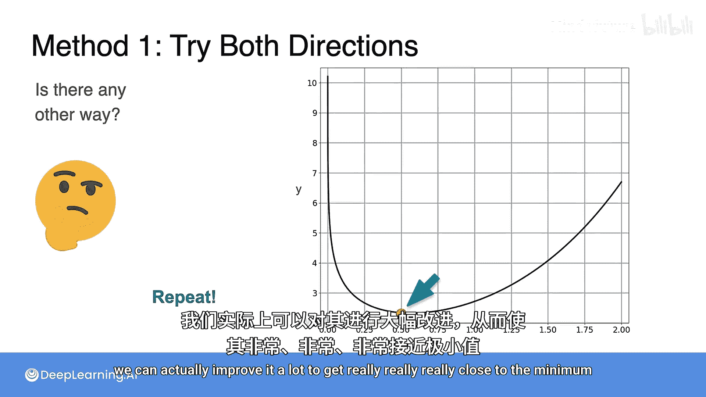

# 036：单变量梯度下降优化第一部分

在本节课中，我们将学习一种强大的迭代方法，用于最小化或最大化函数，尤其是在多变量情况下。这种方法被称为梯度下降。我们将从单变量梯度下降开始，逐步过渡到多变量情况。

## 优化问题的挑战

上一节我们学习了如何使用导数和梯度来解决优化问题。然而，当我们尝试通过解析方法精确求解这些问题时，会发现问题会迅速变得非常复杂，尤其是在高维空间中。

本节中，我们来看看一种迭代方法，它对于最小化或最大化函数非常有效。

## 单变量梯度下降示例

让我们观察以下函数：
**f(x) = e^x - ln(x)**

这是该函数的图像。它平滑且连续。我们的问题是：能否找到它的最小值？最小值大约位于此处。

根据之前课程的知识，我们只需计算 **f'(x)** 并令其等于0，然后求解x。

**f(x)** 的导数是：
**f'(x) = e^x - 1/x**

因此，我们需要解方程 **e^x - 1/x = 0**。然而，这相当具有挑战性。

解方程 **e^x - 1/x = 0** 等价于解 **e^x = 1/x**。我建议你尝试一下，解析求解实际上非常困难。其解约为0.5671，这是一个著名的常数，被称为欧米伽常数。

## 迭代方法的引入

解析求解的困难不应阻止我们尝试其他方法。以下是一种方法：

1.  随机选取一个初始值，例如图像中这个位置。
2.  尝试向左和向右移动一小步，得到两个新点。
3.  比较这两个新点的函数值。由于我们的目标是最小化函数，选择函数值较小的那个点（图中右侧的点）。
4.  重复此过程：从新点出发，再次向两侧移动，并选择函数值更小的点。
5.  再次重复后，有趣的情况发生了：两侧点的函数值都比当前点高。因此，我们可以认为当前点“足够接近”最小值。

这种方法并不差，但我们可以在下一个视频中看到如何大幅改进它，从而得到非常、非常接近最小值的结果。

## 本节总结

本节课中，我们一起学习了优化问题解析求解的局限性，并引入了一种基于迭代和比较的简单方法，为理解更强大的梯度下降算法奠定了基础。在下一节，我们将深入探讨如何改进这种方法。