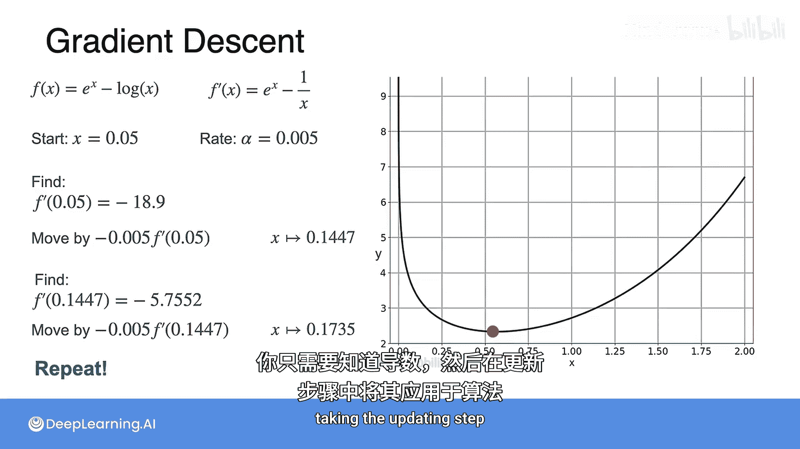

# 037：单变量梯度下降优化第二部分 🎯

在本节课中，我们将学习一种更智能的优化方法——梯度下降法。我们将了解其核心思想、算法步骤，并通过一个具体例子来演示其工作过程。

---

在上一节中，我们学习了一种近似寻找函数最小值的方法。本节中，我们将探讨一种更高效的策略。

假设当前点位于最小值左侧，我们希望它更接近最小值，那么应该让它向右移动一小步。反之，如果当前点位于最小值右侧，则应让它向左移动。那么，函数本身是否包含能帮助我们快速做出这个决策的信息呢？

答案是肯定的。让我们观察导数（斜率）：
*   在最小值左侧，斜率为负，点需要向右移动。
*   在最小值右侧，斜率为正，点需要向左移动。

因此，我们需要的信息就是斜率。具体操作是**减去**斜率：
*   当斜率为负时，减去一个负数等于加上一个正数，点向右移动。
*   当斜率为正时，减去一个正数，点向左移动。

如果用 `x1` 表示新点，`x0` 表示旧点，那么公式可以写为：
`x1 = x0 - f'(x0)`
其中 `f'(x0)` 是函数在 `x0` 处的导数（斜率）。

然而，这里有一个需要注意的问题。想象一下，如果你位于曲线非常陡峭的部分，那么导数值会非常大，这会导致更新步长过大。过大的步长可能使我们“越过”最小值，甚至偏离到更远的地方，导致算法不稳定。我们希望采取小步前进，以确保路径更安全。

如何控制步长呢？很简单，我们修改公式，在斜率前乘以一个很小的数，例如 0.01。这个数被称为**学习率**，通常用希腊字母 **α** 表示。选择合适的 **α** 值本身就是一门学问。

这个修改后的公式还有一个额外的好处：
*   当你远离最小值且处于陡峭区域时，导数值大，乘以学习率后，相对步长仍然较大，有助于快速接近目标。
*   当你接近最小值且处于平坦区域时，导数值小，乘以学习率后，步长自动变小，有助于精细调整，精确逼近。

这就像打高尔夫球：距离球洞远时，需要用力挥杆；距离球洞很近时，则需要轻柔精准地推杆。

这种方法被称为**梯度下降法**。它在机器学习中极其重要且应用广泛，原因就在于它只需要迭代执行一个简单的更新步骤。

以下是梯度下降算法的简要描述：
1.  目标：找到函数 `F(x)` 的最小值。
2.  首先，定义一个学习率 **α** 并选择一个起始点 `x0`。
3.  然后执行更新步骤：`x_k = x_{k-1} - α * f'(x_{k-1})`
4.  重复步骤3，直到足够接近真实的最小值。当连续迭代中 `x` 的变化非常微小时，通常就可以认为已经收敛。

现在，让我们用一个例子来尝试几次迭代。

回顾我们的函数：`f(x) = e^x - ln(x)`
其导数为：`f'(x) = e^x - 1/x`

我们选择起始点 `x0 = 0.05`，学习率 `α = 0.005`。

以下是前两次迭代：
*   **第一次迭代**：计算 `f'(0.05)`，然后更新 `x1 = 0.05 - 0.005 * f'(0.05) ≈ 0.11447`。可以看到，新点 `0.11447` 比旧点 `0.05` 更接近最小值。
*   **第二次迭代**：以 `x1` 为起点，计算 `f'(0.11447)`，然后更新 `x2 = 0.11447 - 0.005 * f'(0.11447) ≈ 0.1735`。

我们可以重复这个过程很多次（几十、几百、几千次），直到非常接近最小值。梯度下降算法速度很快，能够高效地进行大量迭代。

请注意一个有趣且关键的点：在整个算法中，我们**从未需要直接求解方程 `f'(x) = 0`**（即 `e^x - 1/x = 0`）。我们只需要知道导数 `f'(x)` 的表达式，并在每次更新步骤中计算其值即可。这是一个巨大的改进。

---

本节课中，我们一起学习了梯度下降法的核心原理。我们了解到它通过利用函数的导数（梯度）信息，结合学习率来控制步长，以迭代的方式智能地逼近函数的最小值点。这种方法避免了直接求解复杂方程，计算高效，是机器学习中模型优化的基石算法之一。