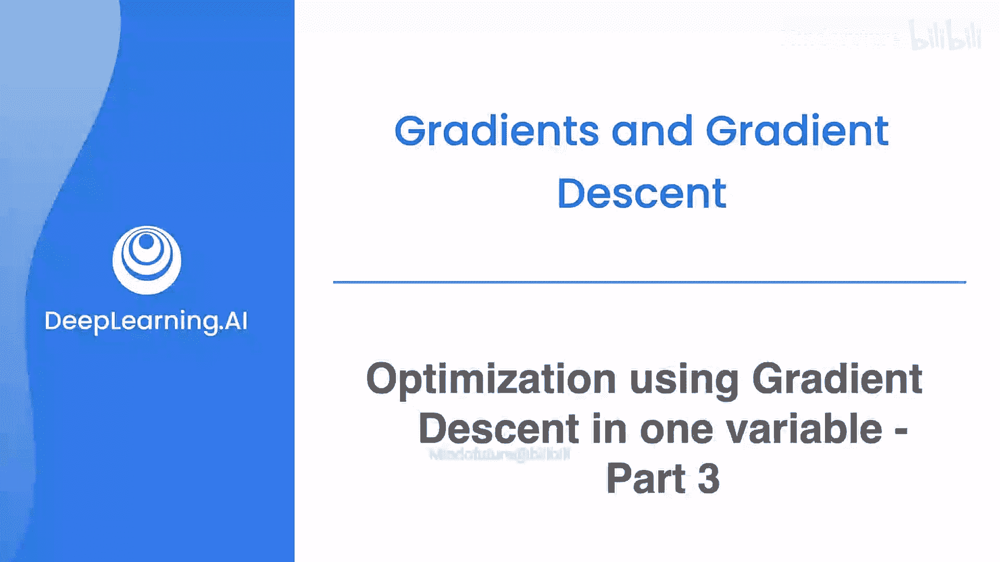
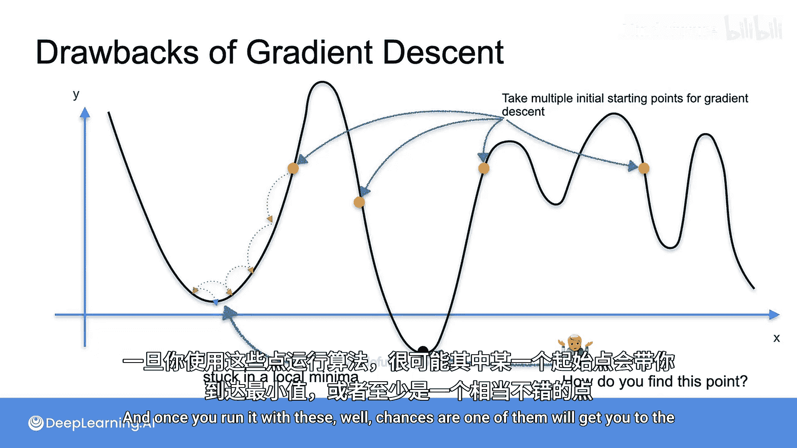

# 038：单变量梯度下降优化第三部分

在本节课中，我们将继续探讨梯度下降算法，重点分析学习率的选择对优化过程的影响，以及算法可能遇到的局部最小值问题。

## 学习率的重要性

上一节我们介绍了学习率的概念。学习率在机器学习中至关重要，找到一个合适的学习率可能相当困难，并且它对你的模型性能有显著影响。

以下是学习率设置不当可能带来的问题：

*   **学习率过大**：步长过大，可能导致算法越过最小值，永远无法找到它。
*   **学习率过小**：步长过小，可能需要极长时间才能到达最小值，甚至永远无法到达。

理想情况是找到一个“刚刚好”的学习率。然而，这本身就是一个研究课题。虽然存在许多根据优化进程动态调整学习率的优秀方法，但目前没有确定性的方法来找到一个完美的学习率。

## 局部最小值问题

现在，我们来看看梯度下降算法可能遇到的另一个问题。

假设你有一个如上图所示的函数，其全局最小值位于左侧。然而，如果你的梯度下降算法从右侧的某个点开始运行，它可能会将你带到一个**局部最小值**。这个点看起来像最小值，但实际上并不是全局最优解。

那么，如何克服这个问题呢？实际上，没有绝对可靠的方法来保证避免局部最小值。但一个能获得较好结果的策略是：使用**许多不同的起始点**，多次运行梯度下降算法。当你用这些不同的起点运行算法后，很可能其中一次运行会将你带到全局最小值，或者至少是一个相当不错的点。

## 总结

本节课中，我们一起学习了梯度下降优化中的两个关键挑战。首先，学习率的选择需要权衡，过大或过小都会影响收敛。其次，算法可能陷入局部最小值而非全局最小值，解决策略之一是尝试从多个不同的起点开始运行算法。理解这些挑战是有效应用梯度下降法的基础。