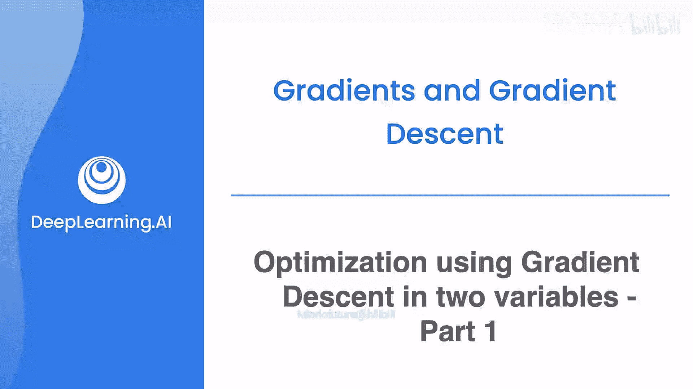
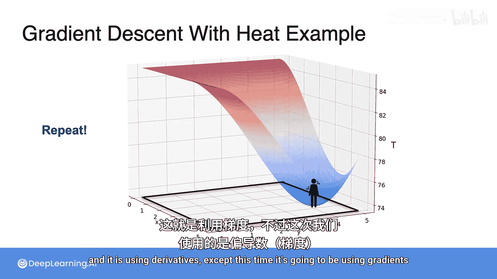

# 039：双变量梯度下降优化第一部分

在本节课中，我们将学习如何将单变量梯度下降的概念扩展到多变量场景。我们将从基础概念开始，逐步构建出完整的梯度下降算法。

## 概述

上一节我们介绍了单变量函数的梯度下降。本节中，我们来看看如何将这一优化方法应用于包含两个变量的函数。我们将使用一个温度与海拔的例子来引入双变量优化问题，目标是找到房间中最凉爽的位置。

## 从解析法到迭代法

在之前的课程中，你学习了通过计算偏导数并令其等于零来解析地求解优化问题。现在的目标是找到另一种方法，使用迭代法来解决这个问题，就像你在上一个视频中对单变量函数所做的那样。

假设你从桑拿房（一个高温点）开始。你将尝试向四个随机方向各走一步，然后观察这四个方向中哪一个能带你到达更凉爽的位置。

例如，你发现其中一个方向温度更低，于是你朝那个方向移动一步。

移动之后，你重复这个过程：再次向四个新方向各走一步，找出温度最低的方向，并朝该方向移动。你可以不断迭代这个过程，直到到达最冷点，或者至少接近最冷点。

## 随机步长的局限性

然而，这种方法存在一些缺陷。你如何选择移动的方向？是否有更智能的方法来确定这些方向？

与上一个视频中的单变量情况类似，确实存在一种更智能的方法，那就是使用导数。不过，这次我们将使用**梯度**。

## 梯度的作用

梯度是多变量函数的导数推广。对于一个双变量函数 `f(x, y)`，其梯度是一个向量，记作 **∇f(x, y)**，它包含了函数关于每个变量的偏导数：

**∇f(x, y) = [ ∂f/∂x, ∂f/∂y ]**

这个梯度向量指向函数值**增长最快**的方向。因此，它的反方向（即负梯度方向 **-∇f(x, y)**）就指向了函数值**下降最快**的方向。

在寻找最冷点（即最小化温度函数）的问题中，我们正是要沿着这个**负梯度方向**移动，从而最有效地降低温度。

## 核心算法步骤

以下是双变量梯度下降算法的基本步骤：

1.  **初始化**：随机选择一个起始点 `(x₀, y₀)`。
2.  **计算梯度**：在当前点计算函数的梯度 **∇f(x, y)**。
3.  **更新参数**：沿着负梯度方向移动一小步。更新公式为：
    `(x_new, y_new) = (x_old, y_old) - α * ∇f(x_old, y_old)`
    其中 **α** 称为**学习率**，它控制着每一步移动的大小。
4.  **迭代**：重复步骤2和步骤3，直到满足停止条件（例如梯度接近零，或达到预设的迭代次数）。

## 总结

本节课中，我们一起学习了双变量梯度下降的基本思想。我们从随机搜索的直观方法入手，指出了其效率低下的问题，进而引入了**梯度**这一核心概念。梯度指示了函数上升最快的方向，其反方向则是我们寻找最小值时需要前进的方向。下一节，我们将深入探讨学习率的选择以及算法的具体实现细节。