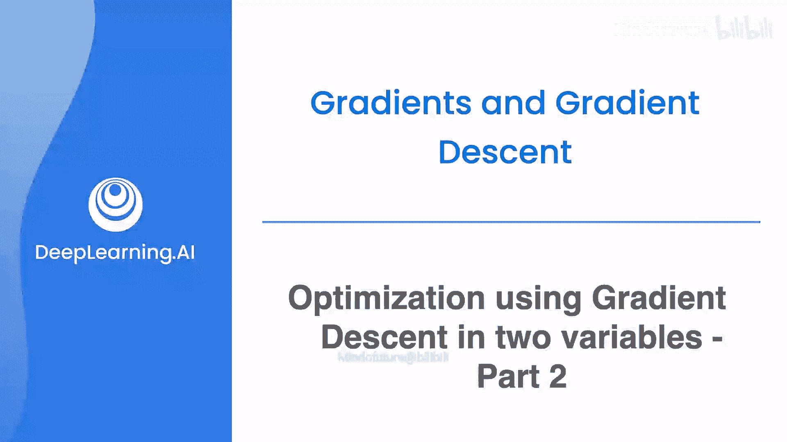
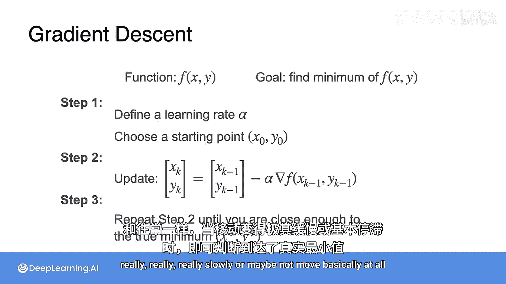
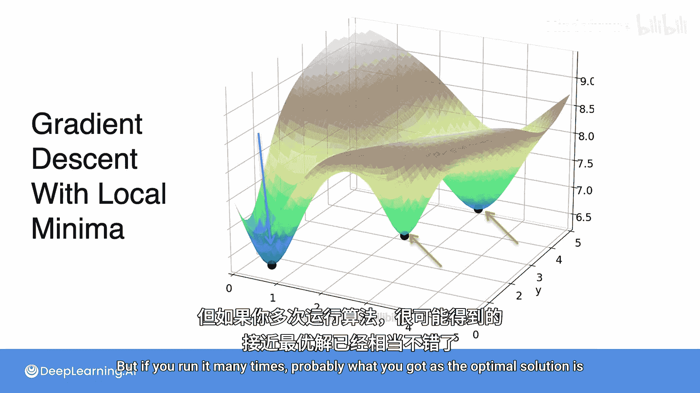

# 040：双变量梯度下降优化第二部分 🧮



在本节课中，我们将学习如何将单变量梯度下降算法精确地推广到双变量情况。我们将通过数学公式定义梯度，并展示如何使用它来高效地找到函数的最小值点。

## 梯度下降的精确数学方法

上一节我们介绍了一种近似方法，但其中包含了许多随机步骤。本节中，我们将像处理单变量时一样，采用更精确、更数学化的方法。

我们将为双变量函数定义梯度。其过程与单变量非常相似。首先需要一个初始位置，但现在这个初始位置包含两个坐标：`x0` 和 `y0`。在单变量中我们绘制切线（导数），而在双变量中，我们有两个切线。

其中一个切线非常陡峭。我们将在地板上绘制一个向量，其方向是导数增加的方向。由于它很陡，所以这是一个大向量。接着，我们对梯度的另一个分量做同样的事情，得到一个较小的向量，因为第二个梯度比前一个平坦得多。

现在，我们将这两个向量相加（或将两个坐标组合成一个向量），结果就是梯度。梯度有一个有趣的特性：它指向**最速上升方向**。如果你想迈出一小步并到达尽可能热的地方，你应该沿着梯度的方向走。

但我们不想变热，我们想变冷。因此，我们沿着**负梯度**的方向前进。负梯度的方向是：如果你迈出一小步，它能将你带到在一步之内能达到的最冷的地方。我们将沿着负梯度的方向迈出这一步，并且是一小步，所以再次乘以学习率。

于是我们得到新点 `(x1, y1)`：
```
(x1, y1) = (x0, y0) - α * ∇f(x0, y0)
```
其中 `α` 是学习率，`∇f` 是梯度。这个新点是一个更好的点。

请注意，这与单变量梯度下降完全相同，只是我们不再使用导数，而是使用梯度。

## 算法应用示例

现在让我们看看这个算法如何应用于之前的例子。

温度函数的公式是：
```
T(x, y) = 85 - (1/90) * x² * (x-6) * y² * (y-6)
```

让我们运行几步梯度下降算法。我们从初始点 `(0.5, 0.6)` 开始。

我们需要计算梯度，梯度是一个向量，包含对 `x` 的偏导数和对 `y` 的偏导数。我们之前已经计算过这些导数：

*   对 `x` 的偏导数：`∂T/∂x = ...` （根据前文公式）
*   对 `y` 的偏导数：`∂T/∂y = ...` （根据前文公式）

要找到梯度，只需将它们组合成一个向量 `∇T = [∂T/∂x, ∂T/∂y]`。

现在，将 `x = 0.5` 和 `y = 0.6` 代入这个向量，得到该点的梯度。

然后，简单地沿着负梯度方向（乘以学习率）前进一步。设学习率 `α = 0.05`，我们得到一个新点 `(0.5057, 0.6047)`。你沿着那个方向移动，现在离最小点更近了一点。

现在让我们再次运行这个算法。我们计算新点的梯度，并沿着负梯度方向移动，得到另一个新点。

只需重复这个过程很多很多次，你就会非常快、非常接近最小值点。

## 算法步骤总结

简而言之，梯度下降算法与单变量版本非常相似。对于一个双变量函数 `f(x, y)`，目标是找到最小值。

以下是核心步骤：

1.  **初始化**：定义一个学习率 `α`，并选择一个起始点 `(x0, y0)`。
2.  **迭代更新**：使用以下公式更新当前位置：
    ```
    (x_k, y_k) = (x_{k-1}, y_{k-1}) - α * ∇f(x_{k-1}, y_{k-1})
    ```
    其中 `∇f` 是函数在 `(x_{k-1}, y_{k-1})` 点的梯度。
3.  **重复**：重复步骤2，直到足够接近真正的最小值。通常，当你移动得非常非常缓慢，或者基本不再移动时，就说明已经接近最小值了。

## 算法的局限性

与单变量梯度下降一样，双变量（或多变量）梯度下降也存在相同的缺点。

例如，你可能想要到达全局最小值，但可能会意外地陷入这些局部最小值中。



至少以高概率克服这个问题的方法是：从非常不同的地方开始多次运行算法。注意，在下图中，我们从三个不同的地方开始，每个都引导我们到达了一个不同的局部最小值，其中一个实际上到达了全局最小值。


但就像单变量一样，无法绝对确定你是否到达了全局最小值。不过，如果你多次运行它，很可能你得到的最优解是相当不错的。



## 课程总结


本节课中，我们一起学习了如何将梯度下降算法扩展到双变量函数。我们定义了梯度向量，它指明了函数的最速上升方向，并通过向负梯度方向移动来寻找最小值。我们详细介绍了算法的步骤，并通过一个温度函数的例子演示了其应用过程。最后，我们讨论了算法可能陷入局部最小值的局限性，以及通过多次从不同起点运行来寻找更好解的常用策略。