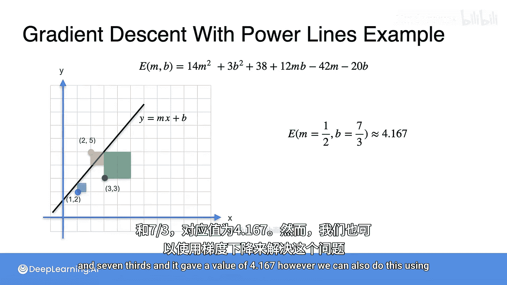
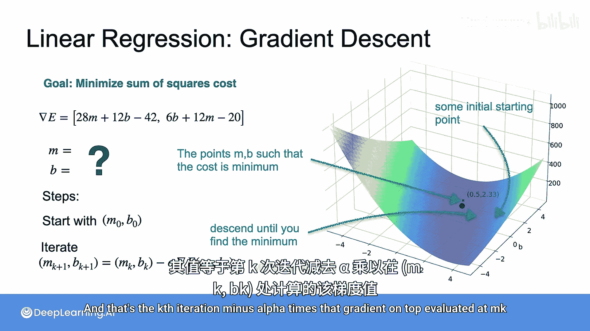

# 041：梯度下降优化-最小二乘法


在本节课中，我们将学习如何使用梯度下降法来优化线性回归问题中的最小二乘成本函数。我们将通过一个具体的电力线连接成本问题，演示梯度下降如何高效地找到最优参数。

## 概述

在前面的课程中，我们通过解析方法（如正规方程）解决了线性回归问题。然而，当变量增多或问题变得复杂时，解析方法可能变得繁琐。本节将介绍梯度下降法，这是一种迭代优化算法，能够更高效地找到使成本函数最小化的参数。

## 问题回顾：电力线连接成本

我们曾试图找到一条最佳拟合线，以最小化连接到电力线的成本。该问题归结为最小化以下成本函数，即找到使 `E(M, B)` 最小的最优参数 `M` 和 `B`。

**成本函数公式：**
```
E(M, B) = Σ (y_i - (M*x_i + B))^2
```

通过解析方法，我们找到了最优解：`M = 1/2`，`B = 7/3`，对应的最小成本值为 `4.167`。

## 梯度下降法原理

梯度下降法的核心思想是，通过迭代地调整参数，沿着成本函数梯度的反方向（即下降最快的方向）移动，从而逐步逼近最小值点。

**梯度下降更新公式：**
```
M_{k+1} = M_k - α * ∂E/∂M |_{M_k, B_k}
B_{k+1} = B_k - α * ∂E/∂B |_{M_k, B_k}
```
其中：
- `M_k`, `B_k` 是第 `k` 次迭代的参数值。
- `α` 是学习率，控制每次更新的步长。
- `∂E/∂M` 和 `∂E/∂B` 是成本函数 `E` 关于 `M` 和 `B` 的偏导数（即梯度）。

## 梯度下降步骤详解

以下是使用梯度下降法求解最优参数的具体步骤。

### 1. 初始化参数

首先，我们需要为参数 `M` 和 `B` 选择初始值。这通常是随机选择的，例如 `M_0` 和 `B_0`。



### 2. 计算梯度

在每次迭代中，计算成本函数在当前参数 `(M_k, B_k)` 处的梯度。梯度指明了成本函数增长最快的方向，因此我们取其反方向进行下降。

### 3. 更新参数

使用梯度下降更新公式，根据当前梯度和学习率 `α` 更新参数 `M` 和 `B`。

### 4. 迭代直至收敛

重复步骤2和步骤3，直到参数的变化非常小（即收敛），或者达到预设的迭代次数。

## 梯度下降的优势

与解析方法相比，梯度下降法具有以下优势：
- **高效性**：对于大规模数据集或复杂模型，梯度下降通常计算更快。
- **灵活性**：可以应用于各种不同类型的模型和成本函数。
- **易于实现**：算法步骤清晰，易于编程实现。

## 总结



本节课中，我们一起学习了如何使用梯度下降法来优化线性回归中的最小二乘成本函数。我们回顾了电力线连接成本问题，并详细介绍了梯度下降的原理、更新公式及实施步骤。通过梯度下降，我们可以高效地找到使成本函数最小化的最优参数，即使对于复杂问题也是如此。