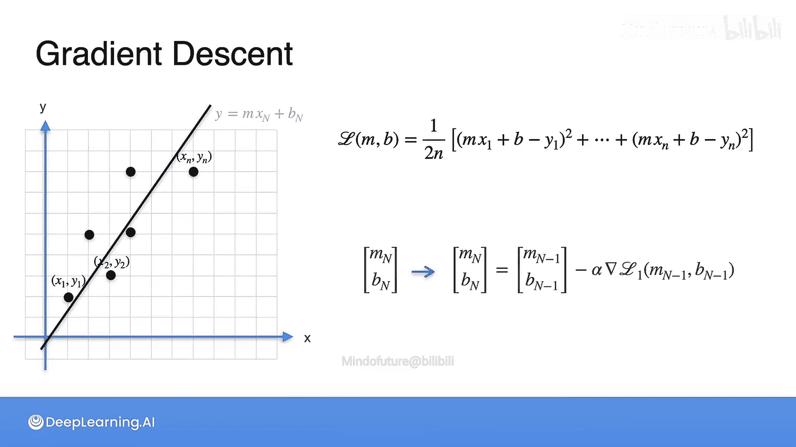

# 042：梯度下降优化-多观测值最小二乘法

## 概述
在本节课中，我们将学习如何使用梯度下降算法来优化线性回归模型。我们将从一个简单的例子开始，理解成本函数（误差）与模型参数（斜率和截距）之间的关系，然后将其推广到处理多个观测数据点的场景。最后，我们将看到一个关于广告预算预测的实际应用案例。

---

## 从拟合线到成本函数

上一节我们介绍了线性回归的基本概念。本节中我们来看看如何量化一条拟合线的“好坏”。

假设我们有三个数据点，以及一条试图紧密拟合它们的直线，其方程为 **y = Mx + B**。右侧的图表描绘了这条拟合线的“成本”。

成本是如何计算的呢？我们计算每个数据点到拟合线的垂直距离（即误差），然后取这些距离的平方和。这个平方和就是该拟合线的成本。在右侧的图表中，我们在垂直轴上绘制这个“平方损失”。

这个图表的绘制方式如下：我们用地面上的两个轴分别代表斜率 **M** 和截距 **B**。对于每一对 **(M, B)** 参数所确定的直线，我们计算其对应的成本函数值，并将这个值作为高度绘制在 **(M, B)** 点的正上方。

因此，图中每一个点都对应左侧的一种直线拟合情况。拟合得好的直线（误差小），其在成本函数图上的点就低；拟合得差的直线（误差大），其对应的点就高。

梯度下降的目标，就是在这个成本函数图上，找到最低的那个点。当我们通过梯度下降调整 **M** 和 **B**，向最低点移动时，左侧的拟合直线也会随之变得越来越好。这就是使用梯度下降解决线性回归问题的核心思想。

---

## 实际应用：广告预算预测

理解了基本原理后，我们来看一个实际例子。假设你在一个广告公司工作，拥有电视广告预算数据，并且知道对应的销售额。通常，增加预算会提升销售额，减少预算则会降低销售额。你的目标是建立一个模型，能够根据给定的广告预算来预测销售额。

你首先会查看历史数据，并尝试使用的第一个工具就是线性回归。换句话说，就是找到一条直线 **y = Mx + B**，使得当你输入预算 **X** 时，能得到一个与真实销售额 **Y** 非常接近的预测值。

---

## 多观测值的梯度下降

在实际应用中，我们通常拥有大量数据点，而不仅仅是三个。现在，让我们将梯度下降算法推广到处理 **n** 个观测值的情况。

假设电视预算在横轴，销售额在纵轴，我们有一系列数据点：**(x1, y1), (x2, y2), ..., (xn, yn)**。

首先，我们需要定义成本函数。让我们先看第一个点 **(x1, y1)**。该点的损失是多少？它是该点到拟合线的垂直距离的平方。

这个距离是多少？拟合线上横坐标为 **x1** 的点的纵坐标是 **M*x1 + B**。因此，垂直距离为 **y1 - (M*x1 + B)**。由于之后要平方，所以也可以写成 **(M*x1 + B) - y1**，结果一样。

平方后，我们就得到了在该点的损失。

现在，我们需要计算所有点的总损失。通常，我们取所有点损失的平均值。此外，公式中常包含一个除以2的因子，这是为了后续求导时计算方便（平方项的导数会产生因子2，与分母的2约掉）。不过，是否除以2并不影响成本函数最小值的位置。

因此，我们的总成本函数 **L(M, B)** 定义如下：

**L(M, B) = (1/n) * Σ [ (M*xi + B - yi)^2 ]** （有时前面会有 1/(2n)）

---

## 梯度下降算法流程

定义了成本函数后，梯度下降算法的正式流程如下：

以下是梯度下降算法的具体步骤：

1.  **初始化**：随机选择一组初始参数 **(M0, B0)**。这对应一条可能拟合得很差的随机直线。
2.  **计算梯度**：在当前位置 **(M0, B0)**，计算成本函数 **L** 关于 **M** 和 **B** 的偏导数（即梯度）。梯度指明了成本函数上升最快的方向，因此我们取其反方向。
3.  **更新参数**：沿着梯度的反方向，以“学习率”（一个小的正数，记为 **α**）为步长，更新参数。
    *   新斜率：**M1 = M0 - α * (∂L/∂M)**
    *   新截距：**B1 = B0 - α * (∂L/∂B)**
    这得到了一组稍好的参数 **(M1, B1)**，对应一条拟合稍好的直线。
4.  **迭代**：将新的参数 **(M1, B1)** 作为起点，重复步骤2和3。
    *   计算 **(M1, B1)** 处的梯度。
    *   更新得到 **(M2, B2)**。
5.  **终止**：重复这个过程很多次（比如 **N** 次），直到参数变化非常小，或者成本函数值不再显著下降。此时，我们便得到了一个对数据拟合良好的线性模型。

---

## 总结
本节课中我们一起学习了梯度下降算法在多观测值线性回归中的应用。我们首先通过可视化理解了成本函数与模型参数的关系，然后定义了适用于多个数据点的均方误差成本函数。最后，我们详细阐述了梯度下降算法的迭代步骤：初始化参数、计算梯度、沿负梯度方向更新参数，并重复此过程直至收敛。通过这个流程，我们可以从任意初始直线出发，自动找到最能拟合数据的最佳直线。