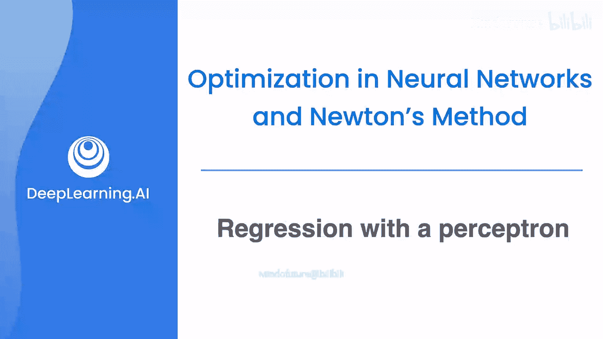
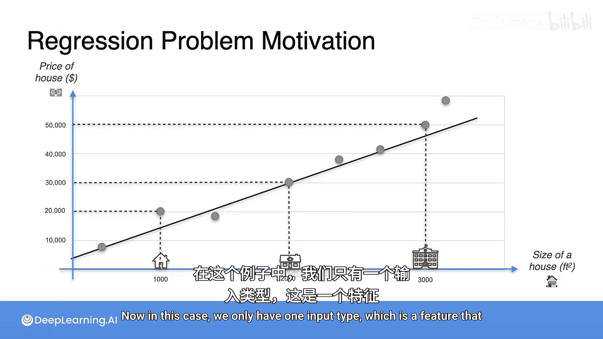
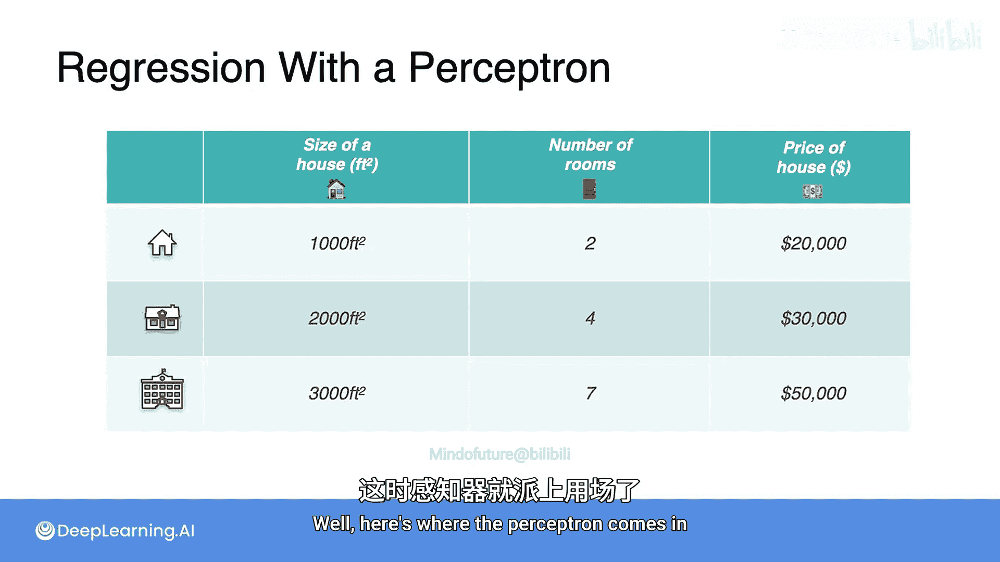
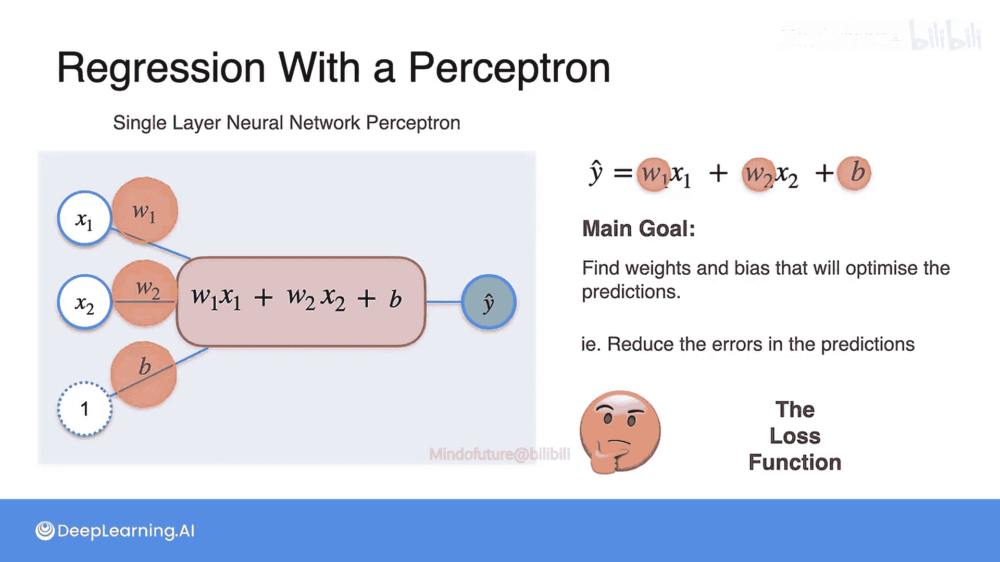

# 044：感知机与回归 🧠

在本节课中，我们将学习神经网络的基本单元——感知机。你将了解到，线性回归实际上可以表示为一个感知机。我们将从一个经典的回归问题——预测房价入手，逐步引入感知机的概念，并探讨其数学原理。

## 动机：房价预测问题 🏠

我们从一个简单的线性回归问题开始：根据房屋面积预测房价。假设我们有三套房屋的数据：
*   第一套：面积1000平方英尺，价格20,000美元。
*   第二套：面积2000平方英尺，价格30,000美元。
*   第三套：面积3000平方英尺，价格50,000。

我们将这些数据点绘制在图表上，目标是找到一条最佳拟合直线，用于根据房屋面积预测其价格。

上一节我们介绍了单一特征（面积）的预测问题。本节中我们来看看，如果引入第二个特征会怎样。

## 引入更多特征

现在，我们为每套房屋增加一个特征：房间数量。假设三套房屋的房间数分别为2、4、7。问题变得复杂了，我们需要同时考虑面积和房间数对房价的影响。

那么，我们如何构建并训练一个能够预测房价的模型呢？更进一步，如果我们有10个、100个甚至更多特征呢？这时，感知机的概念就派上用场了。

## 感知机：神经网络的基本单元

这个回归问题可以用一个单一的感知机来建模。感知机接收一些输入（特征），并输出我们想要预测的未知值。

首先，我们从数学角度来探索感知机。输入是 `x1` 和 `x2`，分别代表房屋面积和房间数量。你可以想象，如果有100个输入，就会有100个节点 `x1` 到 `x100`。

输入进入一个求和函数，该函数的输出是预测值 `ŷ`，即我们预测的房屋价格。一个好的模型能给出相当准确的预测，我们的目标是构建最佳模型。

以下是求和步骤中发生的事：
*   每个特征 `x1` 和 `x2` 都会乘以一个对应的权重（`w1` 和 `w2`），以确定该特征对输出的重要性。例如，如果房屋面积对预测价格远比房间数量重要，那么 `w1` 的值就会比 `w2` 大。
*   我们将权重和输入相乘后相加：`w1*x1 + w2*x2`。
*   最后，我们再加上一个偏置项 `b`。

因此，这个模型的输出就是：
`ŷ = w1*x1 + w2*x2 + b`

在这个模型中，我们没有使用激活函数（稍后会介绍激活函数）。我们的目标是找到最优的权重 `w1`、`w2` 和偏置 `b`，使得当我们输入 `x1` 和 `x2` 时，预测值 `ŷ` 在整个数据集上最接近真实房价。

## 如何找到最优权重？

那么，我们如何找到这些完美的权重呢？核心思想是**最小化某种误差**。误差衡量的是预测值与真实房价的差距。最小化这个误差就是我们需要做的。

为此，我们引入一个称为**损失函数**的概念。损失函数是一个小函数，用于告诉我们预测得有多好（或多差）。这将是下一节视频的内容。