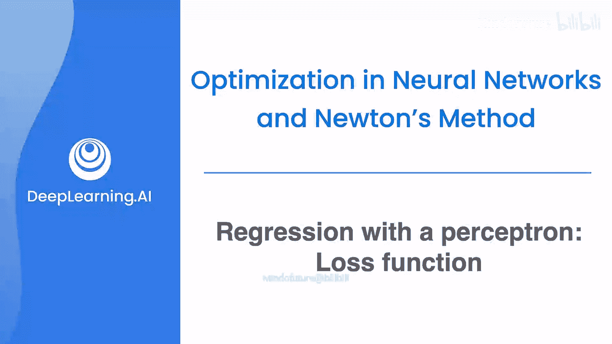
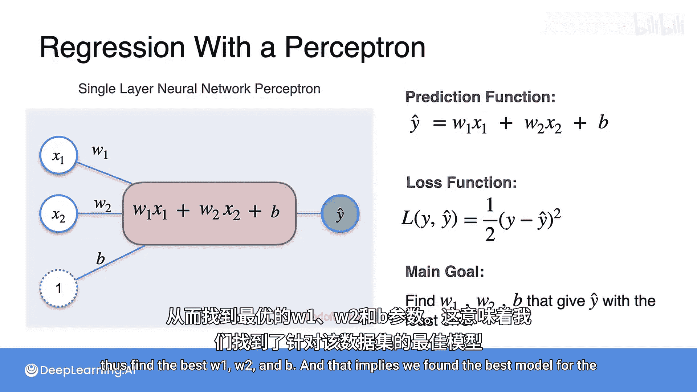

# 045：感知机回归损失函数

## 概述

在本节课中，我们将学习如何评估和优化一个简单的线性回归模型。我们将定义一个称为“损失函数”的指标，用于量化模型预测的准确性，并理解如何通过最小化这个损失函数来找到最佳的模型参数。

## 模型预测与误差

在上一节视频中，我们看到了一个包含房屋面积和价格的数据集。我们的目标是找到一条最贴合这些数据点的直线，这条直线就是我们的预测模型。

首先，让我们看看模型预测得如何。模型会为每个数据点输出一个预测值。例如，对于第一个房屋，模型预测价格为15000；第二个房屋预测为30000；第三个预测为45000。从图中看，这个模型似乎不错，它正确预测了第二个房屋的价格，并且对第一个和第三个房屋的预测也较为接近。

为了量化预测的接近程度，我们需要计算预测值与实际值之间的差异，我们称之为“误差”。在图中，这些误差用垂直的虚线表示。显然，虚线越短，说明预测值越接近真实值，模型就越好。

## 定义损失函数

然而，直接使用 `y - y_hat` 作为误差度量存在一个问题：如果数据点在直线上方，误差为正；如果在直线下方，则为负。正负误差都表示预测不准，但如果简单相加，正负可能抵消，导致总误差看起来很小，这会产生误导。

为了解决这个问题，我们采用误差的平方 `(y - y_hat)^2` 作为度量。在机器学习中，我们通常还会乘以 `1/2`，这主要是为了后续计算梯度时的便利性，因为对平方项求导会产生一个因子 `2`，乘以 `1/2` 可以将其抵消。乘以任何常数都不会改变最小化问题的本质。

因此，我们定义损失函数 `L`。对于单个数据点，其损失为：
`L(y, y_hat) = (1/2) * (y - y_hat)^2`

## 模型参数与优化目标

我们的预测函数（模型）由公式 `y_hat = w1 * x + w2 * x + b` 给出（注：此处原文可能为笔误，通常线性回归为 `y_hat = w * x + b`，但为保留原意，未作修改）。其中 `w1`、`w2` 和 `b` 是模型参数。

我们的目标现在是找到一组 `w1`、`w2` 和 `b` 的值，使得所有数据点的总损失 `L` 最小。最小化损失函数意味着我们找到了对当前数据集而言“最佳”的模型。

## 使用梯度下降进行优化

在之前的课程中，你已经学习了包括梯度下降在内的函数最小化方法。可以想象，接下来我们将使用梯度下降法来最小化损失函数 `L`。

通过梯度下降，我们可以迭代地调整参数 `w1`、`w2` 和 `b`，逐步降低损失，最终找到那组能使模型预测最准确的参数值。

## 总结

本节课我们一起学习了回归模型中的核心概念——损失函数。我们了解到，损失函数 `L = (1/2)*(y - y_hat)^2` 用于衡量模型预测的误差。我们的核心目标是通过优化算法（如梯度下降）最小化这个损失，从而找到最佳的模型参数 `w1`、`w2` 和 `b`，构建出最贴合数据的预测模型。