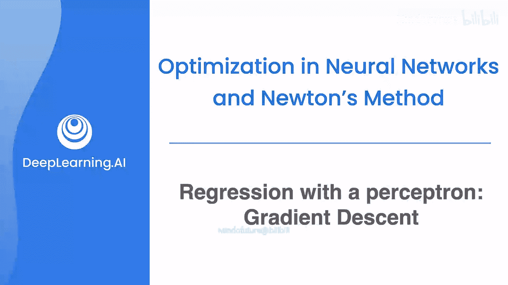
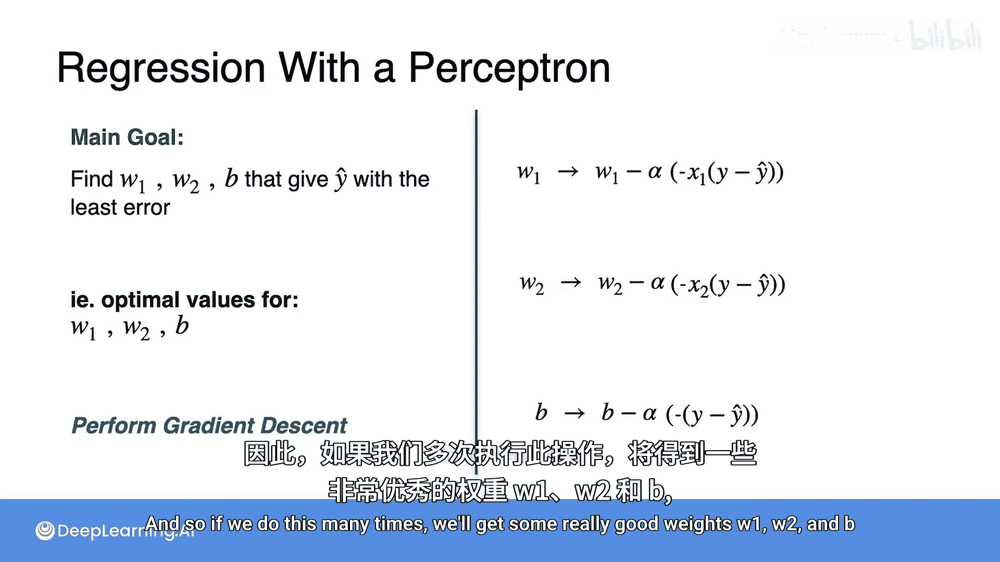

# 046：感知机回归与梯度下降

## 概述

在本节课中，我们将学习如何为感知机回归模型找到最优的权重和偏置参数。具体来说，我们将使用梯度下降算法来最小化模型的损失函数，从而得到一个预测误差最小的模型。

---

## 问题定义

上一节我们介绍了感知机回归模型及其损失函数。现在我们知道，问题的核心是找到一个具有最佳权重 `W1`、`W2` 和偏置 `B` 的预测函数，使得损失函数 `L(Y, Ŷ)` 的值最小。

换句话说，我们希望找到那个犯错最少的、最优的模型。

## 梯度下降法

那么，我们如何找到这些最优值呢？我们将使用梯度下降法来最小化损失函数 `L`。

我们将通过梯度下降来寻找最佳的 `W1`、`W2` 和 `B`。回顾一下，梯度下降公式通过以下方式更新 `W1` 以最小化 `L`：

**公式：**
`W1_new = W1_old - α * (∂L/∂W1)`

其中 `α` 是学习率。类似地，更新 `W2` 和 `B` 的公式如下：

**公式：**
`W2_new = W2_old - α * (∂L/∂W2)`
`B_new = B_old - α * (∂L/∂B)`

这意味着，我们从 `W1`、`W2` 和 `B` 的某个初始值开始，然后需要做的就是计算这三个梯度。通过更新参数，我们可以得到新的、更好的 `W1`、`W2` 和 `B`，从而得到一个损失函数更小、性能更好的模型。如果这个过程重复足够多次，最终我们将获得具有非常低损失函数的、相当不错的权重，这也就意味着一个优秀的模型。

## 计算偏导数

接下来，我将讲解如何计算这些导数。这里会大量用到链式法则。为了清晰起见，我们在左侧列出相关函数作为参考，在右侧计算偏导数。

首先，计算 `∂L/∂B`。观察 `L`，它依赖于变量 `Ŷ`。因此，我们需要先计算 `∂L/∂Ŷ`，然后 `Ŷ` 又依赖于 `B`，所以再计算 `∂Ŷ/∂B`。这正是我们上周学习的链式法则。

对于 `∂L/∂W1` 和 `∂L/∂W2`，情况是类似的：
*   `∂L/∂W1 = (∂L/∂Ŷ) * (∂Ŷ/∂W1)`
*   `∂L/∂W2 = (∂L/∂Ŷ) * (∂Ŷ/∂W2)`

现在我们知道需要做什么了：计算这四个导数。请注意，`∂L/∂Ŷ` 在三个表达式中重复出现，所以我们只需要计算它一次，然后再分别计算 `Ŷ` 对 `W1`、`W2` 和 `B` 的三个偏导数。这比直接代入整个公式计算要简单得多，相当于把问题分解成了更易于处理的子问题。

让我们分别计算每一个。

### 1. 计算 ∂L/∂Ŷ

这是关于 `Ŷ` 的导数。我们使用链式法则。损失函数 `L = 1/2 * (Y - Ŷ)^2`。对平方项求导得到 `(Y - Ŷ)`，但还需要乘以内部项 `(Y - Ŷ)` 对 `Ŷ` 的导数，即 `-1`。

**公式：**
`∂L/∂Ŷ = 1/2 * 2 * (Y - Ŷ) * (-1) = -(Y - Ŷ)`

我们可以将其写为 `-Y + Ŷ`，但保持 `-(Y - Ŷ)` 的形式会使后续的数学计算更简便。

### 2. 计算 ∂Ŷ/∂B、∂Ŷ/∂W1、∂Ŷ/∂W2

这三个导数计算起来要容易得多。

*   **∂Ŷ/∂B**：预测函数为 `Ŷ = W1*X1 + W2*X2 + B`。`B` 的系数是 1。
    **公式：** `∂Ŷ/∂B = 1`

*   **∂Ŷ/∂W1**：在 `Ŷ` 中，`W1` 的系数是 `X1`。
    **公式：** `∂Ŷ/∂W1 = X1`

*   **∂Ŷ/∂W2**：在 `Ŷ` 中，`W2` 的系数是 `X2`。
    **公式：** `∂Ŷ/∂W2 = X2`

### 3. 组合得到最终梯度

现在我们有了这些部分导数，让我们将它们代回链式法则中。右侧列出了我们已经计算好的结果作为参考。

*   **∂L/∂B** = (∂L/∂Ŷ) * (∂Ŷ/∂B) = `-(Y - Ŷ) * 1 = -(Y - Ŷ)`
*   **∂L/∂W1** = (∂L/∂Ŷ) * (∂Ŷ/∂W1) = `-(Y - Ŷ) * X1`
*   **∂L/∂W2** = (∂L/∂Ŷ) * (∂Ŷ/∂W2) = `-(Y - Ŷ) * X2`

这些就是我们的三个梯度。

## 应用梯度下降更新规则

现在让我们回到主要目标。回顾一下，主要目标是找到能给出预测误差最小的最优 `W1`、`W2` 和 `B` 值。我们将使用上周开发的工具——梯度下降法。

梯度下降使用以下更新公式来获得新的参数。我们已经计算出了所需的梯度：

**更新公式：**
`W1_new = W1_old - α * [ -(Y - Ŷ) * X1 ]`
`W2_new = W2_old - α * [ -(Y - Ŷ) * X2 ]`
`B_new = B_old - α * [ -(Y - Ŷ) ]`

通常，我们会将负号吸收到括号内，使公式更简洁：

**简化后的更新公式：**
`W1_new = W1_old + α * (Y - Ŷ) * X1`
`W2_new = W2_old + α * (Y - Ŷ) * X2`
`B_new = B_old + α * (Y - Ŷ)`

如果我们将这个更新过程重复很多次（对数据集中的多个样本或多次迭代），就会得到一组非常好的权重 `W1`、`W2` 和偏置 `B`，它们将具有非常小的误差，从而构成一个非常优秀的模型。

---

## 总结

本节课中，我们一起学习了如何为简单的感知机回归模型实施梯度下降。
1.  我们明确了目标：通过最小化均方误差损失函数来优化模型参数。
2.  我们回顾了梯度下降法的核心更新公式。
3.  我们详细推导了损失函数 `L` 关于每个参数（`W1`， `W2`， `B`）的偏导数，关键步骤是应用链式法则。
4.  最后，我们将计算得到的梯度代入梯度下降更新规则，得到了可用于迭代优化模型参数的具体公式。

通过不断重复“计算梯度 -> 更新参数”这一过程，模型能够逐步学习并逼近最优解。