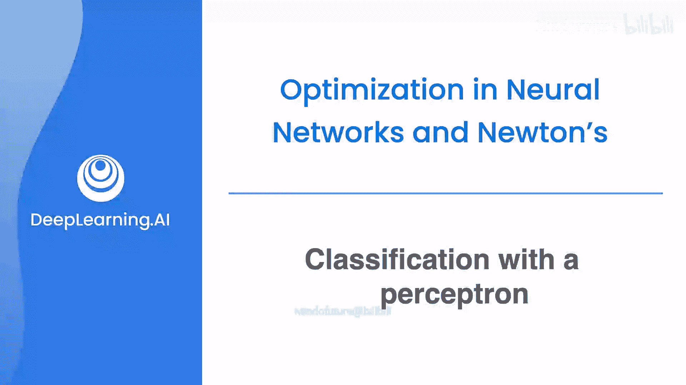
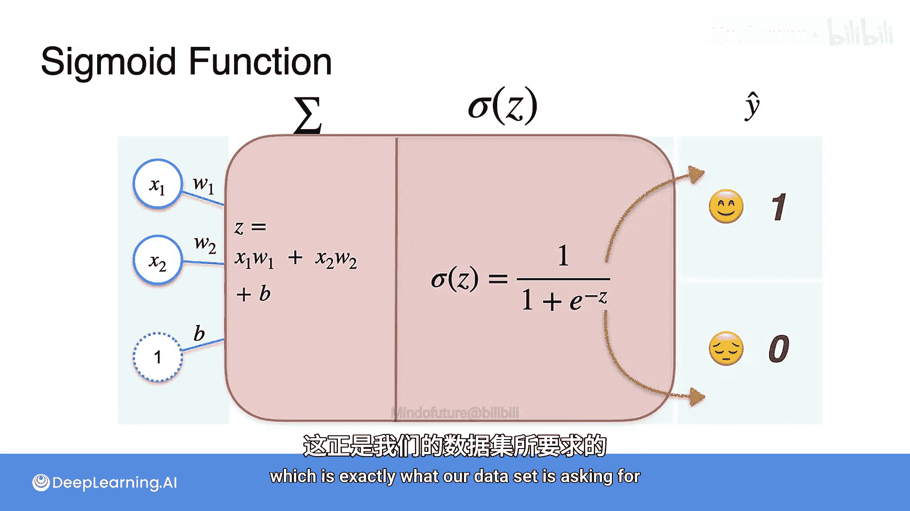

# 047：感知机分类

## 概述
在本节课中，我们将学习如何将感知机应用于分类问题，特别是二分类问题。我们将通过一个外星语言情感分析的例子，了解如何修改感知机的激活函数，使其能够预测句子是“开心”还是“悲伤”。

---

## 从回归到分类
上一节我们介绍了如何使用感知机和梯度下降解决回归问题。本节中我们来看看分类问题。分类与回归非常相似，只涉及一个小的改动。

## 问题引入：外星语言情感分析
假设你遇到了一个外星文明，并记录了他们的四句话。他们的语言只有两个词：“act”和“beep”。你的目标是判断每句话表达的情绪是“开心”还是“悲伤”。

以下是记录的数据：
*   第一句：开心，包含3个“act”，0个“beep”。
*   第二句：悲伤，包含0个“act”，2个“beep”。
*   第三句：悲伤，包含1个“act”，3个“beep”。
*   第四句：开心，包含2个“act”，1个“beep”。

为了用模型处理，我们将句子转化为数字特征。以下是转换后的数据集：

| 句子 | “act”数量 (x1) | “beep”数量 (x2) | 情绪 (y) |
| :--- | :--- | :--- | :--- |
| 1 | 3 | 0 | 开心 (1) |
| 2 | 0 | 2 | 悲伤 (0) |
| 3 | 1 | 3 | 悲伤 (0) |
| 4 | 2 | 1 | 开心 (1) |

## 数据可视化
首先，我们将数据点绘制在坐标系中。如下图所示，开心的点（绿色）倾向于集中在右下角，而悲伤的点（红色）集中在左上角。我们的模型目标就是找到一条线来区分这两个区域。

## 构建分类感知机
现在，我们将其构建为一个感知机模型。输入是特征x1（“act”数量）和x2（“beep”数量）。模型的核心是一个节点（图中红框部分），它将计算出一个值，用于判断句子情绪。

这个节点内部的工作流程与回归感知机类似，但有一个关键的增加。以下是其内部结构：

1.  **加权求和**：首先，对输入特征进行加权求和，并加上一个偏置项。公式如下：
    `z = (x1 * w1) + (x2 * w2) + b`
    其中，`w1`和`w2`是权重，`b`是偏置。权重决定了每个特征的重要性。例如，如果“act”与开心高度相关，`w1`会是一个较大的正数；如果“beep”与悲伤相关，`w2`可能是一个负数。

2.  **激活函数**：求和结果`z`是一个连续的实数，可能非常大或非常小。但我们的输出需要是0（悲伤）或1（开心），或者介于两者之间的概率值。因此，我们需要一个函数将整个实数轴“压缩”到(0,1)区间。这个函数就是**Sigmoid激活函数**。

    Sigmoid函数的公式是：
    `σ(z) = 1 / (1 + e^{-z})`
    这个函数将任何输入`z`映射为一个0到1之间的值。输出可以解释为模型认为句子是“开心”的概率。

## 激活函数的作用
Sigmoid函数是分类感知机的核心组件。它将加权求和`z`的结果转化为我们需要的概率输出。
*   如果`σ(z)`接近1，模型认为句子很可能是开心的。
*   如果`σ(z)`接近0，模型认为句子很可能是悲伤的。
*   如果`σ(z)`约为0.5，模型则不太确定。

下图展示了包含Sigmoid激活函数的完整分类感知机结构：

## 总结
本节课中，我们一起学习了如何将感知机用于二分类任务。关键步骤是将回归模型中的线性输出，通过一个Sigmoid激活函数，转换为表示概率的0到1之间的值。我们通过一个外星语言情感分析的例子，直观地理解了数据分布、模型目标以及分类感知机的基本架构。在下一节中，我们将更深入地探讨Sigmoid函数的特性。