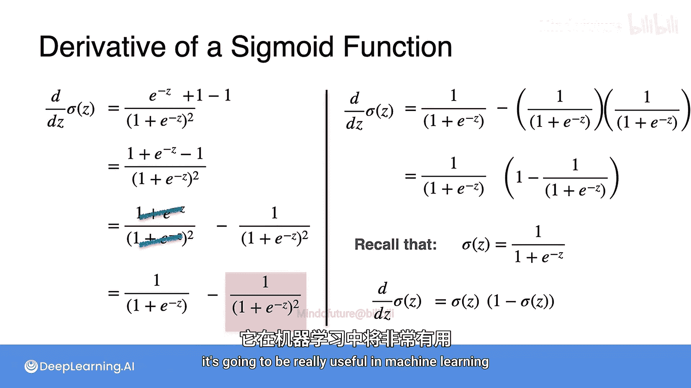

# 048：感知机分类 - Sigmoid函数及其导数


## 概述

在本节课中，我们将学习Sigmoid函数及其导数。Sigmoid函数在机器学习中极为重要，因为它能将整个实数轴压缩到区间(0,1)内，这正好符合许多机器学习模型对输出的要求。我们还将详细推导其导数，并解释为什么这个简洁的导数形式在机器学习中非常有用。

---

## Sigmoid函数回顾

上一节我们介绍了Sigmoid函数及其在机器学习中的重要性。本节中，我们来看看它的具体形式和图像。

Sigmoid函数的公式为：

**公式：** `σ(z) = 1 / (1 + e^(-z))`

其图像如下所示。输入（水平轴）是整个实数轴，而输出（垂直轴）被压缩在区间(0,1)内。

该函数在0和1处有渐近线，这意味着它永远不会真正触及0或1，但任何实数输入都会产生一个严格介于0和1之间的输出。

以下是几个关键点的示例：
*   `σ(0) = 1 / (1 + e^0) = 1 / (1 + 1) = 1/2`
*   当输入为一个非常大的正数（如1000）时，`σ(1000)` 的值非常接近1。
*   当输入为一个非常大的负数（如-1000）时，`σ(-1000)` 的值非常接近0。

---

## Sigmoid函数的导数

除了将输入映射到(0,1)区间外，Sigmoid函数还有一个非常优良的特性：它的导数形式非常简单。在机器学习中，我们会频繁使用导数进行优化（如梯度下降），因此一个易于求导的函数至关重要。

现在，让我们详细推导Sigmoid函数的导数。

我们将Sigmoid函数写作：
`σ(z) = (1 + e^(-z))^(-1)`

接下来，我们使用链式法则求导：
1.  首先，对 `(1 + e^(-z))^(-1)` 求导，得到 `-1 * (1 + e^(-z))^(-2)`。
2.  然后，乘以内部函数 `(1 + e^(-z))` 的导数。

具体步骤如下：

**求导过程：**
```
dσ(z)/dz = d/dz [(1 + e^(-z))^(-1)]
         = -1 * (1 + e^(-z))^(-2) * d/dz (1 + e^(-z))
         = - (1 + e^(-z))^(-2) * (0 + e^(-z) * (-1))
         = - (1 + e^(-z))^(-2) * (-e^(-z))
         = e^(-z) / (1 + e^(-z))^2
```

推导至此，我们可以通过一个巧妙的代数变换得到更简洁的形式。我们在分子上同时加1和减1：

```
dσ(z)/dz = e^(-z) / (1 + e^(-z))^2
         = [ (1 + e^(-z)) - 1 ] / (1 + e^(-z))^2
         = (1 + e^(-z))/(1 + e^(-z))^2 - 1/(1 + e^(-z))^2
         = 1/(1 + e^(-z)) - [1/(1 + e^(-z))]^2
```

现在，提取公因式 `1/(1 + e^(-z))`：

```
dσ(z)/dz = 1/(1 + e^(-z)) * [ 1 - 1/(1 + e^(-z)) ]
```

请注意，`1/(1 + e^(-z))` 正是Sigmoid函数 `σ(z)` 本身。因此，上式可以写为：

**最终导数公式：** `dσ(z)/dz = σ(z) * (1 - σ(z))`

这个结果非常优美：Sigmoid函数的导数等于Sigmoid函数本身乘以 `(1 - Sigmoid)`。

---

## 总结

本节课中，我们一起学习了：
1.  **Sigmoid函数**：其公式为 `σ(z) = 1 / (1 + e^(-z))`，作用是将任意实数输入映射到(0,1)区间，非常适合表示概率。
2.  **Sigmoid函数的导数**：通过详细的链式法则推导，我们得到了极其简洁的导数公式 `σ‘(z) = σ(z) * (1 - σ(z))`。



Sigmoid函数因其良好的数学性质（输出范围固定、导数易于计算）而在机器学习，尤其是逻辑回归和早期神经网络中扮演了重要角色。理解其导数形式对于后续学习反向传播等算法至关重要。