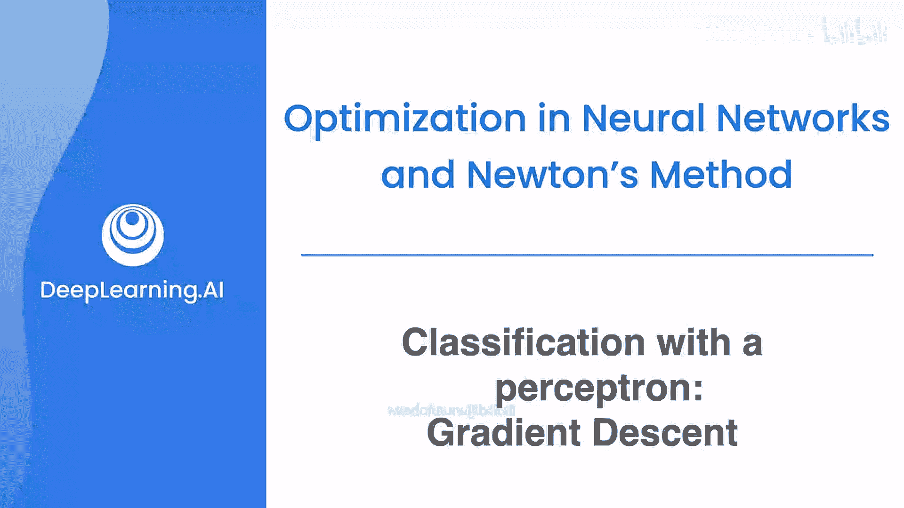
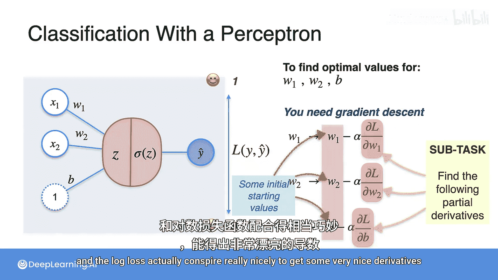

# 049：感知机分类梯度下降

在本节课中，我们将学习如何将梯度下降算法应用于感知机分类模型。我们将回顾感知机的工作原理，并引入一个适用于分类问题的损失函数——对数损失函数。最后，我们将概述如何使用梯度下降来更新模型参数，以最小化这个损失。

## 感知机预测回顾

上一节我们介绍了Sigmoid函数。本节中我们来看看如何将其应用于感知机模型。

以一个句子“act beep beep beep”为例。其中单词“act”出现1次，因此特征x1 = 1；单词“Bep”出现3次，因此特征x2 = 3。

假设在算法训练过程中，我们当前的权重为：w1 = 4.5， w2 = 1.5，偏置项b = 2。

感知机的工作流程如下：它接收输入，将其与权重相乘并求和，然后对求和结果应用Sigmoid函数，最终得到预测值ŷ。

模型的目标是使用ŷ和一个损失函数来计算ŷ与真实值y之间的差距，并利用这个差距来更新权重。

假设这个句子的真实标签y = 0（表示句子是悲伤的）。我们将利用这个信息来更新w1、w2和b。

## 分类问题的损失函数

我们需要衡量ŷ与y之间的误差。你可能会想到之前见过的误差函数，例如ŷ - y、(ŷ - y)² 或 ½(ŷ - y)²。这些函数都有效。

但对于分类问题，效果最好的函数称为**对数损失**。

接下来，我将展示如何计算对数损失。

我们将对数损失函数记为L(y, ŷ)。我们将利用这个误差来更新三个权重参数，以降低误差。

让我们回顾一下：我们有一个预测函数ŷ，它是对感知机求和结果应用Sigmoid激活函数得到的。我们还有一个损失函数，即对数损失。

## 对数损失函数的来源与特性

这个对数损失函数你之前已经见过。还记得上一节我们尝试寻找理想硬币来拟合数据集的例子吗？你需要抛一枚硬币10次，得到7次正面和3次反面，然后寻找最适合的硬币。那个完美硬币是通过最小化一个包含对数的损失函数找到的。正是这个函数。

实际上，这就是当前问题的损失函数。你可以观察到：
*   如果y = 0，当ŷ较小时，函数值较小；当ŷ较大时，函数值较大。
*   如果y = 1，则情况相反：当ŷ接近1时，函数值较小；当ŷ接近0时，函数值较大。

换句话说，当y和ŷ相差很大时，L(y, ŷ)是一个大数；当它们彼此接近时，它是一个小数。

使用对数损失函数的原因有很多：一是其数学性质非常优美，二是这个函数具有概率特性。其概率特性源于它与硬币例子的同源性。分类问题具有高度的概率性，因为你可以将输出ŷ视为一个概率。例如，如果ŷ是80%或0.8，那就意味着模型认为该句子有80%的概率是快乐的。

## 梯度下降更新权重

让我们回到主要目标：找到完美的权重w1、w2和偏置b，使我们的预测ŷ具有最小的对数损失L(y, ŷ)。

为了实现这个目标，我们需要回到梯度下降法。

以下是梯度下降更新权重的公式：
*   **w1** 的更新公式为：`w1 := w1 - α * (∂L / ∂w1)`
*   **w2** 的更新公式为：`w2 := w2 - α * (∂L / ∂w2)`
*   **偏置b** 的更新公式为：`b := b - α * (∂L / ∂b)`

其中，α是学习率。

为了启动算法，我们只需为权重和偏置设置一些初始值，然后开始下降过程。

以下是算法步骤：
1.  初始化随机变量（权重和偏置）。
2.  计算偏导数。
3.  更新参数。

在下一个视频中，我将展示如何计算这些偏导数。你将看到，Sigmoid函数和对数损失函数共同作用，能得到非常简洁优美的导数形式。

## 总结

本节课中我们一起学习了感知机分类模型中的梯度下降。我们回顾了感知机如何利用Sigmoid函数进行预测，并引入了专门用于分类问题的对数损失函数来度量误差。最后，我们概述了使用梯度下降法、通过计算损失函数对各个参数的偏导数来迭代更新权重和偏置的完整流程，为下一步具体计算偏导数奠定了基础。