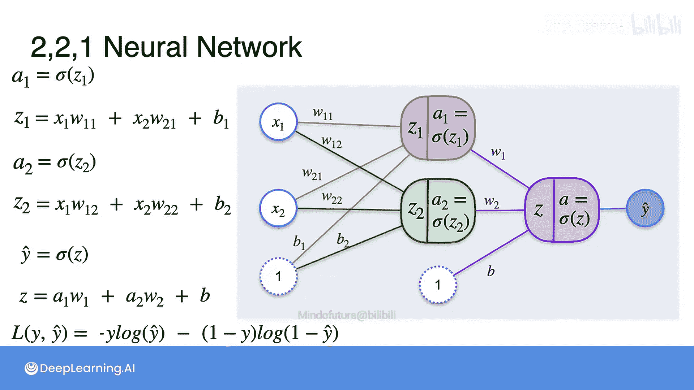

# 051：神经网络分类 03 01 08


## 概述
在本节课中，我们将学习神经网络的基本概念。我们将从单个感知器出发，了解其局限性，然后构建一个由多个感知器组成的简单神经网络。我们将详细讲解这个神经网络的数学结构，包括输入层、隐藏层和输出层，并介绍用于分类问题的损失函数。

## 从感知器到神经网络
上一节我们介绍了用于情感分析的二元分类感知器模型。该模型通过线性组合输入特征与权重，再经过Sigmoid激活函数得到预测值 `y_hat`。然而，这类模型相对简单，只能构建线性的决策边界（例如一条直线）。现实问题（如语言理解）往往需要更复杂的非线性边界。

为了处理更复杂的问题，我们不再使用单个感知器，而是将多个感知器组合在一起，这就构成了神经网络。

## 构建一个简单的神经网络
以下是构建一个两层神经网络的方法。我们首先创建两个感知器（红色和绿色），然后将它们的输出作为输入，传递给第三个感知器（紫色）。

### 第一层：隐藏层
我们有两个感知器构成隐藏层。

*   **红色感知器**：
    *   输入：特征 `x1`, `x2`
    *   权重：`w11`, `w21`
    *   偏置：`b1`
    *   计算过程：
        1.  线性组合：`z1 = x1*w11 + x2*w21 + b1`
        2.  激活函数：`a1 = sigmoid(z1)`
    *   输出：`a1`

*   **绿色感知器**：
    *   输入：特征 `x1`, `x2`
    *   权重：`w12`, `w22`
    *   偏置：`b2`
    *   计算过程：
        1.  线性组合：`z2 = x1*w12 + x2*w22 + b2`
        2.  激活函数：`a2 = sigmoid(z2)`
    *   输出：`a2`

### 第二层：输出层
隐藏层的输出 `a1` 和 `a2` 将作为输入传递给输出层的紫色感知器。

*   **紫色感知器（输出层）**：
    *   输入：`a1`, `a2`
    *   权重：`w1`, `w2`
    *   偏置：`b`
    *   计算过程：
        1.  线性组合：`z = a1*w1 + a2*w2 + b`
        2.  激活函数：`y_hat = sigmoid(z)`
    *   输出：`y_hat`（最终的预测值）

这个结构构成了一个深度为2的神经网络，包含一个输入层、一个隐藏层和一个输出层。更复杂的网络可以包含更多的层和节点。

## 神经网络的数学表达与损失函数
本节中我们来看看整个网络的计算流程和如何衡量其性能。

以下是整个神经网络的计算总结：
```
a1 = sigmoid(x1*w11 + x2*w21 + b1)
a2 = sigmoid(x1*w12 + x2*w22 + b2)
y_hat = sigmoid(a1*w1 + a2*w2 + b)
```

由于我们处理的是分类问题，需要定义一个损失函数来衡量预测值 `y_hat` 与真实标签 `y` 之间的误差。我们使用之前介绍过的对数损失（Log Loss）函数：

**损失函数公式**：
`L(y, y_hat) = -[y * log(y_hat) + (1 - y) * log(1 - y_hat)]`

其中，`y` 是训练数据中的真实目标值（0或1），`y_hat` 是神经网络的预测值。

## 训练神经网络
现在我们已经了解了神经网络的工作原理，接下来将探讨如何训练它。训练的目标是通过调整网络中的所有权重（`w11`, `w21`, `b1`, `w12`, `w22`, `b2`, `w1`, `w2`, `b`）和偏置，使损失函数 `L` 的值最小化。

我们将使用梯度下降法，这与训练单个感知器类似。关键区别在于，现在我们需要计算损失函数相对于**每一个**权重和偏置的导数（梯度）。在后续课程中，我们将详细讲解如何通过反向传播算法高效地计算这些梯度。



## 总结
本节课中我们一起学习了神经网络的基础。我们从单个感知器的局限性出发，构建了一个包含输入层、隐藏层和输出层的两层神经网络，并描述了其前向传播的计算过程。我们还回顾了用于分类问题的对数损失函数。最后，我们指出了训练神经网络的核心是使用梯度下降法优化所有权重和偏置，这需要计算大量的梯度，为下一节学习反向传播算法做好了准备。