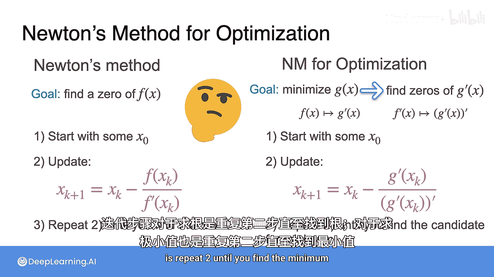

# 054：牛顿法

在本节课中，我们将学习一种替代梯度下降的优化方法——牛顿法。牛顿法在原理上非常快速且强大。我们将从牛顿法的基本概念开始，逐步了解它如何用于寻找函数的零点，并最终将其应用于优化问题。

## 牛顿法原理：寻找函数零点 🔍

牛顿法最初用于寻找函数的零点。让我们从一个简单的单变量函数开始，看看它是如何工作的。

假设我们有一个函数，目标是找到它的零点，即函数值 `f(x) = 0` 的点。牛顿法通过迭代逼近这个点，其过程类似于梯度下降。

以下是牛顿法寻找零点的步骤：

1.  从一个随机初始点 `x0` 开始。
2.  计算该点处的函数值 `f(x0)` 和导数值 `f'(x0)`。
3.  画出该点的切线，并找到切线与x轴的交点，这个交点就是新的近似点 `x1`。
4.  重复步骤2和3，用 `x1` 替代 `x0`，得到 `x2`，依此类推。

通过几次迭代，我们就能非常接近函数的真实零点。

## 数学推导：迭代公式 📐

现在，让我们用数学公式来描述上述过程。

在第一次迭代中，初始点为 `x0`。该点切线的斜率是 `f'(x0)`。根据“斜率 = 上升 / 前进”的几何关系，我们可以得到：

**公式：** `f'(x0) = f(x0) / (x0 - x1)`

对这个公式进行移项，我们可以解出 `x1`：

**公式：** `x1 = x0 - f(x0) / f'(x0)`

这就是牛顿法的核心迭代公式。将其推广到第 `k` 次迭代，公式变为：

**公式：** `x_{k+1} = x_k - f(x_k) / f'(x_k)`

其中，`x_k` 是第 `k` 次迭代的点，`x_{k+1}` 是第 `k+1` 次迭代的点。只要我们知道当前点的函数值和导数值，就能计算出下一个更接近零点的点。

## 从寻零到优化：寻找函数最小值 🎯

上一节我们介绍了如何用牛顿法寻找函数零点。本节中我们来看看如何将它应用于优化问题，即寻找函数的最小值。

关键在于一个基本原理：**一个函数 `g(x)` 在其最小值点处的导数 `g'(x)` 等于零**。因此，寻找 `g(x)` 的最小值点，等价于寻找其导函数 `g'(x)` 的零点。

如果我们令 `f(x) = g'(x)`，那么对 `f(x)` 应用牛顿法寻找零点，实际上就是在寻找 `g(x)` 的极值候选点。将这些候选点代入原函数 `g(x)` 进行比较，就能找到最小值。

因此，将牛顿法用于优化的迭代公式需要进行调整。我们不再使用原函数 `f`，而是使用目标函数 `g` 的一阶导数 `g'` 和二阶导数 `g''`。

优化版的牛顿法迭代公式如下：

**公式：** `x_{k+1} = x_k - g'(x_k) / g''(x_k)`

## 算法步骤总结 📋

以下是两种场景下牛顿法的算法步骤对比。

**牛顿法（寻找函数零点）**
1.  初始化：选择起始点 `x0`。
2.  迭代更新：重复计算 `x_{k+1} = x_k - f(x_k) / f'(x_k)`。
3.  终止条件：重复步骤2，直到找到函数的根（零点）。

**牛顿法（寻找函数最小值）**
1.  初始化：选择起始点 `x0`。
2.  迭代更新：重复计算 `x_{k+1} = x_k - g'(x_k) / g''(x_k)`。
3.  终止条件：重复步骤2，直到找到函数的最小值。

## 课程总结

本节课中我们一起学习了牛顿法。我们首先了解了牛顿法如何通过迭代切线来高效地寻找函数的零点，并推导出其核心迭代公式 `x_{k+1} = x_k - f(x_k) / f'(x_k)`。接着，我们探讨了如何将寻零问题转化为优化问题，通过寻找导函数的零点来定位原函数的最小值，从而得到了用于优化的牛顿法公式 `x_{k+1} = x_k - g'(x_k) / g''(x_k)`。牛顿法是一种强大且收敛速度快的优化算法，是机器学习工具箱中的重要组成部分。