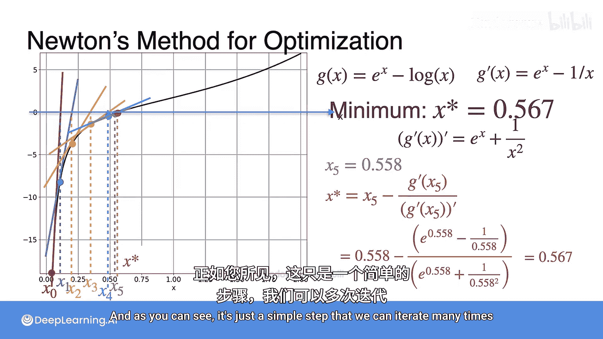

# 055：牛顿法示例 🚀

在本节课中，我们将通过一个具体的例子，学习如何应用牛顿法来寻找函数的最小值。我们将回顾一个熟悉的函数，并一步步演示牛顿法的迭代过程，展示其快速收敛的特性。

## 概述

上一节我们介绍了牛顿法的基本原理。本节中，我们来看看如何将其应用于一个实际函数，以寻找其最小值点。我们将使用函数 **f(x) = e^x - log(x)** 作为示例，其最小值点位于著名的欧米伽常数（约0.5671）附近。需要注意的是，为了用牛顿法求最小值，我们实际上是寻找其导数的零点。

## 示例函数与导数

我们使用的函数及其导数如下：
*   **原函数**：`f(x) = e^x - log(x)`
*   **一阶导数（即我们需要找零点的函数）**：`g'(x) = e^x - 1/x`
*   **二阶导数（牛顿法迭代中所需的导数）**：`g''(x) = e^x + 1/x^2`

在牛顿法的框架下，我们设：
*   `F(x) = g'(x) = e^x - 1/x`
*   `F'(x) = g''(x) = e^x + 1/x^2`

## 牛顿法迭代过程

现在，让我们开始迭代。我们选择初始值 **x0 = 0.05**。

以下是牛顿法的迭代步骤，每一步都遵循公式 **x_{n+1} = x_n - F(x_n) / F'(x_n)**：

*   **第一次迭代 (x0 -> x1)**
    使用公式计算 x1：
    `x1 = 0.05 - (e^0.05 - 1/0.05) / (e^0.05 + 1/(0.05)^2) ≈ 0.097`

*   **第二次迭代 (x1 -> x2)**
    以 x1 为起点，计算下一个近似值：
    `x2 = 0.097 - (e^0.097 - 1/0.097) / (e^0.097 + 1/(0.097)^2) ≈ 0.183`

*   **第三次迭代 (x2 -> x3)**
    继续迭代过程：
    `x3 = 0.183 - (e^0.183 - 1/0.183) / (e^0.183 + 1/(0.183)^2) ≈ 0.320`

*   **第四次迭代 (x3 -> x4)**
    我们正逐渐接近目标：
    `x4 = 0.320 - (e^0.320 - 1/0.320) / (e^0.320 + 1/(0.320)^2) ≈ 0.477`

*   **第五次迭代 (x4 -> x5)**
    值已经非常接近最小值：
    `x5 = 0.477 - (e^0.477 - 1/0.477) / (e^0.477 + 1/(0.477)^2) ≈ 0.558`

*   **第六次迭代 (x5 -> x6)**
    进行最后一次演示迭代：
    `x6 = 0.558 - (e^0.558 - 1/0.558) / (e^0.558 + 1/(0.558)^2) ≈ 0.567`

## 总结

本节课中，我们一起学习了牛顿法在一个具体优化问题中的应用。我们从初始值 **x0=0.05** 开始，通过仅仅**六次迭代**，就使近似值达到了 **0.567**，这与函数真实的最小值点（欧米伽常数 ≈ 0.5671）已经极为接近。这个例子清晰地展示了牛顿法**收敛速度非常快**的优势。整个过程步骤清晰，只需重复简单的计算即可逐步逼近目标。