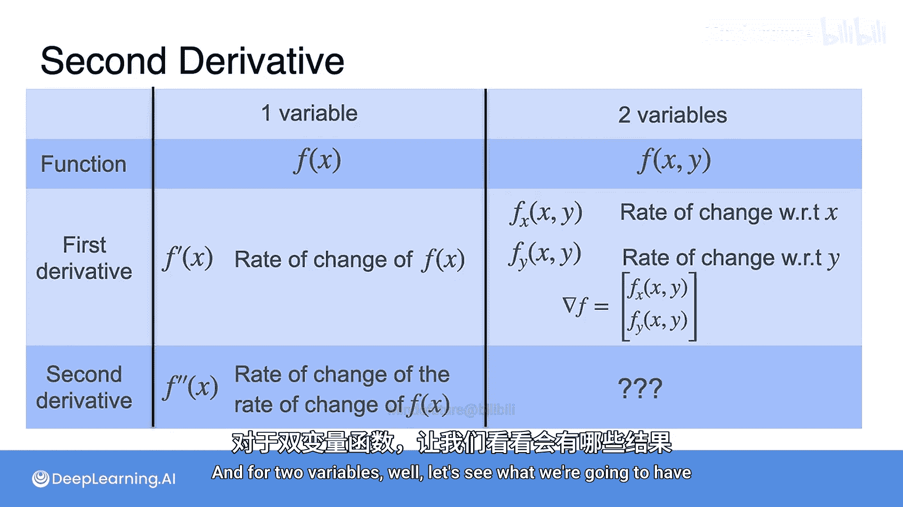
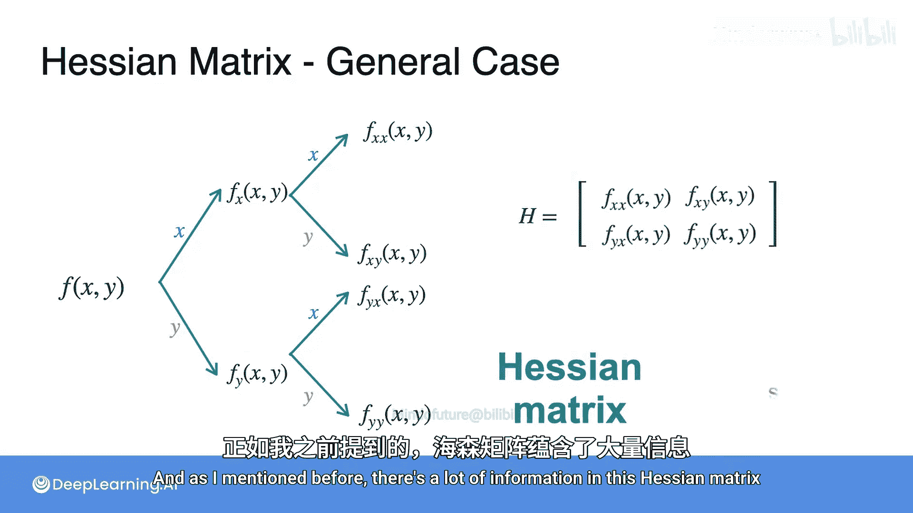
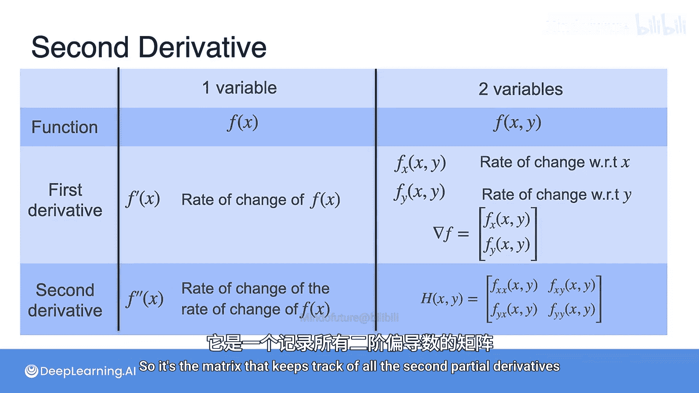

# 057：海森矩阵


在本节课中，我们将要学习多变量函数的二阶导数。上一节我们介绍了单变量函数的二阶导数及其在优化问题中的应用。本节中我们来看看当函数变量多于一个时，二阶导数的概念如何扩展。我们将重点学习一个称为**海森矩阵**的重要工具，它包含了所有的二阶偏导数信息，并在多变量优化中扮演关键角色。

## 单变量与多变量函数的对比

首先，我们来回顾和对比单变量与双变量函数。

*   一个单变量函数记作 **`f(x)`**，它只依赖于变量 **`x`**。
*   一个双变量函数记作 **`f(x, y)`**，它依赖于变量 **`x`** 和 **`y`**。

对于一阶导数：
*   单变量函数的一阶导数是 **`f'(x)`**，表示 **`f`** 相对于唯一变量 **`x`** 的变化率。
*   双变量函数有两个变化率：**`f`** 相对于 **`x`** 的变化率（记作 **`f_x`**）和相对于 **`y`** 的变化率（记作 **`f_y`**）。将它们组合起来，就得到了梯度向量 **`∇f`**。

那么二阶导数呢？对于单变量函数，二阶导数是 **`f''(x)`**，即变化率的变化率。对于双变量函数，情况会复杂一些，这正是本节视频要展示的内容。

## 理解双变量函数的二阶导数



为了理解双变量函数的二阶导数，让我们分析一个简单的例子。

考虑函数：
**`f(x, y) = 2x² + 3y² - xy`**

首先，我们计算它的一阶偏导数：
*   对 **`x`** 求偏导：**`f_x = 4x - y`**
*   对 **`y`** 求偏导：**`f_y = 6y - x`**

接下来，我们可以计算二阶偏导数。以下是计算过程：
1.  对 **`f_x`** 再对 **`x`** 求偏导：**`f_xx = 4`**
2.  对 **`f_x`** 再对 **`y`** 求偏导：**`f_xy = -1`**
3.  对 **`f_y`** 再对 **`x`** 求偏导：**`f_yx = -1`**
4.  对 **`f_y`** 再对 **`y`** 求偏导：**`f_yy = 6`**

这四个二阶偏导数代表了“变化率的变化率”。具体来说：
*   **`f_xx`** 和 **`f_yy`** 类似于单变量情况，分别表示沿 **`x`** 方向和 **`y`** 方向的变化率如何变化。
*   **`f_xy`** 和 **`f_yx`** 则有些特殊，它们表示沿一个坐标轴方向的斜率如何随另一个正交坐标轴的微小变化而变化。

一个值得注意的现象是：**`f_xy`** 和 **`f_yx`** 在这个例子中是相等的。在大多数情况下，只要两个一阶偏导数都是可微的，这个等式就成立，即混合偏导数与求导顺序无关。

在数学符号中，这些二阶偏导数可以表示为：
*   **`∂²f/∂x²`**, **`∂²f/∂y²`**
*   **`∂²f/∂x∂y`**, **`∂²f/∂y∂x`**

或者简写为：**`f_xx`**, **`f_yy`**, **`f_xy`**, **`f_yx`**。

## 海森矩阵的定义与构成

现在让我们引入海森矩阵。回顾上面的例子，我们计算了四个二阶偏导数。如果我们将这四个数按特定顺序排列成一个矩阵，就得到了该函数在这一点上的**海森矩阵**。

对于函数 **`f(x, y) = 2x² + 3y² - xy`**，其海森矩阵 **`H`** 为：
```
H = [ f_xx  f_xy ] = [ 4   -1 ]
    [ f_yx  f_yy ]   [ -1   6 ]
```

在一般情况下，对于一个函数 **`f(x, y)`**，我们首先计算一阶偏导数 **`f_x`** 和 **`f_y`**，然后计算它们的二阶偏导数：**`f_xx`**, **`f_xy`**, **`f_yx`**, **`f_yy`**。将这些二阶偏导数排列成的矩阵就是海森矩阵：
```
H(f) = [ ∂²f/∂x²   ∂²f/∂x∂y ]
       [ ∂²f/∂y∂x   ∂²f/∂y² ]
```

海森矩阵包含了函数在一点附近曲率的所有二阶信息。正如我们之前提到的，在大多数实际情况下（当函数满足连续性条件时），有 **`∂²f/∂x∂y = ∂²f/∂y∂x`**，这意味着海森矩阵是一个**对称矩阵**。

## 总结与对比

让我们回到最初的对比表格，现在可以将其补充完整：





*   对于单变量函数，二阶导数是一个数值 **`f''(x)`**。
*   对于多变量函数（如双变量），二阶导数的角色由**海森矩阵**扮演。它是一个矩阵，系统地记录了所有可能的二阶偏导数。


本节课中我们一起学习了多变量函数的二阶导数概念。我们通过一个具体例子计算了二阶偏导数，并引出了核心工具——**海森矩阵**。海森矩阵不仅概括了函数在各个方向上的曲率信息，其对称性也简化了计算。在接下来的学习中，我们将看到海森矩阵在多变量牛顿法等优化算法中如何被用来高效地寻找函数的最优点。