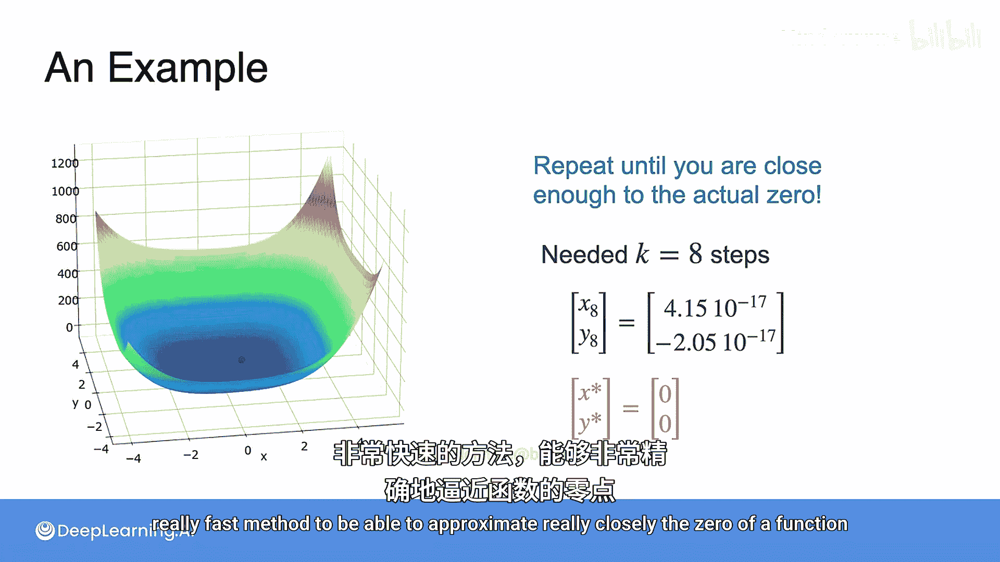

# 059：双变量牛顿法 🧮

在本节课中，我们将学习如何将牛顿法应用于优化多变量函数。正如你所猜测的，海森矩阵将在此出现。

## 概述

上一节我们介绍了单变量牛顿法，本节中我们来看看如何将其推广到两个或更多变量的情况。我们将学习更新公式，并通过一个具体例子演示其应用。

## 从单变量到多变量

回想一下，在本课程开始时，我们学习了牛顿法，并找到了迭代寻找函数最小值或最大值的表达式。

对于单变量函数，更新方程依赖于当前值、一阶导数和二阶导数，其表达式如下：
`x_{k+1} = x_k - f'(x_k) / f''(x_k)`

我们也可以将其重写为：
`x_{k+1} = x_k - [f''(x_k)]^{-1} * f'(x_k)`
即，不是除以 `f''(x_k)`，而是乘以 `f''(x_k)` 的倒数。

## 双变量牛顿法公式

对于双变量情况，我们不再只有一个坐标，而是有两个坐标 `x` 和 `y`。第 `k` 次迭代是 `(x_k, y_k)`，第 `k+1` 次迭代是 `(x_{k+1}, y_{k+1})`。

那么如何从第 `k` 次迭代得到第 `k+1` 次迭代呢？观察上面的表达式，二阶导数变成了海森矩阵，一阶导数变成了梯度。由于我们之前是除以二阶导数，现在则变为乘以海森矩阵的逆。

因此，双变量的表达式为：
`[x_{k+1}, y_{k+1}]^T = [x_k, y_k]^T - H^{-1} * ∇f(x_k, y_k)`

其中 `H` 是海森矩阵，`∇f` 是梯度向量。

实际上，这个公式可以推广到 `n` 个变量：
`\vec{x}_{k+1} = \vec{x}_k - H^{-1}(\vec{x}_k) * ∇f(\vec{x}_k)`

这里 `\vec{x}_k` 是 `n` 维坐标向量，`H` 是 `n x n` 的海森矩阵，`∇f` 是 `n` 维梯度向量。

> **注意**：矩阵乘法的顺序至关重要。梯度向量必须乘在海森逆矩阵的右侧，因为梯度是列向量（`n x 1`），而海森矩阵是 `n x n` 的。写成 `∇f * H^{-1}` 在数学上是无效的。

虽然证明这个公式需要大量工作，但我们可以直接使用它。可以看到，这确实是单变量情况的一个合理推广。

## 实践应用：一个具体例子

现在你知道了多变量牛顿法，让我们将其付诸实践。以下是一个凹函数，我们将尝试找到其最小值。

首先，我们来看函数关于 `x` 和 `y` 的两个偏导数：
`f_x = 2x + y`
`f_y = x + 2y`

然后，计算这些偏导数关于 `x` 和 `y` 的二次偏导：
`f_{xx} = 2`
`f_{xy} = 1`
`f_{yx} = 1`
`f_{yy} = 2`

因此，梯度由中间的两个表达式构成：
`∇f = [2x + y, x + 2y]^T`

海森矩阵则由这四个二次偏导表达式构成：
`H = [[2, 1], [1, 2]]`

## 迭代求解过程

现在，使用海森矩阵和梯度进行牛顿法迭代。

让我们从一个初始点开始，例如 `(x0, y0) = (4, 4)`。

以下是该点的梯度（将数字4和4代入梯度表达式）：
`∇f(4,4) = [2*4+4, 4+2*4]^T = [12, 12]^T`

现在计算海森矩阵（注意，它在整个定义域内是常数矩阵）：
`H = [[2, 1], [1, 2]]`
其逆矩阵为：
`H^{-1} = (1/3) * [[2, -1], [-1, 2]]`

**第一次迭代**：
根据公式，第二次迭代（即第一次迭代后的点）为：
`[x1, y1]^T = [4, 4]^T - H^{-1} * [12, 12]^T`
计算后得到：
`[x1, y1] ≈ [2.58, 2.62]`

可以看到，新点 `(2.58, 2.62)` 比 `(4, 4)` 更接近我们寻找的根 `(0, 0)`。

**第二次迭代**：
现在以 `(2.58, 2.62)` 为新起点。
计算该点梯度：
`∇f ≈ [7.78, 7.82]^T`
（代入 `x=2.58, y=2.62` 到梯度公式）

第二次迭代为：
`[x2, y2]^T = [2.58, 2.62]^T - H^{-1} * [7.78, 7.82]^T`
计算后得到：
`[x2, y2] ≈ [1.59, 1.67]`

**继续迭代**：
如果我们重复这个过程多次，最终会非常接近实际零点。

例如，经过八次迭代后，我们得到：
`[x8, y8] ≈ [4.15e-17, -2.05e-17]`
这是一个极其小的数字，非常非常接近 `(0, 0)`。而 `(0, 0)` 正是我们要找的最优点，因为它是函数的根。

## 总结

本节课中，我们一起学习了双变量牛顿法。正如你所见，与单变量情况类似，双变量牛顿法也是一种非常快速的方法，能够非常精确地逼近函数的零点。其核心在于使用梯度向量和海森矩阵的逆来迭代更新变量值，从而高效地找到最优解。