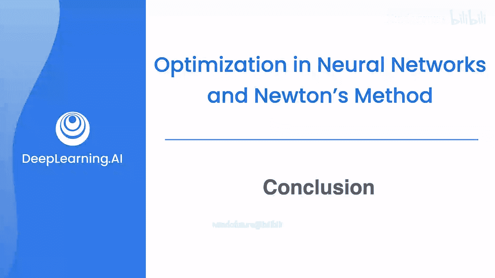

# 060：课程回顾与展望 🎓

在本节课中，我们将对微积分课程的核心内容进行总结，回顾所学知识，并展望其在机器学习旅程中的应用。

---

首先，我们学习了单变量函数的导数。导数描述了函数在某一点处的瞬时变化率，是理解函数行为的基础工具。

上一节我们介绍了单变量导数，本节中我们来看看多变量情况下的扩展。

接着，我们学习了多变量函数的梯度和导数。梯度是一个向量，其每个分量是函数对相应变量的偏导数。对于函数 `f(x, y)`，其梯度公式为：
**∇f = [∂f/∂x, ∂f/∂y]**
我们掌握了如何计算它们，并理解了它们在描绘多变量函数变化方向上的重要性。

当我们掌握了这些基本工具后，下一步就是学习如何运用它们来解决问题。

然后，我们学习了如何利用导数和梯度来优化问题。优化的核心是找到使函数值最小化或最大化的输入点，这在机器学习中对应于寻找最佳模型参数。

然而，当优化问题变得复杂时，我们需要更高效的方法。

当问题变得复杂时，我们学习了诸如梯度下降法和牛顿法等技术来加速优化过程。梯度下降法的核心更新公式为：
**θ_new = θ_old - α * ∇J(θ)**
其中 `α` 是学习率，`J(θ)` 是代价函数。

以下是本课程涵盖的核心主题列表：
*   **单变量导数**：函数变化率的基础概念。
*   **多变量梯度**：函数在多维空间中变化方向与速率的向量表示。
*   **优化方法**：应用导数寻找函数极值点。
*   **高级优化算法**：如梯度下降法，用于处理复杂、高维的优化问题。

最重要的是，我们学习了如何将所有这些优化方法应用到机器学习中。从线性回归的代价函数最小化，到神经网络中通过反向传播调整权重，微积分都是其背后的核心数学引擎。

---

本节课中我们一起学习了从单变量导数到多变量梯度的核心微积分概念，探索了如何利用它们进行优化，并特别介绍了梯度下降等实用算法。最终，我们看到了这些数学工具如何构成机器学习模型训练的基础。祝贺你完成了这门微积分课程，这是你机器学习之旅中坚实的一步。我们对你即将迈出的后续步伐充满期待。