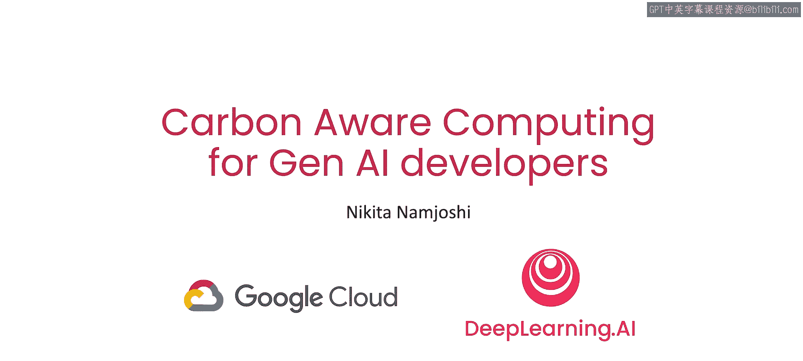
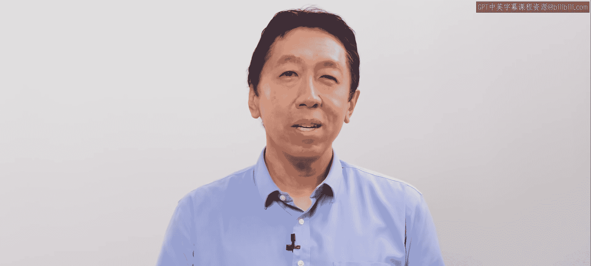
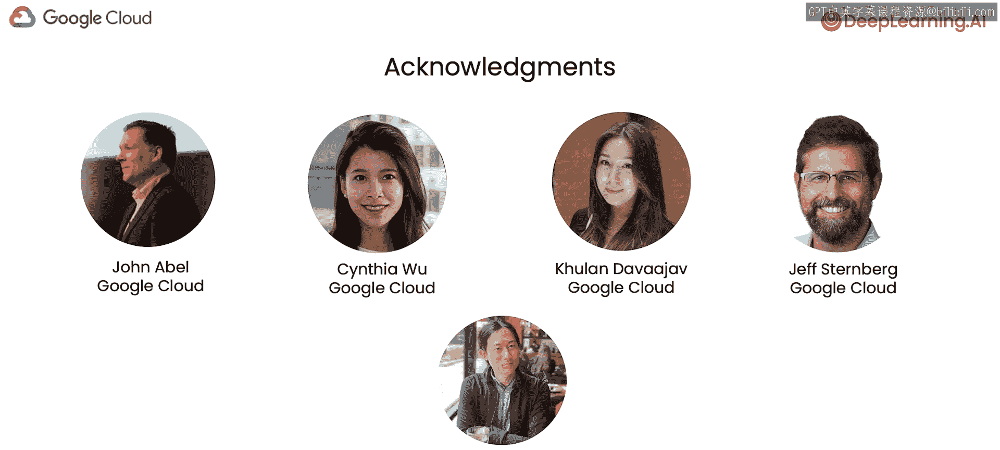

# 001：课程介绍 🌱

在本课程中，我们将学习如何通过选择合适的时间和地点运行AI工作负载，来显著降低其碳排放。我们将了解电网能源结构、碳排放强度等核心概念，并学习使用相关工具来实践碳意识计算。

欢迎来到《面向生成式AI开发者的碳意识计算》课程，本课程是与谷歌云合作开发的。

我是吴恩达，很高兴本课程的讲师是Nikkita Namjihi。

她是谷歌云的开发者倡导者，同时也是“永久冻土发现门户”项目的谷歌研究员。

该项目是一个利用人工智能追踪北极永久冻土变化的倡议。

她在可持续发展领域工作超过五年，对于如何减少AI工作负载的二氧化碳排放拥有丰富的实践经验可以分享。

谢谢吴恩达。

我很高兴能与你和你的团队合作。

训练、微调乃至部署模型，尤其是生成式模型，可能是计算密集型和能源密集型的。

但如果你知道如何在云端定制运行模型任务的地点和时间，它就不必是高碳排放的。

具体来说，你可以通过选择由低碳能源供电的数据中心来运行训练任务，从而选择低二氧化碳的能源为你的训练工作供电，这些能源包括风能、太阳能、水能或核能。

在这个短期课程中，你将学习如何使用Electricity Maps API查询全球不同区域电网的能源结构组成。

同时，你将学习如何在云端选择一个由高比例无碳能源供电的数据中心来训练机器学习模型。

目前的估计是，云计算约占全球温室气体排放总量的2.5%至3.7%。

此外，AI工作流持续增长，这既是AI领域蓬勃发展的标志，也使得我们采取行动减少排放变得越来越重要。

在本课程中，你将学习如何根据温室气体核算体系企业标准来量化和报告碳排放，以及这对你作为开发者意味着什么。

Nikkita将使用Electricity Maps API、谷歌云的Vertex AI SDK和碳足迹工具来讲解这些概念。

但你学到的概念适用于多云环境，甚至仅使用本地机器的情况。

谢谢吴恩达。

我认为，当我们使用一次性塑料叉子或水瓶、乘坐飞机或给汽车加油时，更容易理解我们的环境影响。

但对于计算和机器学习这类仅仅是在写代码的事情，其影响则较难把握。

学习碳意识开发对我来说确实大开眼界。

通过本课程你将学到的一些简单步骤，你可以显著改变机器学习工作负载的碳影响。

也请务必坚持到课程结束，在那里你将探索一个仪表板，它能帮助你基于你对碳排放、成本和延迟等因素的权衡，选择最优的谷歌云区域。

课程最后还将概述可持续云计算领域一些令人兴奋的研究。

许多人共同努力制作了这门课程。我要感谢来自谷歌云的John Abbel、Cynthia Wu、Klan Davajav和Jeff Sternberg，来自DeepLearning.AI的Eddie Shu也为本课程做出了贡献。

在第一课中，你将学习与计算基础设施和碳排放相关的能源和电网知识。

你还将通过一个交互式地图探索全球各地的区域碳排放强度。

这听起来很棒。

让我们进入下一个视频，开始学习吧。

