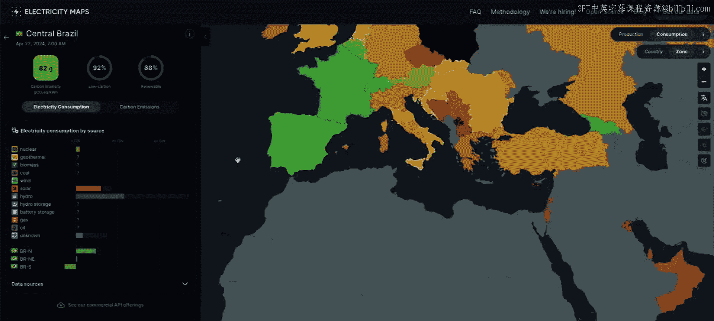
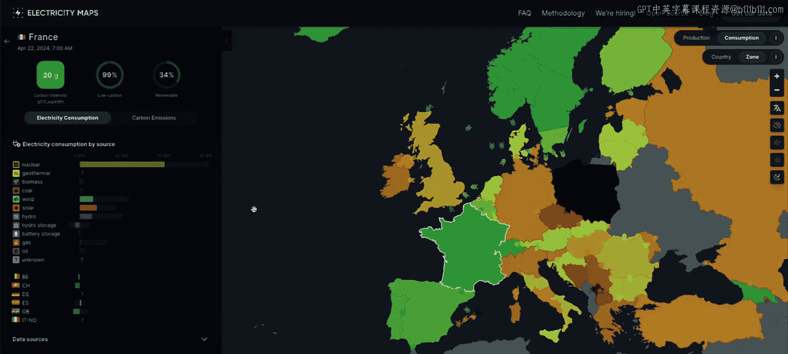
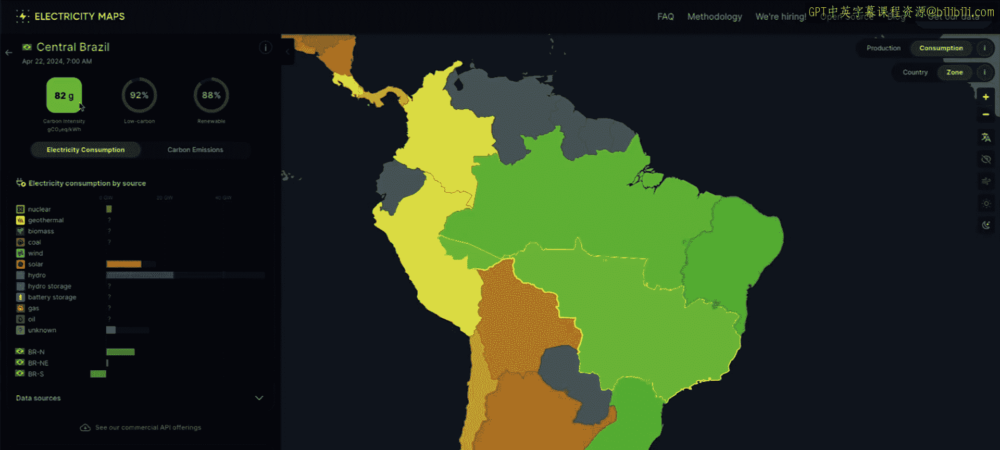
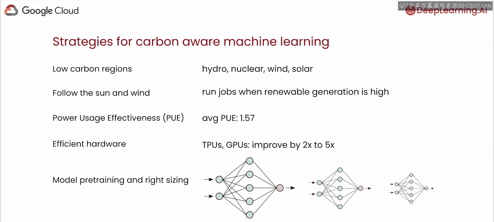

# 002：机器学习的碳足迹 🌱

在本节课中，我们将学习机器学习生命周期中的碳足迹。我们将了解模型训练和推理，特别是大型语言模型，如何产生显著的碳排放。同时，我们也会熟悉影响这个碳足迹大小的关键因素和决策。

---

## 能源与电网基础

首先，我们需要了解与计算基础设施和碳排放相关的一些能源和电网基础知识。

运行任何计算工作负载，无论是机器学习还是其他任务，都需要以电力形式存在的能源。这些能源通常来自会释放二氧化碳的来源。因此，云计算实际上排放的全球温室气体比商业航空业还要多。根据“转变项目”的数据，估计云计算占全球温室气体排放的2.5%至3.7%。请注意，这些数字是针对一般云计算，而非特指机器学习工作负载。

以下是我们的电网工作原理的简要概述：
*   能源由发电厂生产。
*   这些发电厂可能从排放碳的化石燃料（如煤炭或天然气）或非碳排放源（如风能或太阳能）获取能源。
*   然后，这些能源通过输电线路和变电站网络（即电网）输送到我们的家庭、办公室、餐厅、医院，甚至数据中心。

每个区域电网的碳排放源和非碳排放源的混合比例是不同的。例如，法国严重依赖核能，瑞典依赖水力，德克萨斯依赖天然气。即使在特定的区域电网内，碳强度也可能因一天中的不同时间而变化，因为像太阳能这样的能源只在白天可用。

如果你想了解你连接的是哪个区域电网，以及为你的笔记本电脑、冰箱和家中灯光供电的是哪种能源，你可以查看Electricity Maps。他们提供量化数据，显示超过50个国家每小时电力的碳密集程度。

---

## 机器学习生命周期的碳足迹

机器学习生命周期的每一步都有碳足迹。在我们开始编写代码之前，与我们用于训练、托管和存储机器学习模型的所有物理硬件（CPU、GPU、服务器和物理数据中心）相关的碳排放就已经存在。

创建所有这些基础设施需要原材料提取、制造、运输，并且每一步都伴随着环境成本。这通常被称为**隐含碳**，指的是给定物品或产品在供应链中产生的所有排放。这些排放通常是机器学习生命周期中最难估算的，因为供应链相当复杂。

现在，稍微容易计算的是训练和服务机器学习模型所产生的排放。换句话说，来自计算的排放。训练机器学习模型或使用它们进行推理，都需要能源来为服务器供电和冷却。无论是在海量数据集上进行预训练以生成基础大语言模型，还是在自定义数据集上进行训练以产生微调模型，甚至在用户与基于大语言模型的应用程序交互的推理时间，所有这些都需要能源，并且所有这些都有碳足迹。

这个足迹可能因多种因素而有很大差异。例如，马萨诸塞大学阿默斯特分校的Strubell等人发现，使用神经架构搜索训练一个Transformer模型所产生的碳排放，相当于五辆汽车在其使用寿命内产生的排放。如果你不熟悉，这里的神经架构搜索指的是一种自动化神经网络设计的技术。

但谷歌研究人员的一篇论文显示，训练相同的Transformer模型实际上更接近0.00004辆汽车的排放量。这是一个巨大的差异，它突显了训练策略、硬件和数据中心效率以及位置等因素如何对碳排放产生巨大影响。作为一名具有碳意识的开发者，你可以采取措施来降低机器学习工作负载的碳排放，而这正是我们将在本短期课程中学习的内容。

请注意，虽然在整个机器学习生命周期中跟踪和理解排放非常重要，但在本课程中，你将只关注计算产生的排放。你将学习一些关于服务端（即推理，当你的模型在生产中使用时）排放的知识，但总体重点将放在训练上，因为这更容易计算，并且与模型服务的碳影响相比，目前已有更多研究。

---

## 如何估算碳排放

现在，让我们深入探讨为什么训练和服务机器学习模型首先会产生碳足迹。简而言之，运行任何类型的计算工作负载（无论是否机器学习）都需要电力形式的能源，而这种能源通常来自会释放二氧化碳的来源。

以下是关键见解：如果我们能找出特定区域电网的碳强度（我们刚刚看到了如何使用Electricity Maps应用程序做到这一点），并且我们知道机器学习训练或服务应用程序消耗的能源量以及这个工作负载在哪里运行，那么我们就可以估算其碳排放。

那么，我们如何估算机器学习训练任务释放了多少碳呢？

1.  **获取每单位能源的碳排放量**：即每千瓦时等效二氧化碳克数。你经常会听到这被称为**碳强度**。我们从为你的计算基础设施供电的电网获取这个数据。
2.  **乘以能源消耗估算**：将这个数字乘以你训练机器学习模型所使用的能源量的估算值。
3.  **得出碳排放估算**：由此，你可以估算出该训练任务导致的碳排放量。

到目前为止，你已经学会了如何找到为电网供电的碳排放源和非碳排放源的混合比例。但拼图的另一部分呢？训练一个大语言模型到底需要多少电力？

我们可以用以下公式测量能源消耗（以千瓦时为单位）：

**千瓦时 = 训练小时数 × 处理器数量 × 每个处理器的平均功率**

其中，处理器可能是CPU，但对于机器学习训练来说，更可能是GPU或TPU。

请注意，如果你在云中训练，使用的能源不仅包括运行计算所需的电力，还包括运行数据中心（如冷却系统）的开销。因此，你需要乘以一个称为**电力使用效率** 的因子来估算训练任务的总用电量。PUE是衡量数据中心计算效率的标准方法。它的计算方式是：数据中心使用的总能源除以仅用于计算的能源。

例如，假设你的工作负载消耗100千瓦时，运行它的数据中心的PUE是1.5。这意味着从电网的实际消耗是150千瓦时，其中50千瓦时用于运行数据中心的开销，100千瓦时用于实际运行你工作负载的硬件。

正如我们刚才讨论的，要从千瓦时估算碳排放，你需要乘以工作负载运行所在电网的碳强度。

---

## 大语言模型的能源消耗

你可能会记得，大语言模型需要大量的预训练时间和大量的处理器。量化所需计算量的一种方法是**GPU年**，即单个GPU完成特定任务需要一年的计算量。你可以用作计量单位的一个特定GPU是NVIDIA V100 GPU。

例如，在2020年，GPT-3花费了405个NVIDIA V100 GPU年来训练。换句话说，如果你使用单个NVIDIA V100 GPU，训练GPT-3将需要405年。所以，幸好他们不止有一个可用的GPU。

在论文《测量AI和云实例的碳强度》中，研究人员估算了不同Transformer模型消耗的能源。他们训练了一个60亿参数的Transformer模型，训练了达到完全训练所需时间的13%，他们发现这导致了13,812.4千瓦时的能源消耗。根据美国能源信息署的数据，这实际上超过了美国家庭一年的平均能源消耗。该论文的作者估计，一次完整的训练运行将消耗大约103,500千瓦时。

大语言模型规模庞大，并且在大量数据上进行训练，这意味着它们会消耗大量能源。

好消息是，你通常不需要从头开始训练一个大语言模型。通过提示工程，你可能能够让一个模型完成你需要的任务，而无需运行训练甚至微调任务。但请记住，每次使用这些模型进行推理（做出预测或生成文本）时，仍然需要能源。

在论文《耗电的处理：是什么推动了AI部署的成本》中，研究人员估计，Stable Diffusion XL Base 1.0模型每1000次推理产生1.594克二氧化碳。为了提供一些背景，这意味着每向该模型发出1000次推理请求，大致相当于一辆普通汽油动力汽车行驶四英里所产生的排放。

为了更容易找到更高效的模型，Hugging Face的LLM性能排行榜实际上包含了能源估算和每千瓦时生成的令牌数。你会看到这些模型在推理时所需的能源量差异很大。还有ML能源排行榜，它通过每个模型生成响应所消耗的平均GPU能源来比较各种开源模型。如果你想将能源消耗作为大语言模型选择标准的一部分，这些排行榜是可以使用的资源。

---

## 如何成为碳意识开发者

到目前为止，你已经了解了生成式AI以及更广泛的计算如何产生碳足迹，你知道了碳足迹的来源以及如何估算它。现在你可能在想，我为什么要关心这些？我实际上能做些什么呢？

我认为，你作为一名开发者可以对这些排放产生影响的想法起初可能看起来有点令人望而生畏。我的意思是，归根结底，你只是在某处连接到某个电网的机器上运行一个任务。但实际上，你可以实施一些策略来成为一名具有碳意识的开发者。

以下是几个重要的策略：

**1. 选择训练位置和时间**
真正影响碳排放的一个因素是训练模型的位置和一天中的训练时间。正如前面提到的，不同的区域电网有不同的能源混合比例，并且这种比例在一天中也会波动。如果你在云上运行工作负载，这意味着某些云区域连接到的电网有更高比例的碳排放源在运行。因此，你选择在哪里训练模型会产生很大影响。不同的区域电网可能有显著不同的碳排放特征，即使是地理上接近的区域。如果你在一个拥有100%无碳能源的地点运行机器学习训练任务，实际上计算产生的碳排放为零。在接下来的课程中，我们将使这个概念更具体，并看看如何检索电网碳强度的实时信息。

一个更复杂的策略不仅仅是选择平均碳强度低的地点，而是在一天中无碳能源更多的时候运行灵活的工作负载。这种技术有时被称为“追随阳光和风”。其基本思想是将工作负载转移到可再生能源充足的时间和地点。这可能意味着你将机器学习训练任务推迟到当天晚些时候，当可再生能源更多时（例如中午太阳能产能最高时）。但它甚至可能意味着更复杂的事情，比如暂停和恢复工作负载，以最小化一天或一周内的总排放量。

**2. 选择低PUE的云提供商**
如果你在云中训练或托管模型，可以尝试选择PUE低的云提供商。同样，PUE是电力使用效率。这个数字实际上差异很大。例如，谷歌数据中心的平均PUE是1.10，在某些场景下甚至低至1.06。而根据Uptime Institute的2021年数据中心调查，全球数据中心平均PUE约为1.57。这意味着在相同的计算量下，电力和碳排放几乎高出50%。

**3. 使用高效硬件**
论文《机器学习的碳足迹将趋于稳定然后缩小》的作者指出，与通用处理器相比，使用针对机器学习训练优化的处理器（如TPU或一些更新的GPU，如NVIDIA V100或NVIDIA A100）实际上可以将每瓦性能提高2到5倍。

**4. 考虑模型大小与效率**
正如我们之前谈到的，生成式AI的一个好处是，尽管模型很大，训练时间很长，但你通常不需要从头开始训练。你通常根本不需要训练模型。虽然生成式AI的趋势一直是追求越来越大的模型，但更专业化、有针对性且更小的模型通常也能完成任务。

在整个软件生命周期中，有许多不同的策略可以降低碳排放，并且这个领域有越来越多有趣且富有启发性的研究。但这些只是针对机器学习的一些重要建议。

---

## 总结

在本节课中，我们一起学习了机器学习工作负载碳足迹的基础知识。我们探讨了碳排放的来源，包括硬件制造（隐含碳）和模型训练与推理（运营碳）。我们学习了如何通过结合电网的碳强度和工作负载的能源消耗来估算碳排放。我们还了解了影响碳足迹的关键因素，如地理位置、时间、数据中心效率、硬件选择和模型效率。最后，我们概述了作为一名开发者可以采取的实际策略，例如选择低碳区域和时间运行任务、选择高效的基础设施以及考虑使用更小的模型，从而在开发生成式AI应用时更具碳意识。

现在，让我们开始编码，看看如何获取实时碳数据，并在拥有更多无碳能源的地方训练机器学习模型。让我们进入下一课。