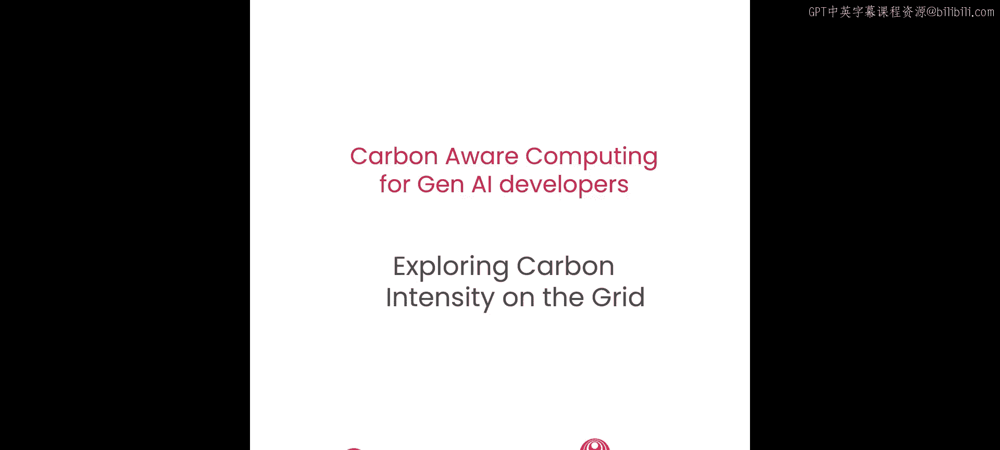
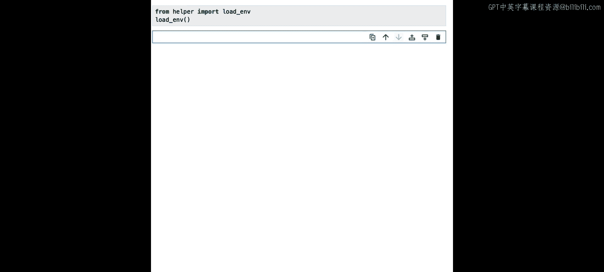
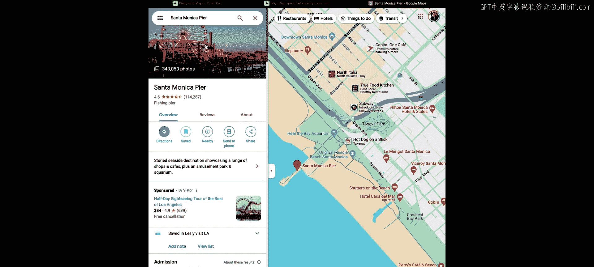
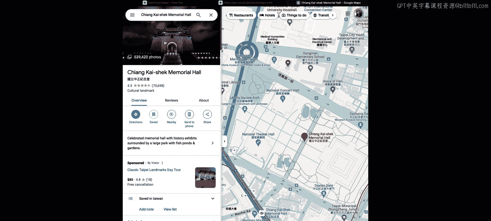
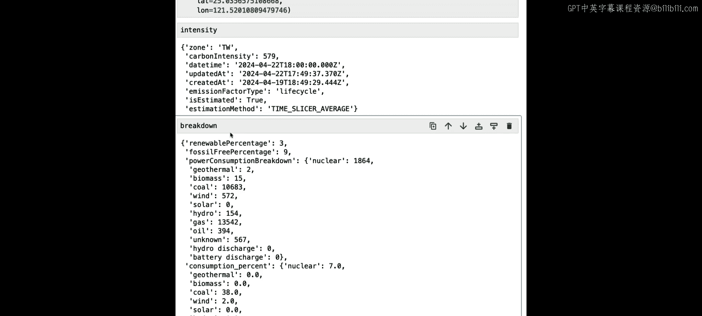

# 003：探索电网碳强度 🌍




在本节课中，我们将学习如何使用 Electricity Maps API 来探索电网的碳强度。你将了解如何获取特定区域的电力来源信息，以及生产这些电力所排放的二氧化碳量。

## 概述




我们将通过编写代码，调用 Electricity Maps API 的两个主要端点：一个用于获取实时碳强度数据，另一个用于获取电力来源的详细构成。这将帮助我们理解不同地区的能源清洁程度。

---

## 获取并使用 API 密钥 🔑

要使用 Electricity Maps API，你需要一个 API 密钥。在本在线课堂环境中，我们已经为你设置好了。你可以直接导入 `load_end` 函数并执行代码单元。

如果你想在自己的环境中运行此代码，可以访问 Electricity Maps 网站，点击“获取 API 密钥”来申请免费的个人层级密钥。



---


## 查询实时碳强度数据 ⚡

上一节我们介绍了如何获取 API 密钥，本节中我们来看看如何查询实时的电网碳强度数据。

`carbon-intensity/latest` 端点可以检索到最新的碳强度数据，单位是**克二氧化碳当量每千瓦时**。这个数值表示在特定区域，每消耗一千瓦时电力所排放的二氧化碳量。

**核心概念**：碳强度 = 排放的二氧化碳量 / 消耗的电量。公式表示为：
`Carbon Intensity (gCO₂eq/kWh) = Total CO₂ Emissions / Total Electricity Consumed`

你可以通过经纬度坐标或预定义的区域标识符来指定查询位置。我们将使用经纬度坐标。

以下是获取坐标的步骤：
1.  打开谷歌地图。
2.  搜索一个地点（例如：洛杉矶的圣莫尼卡码头）。
3.  右键点击地图上的位置，选择弹出的坐标并复制。

获取坐标后，我们回到代码中。首先，创建一个包含坐标的字典。

```python
coordinates = {
    ‘la’: 34.0100931,  # 纬度
    ‘lo’: -118.4964752 # 经度
}
```

接着，我们使用 Python 的 `requests` 库向 API 端点发送请求。需要将 API 密钥放在请求头中。

```python
import requests
import helper

url = f"https://api.electricitymap.org/v3/carbon-intensity/latest?lat={coordinates[‘la’]}&lon={coordinates[‘lo’]}"
headers = {‘auth-token’: helper.load_api_key()}

response = requests.get(url, headers=headers)
data = response.json()
print(data)
```

执行代码后，你会得到一个包含碳强度值的响应。例如，在录制时，洛杉矶的碳强度是 **242 克二氧化碳当量/千瓦时**。这意味着在洛杉矶，每消耗一千瓦时电力，就会排放 242 克二氧化碳。

请注意，这是实时数据，你查询时看到的数字很可能与示例不同，因为电网的碳强度和能源构成在一天中会不断波动。

---

## 分析电力来源构成 🔋

仅仅知道碳强度还不够，我们还想了解是哪些能源产生了这些碳排放。为此，我们将使用另一个端点：`power-breakdown/latest`。

这个端点可以检索一个地区电力来源的最新数据。与之前类似，我们需要构建请求 URL 并发送请求。

```python
url = f"https://api.electricitymap.org/v3/power-breakdown/latest?lat={coordinates[‘la’]}&lon={coordinates[‘lo’]}"
response = requests.get(url, headers=headers)
power_data = response.json()
```

返回的数据是一个包含大量信息的字典。让我们查看几个关键的指标：

*   **`renewablePercentage`**: 来自可再生能源的电力消耗百分比。
*   **`fossilFreePercentage`**: 来自可再生能源和核能的电力消耗百分比（核能是零碳的，但不属于可再生能源）。
*   **`powerConsumptionBreakdown`**: 按能源类型（如太阳能、煤炭、天然气）细分的电力消耗构成，单位为兆瓦。

为了更直观地理解，我们可以将兆瓦值转换为百分比。首先获取总消耗量，然后计算每种能源的占比。

```python
import numpy as np

total_consumption = power_data[‘powerConsumptionTotal’]
breakdown = power_data[‘powerConsumptionBreakdown’]

percentage_breakdown = {source: round((value / total_consumption) * 100, 2)
                        for source, value in breakdown.items()}
print(percentage_breakdown)
```

例如，在查询时，洛杉矶电网有相当大一部分电力来自太阳能。这些数据同样是实时且动态变化的。

**注意**：有时你可能看到所有数据都是零。这可能是因为该区域的能源供应商暂时没有提供数据。如果遇到这种情况，可以尝试查询其他地点或稍后再试。

---

## 动手实践：查询你所在区域 🧑‍💻

现在轮到你了。尝试查找你所在地标或区域的坐标，并使用上述端点查询碳强度和电力构成。

例如，我们可以查询台湾台北的中正纪念堂。使用提供的辅助函数 `power_stats` 可以更方便地获取信息。

```python
from helper import power_stats

taipei_coords = {‘la’: 25.0343, ‘lo’: 121.5198}
intensity, breakdown = power_stats(taipei_coords[‘la’], taipei_coords[‘lo’])

print(f”碳强度: {intensity} gCO₂eq/kWh”)
print(“电力构成:”, breakdown)
```

运行后，你可能会看到该地的碳强度（例如 579）和详细的能源构成（可能包含煤炭、天然气、太阳能等）。请注意，Electricity Maps 并未覆盖全球所有地区。如果你的位置没有数据，可以尝试查询附近的其他地点。




---

## 总结

本节课中，我们一起学习了：
1.  如何获取并使用 Electricity Maps API 密钥。
2.  如何使用 `carbon-intensity/latest` 端点查询一个地区的实时电网碳强度。
3.  如何使用 `power-breakdown/latest` 端点深入分析电力的具体来源构成。
4.  通过动手实践，查询了不同地点的能源数据。



理解一个地区的碳强度和能源构成，是进行碳意识计算的第一步。在下一节课中，我们将利用这些信息，尝试在拥有大量零碳能源的地区训练机器学习模型，将知识付诸实践。