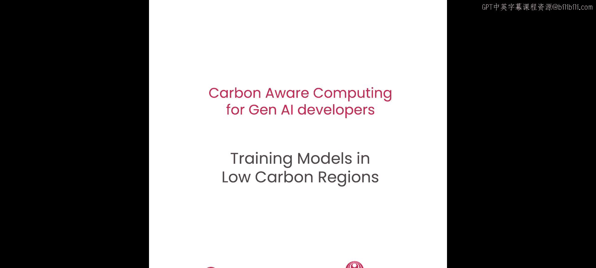
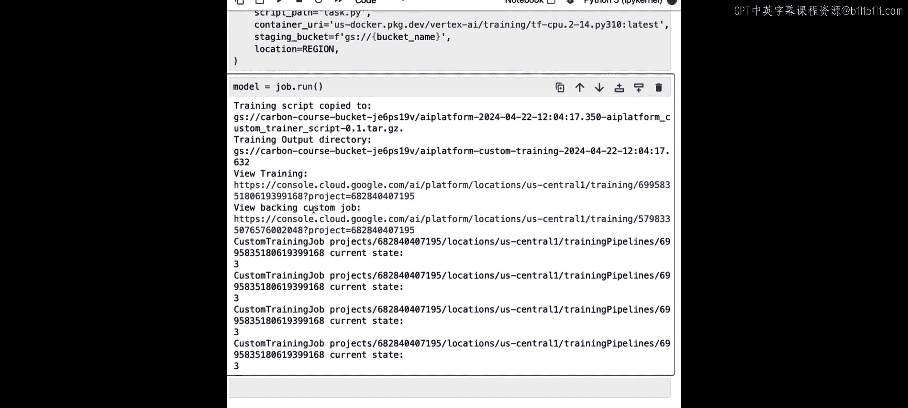
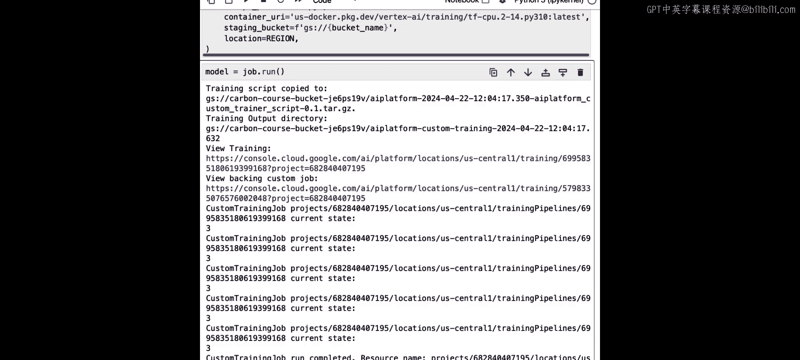
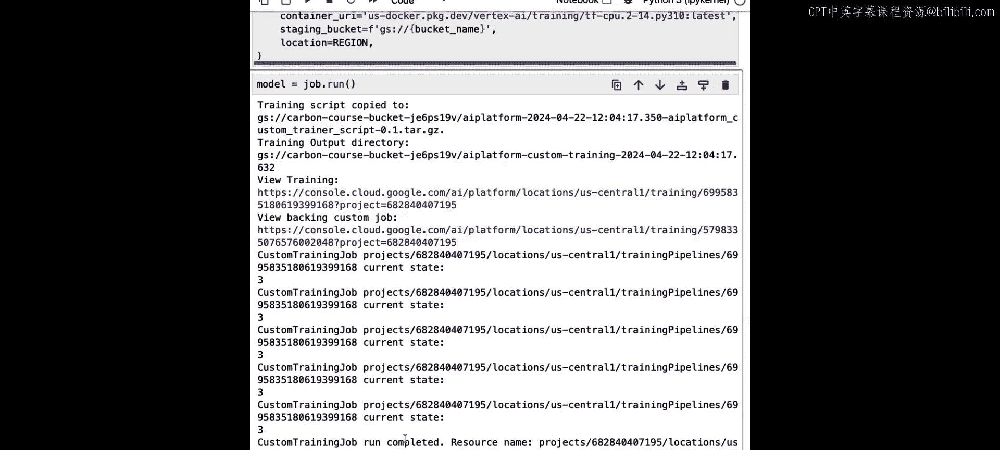
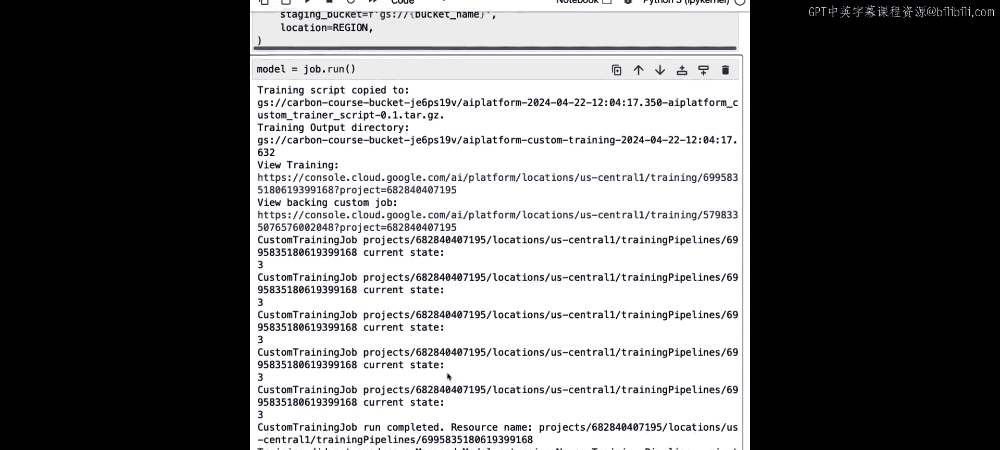
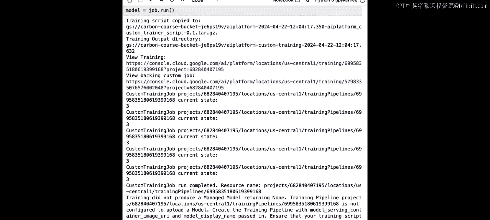
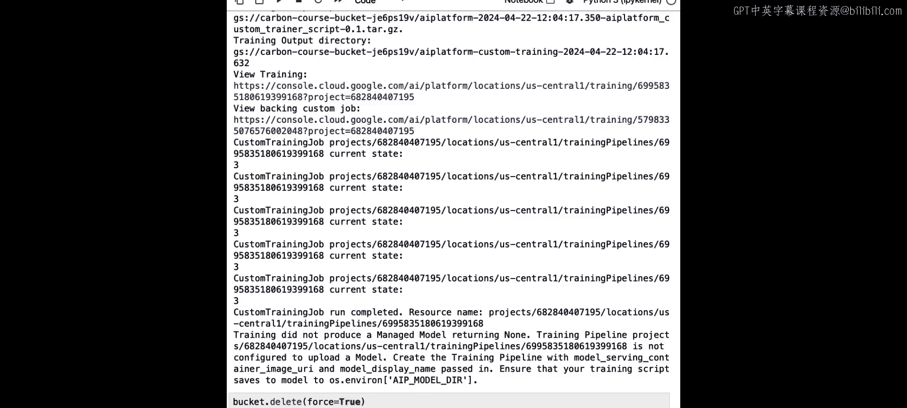

# 004：在低碳区域训练模型




在本节课中，你将尝试一种最简单且最具影响力的碳意识机器学习开发策略：在由大量无碳能源供电的地点训练模型。这个策略不需要太多努力，但正如你将看到的，它能带来相当大的回报。让我们开始尝试。

## 概述

在本节中，我们将学习如何通过选择在低碳强度的云区域运行计算任务，来减少机器学习训练工作的碳足迹。我们将首先在本地训练一个简单的模型，然后将其迁移到Google Cloud Vertex AI平台，并特意选择一个拥有大量无碳能源（如风能）的数据中心区域来执行训练。

## 本地模型训练

首先，我们将在本地Jupyter Notebook中训练一个机器学习模型。以下是具体步骤。

我们首先导入必要的库，包括NumPy、Scikit-learn和TensorFlow。

```python
import numpy as np
from sklearn.datasets import make_blobs
import tensorflow as tf
```

接着，我们使用Scikit-learn的`make_blobs`函数创建数据集。这个函数会生成一个包含四个不同类别的训练数据集。如果你对这个函数和具体的分类任务背景感兴趣，可以参考吴恩达机器学习专项课程的第二门课“高级算法”，其中使用了相同的例子。

```python
# 创建数据集
X_train, y_train = make_blobs(n_samples=1000, centers=4, n_features=2, random_state=42)
```

创建数据集后，我们构建模型。本课中模型的具体细节并不重要，我们只需要一个可以训练的模型。这里我们构建一个包含两个层的简单模型。

```python
# 创建模型
model = tf.keras.Sequential([
    tf.keras.layers.Dense(10, activation='relu', input_shape=(2,)),
    tf.keras.layers.Dense(4, activation='softmax')
])
```

模型构建完成后，我们需要编译它。编译过程需要指定损失函数和优化器。如果你使用过Keras，这个过程会很熟悉；如果没有，也无需担心。

```python
# 编译模型
model.compile(optimizer='adam',
              loss='sparse_categorical_crossentropy',
              metrics=['accuracy'])
```

现在，我们已经准备好了训练数据和模型，可以调用`model.fit`开始训练。我们将运行200个周期。由于模型和数据量都很小，训练会很快完成。

```python
# 训练模型
history = model.fit(X_train, y_train, epochs=200, verbose=0)
```

滚动到输出底部，可以看到损失函数在下降，这表明模型正在学习。

## 利用云计算的灵活性

在云端训练模型的一个好处是，在选择训练地点时具有灵活性。如果你所在地的电网碳强度很高，你对电力的来源控制有限。但通过使用云计算，你可以选择在低碳电网的区域运行计算工作负载。

这正是我们接下来要做的：在Google Cloud上运行相同的训练代码，并选择一个平均碳强度非常低的数据中心位置。

在开始之前，我们需要了解一些关于Google机器学习平台Vertex AI的知识。为了在Vertex AI上运行代码，我们需要完成三个主要步骤：
1.  导入并初始化Vertex AI Python SDK。
2.  将训练代码写入一个文件。
3.  配置并提交一个将运行此代码的训练任务。

下面我们逐一完成这些步骤。

### 步骤一：初始化Vertex AI Python SDK

我们从一个已编写好的辅助函数开始，它会导入凭证和项目ID。

如果你不熟悉Google Cloud，这里有一些基础知识：首先导入`aiplatform`，这是Google Cloud上的机器学习平台。然后调用`initialize`函数，传入项目ID和凭证。项目ID是对你的Google Cloud项目的引用，所有服务、计算资源都包含在其中。凭证则是用于身份验证的密钥。

```python
# 假设辅助函数已设置好项目ID和凭证
project_id = ‘your-project-id‘
credentials = ‘your-credentials‘

import vertexai
from google.cloud import aiplatform

# 初始化Vertex AI
aiplatform.init(project=project_id, credentials=credentials)
```

初始化完成后，我们就可以从本笔记本访问Vertex AI服务了。

### 步骤二：将训练代码写入文件

接下来，我们不直接在笔记本中运行训练代码，而是将其写入一个文件，然后在Vertex AI上运行该文件。

首先，我们使用笔记本的`%%writefile`魔法命令创建一个文件。这里将其命名为`task.py`。按照惯例，主要的训练代码文件常被命名为`task.py`，但你可以使用其他名称。

```python
%%writefile task.py
# 导入库
import numpy as np
from sklearn.datasets import make_blobs
import tensorflow as tf

# 创建数据集
X_train, y_train = make_blobs(n_samples=1000, centers=4, n_features=2, random_state=42)

# 创建模型
model = tf.keras.Sequential([
    tf.keras.layers.Dense(10, activation=‘relu‘, input_shape=(2,)),
    tf.keras.layers.Dense(4, activation=‘softmax‘)
])

# 编译模型
model.compile(optimizer=‘adam‘,
              loss=‘sparse_categorical_crossentropy‘,
              metrics=[‘accuracy‘])

# 训练模型
model.fit(X_train, y_train, epochs=200, verbose=0)
print(“训练完成！“)
```

执行此单元格后，会创建一个名为`task.py`的文件。你可以使用`cat task.py`命令查看文件内容，确认它包含了我们指定的所有代码：导入库、创建数据集、创建模型、编译模型以及训练模型。

### 步骤三：创建并运行训练任务

现在，我们已经定义了要在Vertex AI上执行的训练代码，接下来需要创建并运行一个训练任务。我们将使用Vertex AI Python SDK中的“自定义训练任务”功能。

以下是创建自定义训练任务时需要传递的几个重要参数：
*   `display_name`: 任务的字符串标识符。
*   `script_path`: Python文件的路径（即`task.py`）。
*   `container_uri`: 运行训练任务所需的Docker镜像。Vertex AI为TensorFlow、PyTorch、Scikit-learn和XGBoost提供了预构建的镜像，无需自己编写Dockerfile。
*   `staging_bucket`: 用于存储训练任务过程中可能产生的任何中间产物的云存储桶。
*   `location`: 我们希望运行此工作负载的数据中心位置。**这是关键**，我们将选择一个拥有大量无碳能源的区域。

在运行任务之前，我们需要先选择区域并创建存储桶。

#### 选择低碳区域

Google为其每个数据中心区域提供了平均碳强度值。通过查阅相关文档，我们可以找到低碳区域。例如：
*   `europe-west9`（巴黎）：由于法国拥有大量核能，属于低碳区域。
*   `southamerica-east1`（圣保罗）：巴西拥有大量水力和太阳能，碳强度也较低。
*   `us-central1`（爱荷华州）：拥有大量风能，被标记为低碳区域。

我们将选择`us-central1`作为运行机器学习训练任务的区域。

```python
region = ‘us-central1‘
```

#### 创建云存储桶

接下来，我们需要创建一个云存储桶来存放临时文件。存储桶名称必须是全局唯一的，因此我们生成一个唯一标识符附加到桶名上。

```python
import random
import string

def generate_uuid(length=8):
    return ‘‘.join(random.choices(string.ascii_lowercase + string.digits, k=length))

unique_id = generate_uuid()
print(f“唯一标识符: {unique_id}“)

from google.cloud import storage

storage_client = storage.Client(project=project_id, credentials=credentials)
bucket_name = f“carbon-course-bucket-{unique_id}“
bucket = storage_client.create_bucket(bucket_name, location=region)
print(f“存储桶 ‘{bucket_name}‘ 已在区域 ‘{region}‘ 中创建。“)
```

**重要提示**：存储桶必须创建在计划运行训练任务的同一区域，以避免跨区域传输数据带来的额外碳排放和延迟。

#### 提交训练任务

现在，所有准备工作都已就绪，我们可以创建自定义训练任务了。

```python
# 定义训练任务
job = aiplatform.CustomTrainingJob(
    display_name=“deep-learning-ai-course-example“,
    script_path=“task.py“,
    container_uri=“us-docker.pkg.dev/vertex-ai/training/tf-gpu.2-15:latest“, # 示例TensorFlow镜像URI
    staging_bucket=f“gs://{bucket_name}“,
    location=region
)

# 运行训练任务
model = job.run()
```

执行`job.run()`后，Vertex AI会在后台置备计算资源，运行我们写在`task.py`中的训练代码。训练完成后，计算资源会被自动删除。

任务日志会打印出一个链接（在在线课堂环境中可能无法点击），在你的个人项目中，你可以通过此链接在云控制台查看任务状态、耗时等信息。

由于需要置备资源，这个训练任务可能需要大约3到5分钟完成，比直接在笔记本中运行要慢。对于这个小模型来说，这种开销显得比较明显。然而，在现实世界中，训练任务通常需要数小时甚至数天，这种置备开销就会被平摊，相对影响很小。

## 清理资源



训练任务完成后，为了清理在线课堂环境中的额外资源，我们需要删除刚刚创建的存储桶。

```python
# 删除存储桶（force=True确保删除非空桶）
bucket.delete(force=True)
print(f“存储桶 ‘{bucket_name}‘ 已删除。“)
```

## 总结

在本节课中，我们一起学习并实践了降低机器学习训练工作碳足迹的最简单且最有效的措施之一：选择在低碳区域运行计算任务。

我们首先在本地训练了一个简单的模型，然后将其迁移到Google Cloud Vertex AI平台。通过查阅Google Cloud的碳强度文档，我们选择了平均碳强度较低、拥有大量风能的`us-central1`（爱荷华州）区域来重新训练我们的模型。这个策略对于降低计算任务的碳足迹非常有效。







机器学习训练任务通常是批处理作业，对延迟不敏感，这使其非常适合应用此类策略。你可以在选择运行程序和存储数据的位置时拥有更大的灵活性。

在下一节课中，我们将尝试一种略有不同的方法：使用实时数据来指导我们选择训练地点。我们下节课再见。






