# 005：利用实时能源数据进行低碳训练 🌱

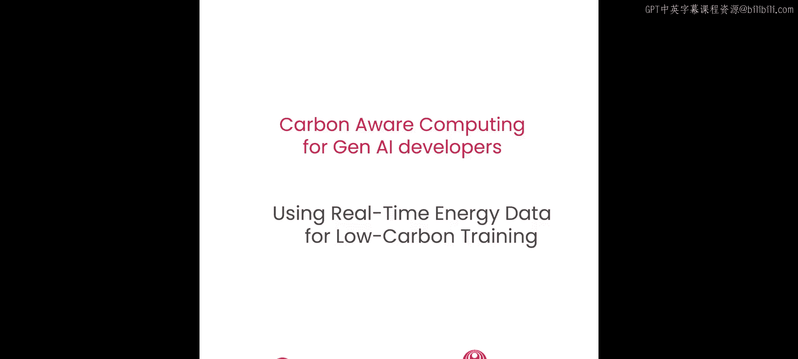


在本节课中，我们将基于前两节课程的内容，学习如何利用来自Electricity Maps的实时电力数据，为机器学习模型训练选择碳排放最低的区域。我们将通过编写代码，查询实时碳强度，并据此动态选择最“绿色”的云区域来运行训练任务。

---

## 概述

之前，我们学习了如何在Google Cloud上运行训练任务，并了解了如何根据平均碳强度指标选择低碳区域。本节课程将更进一步，我们将利用Electricity Maps的API获取**实时**的电网碳强度数据，并据此做出更精确、更动态的决策。我们将编写两个核心函数：一个用于查询特定区域的实时碳强度，另一个用于从候选区域列表中找出当前碳强度最低的区域。

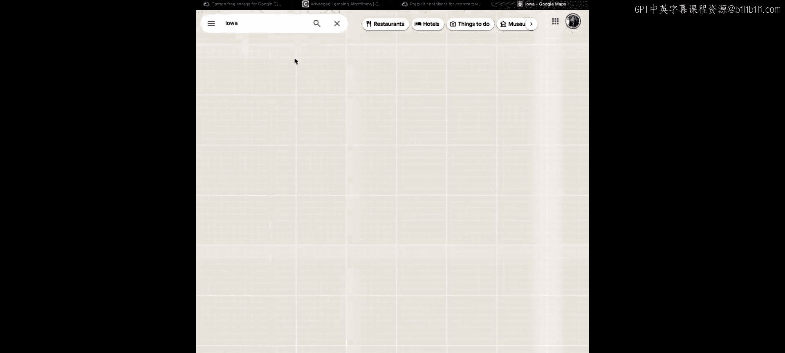

---

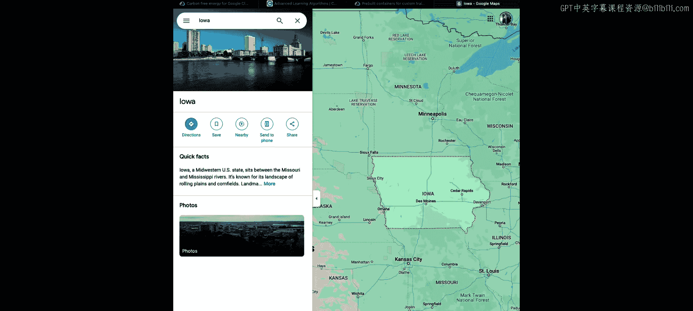

## 准备工作

首先，我们需要导入必要的库并加载API密钥，这与上一节课的步骤类似。

```python
import requests
import json
from helper import load_secret
api_key = load_secret(“electricity_maps_api_key”)
```

**注意**：在在线课堂环境中，打印出的`api_key`是隐藏的，无法直接使用。您需要在自己的项目中配置真实的API密钥。

---

## 估算数据中心的坐标

为了查询特定Google Cloud区域的碳强度，我们需要该区域的大致坐标。虽然我们不知道数据中心的确切位置，但可以通过区域名称在谷歌地图上找到代表性坐标。例如，对于`us-central1`区域（位于美国爱荷华州），我们可以使用该州某个主要城市的坐标作为近似值。

我们将创建一个字典，包含多个支持Vertex AI的Google Cloud区域及其近似坐标。

```python
vertex_regions = {
    “us-central1”: {“lat”: 41.8780, “lon”: -93.0977}, # 爱荷华州，得梅因
    “northamerica-northeast1”: {“lat”: 45.5017, “lon”: -73.5673}, # 加拿大，蒙特利尔
    “europe-west6”: {“lat”: 47.3769, “lon”: 8.5417}, # 瑞士，苏黎世
    “asia-northeast3”: {“lat”: 37.5665, “lon”: 126.9780}, # 韩国，首尔
    “australia-southeast1”: {“lat”: -37.8136, “lon”: 144.9631} # 澳大利亚，墨尔本
}
```

这个字典将作为我们选择训练区域的“候选名单”。

---

## 查询单个区域的实时碳强度

接下来，我们编写第一个函数`carbon_intensity`。这个函数接收区域名称，调用Electricity Maps API，并返回该区域电网的当前碳强度值（单位：克CO₂当量/千瓦时）。

以下是该函数的代码，我们将逐行解析：

```python
def carbon_intensity(vertex_regions, api_key, region):
    try:
        # 1. 从大字典中获取目标区域的坐标信息
        region_obj = vertex_regions[region]
        # 2. 构建API请求URL
        url = f“https://api.electricitymap.org/v3/carbon-intensity/latest?lat={region_obj[‘lat’]}&lon={region_obj[‘lon’]}”
        # 3. 发送GET请求，携带API密钥
        response = requests.get(url, auth=(api_key, ‘’))
        # 4. 解析返回的JSON数据
        data = json.loads(response.content)
        # 5. 提取并返回碳强度值
        return int(data[‘carbonIntensity’])
    except Exception as e:
        # 错误处理：如果API调用失败，打印错误并返回None
        print(f“Error getting carbon intensity for {region}: {e}”)
        return None
```

让我们以`asia-northeast3`区域为例，手动执行函数中的关键步骤，以便理解：

1.  `region_obj = vertex_regions[“asia-northeast3”]`：获取首尔的坐标 `{‘lat’: 37.5665, ‘lon’: 126.9780}`。
2.  构建URL：`https://api.electricitymap.org/v3/carbon-intensity/latest?lat=37.5665&lon=126.9780`。
3.  发送请求并解析响应。打印出的数据可能类似：`{‘zone’: ‘KR’, ‘carbonIntensity’: 416}`。
4.  函数最终返回整数值 `416`。这个值会根据实时电力情况不断变化。

---

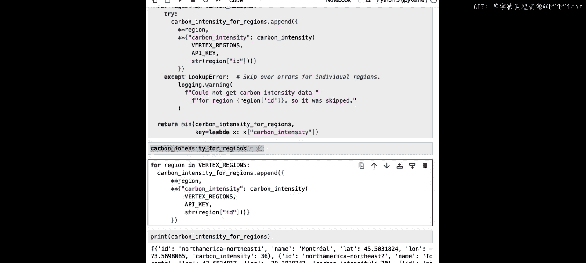

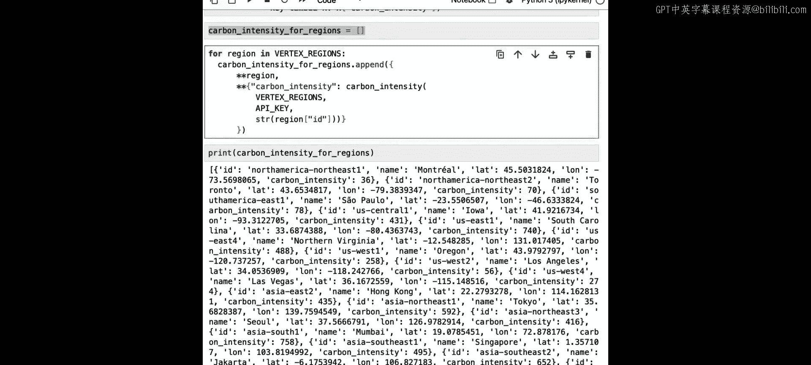

## 找出碳强度最低的区域

有了查询单个区域碳强度的能力后，我们需要一个方法来找出所有候选区域中，**当前**碳强度最低的那个。这就是第二个函数`cleanest`的任务。

以下是`cleanest`函数的代码和解析：

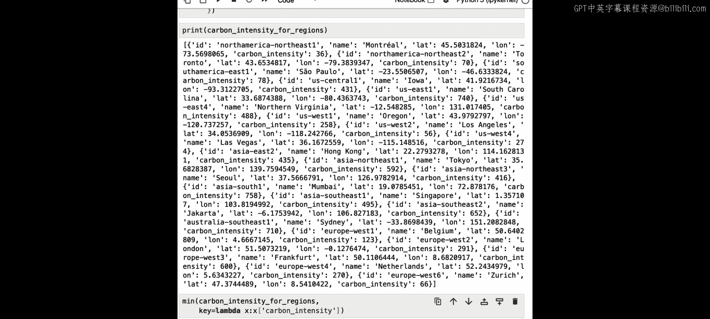

```python
def cleanest(vertex_regions, api_key):
    carbon_intensity_for_regions = []
    for region_name in vertex_regions:
        try:
            # 为每个区域计算实时碳强度
            ci = carbon_intensity(vertex_regions, api_key, region_name)
            if ci is not None:
                # 将区域原有信息与新查询到的碳强度合并成一个新字典
                new_entry = {**vertex_regions[region_name], **{‘name’: region_name, ‘carbon_intensity’: ci}}
                carbon_intensity_for_regions.append(new_entry)
        except Exception as e:
            print(f“Skipping {region_name} due to error: {e}”)

    # 找出碳强度值最小的那个字典
    cleanest_region = min(carbon_intensity_for_regions, key=lambda x: x[‘carbon_intensity’])
    return cleanest_region
```

**关键步骤解析**：
1.  我们创建一个空列表`carbon_intensity_for_regions`。
2.  遍历`vertex_regions`字典中的每个区域。
3.  对每个区域，调用`carbon_intensity`函数获取实时碳强度`ci`。
4.  使用 `{**dict1, **dict2}` 的语法，将原始坐标字典、区域名称和新的碳强度值合并成一个新字典，并添加到列表中。
5.  循环结束后，使用`min`函数和`lambda`键，从列表中找出`carbon_intensity`值最小的那个字典，即为最清洁的区域。

运行这个函数，可能会返回类似的结果：`{‘lat’: 45.5017, ‘lon’: -73.5673, ‘name’: ‘northamerica-northeast1’, ‘carbon_intensity’: 36}`。这意味着当前时刻，加拿大蒙特利尔区域的电网碳强度最低。

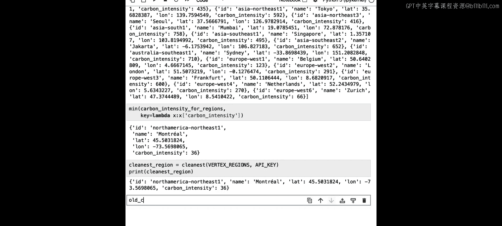

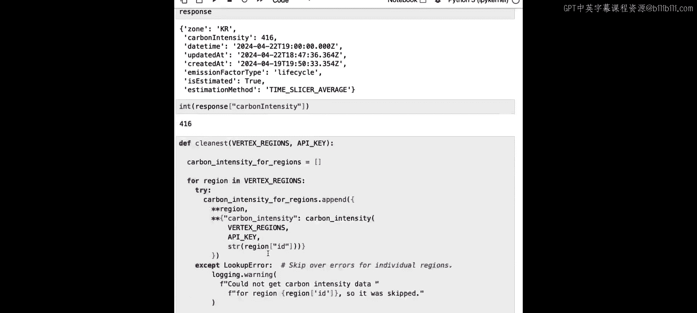

---

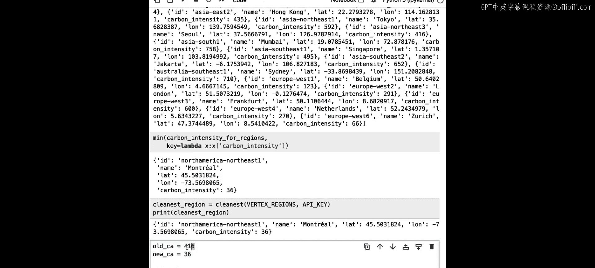

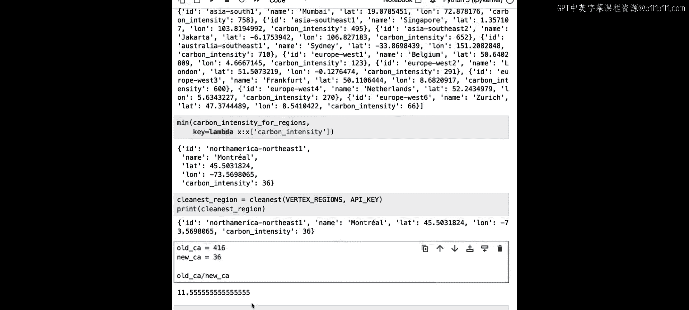

## 在最优区域运行训练任务

找到最清洁的区域后，我们就可以在那里启动训练任务了。这需要在该区域创建一个新的存储桶（Bucket），因为训练任务的暂存桶必须与计算区域位于同一位置。

```python
# 1. 获取最清洁的区域信息
best_region_info = cleanest(vertex_regions, api_key)
best_region_name = best_region_info[‘name’] # 例如：’northamerica-northeast1’

# 2. 为该区域创建唯一的存储桶名称和存储桶
import uuid
bucket_name = f“cleaner-bucket-{uuid.uuid4()}”
storage_client = storage.Client()
bucket = storage_client.create_bucket(bucket_name, location=best_region_name)

# 3. 使用Vertex AI在该区域提交自定义训练任务
from google.cloud import aiplatform
aiplatform.init(project=your_project_id, location=best_region_name)

job = aiplatform.CustomTrainingJob(
    display_name=“dl-ai-course-cleaner”,
    script_path=“task.py”,
    container_uri=“gcr.io/cloud-aiplatform/training/tf-cpu.2-12:latest”,
    staging_bucket=bucket_name
)

# 4. 运行训练任务
model = job.run()
```

通过对比，我们发现新区域（碳强度36）的碳强度远低于之前使用的`us-central1`区域（碳强度416），这意味着此次训练产生的碳排放约为之前的1/11，减排效果显著。

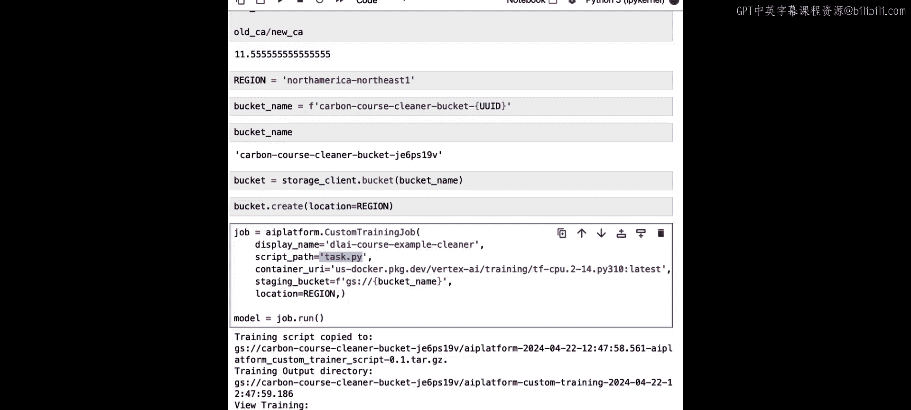

---

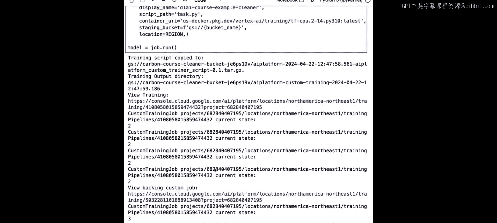

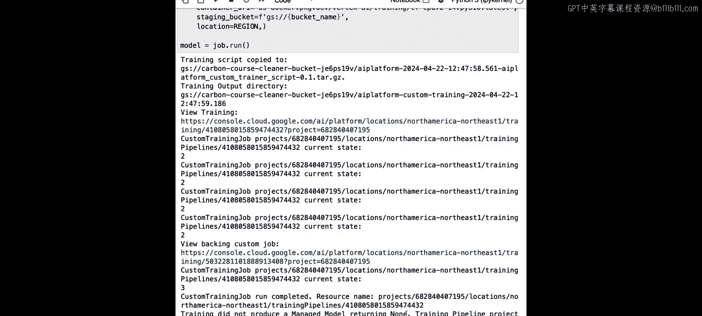

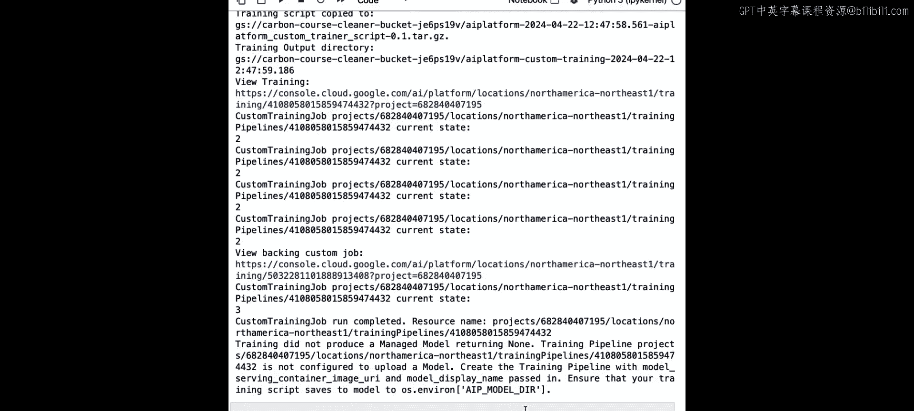

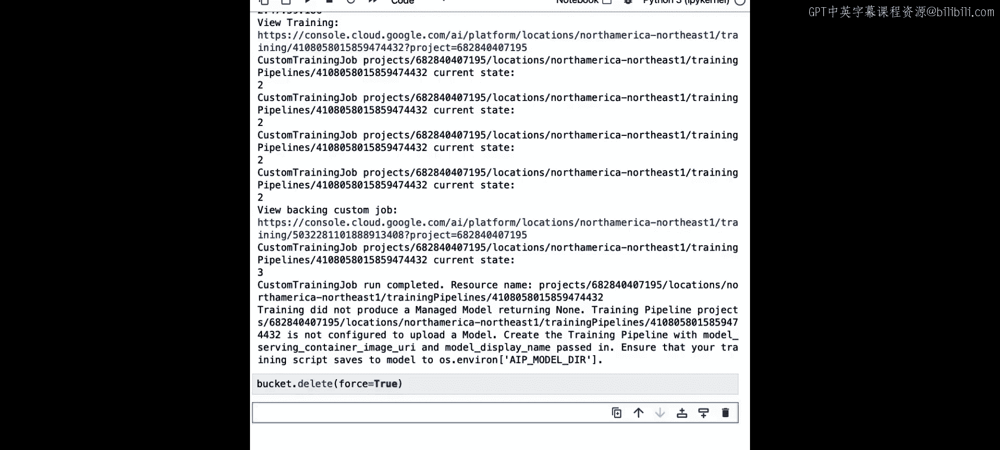

## 关于实时数据的注意事项

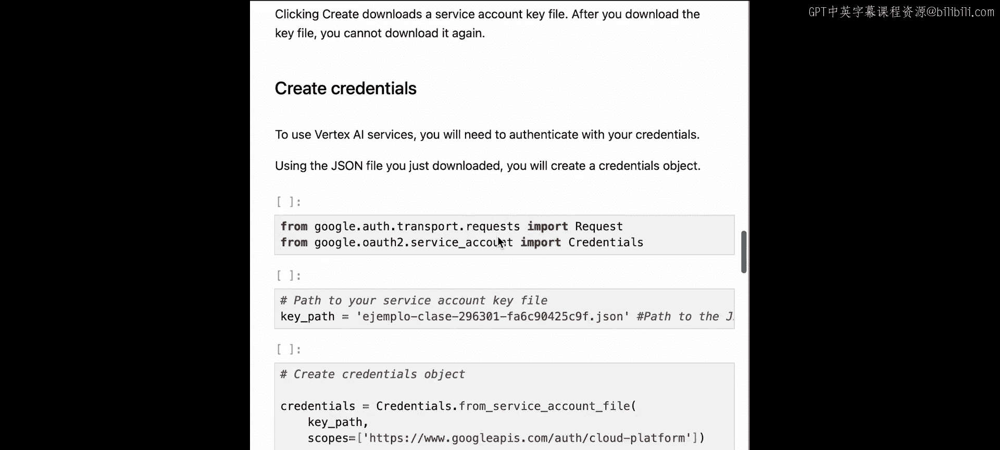

使用实时碳强度数据选择训练时机和地点，对于短时间任务（如本例）可以显著降低排放。但对于长达数天或更久的训练任务，其减排效果可能被“平均化”，因为电网的碳强度在一天中会波动。

Electricity Maps API 提供了一个`/carbon-intensity/history`端点，可以查询历史碳强度数据（通常按小时间隔）。这有助于估算长时间训练任务的整体碳排放。

```python
# 查询历史碳强度数据示例
history_url = f“https://api.electricitymap.org/v3/carbon-intensity/history?lat=45.5017&lon=-73.5673”
history_response = requests.get(history_url, auth=(api_key, ‘’))
history_data = json.loads(history_response.content)
print(history_data) # 将输出过去一段时间内每小时的平均碳强度
```

---

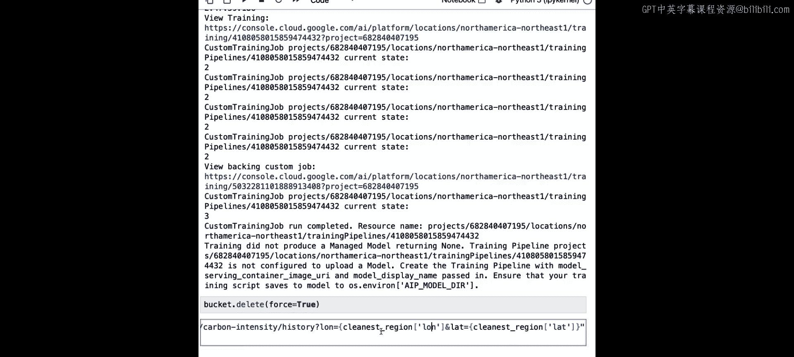

## 总结

在本节课中，我们一起学习了如何利用实时能源数据进行低碳AI模型训练：

1.  **基础准备**：我们导入了必要的库，加载了API密钥，并创建了Google Cloud区域及其近似坐标的字典。
2.  **核心函数一**：我们编写了`carbon_intensity`函数，用于查询任一指定区域的实时电网碳强度。
3.  **核心函数二**：我们编写了`cleanest`函数，该函数遍历所有候选区域，调用第一个函数，并智能地找出当前碳强度最低的最优区域。
4.  **实践应用**：我们利用`cleanest`函数的返回结果，在碳强度最低的区域创建了存储桶并成功提交了Vertex AI训练任务，实现了基于实时数据的动态低碳调度。
5.  **深入思考**：我们讨论了实时数据策略对长时任务效果的局限性，并介绍了查询历史碳强度数据的方法，以便进行更全面的碳排放估算。

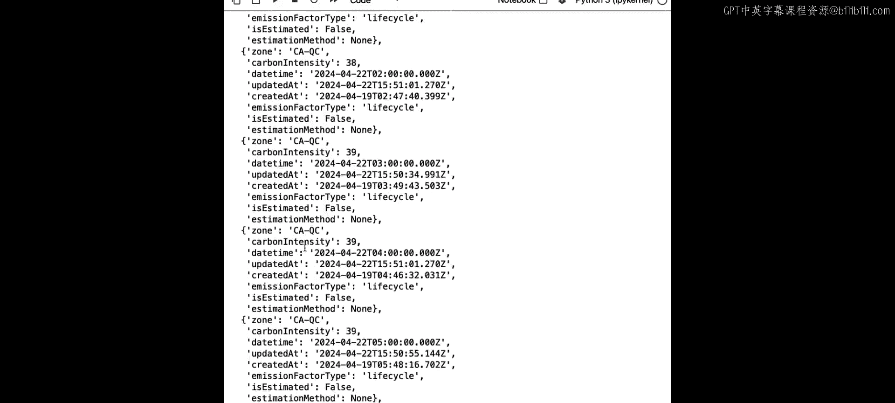

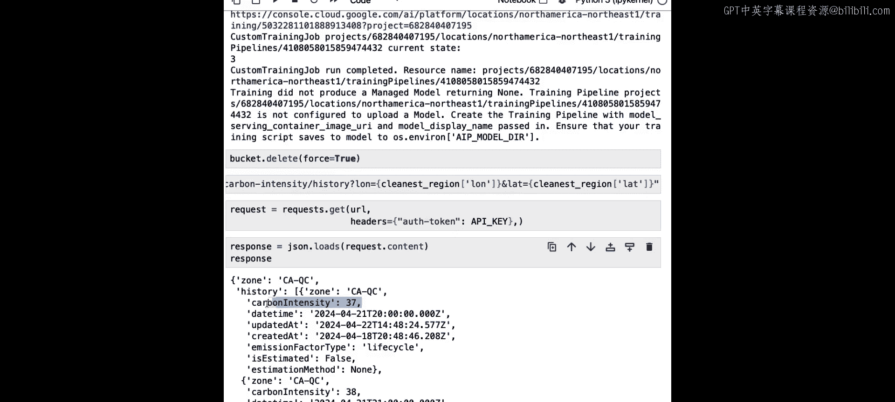

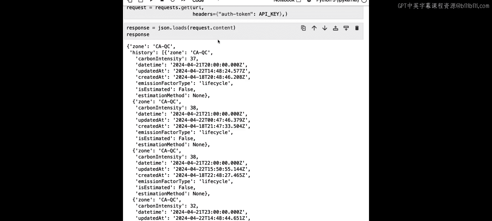

通过本节课，你掌握了利用实时外部数据优化AI工作负载碳足迹的关键技能。在下一节课中，我们将从一个更宏观的视角，学习如何评估云计算整体使用的碳排放。