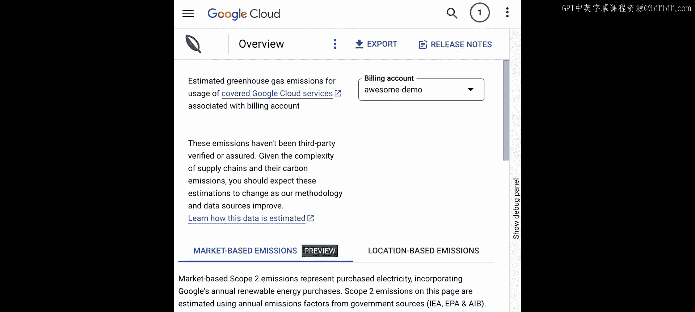
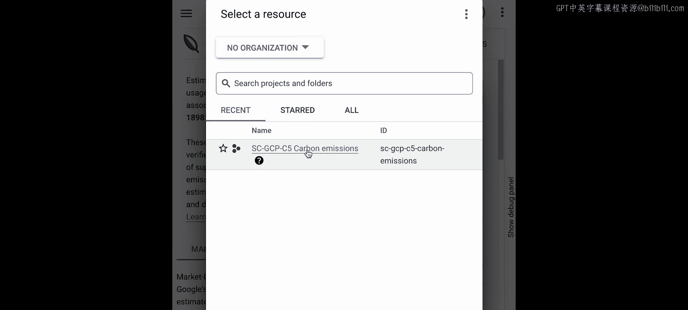
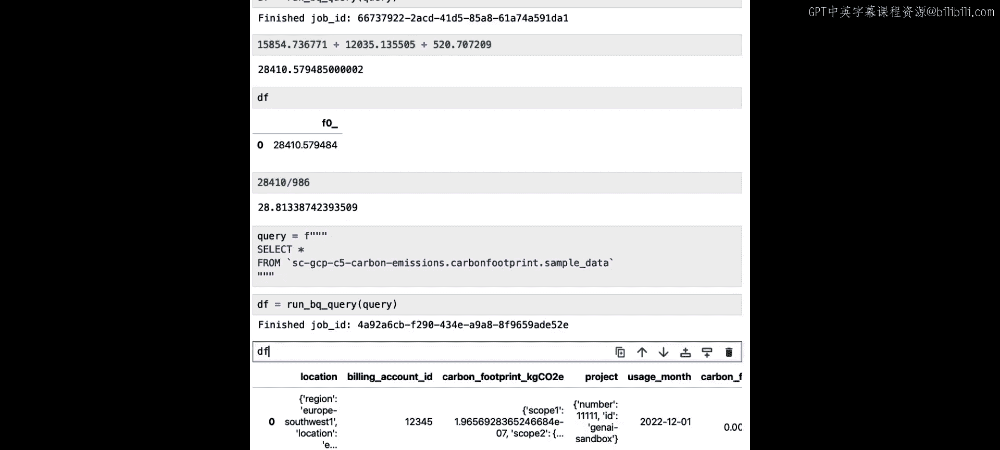

# 006：理解你的Google Cloud碳足迹 🌍


在本节课中，我们将学习如何使用Google Cloud碳足迹工具。该工具通过自动估算您所有Google Cloud使用所产生的温室气体排放，为您提供一个更全面的碳足迹衡量标准。

## 准备工作与核心概念

上一节我们介绍了如何通过区域选择来优化碳排放。本节中，我们来看看如何获取和分析Google Cloud服务的完整碳足迹数据。

我们将使用Google Cloud，因此需要导入身份验证函数以获取凭据和项目ID。

```python
# 导入必要的库
from google.cloud import bigquery
import pandas as pd
```

在深入代码之前，您需要了解碳通常是如何被测量和量化的。温室气体核算体系标准定义了三个类别，称为范围1、范围2和范围3。这些类别帮助组织衡量其碳影响，每个类别的具体构成因组织的业务类型和活动而异。

*   **范围2**：这是我们本课程迄今为止讨论的重点。它涵盖了购买电力、供暖和制冷所产生的所有间接排放。当我们讨论碳与计算时，范围2最相关，因为它包括了因连接到电网而在Google Cloud数据中心用电所产生的排放。
*   **范围1**：这包括组织控制的来源产生的直接排放，例如厨房的燃气灶，或者如果您运营一支班车车队，用于运行班车的燃料。在Google Cloud数据中心的背景下，范围1可能包括现场备用发电机等。
*   **范围3**：这涵盖了来自您不控制的资产的所有间接排放。这包括从供应商处购买的物品、废物处理以及任何类型的商务旅行等类别。就Google Cloud而言，这可能包括生产数据中心中GPU所产生的排放。

碳影响不仅仅包括我们目前关注的、来自电力生产的范围2排放。通过将范围1和范围3纳入我们的估算，我们可以更全面地了解我们的影响。具体到本课将讨论的碳足迹工具和数据，您看到的是Google数据中心运营的范围1、2和3排放。作为开发者，您对Google Cloud的使用实际上属于您的范围3排放。

## 访问碳足迹数据

对于您在本课程之外的个人项目，您需要将碳足迹数据导出到BigQuery。我已为本课程完成了此设置，因此您无需进行设置。但如果您想为自己的项目尝试此操作，并了解您在Google Cloud中可能进行的任何工作的碳数据，让我快速展示如何在云控制台中操作。





在云控制台中，您可以输入“Carbon footprint”。然后从这里，点击“导出”按钮，选择要将数据导出到的项目，然后点击“配置导出”。完成此操作后，您可以进行一些不同的自定义设置，可以保留所有默认设置，唯一需要设置的是BigQuery中数据集的名称，您希望将所有数据传输到该数据集。然后您可以点击“保存”。完成此设置并导出数据后，您将能够访问它。

回到笔记本，使用BigQuery Python客户端，我们将编写一个函数来执行BigQuery查询。该函数将SQL查询字符串作为输入，在BigQuery中执行它，结果将以Pandas DataFrame的形式返回。

```python
def run_bq_query(sql):
    """
    执行BigQuery查询并返回Pandas DataFrame。
    """
    # 创建BigQuery客户端
    client = bigquery.Client(project=project_id, credentials=credentials)
    # 设置作业配置
    job_config = bigquery.QueryJobConfig()
    # 执行查询
    query_job = client.query(sql, job_config=job_config)
    # 获取作业ID（可选，便于调试）
    job_id = query_job.job_id
    # 等待作业完成并转换为DataFrame
    df = query_job.to_dataframe()
    # 打印完成信息
    print(f"作业 {job_id} 已完成。")
    return df
```

## 探索数据

现在我们有了函数，让我们尝试一些查询来调查数据。我们将使用SQL来完成，但如果您不是SQL专家，请不要担心，我也不是。我们将一起学习几个基本的SQL命令，您可以用它们从这些数据中获取大量信息。

首先，我们将查看数据的一个子集，只提取数据集的前五行，以便了解这些数据中实际包含什么，以及所有“范围2”、“范围3”等字段的含义。

```sql
SELECT *
FROM `your-project-id.carbon_footprint.sample_data`
LIMIT 5
```

我们可以调用上面定义的 `run_bq_query` 函数来获取数据。

```python
sample_df = run_bq_query(query)
print(sample_df)
```

此表中的每一行代表特定Google Cloud服务在特定项目中一个月时间范围内的排放量。这些实际上是我在Google Cloud中三个项目的真实数据。您将看到我在不同时间使用的不同Google Cloud服务，用于我创建的所有演示、机器学习内容和课程。

浏览这些列，您会注意到没有一个单独的列叫“排放量”。这是因为有几种不同的计算和报告这个数字的方式。让我们放大一个名为 `carbon_footprint_kg_co2e` 的列。这个字段有三个嵌套列：`scope1`、`scope2` 和 `scope3`，即我们之前讨论的范围。

这些数字告诉我们什么？这是我从一些Google Cloud项目编译的碳足迹数据。具体来说，这一行（如果我们打印出服务列的值）来自名为“Cloud Run”的服务，这是一个特定的Google Cloud项目。这里的范围1、2和3数字告诉我们那个月我的Cloud Run使用所产生的排放。

*   查看这里的 `scope2`，您可以看到 `4.966e-05` 是范围2产生的排放，这是通过估算执行此计算工作负载的当地电网提供的电力所产生的温室气体排放得出的。
*   这是 `scope1` 的值。
*   这是 `scope3` 的值。

在碳足迹工具中，这两个数字是通过获取Google Cloud总的范围1和范围3排放，然后根据您特定的Google Cloud使用情况进行分配来计算的。

因此，综合来看，当我们查看我对Cloud Run的使用时，重要的不仅仅是这里的范围2排放（即发电产生的排放），这个碳足迹工具还为我们提供了因运营和运行我实际运行此工作负载的数据中心而产生的额外排放的估算。

**请注意**：您可能已经注意到，这里的 `scope2` 有一个额外的键叫 `location_based`。这指的是在特定Google Cloud服务的使用中消耗电力所排放的实际二氧化碳当量。之所以将其作为一个特定的键标出，是因为未来这里还会有一个基于市场的值，该值会考虑Google Cloud为该工作负载购买的可再生能源，但目前数据中还没有这个数字，所以您无需担心，可以忽略它。但如果您想知道为什么范围2有一个特定的键，而范围1和范围3没有，这就是原因。但数字仍然是相同的，这里的数字才是您需要关心的。

除了这个 `carbon_footprint_kg_co2e` 列，如果您滚动查看，还会看到 `carbon_footprint_total_kg_co2e`。如果您想知道所有三个范围的总排放量，而不仅仅是范围2的电力使用排放，这就是需要查看的字段。我们可以实际测试一下，确保计算正确，因为如果我们把这里的范围1、2和3的值相加，应该得到这里的总位置数字。

```python
# 验证总和
total_emissions = (sample_df.iloc[0]['carbon_footprint_kg_co2e']['scope1'] +
                   sample_df.iloc[0]['carbon_footprint_kg_co2e']['scope2']['location_based'] +
                   sample_df.iloc[0]['carbon_footprint_kg_co2e']['scope3'])
print(f"范围1+2+3总和: {total_emissions}")
print(f"总排放字段值: {sample_df.iloc[0]['carbon_footprint_total_kg_co2e']['location_based']}")
```

因此，尽管在本课程中我们主要讨论了范围2排放，但如果我们想全面了解我们的影响，加入范围1和范围3并查看这里的总数，将为我们提供更好的碳排放估算。

## 运行分析查询

现在我们已经快速浏览了数据，可以运行哪些有趣的分析查询呢？

**查询1：特定服务的范围2总排放**

如果我们想知道某一特定服务（例如BigQuery）的发电总排放量，可以运行以下查询：

```sql
SELECT SUM(carbon_footprint_kg_co2e.scope2.location_based) AS total_scope2_emissions
FROM `your-project-id.carbon_footprint.sample_data`
WHERE service.description = 'BigQuery'
```

**查询2：按月份、区域和服务查看特定项目的排放细分**

如果您想查看特定项目在所有三个范围（不仅仅是范围2）上，跨月份、区域和服务的碳排放细分，可以运行一个更复杂的查询：

```sql
SELECT
  usage_month,
  service.description,
  location,
  carbon_footprint_total_kg_co2e.location_based AS total_emissions_kg_co2e
FROM `your-project-id.carbon_footprint.sample_data`
WHERE project.number = 11111  -- 替换为您的项目ID
ORDER BY usage_month, service.description
```

**查询3：计算特定项目的总排放量**

如果您想知道特定项目在所有三个范围上的总排放量，可以运行以下查询：

```sql
SELECT
  project.number,
  SUM(carbon_footprint_total_kg_co2e.location_based) AS total_carbon_emissions_kg_co2e
FROM `your-project-id.carbon_footprint.sample_data`
GROUP BY project.number
```

运行此查询后，您可以看到数据中三个项目的总碳排放量。为了给您一点背景信息，根据德国非营利组织的数据，从伦敦往返纽约一次，每位乘客会产生约986公斤的二氧化碳。这里的一个项目产生的排放量略少于两次伦敦到纽约的往返航班，而这仅仅来自于训练机器学习模型和构建演示（这是我在这些项目中所做的工作）。

如果我们实际上只是使用这里的查询对这三个数字求和，我们可以看到我在这些项目中所有Google Cloud活动的总排放量。将这个数字除以986（每位乘客从伦敦往返纽约产生的二氧化碳公斤数），我们得到接近29。这意味着，仅仅通过在这些Google Cloud项目中训练ML模型、构建演示以及我做的所有其他事情，我产生的排放量接近29次往返纽约的航班。

这个数字让我个人感到非常惊讶。我认为，当我们使用一次性塑料或给汽车加油时，很容易看到我们对环境的影响，因为这些行为更具体。但在笔记本中执行单元格、运行代码有时感觉非常抽象，因此很难将我们编写代码时所做的事情与实际对环境可能产生的影响联系起来。能够像这样看到我的碳足迹数据，并如此清晰地看到这些数字，对我来说真的很有启发性。

## 使用Pandas进行本地分析

现在轮到您试验数据了，看看是否有其他有趣的查询想要运行。如果您像我一样，对SQL不太熟悉，这些数据实际上足够小，您可以将其加载到本笔记本的Pandas DataFrame中，这样就可以使用Pandas来分析数据。

让我快速展示一下如何操作：

```python
# 将所有数据加载到Pandas DataFrame中
query_all = """
SELECT *
FROM `your-project-id.carbon_footprint.sample_data`
"""
full_df = run_bq_query(query_all)
# 现在您可以使用Pandas方法（如groupby, sum, plot等）分析full_df
print(full_df.head())
print(full_df.groupby('service.description')['carbon_footprint_total_kg_co2e'].sum())
```

## 总结与下节预告

本节课中，我们一起学习了如何通过Google Cloud碳足迹工具，获取和分析我们使用Google Cloud所产生的完整碳排放情况。我们了解了范围1、2、3排放的区别，并实践了使用SQL和Python来查询和解读这些数据。



下一节课，我们将讨论一些后续步骤和延伸阅读材料，以及您可以在Google Cloud中采取的具体措施来降低碳足迹。我们下节课见。