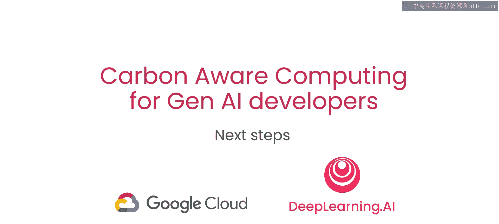
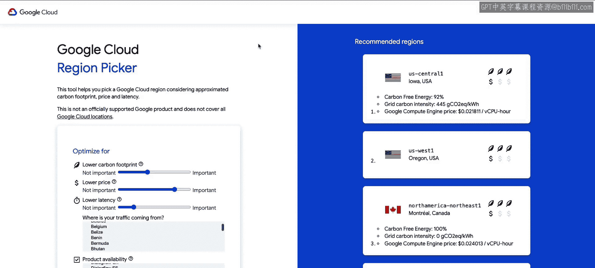
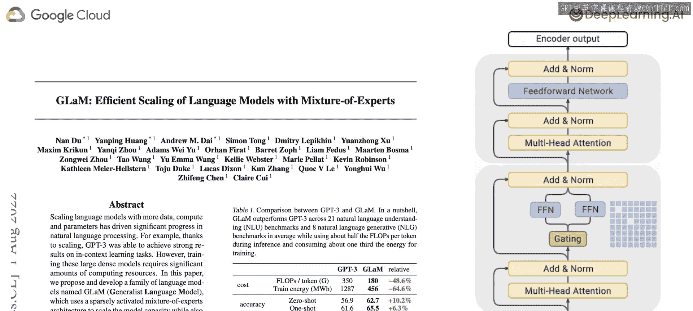
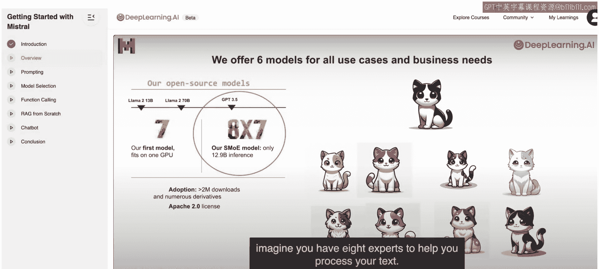
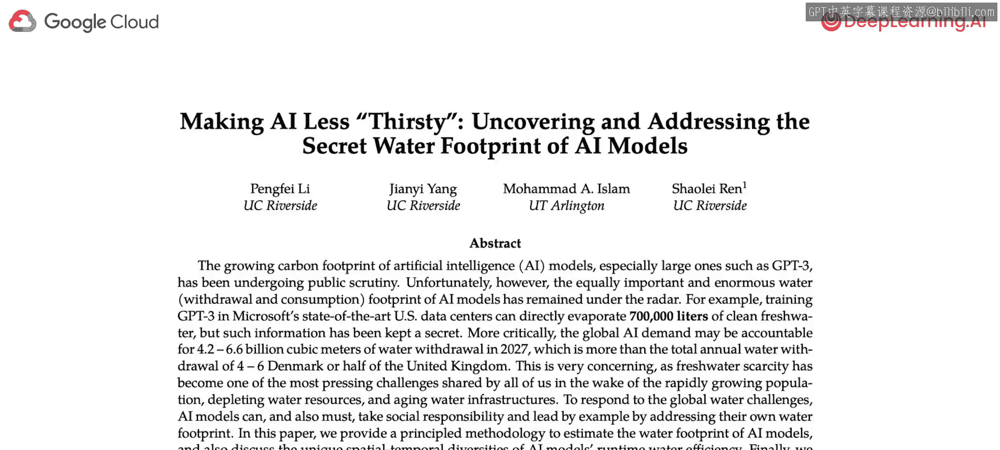

# 007：后续步骤 🚀

在本节课中，我们将一起探索一些有趣的论文和项目，作为您碳意识旅程的延伸和启发。我们将了解实用的工具、前沿的研究模型以及超越碳排放的其他环境影响。

## 区域选择工具实践 🌍

上一节我们介绍了如何根据碳排放选择云服务区域。本节中我们来看看一个综合性的工具，它可以帮助您在考虑多种因素的情况下做出最佳选择。

选择实际项目的部署区域通常取决于许多其他因素，例如延迟、价格和数据位置。为了帮助您进行区域选择，您可以使用Google Cloud的区域选择器工具。

以下是使用该工具的步骤：
*   您可以为碳排放、更低价格和延迟等不同因素指定其重要性程度。
*   假设碳排放的重要性略低于中等，但我们非常关心价格，并且不太关心延迟。
*   如果适用，您还可以指定流量的来源以及您计划运行的产品。
*   指定所有这些参数后，您将获得基于您特定偏好的区域推荐。

例如，根据我的设置，工具推荐了美国爱荷华州的US Central 1区域。您可能记得，这是我们在第三课中用于训练机器学习模型的区域。后来，我还在加拿大蒙特利尔进行了训练，因为该区域在当时有更多的可再生能源可用。

如果您计划使用Google Cloud，请务必查看区域选择器。您可以使用此工具来指导您选择最佳区域，在优化碳效率的同时，也兼顾对您重要的其他因素。

## 前沿研究论文探索 📄

现在，让我们了解一些有趣的研究论文。如果您想更深入地了解这个领域，这些资料将非常有帮助。

第一项研究是关于一个名为GLaM（通用语言模型）的模型家族。该论文的作者表明，最大的GLaM模型（1.2万亿参数）在训练时消耗的能源仅为GPT-3的三分之一，推理所需的计算量（FLOPs）也减少了一半，同时在29个NLP任务上实现了可比的性能。

研究人员通过使用一种称为**稀疏激活的专家混合架构**来实现这种效率。在阅读这篇论文之前，我并不熟悉这种架构。如果您想了解更多关于其工作原理以及他们如何在能源使用方面获得这些效率提升的信息，我强烈推荐您查阅这篇论文。

除了这篇论文，如果您想了解更多关于专家混合模型的知识，Mistral AI还有一个简短的课程，其中介绍了一些相关内容。如果您想在深入研究这篇技术论文之前获得一些入门知识，请务必查看那个课程。

虽然本课程主要讨论了训练模型产生的碳足迹，但最近关于推理时能源消耗的研究也越来越多。我推荐您阅读论文《Power Hungry Processing: What’s Driving the Cost of AI Deployment?》。

该论文的作者指出，虽然对单个示例进行推理所需的计算量远少于训练同一模型，但推理发生的频率要高得多。具体来说，研究人员比较了几种不同BLOOM模型每次推理的能源使用量，以及训练和微调它们所消耗的总能源。他们用这个数字来估算，对于一个给定的模型，需要进行多少次推理，其推理成本才能达到训练成本。

他们估计，对于ChatGPT，即使假设每个用户只进行一次查询，部署该模型的能源成本在仅仅几周或几个月的部署后就会超过其训练成本。

这篇论文研究了涵盖自然语言和计算机视觉的10个任务、30个数据集和应用中的88个模型，并分析了最终任务类型、模型大小、架构和学习范式对能源效率的影响。

您还可以从这篇论文中学到，例如，提示大型语言模型执行摘要任务比要求其执行分类任务要消耗更多的能源和产生更多的碳排放。正如您可能想象的那样，图像生成比图像分类或文本生成要消耗更多的能源。

## 超越碳足迹：水资源影响 💧

最后，除了碳排放，生成式AI还有相关的水足迹。请记住，运行GPU和TPU的数据中心会变得非常热，冷却系统可能会蒸发大量的水以保持这些处理器的运行。最近有一些工作试图理解和量化水资源的使用。

如果您想了解更多信息，我建议您查阅论文《Making AI Less “Thirsty”》。目前这方面的研究肯定比量化计算碳足迹的研究要少。但就像过去几年我们对碳足迹的理解有了很大进步一样，我认为理解水足迹并学习如何进行某些优化，将是未来研究领域会更多关注的话题。

水资源使用是研究界最近越来越关注的一个话题。就像几年前我们并不真正理解或考虑计算的碳足迹一样，这种情况在过去几年发生了很大变化，相关研究也越来越多。我认为水资源是一个新的领域，我们将看到更多关于其真实影响以及我们如何做出改变以减少用水量和降低足迹的研究和理解。

如果您想了解这个新领域是如何开始发展的，请务必查阅这篇论文。

## 课程总结 🎯

本节课中我们一起学习了几个我认为非常有趣的论文和项目。我希望本课程能成为您碳意识旅程的一个起点。我认为，作为开发者和工程师，您能够产生影响，这非常令人兴奋。我希望从现在开始，您在开发软件应用程序时会开始考虑碳排放。我的意思是，我们已经习惯于考虑性能、安全性、成本等因素，因此碳排放只是需要添加到这个清单中的又一项内容。