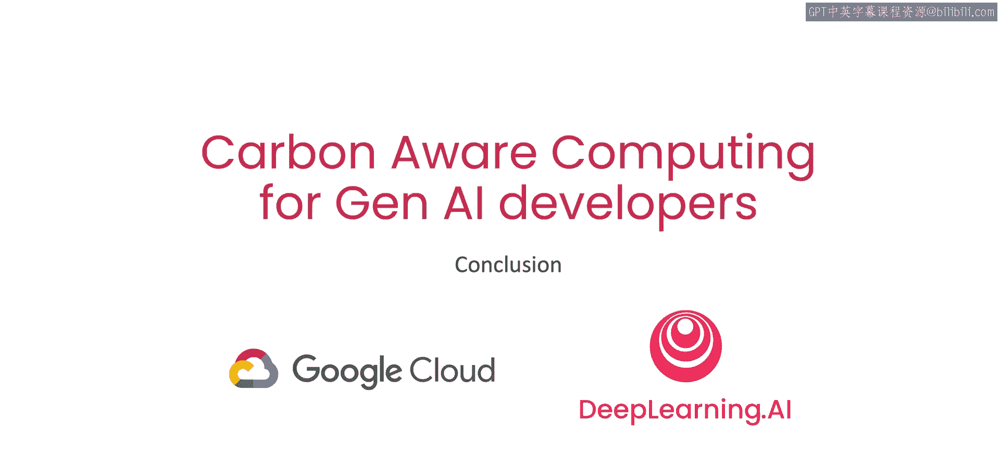

# 008：结论 🎯

在本课程中，我们学习了与计算基础设施和碳排放相关的能源与电网知识。

上一节我们探讨了影响碳足迹的关键因素，本节中我们将对整个课程内容进行总结。

## 课程核心内容回顾 📚

你学习了模型训练和推理，特别是涉及大语言模型时，可能产生显著的碳足迹。

同时，你也熟悉了影响该碳足迹大小的关键因素和决策。

## 实践策略体验 🛠️

以下是课程中介绍的一种碳意识机器学习开发策略：

*   **策略**：在由高比例无碳能源供电的地区训练模型。

## 开发者的积极影响 💡

开发者可以通过改变编码和设计机器学习应用程序的方式，对环境产生切实的积极影响。

一个具体的例子是，如果你希望立即开始贡献，Electricity Maps 应用程序是开源的。如果你发现你所在的区域电网数据缺失，甚至可以按照流程添加新的区域电网数据。

## 展望未来 🚀

希望这只是你碳意识之旅的开始。该领域还有更多值得探索的内容，相关研究也日益深入。期待看到你接下来构建的碳意识应用程序。

## 总结 📝

本节课中我们一起学习了计算，特别是大语言模型训练与推理的碳足迹问题，了解了影响碳足迹的关键决策，并实践了在无碳能源丰富的地区进行模型训练的策略。作为开发者，我们完全可以通过技术选择为环境保护做出积极贡献。