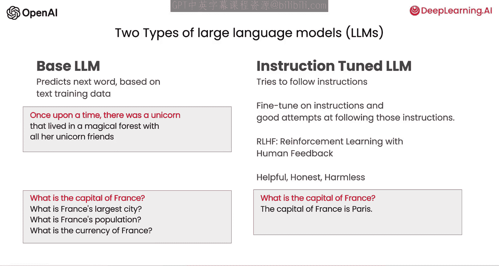
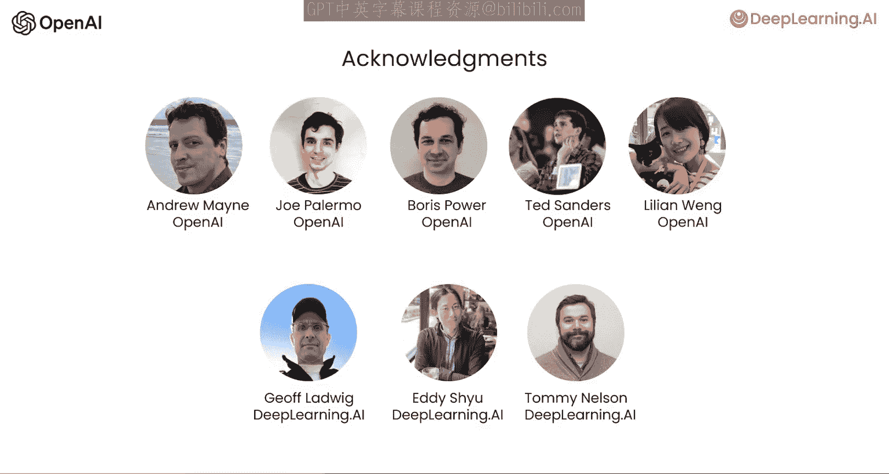

# 001：课程介绍与核心概念 🎯

在本节课中，我们将学习ChatGPT提示工程的核心概念，包括两种主要的大型语言模型（LLM）类型以及使用指令调优模型的最佳实践。

欢迎来到这门面向开发者的ChatGPT提示工程课程。我很高兴能与来自OpenAI的技术团队成员Isa Fulford一同授课。她开发了流行的ChatGPT检索插件，并致力于教授人们如何在产品中使用OpenAI的大型语言模型技术。她也是教授提示技巧的OpenAI Cookbook的贡献者。很高兴能与你分享一些提示工程的最佳实践。

互联网上已有大量关于提示工程的材料，例如“每个人都必须知道的30个提示”这类文章。这些材料大多聚焦于ChatGPT的网页用户界面，许多人用它来完成特定的一次性任务。然而，我认为，作为开发者，通过API调用OpenAI的大型语言模型来快速构建软件应用的能力，其潜力仍未得到充分重视。事实上，我在AI Fund的团队（DeepLearning.AI的关联公司）一直与许多初创公司合作，将这些技术应用于各种场景。看到OpenAI的API如何赋能开发者快速构建应用，这令人非常兴奋。

因此，在本课程中，我们将与你分享一些可能性，以及实现这些可能性的最佳实践。我们将涵盖大量内容：首先，你将学习软件开发中的提示工程最佳实践；接着，我们会探讨一些常见用例，如总结、推断、转换和扩展；最后，你将使用LLM构建一个聊天机器人。我们希望这能激发你对构建新应用的想象力。

## 大型语言模型的两种类型

在大型语言模型的发展过程中，主要出现了两种类型：基础LLM和指令调优LLM。

**基础LLM** 基于文本训练数据，通过预测下一个词来进行训练。它通常使用来自互联网和其他来源的大量数据进行训练，以推断接下来最可能出现的词。

例如，如果你提示它“从前，有一只独角兽”，它可能会补全为“它和所有的独角兽朋友一起生活在神奇的森林里”。

但是，如果你提示它“法国的首都是什么”，根据互联网上的文章，基础LLM很可能会补全为“法国最大的城市是什么”、“法国的人口是多少”等。因为互联网上的文章很可能是一系列关于法国的测验问题列表。

**指令调优LLM** 则不同，这也是当前LLM研究和实践的主要方向。指令调优LLM被训练来遵循指令。因此，如果你问它“法国的首都是什么”，它更可能输出“法国的首都是巴黎”。

指令调优LLM的典型训练方式是：从一个基础LLM开始，该模型已在海量文本数据上进行了训练，然后使用包含指令及遵循这些指令的良好尝试的输入和输出数据对其进行微调。之后，通常会进一步使用一种名为“基于人类反馈的强化学习（RLHF）”的技术进行优化，使系统更能提供帮助并遵循指令。因为指令调优LLM被训练得乐于助人、诚实且无害，所以与基础LLM相比，它们更少输出有问题的文本（如有害内容）。

目前，许多实际应用场景已转向使用指令调优LLM。你在互联网上找到的一些最佳实践可能更适用于基础LLM，但对于当今大多数实际应用，我们建议大多数人专注于使用指令调优LLM，因为它们更易用，并且由于OpenAI和其他LLM公司的工作，它们变得更安全、更符合人类意图。

因此，本课程将重点介绍指令调优LLM的最佳实践，这也是我们建议你在大多数应用中使用的模型类型。

在继续之前，我想感谢来自OpenAI和DeepLearning.AI的团队，他们为Isa和我将要展示的材料做出了贡献。特别感谢OpenAI的Andrew Main、Joe Palermo、Boris Power、Ted Sanders和Lillian Weng，他们与我们共同构思、审查材料，为这门短期课程制定了教学大纲。同时，也感谢DeepLearning.AI的Jeff Ludwig、Eddie Shu和Tommy Nelson的辛勤工作。

## 使用指令调优LLM的核心原则

当你使用指令调优LLM时，可以想象成在给一个聪明但不了解你任务具体细节的人下达指令。因此，当LLM表现不佳时，有时是因为指令不够清晰。

例如，如果你说“请为我写一些关于艾伦·图灵的东西”，除了这个请求，明确你希望文本侧重于他的科学工作、个人生活、历史角色还是其他方面，会更有帮助。同时，指定文本的语调也很重要：是应该像专业记者那样写作，还是更像写给朋友的随意便条？这有助于LLM生成你想要的内容。

当然，如果你想象自己让一位刚毕业的大学生为你完成这项任务，如果你能提前指定他们应该阅读哪些文本片段来撰写关于艾伦·图灵的文章，那么这将更好地为他们成功完成任务做好准备。

在下一节视频中，你将看到如何做到清晰和具体的示例，这是提示LLM的一个重要原则。你还将学习第二个提示原则：给LLM时间思考。

本节课中，我们一起学习了ChatGPT提示工程的课程介绍，了解了基础LLM与指令调优LLM的核心区别，并明确了本课程将聚焦于指令调优模型的最佳实践。我们还初步探讨了使用这类模型时“清晰具体”和“给予思考时间”两大核心原则的重要性。下一节，我们将深入探讨如何在实际操作中应用这些原则。