# 004：文本摘要 📝


在本节课中，我们将学习如何使用大型语言模型来总结文本。这是一个非常实用的功能，可以帮助我们快速理解大量文本内容的核心信息，尤其适用于处理产品评论、文章或报告等场景。

---

当今世界充斥着海量文本，我们几乎没有人有足够的时间去阅读所有希望阅读的内容。因此，大型语言模型最令人兴奋的应用之一就是用它来总结文本。我看到多个团队正在将这项功能构建到各种软件应用程序中。


你可以在ChatGPT的网页界面中进行文本摘要，我经常用它来总结文章，这样我就能比以前阅读更多文章的内容。如果你想以更程序化的方式实现这一点，本节课将展示具体方法。

接下来，让我们进入代码部分，看看如何自己使用这项功能来总结文本。

## 基础设置与通用摘要

首先，我们从与之前相同的静态代码开始，导入OpenAI库并设置API密钥。以下是 `get_completion` 辅助函数：

```python
import openai
openai.api_key = "YOUR_API_KEY"

def get_completion(prompt, model="gpt-3.5-turbo"):
    messages = [{"role": "user", "content": prompt}]
    response = openai.ChatCompletion.create(
        model=model,
        messages=messages,
        temperature=0,
    )
    return response.choices[0].message["content"]
```

我将使用一个产品评论作为贯穿本节的示例任务。评论内容是：“给我女儿的生日买了这个熊猫毛绒玩具，她很喜欢，去哪都带着它，等等等等。”

如果你正在运营一个电子商务网站，并且有大量的评论，那么拥有一个总结冗长评论的工具，可以让你快速浏览更多评论，从而更好地了解所有客户的想法。

以下是一个用于生成摘要的提示词：

```
你的任务是为电子商务网站的产品评论生成一个简短的摘要。
请总结以下评论，字数不超过30个单词。
```

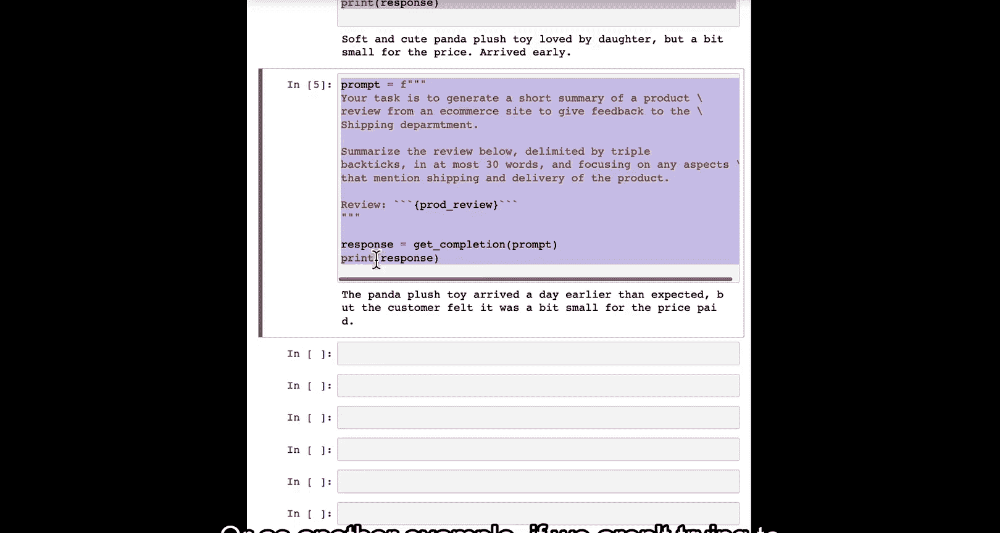

运行这个提示词后，我们得到一个摘要：“柔软可爱的熊猫毛绒玩具，深受女儿喜爱，但尺寸偏小，价格偏高，提前一天送达。总体不错。”

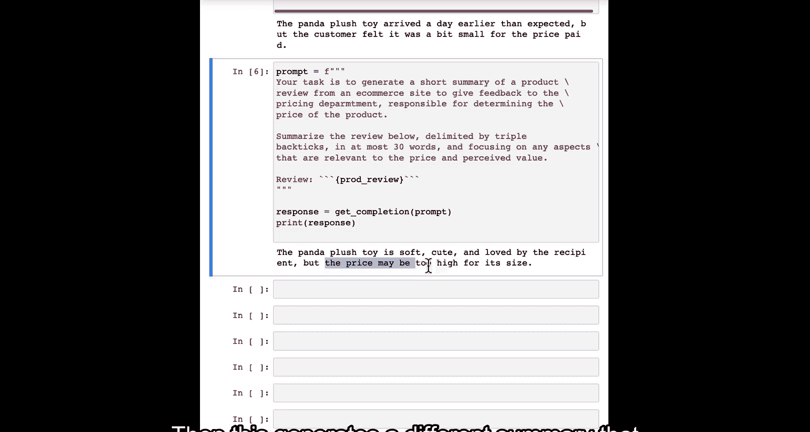

正如你在上一节视频中看到的，你还可以通过控制字符数或句子数量等参数来调整摘要的长度。

## 面向特定目的的摘要

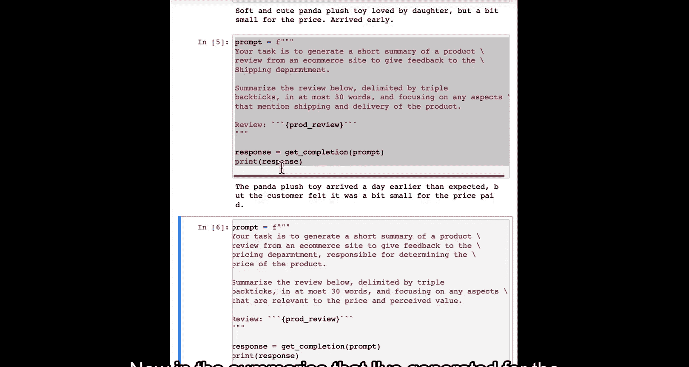

有时，在创建摘要时，如果你对摘要有非常具体的目的，例如，你想向物流部门提供反馈，那么你也可以修改提示词以反映这一点，从而生成更适用于你业务中特定群体的摘要。

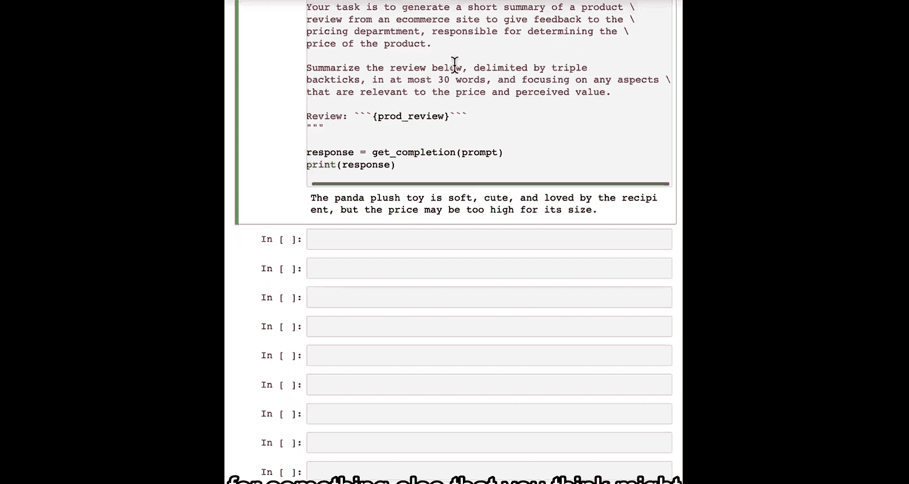

例如，如果我修改提示词，添加“以向物流部门提供反馈为目的”，并指示其“专注于提及产品运输和交付的任何方面”，那么生成的摘要就会有所不同。它不再以“柔软可爱的熊猫毛绒玩具”开头，而是聚焦于“比预期提前一天送达”这一事实。

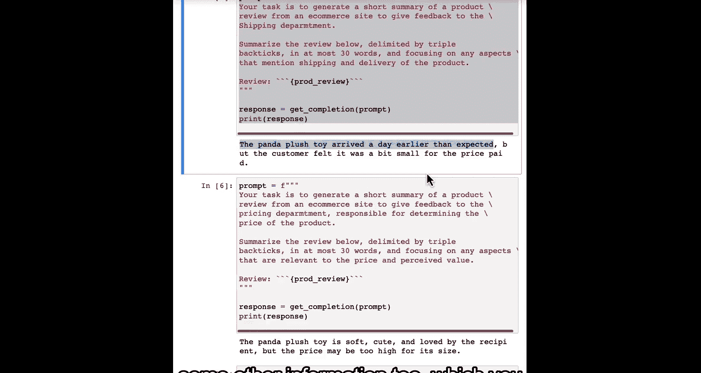

同样，如果我们不是向物流部门提供反馈，而是想向定价部门提供反馈，我们可以将提示词修改为“以向负责产品定价的定价部门提供反馈为目的”，并指示其“专注于与价格和感知价值相关的方面”。这样，模型会生成另一个不同的摘要，例如：“产品价格相对于其尺寸可能偏高。”

在为物流部门或定价部门生成的摘要中，模型会更侧重于与这些特定部门相关的信息。实际上，你可以随时暂停视频，尝试让它为负责产品客户体验的产品部门生成信息，或者为你认为电子商务网站可能感兴趣的其他方面生成摘要。

## 信息提取 vs. 摘要总结

在这些摘要中，即使它生成了与物流相关的信息，也可能包含其他信息，你可以决定这些信息是否有帮助。因此，根据你希望如何总结，你也可以要求它提取信息，而不是进行概括性总结。

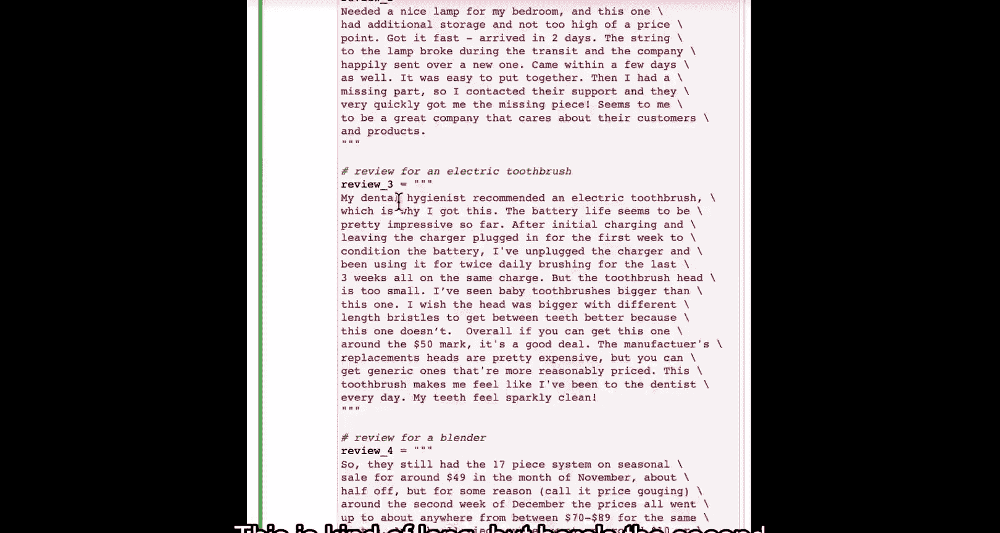

以下是一个提示词示例：“你的任务是提取相关信息，以便向物流部门提供反馈。” 现在，它可能只会输出“比预期提前一天送达”，而不包含其他在通用摘要中有用、但对于只想知道物流情况的物流部门来说不那么具体的信息。

## 批量处理多个评论

最后，让我分享一个具体的工作流程示例，展示如何使用此功能来总结多个评论，使其更易于阅读。

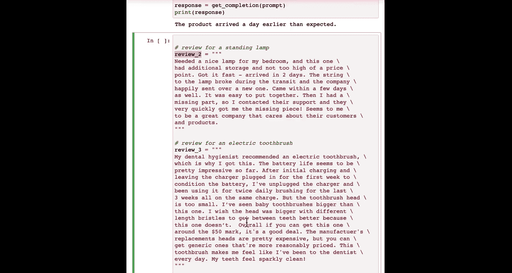

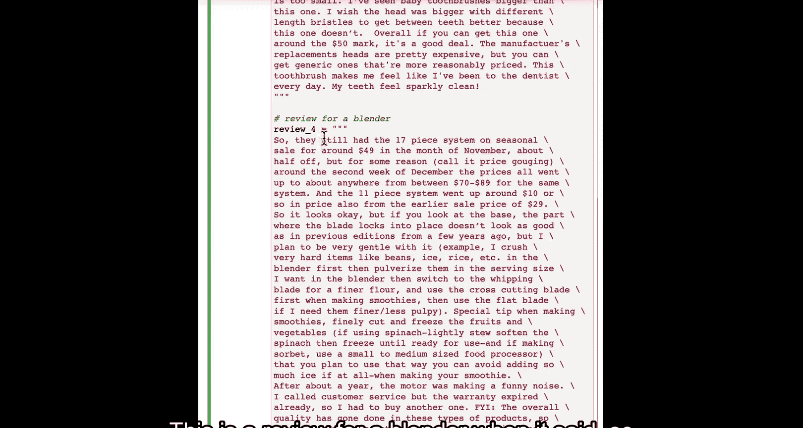

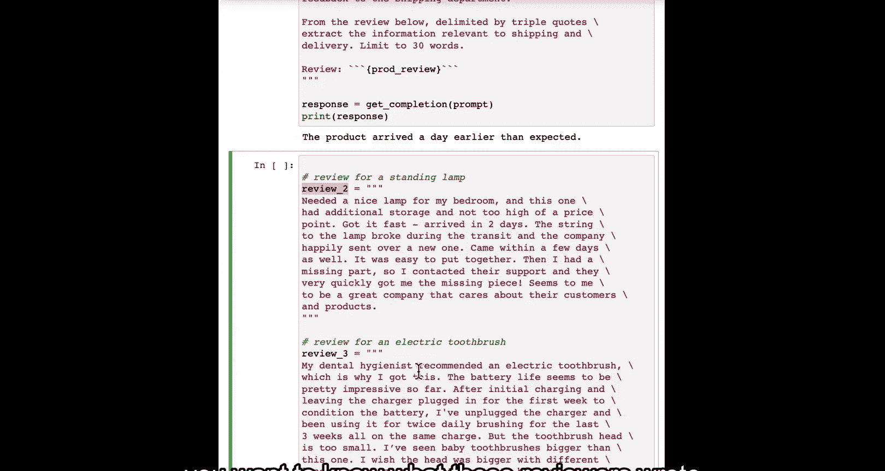

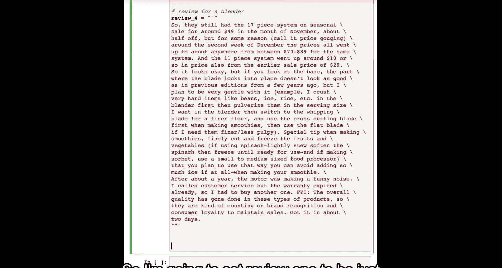

假设我们有几个评论：第一个是关于熊猫玩具的，第二个是关于落地灯的，第三个是关于电动牙刷的，第四个是关于搅拌机的。这些评论文本可能很长。

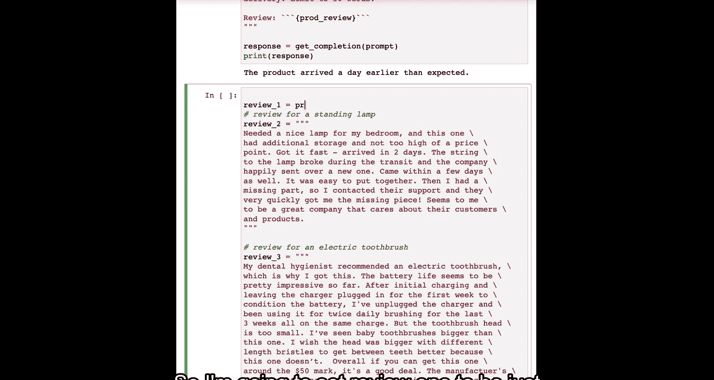

如果你想在不详细阅读所有文本的情况下了解这些评论的内容，可以这样做：首先将这些评论放入一个列表中。然后，实现一个循环来遍历所有评论。

以下是用于批量总结的提示词示例，要求每个摘要不超过20个单词：

```python
reviews = [review_1, review_2, review_3, review_4]

for i in range(len(reviews)):
    prompt = f"""
    你的任务是为电子商务网站的产品评论生成一个简短的摘要。
    请总结以下用三个反引号分隔的评论，字数不超过20个单词。
    评论：```{reviews[i]}```
    """
    response = get_completion(prompt)
    print(f"评论 {i+1} 摘要：{response}\n")
```

运行后，它会打印出每个评论的简短摘要。如果你的网站有数百条评论，你可以想象如何使用它来构建一个仪表板，处理大量评论并生成简短摘要，这样你或其他人就可以更快地浏览评论。如果他们愿意，还可以点击查看原始的长篇评论。这可以帮助你高效地了解所有客户的想法。

---

本节课中，我们一起学习了文本摘要功能。希望你现在能够设想，如果你的应用程序中有许多文本片段，如何使用类似的提示词来总结它们，以帮助人们快速了解文本内容。如果有需要，他们还可以选择深入阅读。

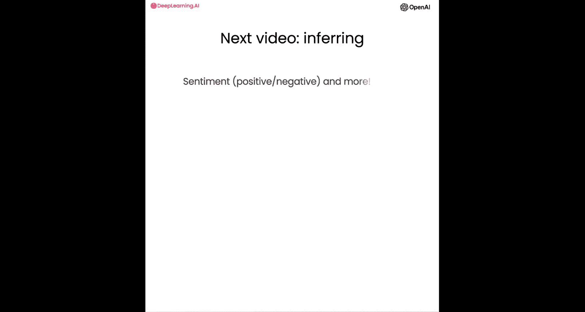

在下一节视频中，我们将探讨大型语言模型的另一个能力：利用文本进行推理。例如，如果你再次面对产品评论，并希望快速了解哪些评论具有正面或负面情绪。让我们在下一节视频中看看如何做到这一点。😊