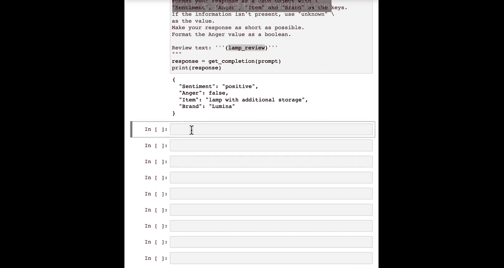
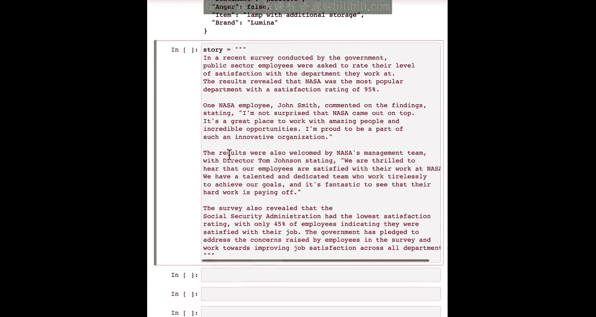
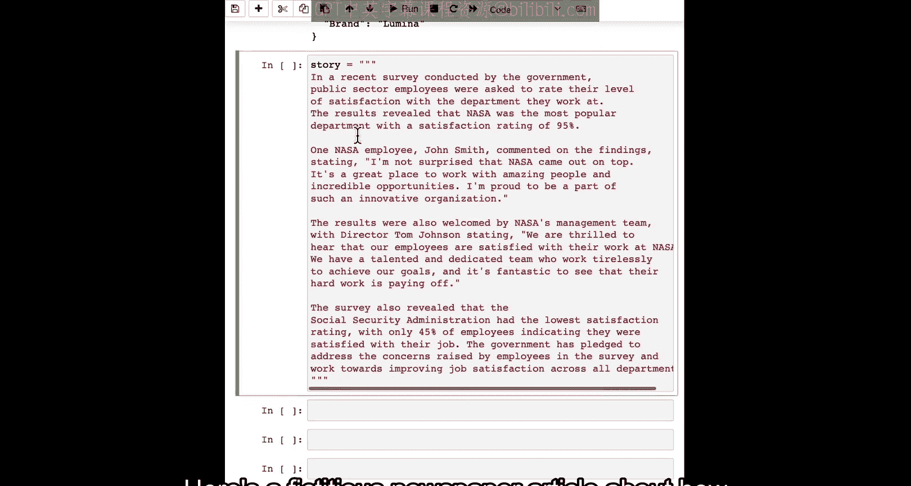
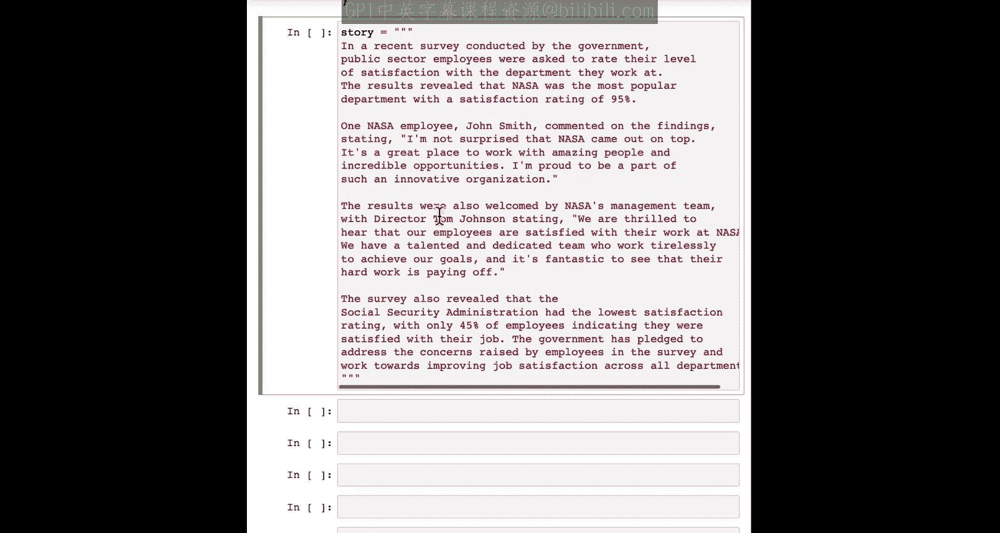
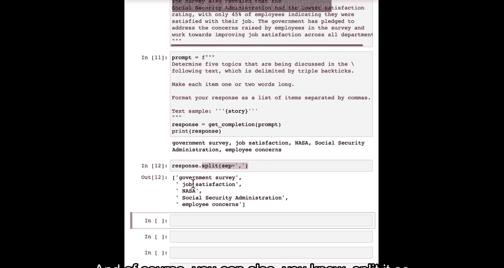
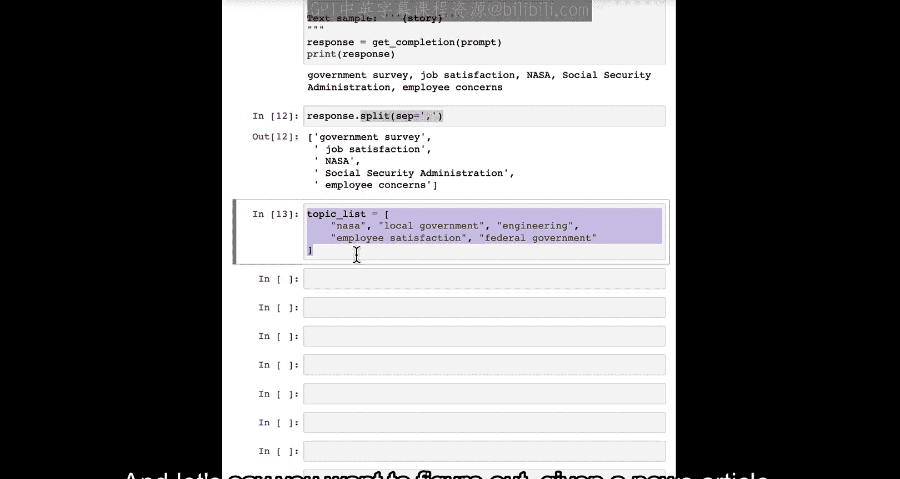
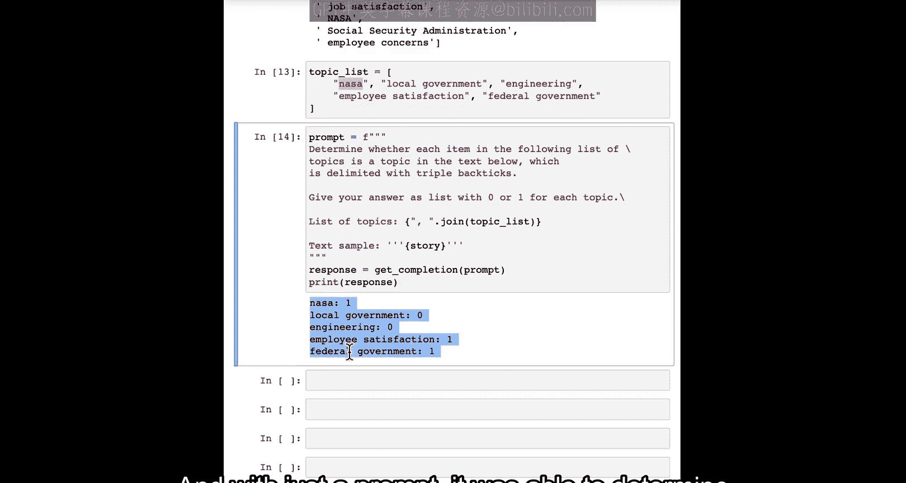
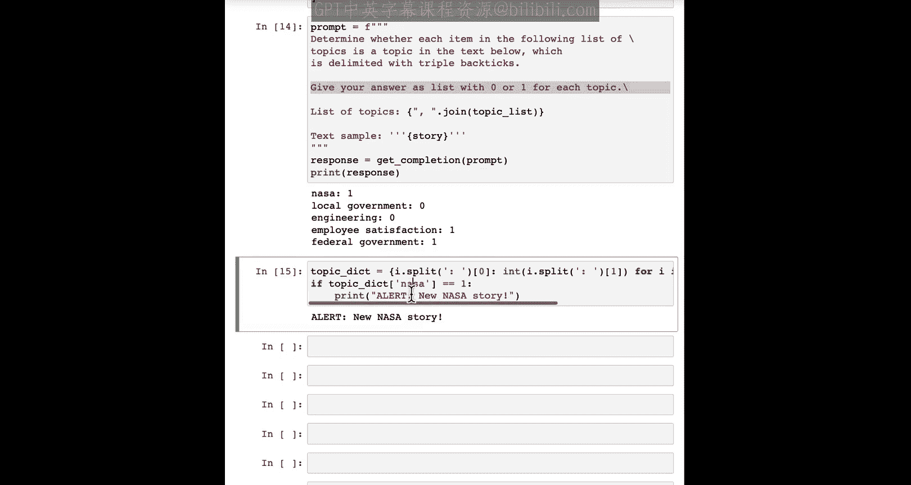
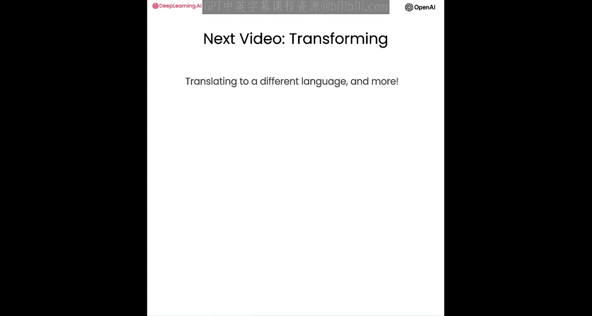

# 005：推断 🧠


在本节课中，我们将学习如何利用大型语言模型进行“推断”任务。推断任务是指模型接收一段文本作为输入，并执行某种分析，例如提取标签、识别情感或理解文本主题。我们将看到，与传统机器学习方法相比，使用提示词可以极大地简化这些任务的开发流程。

---

## 概述

传统机器学习方法中，要完成情感分析等任务，需要收集带标签的数据集、训练模型、部署模型，过程繁琐。对于不同的任务（如情感分析、实体提取），还需要分别训练和部署不同的模型。大型语言模型的优势在于，对于许多此类任务，你只需编写一个提示词，就能立即开始生成结果。这大大加快了应用开发速度，并且你可以使用同一个模型和API来完成多种不同任务。

上一节我们介绍了提示工程的基础，本节中我们来看看如何利用提示词进行文本推断。

---


## 情感分析 😊

我们从一个产品评论的例子开始。以下是一个关于台灯的评论：

```python
review = “这款台灯有额外的储物空间，光线也很柔和。虽然不是完美的产品，但考虑到价格，它物有所值。这家公司似乎很关心客户和产品。”
```

要判断这段评论的情感倾向，我们可以编写如下提示词：

```
判断以下产品评论的情感倾向。

评论：```{review}```
```

运行后，模型可能会输出：“该产品评论的情感是积极的。” 这看起来是正确的，因为客户总体上表达的是满意。

为了使输出更简洁，便于后续处理，我们可以修改提示词，要求输出单个词：

```
判断以下产品评论的情感倾向，仅用“积极”或“消极”一个词回答。

评论：```{review}```
```

这样，输出将直接是“积极”，更容易被其他程序处理。

---

## 识别情绪

除了整体情感，我们还可以让模型识别作者表达的具体情绪。以下是使用的提示词示例：

```
识别以下评论作者所表达的情绪列表。列表中不超过五项。

评论：```{review}```
```

模型可能会输出诸如“满意”、“感激”、“轻微批评”等情绪。这对于客户服务场景非常有用，例如，可以快速识别出表达“愤怒”情绪的客户，以便优先处理。

请注意，如果使用监督学习，为每一个这样的分类任务都构建一个模型将非常耗时。而使用提示词，我们可以在几分钟内完成。

---

## 信息提取

信息提取是自然语言处理的一部分，旨在从文本中提取特定信息。例如，从产品评论中提取购买的商品和品牌。

以下是提取商品和品牌的提示词示例：

```
从以下评论中识别以下项目：购买的商品和制造该商品的品牌名称。
请将你的回复格式化为JSON对象，键为“item”和“brand”。

评论：```{review}```
```

运行后，输出可能是一个JSON对象：`{"item": "带储物功能的台灯", "brand": "Luminar"}`。这个结果可以轻松加载到Python字典中进行进一步处理。

---

## 组合提取多个信息





我们也可以编写一个提示词来同时提取多个字段的信息，而不是为每个字段分别调用模型。

```
执行以下任务：
1. 识别购买的商品。
2. 提取评论的情感（积极/消极）。
3. 评论者是否表达了愤怒？（是/否）
4. 识别制造公司。
请将你的回复格式化为JSON对象，使用以下键：sentiment, anger, item, brand。
其中，anger的值应为布尔值（true/false）。





评论：```{review}```
```

这样，通过一次调用，我们就可以获得一个包含所有所需信息的结构化JSON输出。

---



## 推断主题 📰

大型语言模型另一个很酷的应用是推断长文本的主题。假设我们有一篇虚构的新闻报道，内容是关于政府机构员工满意度的调查。

我们可以使用以下提示词来确定文章讨论的主题：



```
确定以下文本中讨论的五个主题。
每个主题用一两个词概括，并将你的回复格式化为逗号分隔的列表。

文本：```{article_text}```
```

输出可能是一个列表，如：“政府调查，工作满意度，NASA，联邦机构，员工反馈”。

---



## 主题匹配与零样本学习

如果我们有一个预定义的主题列表（例如：[“地方政府”, “工程”, “员工满意度”, “联邦政府”]），我们可以让模型判断给定文章涵盖了列表中的哪些主题。

```
判断以下主题列表中的每一项是否是下方文本的主题。
对于每个主题，如果相关则输出1，否则输出0。
以列表形式给出你的答案。

主题列表：{topic_list}
文本：```{article_text}```
```

例如，对于一篇关于NASA员工满意度的文章，输出可能是 `[0, 0, 1, 1]`，表示它涉及“员工满意度”和“联邦政府”，但不涉及“地方政府”和“工程”。

在机器学习中，这被称为“零样本学习”算法，因为我们没有提供任何带标签的训练数据，仅凭提示词，模型就能做出判断。这种方法可以用于构建新闻提醒系统，例如，当检测到文章主题包含“NASA”时，自动触发警报。



---

## 总结

本节课我们一起学习了如何利用大型语言模型进行文本推断。我们涵盖了：
1.  **情感分析**：判断文本的积极或消极倾向。
2.  **情绪识别**：提取作者表达的具体情绪。
3.  **信息提取**：从文本中提取结构化信息，如商品和品牌。
4.  **主题推断**：识别长文本的核心主题。
5.  **主题匹配**：使用零样本学习判断文本是否涉及特定主题。

通过使用提示词，我们可以在极短的时间内构建出执行这些复杂自然语言处理任务的系统，而传统方法可能需要数天甚至数周。这为机器学习开发者和新手都开辟了快速原型设计和应用开发的新途径。



在下一节课中，我们将继续探索大型语言模型的强大功能，学习如何对文本进行“转换”，例如翻译成不同语言。