# 006：转换任务 🛠️

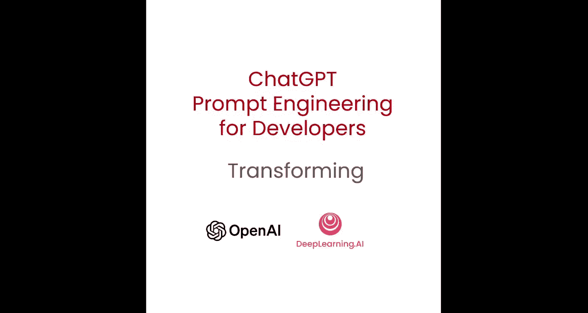

在本节课中，我们将学习大型语言模型（LLM）在**转换任务**上的强大能力。转换任务是指将输入内容从一种格式或形态转换为另一种，例如翻译、语气转换、格式转换以及语法校对。我们将通过具体的代码示例，了解如何利用提示词引导模型完成这些任务。

大型语言模型非常擅长将其输入转换为不同的格式。例如，输入一种语言的文本，将其转换或翻译成另一种语言，或者协助进行拼写和语法校正。这意味着，输入一段可能不完全符合语法的文本，模型可以帮助你修正它。它甚至可以在不同格式之间进行转换，例如输入HTML并输出JSON。过去，许多这类应用需要编写复杂的正则表达式才能实现，而现在，通过大型语言模型和几个简单的提示词，实现起来要简单得多。

---

## 导入与设置

首先，我们需要导入必要的库并设置一个辅助函数来获取模型的响应。我们将使用与之前课程相同的 `get_completion` 函数。


```python
import openai

def get_completion(prompt, model="gpt-3.5-turbo"):
    messages = [{"role": "user", "content": prompt}]
    response = openai.ChatCompletion.create(
        model=model,
        messages=messages,
        temperature=0,
    )
    return response.choices[0].message["content"]
```

---

## 翻译任务 🌐

大型语言模型在大量来自不同来源（主要是互联网）的文本上进行训练，这些文本包含多种语言。这赋予了模型进行翻译的能力，并且模型能以不同程度的熟练度掌握数百种语言。

以下是使用此功能的一些示例。

### 基础翻译

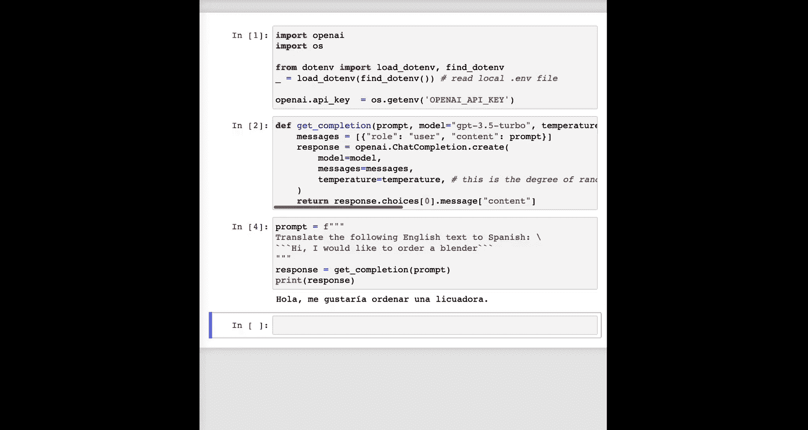

让我们从一个简单的例子开始。提示词要求将英文文本翻译成西班牙文。

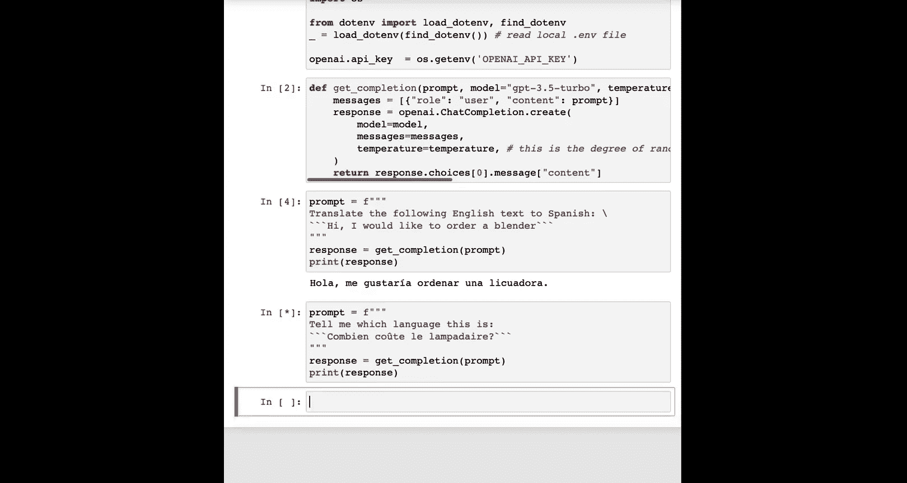

```python
prompt = """
翻译以下英文文本为西班牙文：
```Hi, I would like to order a blender.```
"""
response = get_completion(prompt)
print(response)
```

模型返回的翻译结果是：“Hola, me gustaría ordenar una licuadora.”

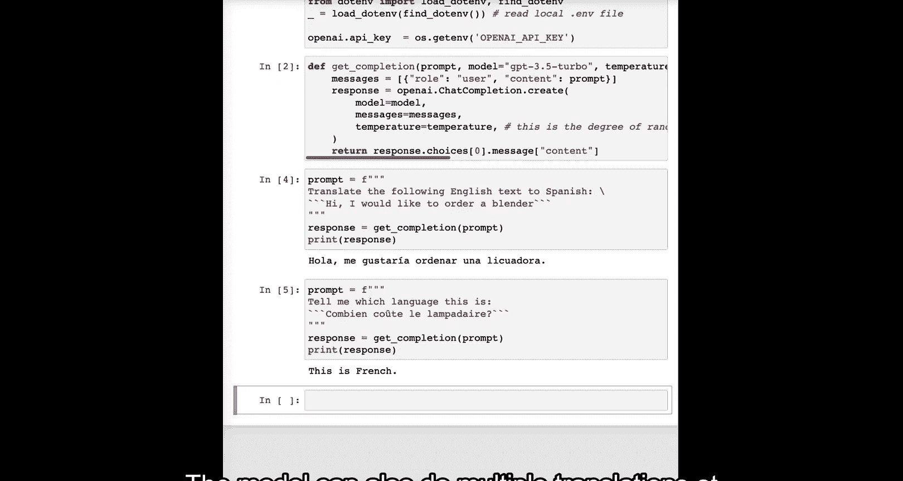

### 语言识别

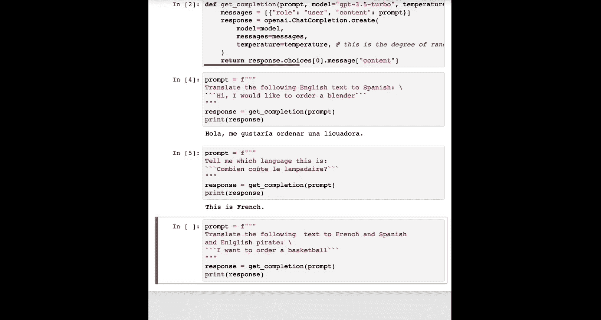

模型不仅可以翻译，还可以识别文本所使用的语言。

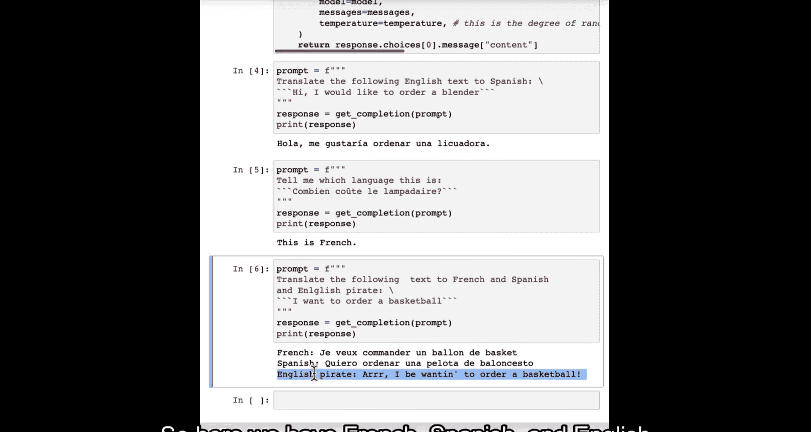

```python
prompt = """
告诉我这是什么语言：
```Combien coûte le lampadaire?```
"""
response = get_completion(prompt)
print(response)
```

模型会识别出这是法语。

### 多语言翻译

模型能够一次性将文本翻译成多种语言。

```python
prompt = """
将以下文本翻译成法语、西班牙语和英语海盗风格：
```I want to order a basketball.```
"""
response = get_completion(prompt)
print(response)
```

执行后，你将得到同一句话的法语、西班牙语和“海盗风格”英语版本。

### 正式与非正式语气翻译

在某些语言中，翻译会根据说话者与听者的关系而变化。你可以在提示词中向模型说明这一点。

```python
prompt = """
将以下文本翻译成西班牙语，并分别使用正式和非正式的语气：
```Would you like to order a pillow?```
"""
response = get_completion(prompt)
print(response)
```

模型会输出两种不同语气的翻译版本，分别适用于正式场合（如对上级或专业环境）和非正式场合（如对朋友）。

---

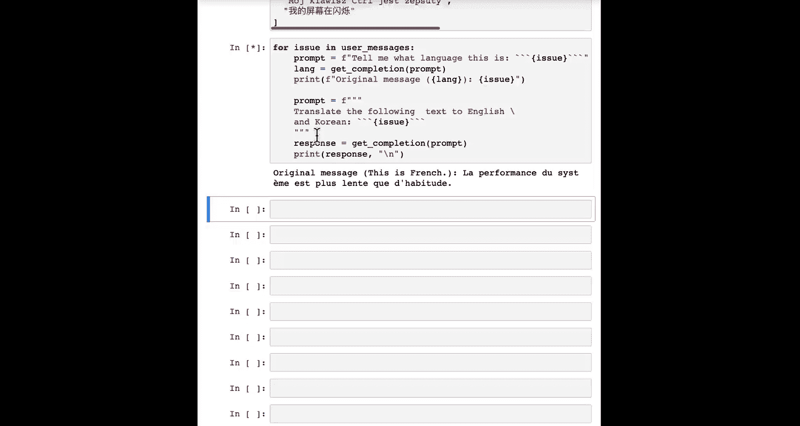

## 构建通用翻译器 🔄

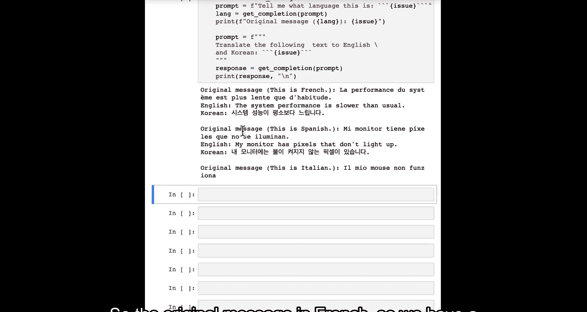

假设我们负责一家跨国电子商务公司的IT支持，用户会用各种语言提交问题。我们需要一个通用翻译器来处理这些消息。

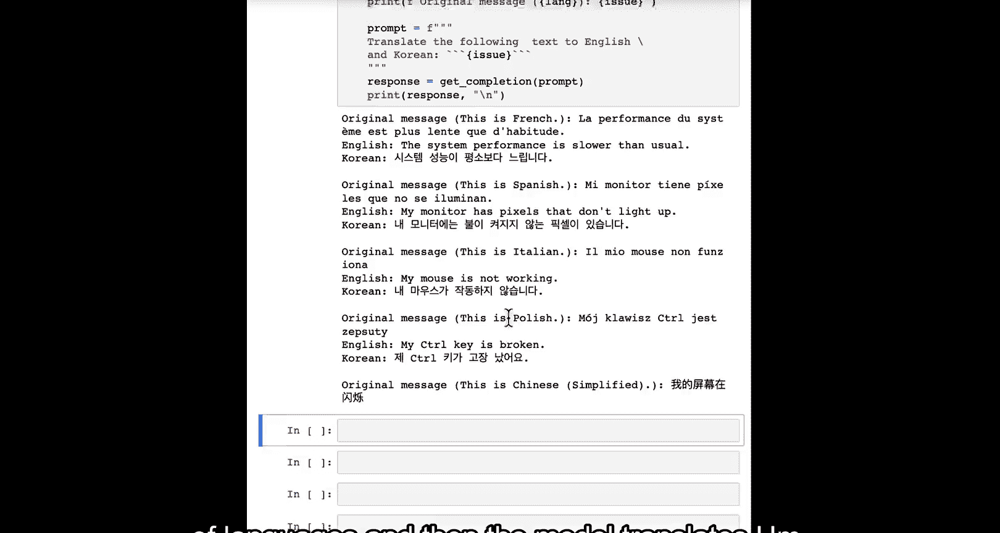

首先，我们创建一个包含多种语言用户消息的列表。

```python
user_messages = [
    "La performance du système est plus lente que d‘habitude.",  # 法语
    "Mi monitor tiene píxeles que no se iluminan.",              # 西班牙语
    "Il mio mouse non funziona",                                 # 意大利语
    "Mój klawisz Ctrl jest zepsuty",                             # 波兰语
    "我的屏幕在闪烁"                                               # 中文
]
```

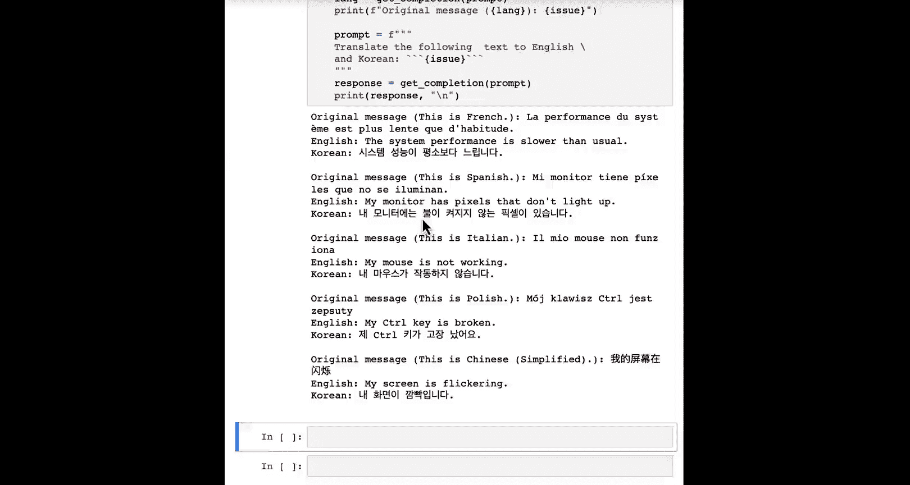

接下来，我们循环处理每条消息，首先让模型识别语言，然后将其翻译成英语和韩语。

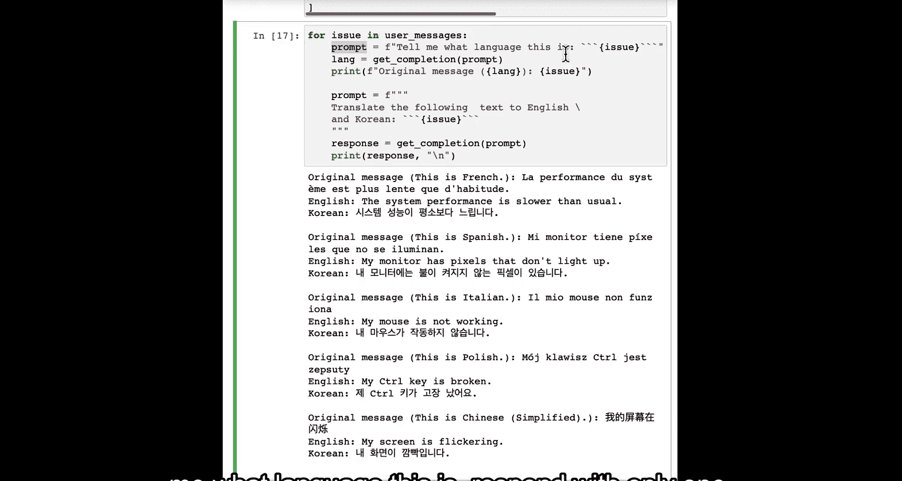

```python
for issue in user_messages:
    prompt = f"""
    以下用户消息是什么语言？只用一个词回答，例如“法语”、“中文”。
    ```{issue}```
    """
    lang = get_completion(prompt)

    prompt = f"""
    将以下消息分别翻译成英语和韩语：
    ```{issue}```
    """
    translation = get_completion(prompt)

    print(f"原始消息 ({lang}): {issue}")
    print(f"翻译: {translation}")
    print("-" * 50)
```

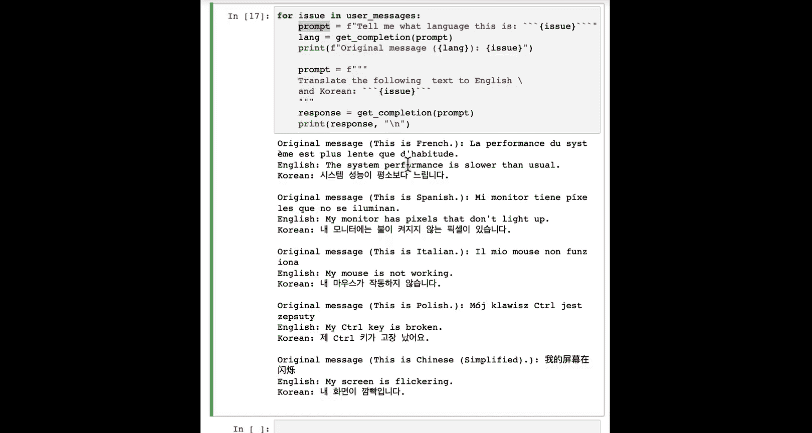

通过这个循环，我们为每条消息获得了语言识别结果以及英、韩双语翻译，从而构建了一个简易的通用翻译器。你可以尝试在列表中添加更多语言进行测试。

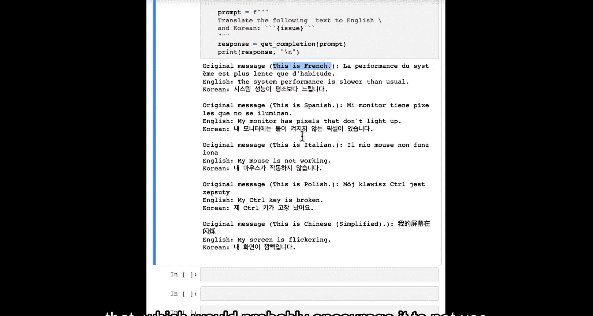

---

## 语气转换 ✍️

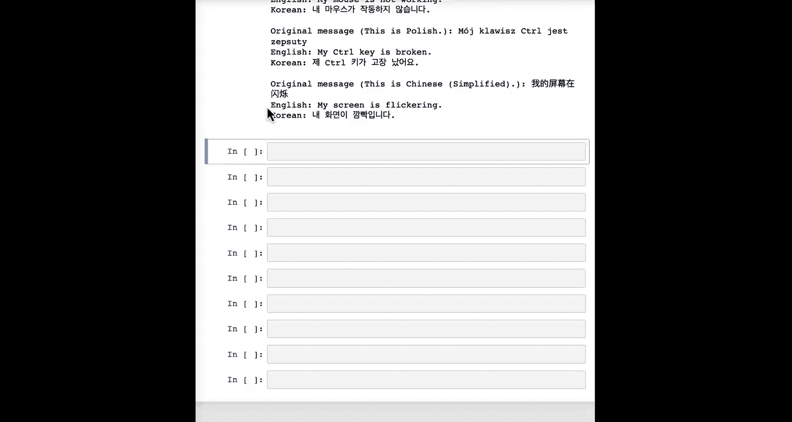

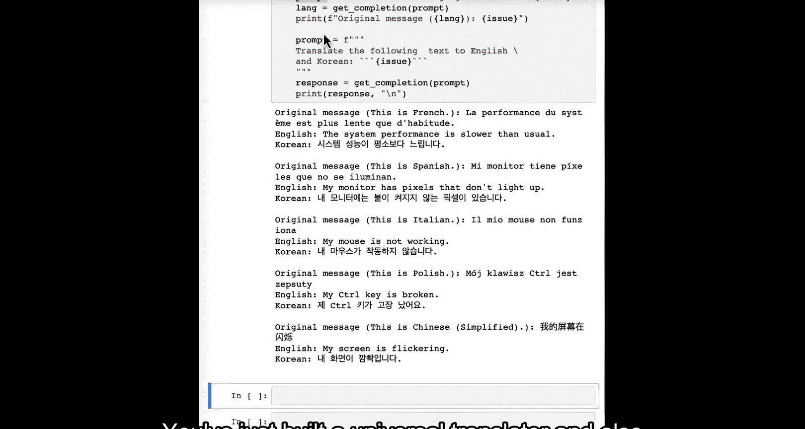

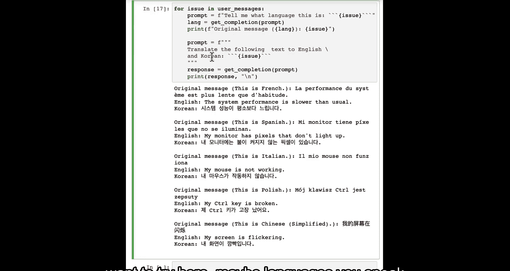

写作风格会根据目标受众而有所不同。例如，写给同事或教授的邮件与发给弟弟的短信在语气上会有明显差异。ChatGPT可以帮助生成不同语气的文本。

### 从俚语转换为商务信函

以下示例展示了如何将随意的俚语转换为正式的商务信函语气。

```python
prompt = """
将以下从俚语转换为商务信函：
```Dude, This is Joe, check out this spec on the standing lamp.```
"""
response = get_completion(prompt)
print(response)
```

转换后的文本会变得非常正式，例如：“Dear Colleague, This is Joe. Please review the specification document for the standing lamp.”

---

## 格式转换 📄

ChatGPT非常擅长在不同格式之间进行转换，例如从JSON到HTML、XML到Markdown等。

### JSON 转 HTML 表格

在这个例子中，我们有一个包含餐厅员工信息的JSON字典，需要将其转换为带有列标题的HTML表格。

```python
data_json = {
    "restaurant employees": [
        {"name": "Shyam", "email": "shyamjaiswal@gmail.com"},
        {"name": "Bob", "email": "bob32@gmail.com"},
        {"name": "Jai", "email": "jai87@gmail.com"}
    ]
}

prompt = f"""
将以下Python字典从JSON转换为带有列标题和表头的HTML表格：
```{data_json}```
"""
response = get_completion(prompt)
print(response)

# 如果你想在Jupyter Notebook中查看渲染后的HTML表格，可以使用：
from IPython.display import display, HTML
display(HTML(response))
```

执行后，你会得到一个格式良好的HTML表格代码，并可以直观地看到表格效果。

---

## 拼写检查与语法校正 ✅

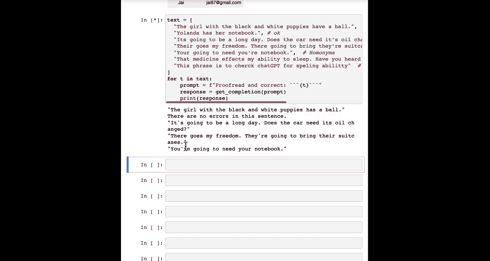

这是ChatGPT一个非常流行的用途，尤其适用于非母语写作者。它可以帮助纠正常见的语法和拼写错误。

### 基础校对

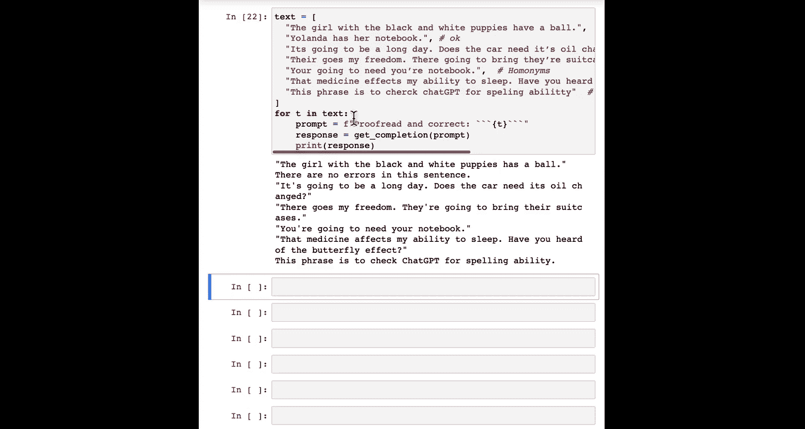

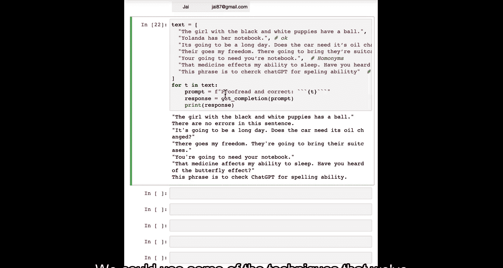

我们首先创建一个包含一些错误句子的列表，然后让模型进行校对和纠正。

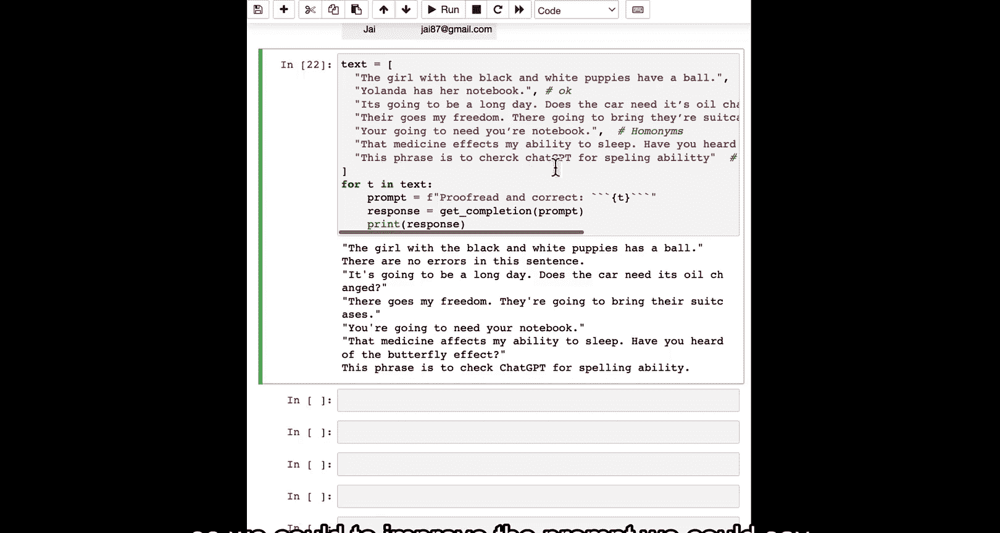

```python
texts = [
    "The girl with the black and white puppies have a ball.",  # 主谓不一致
    "Yolanda has her notebook.",                               # 正确，用于对比
    "Its going to be a long day. Does the car need it’s oil changed?",  # 同音词错误
    "Their goes my freedom. There going to bring they’re suitcases.",   # 同音词错误
]

for text in texts:
    prompt = f"""校对并纠正以下文本。如果未发现错误，请说“未发现错误”。
    ```{text}```
    """
    response = get_completion(prompt)
    print(f"原始文本: {text}")
    print(f"纠正后: {response}")
    print()
```

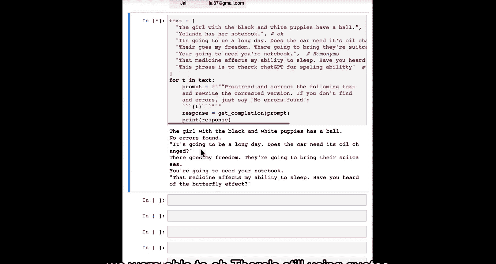

模型能够成功纠正这些句子中的语法错误。

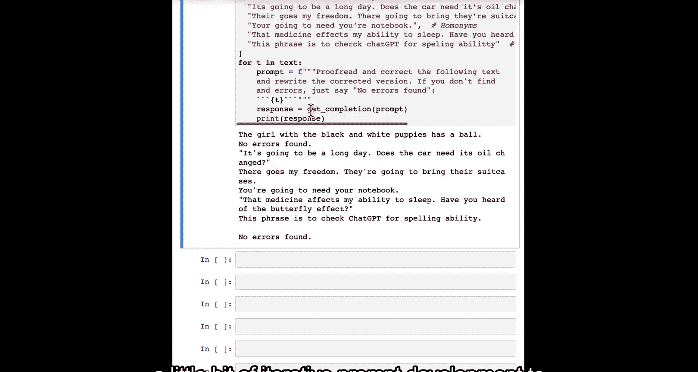

### 高级校对与风格转换

我们还可以要求模型进行更彻底的修改，例如改变文本语气、使其更吸引人，并遵循特定的写作风格（如APA格式）。

以下示例中，我们要求模型校对一篇产品评论，使其更引人入胜，符合APA风格，面向高级读者，并以Markdown格式输出。

```python
review = """
Got this panda plush toy for my daughter‘s birthday, \
who loves it and takes it everywhere. It‘s soft and \ 
super cute, and its face has a friendly look. It‘s \ 
a bit small for what I paid though. I think there \ 
might be other options that are bigger for the \ 
same price. It arrived a day earlier than expected, \ 
so I got to play with it myself before I gave it \ 
to her.
"""

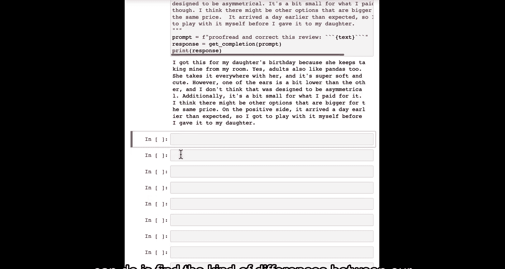

prompt = f"""
针对以下产品评论：
1. 进行校对和纠正。
2. 使其更具说服力。
3. 确保其遵循APA风格。
4. 面向高级读者。
请以Markdown格式输出最终结果。

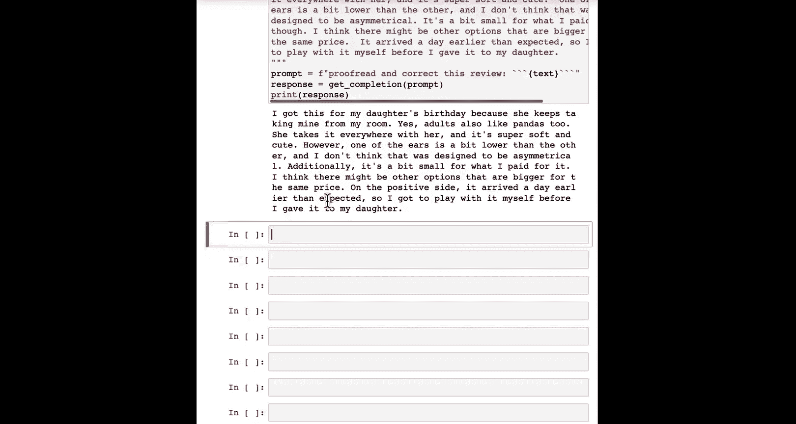

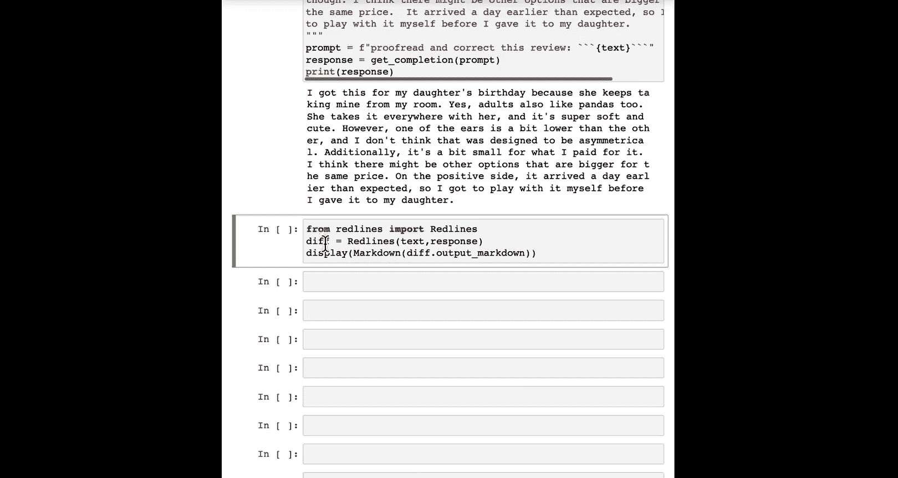

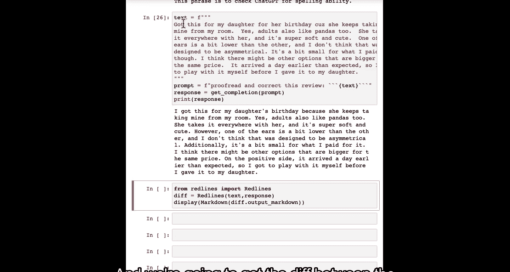

产品评论：```{review}```
"""
response = get_completion(prompt)
print(response)
```

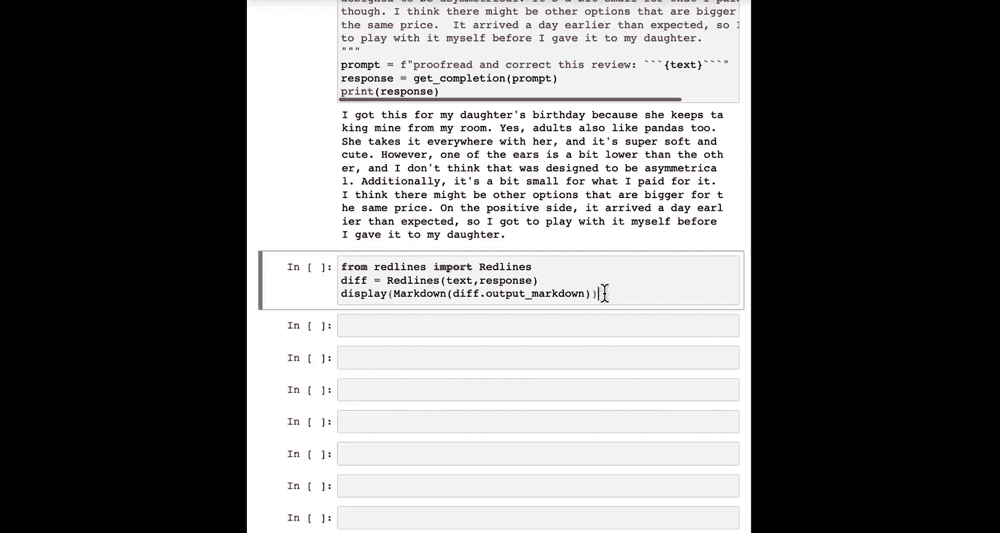

执行后，你会得到一篇经过润色、格式规范、语气专业的评论。

为了更直观地看到修改之处，我们可以使用`redlines`库来比较原始文本和模型输出之间的差异。

```python
# 需要先安装 redlines: pip install redlines
from redlines import Redlines
from IPython.display import display, Markdown

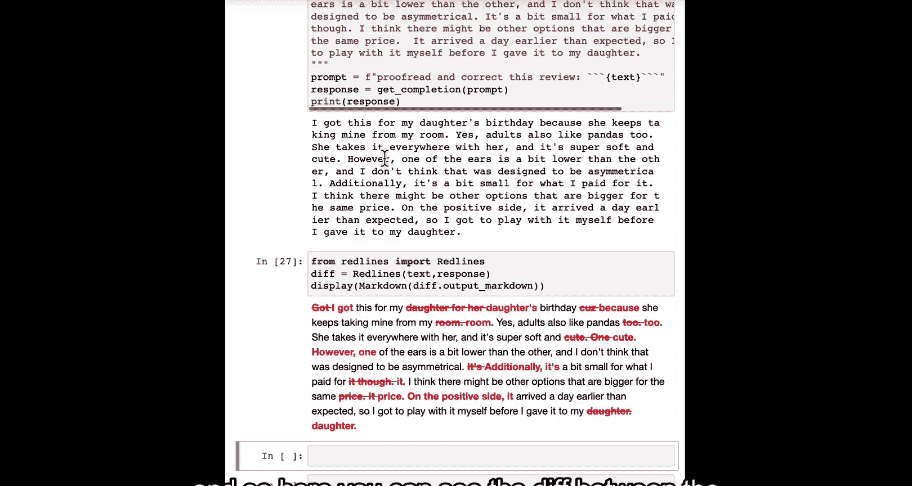

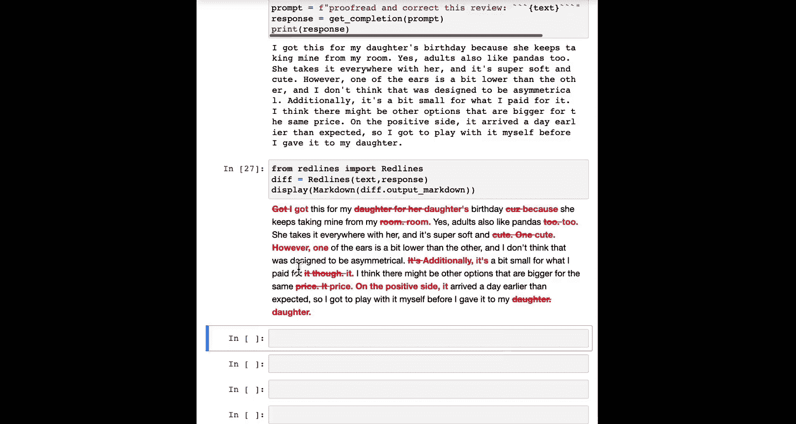

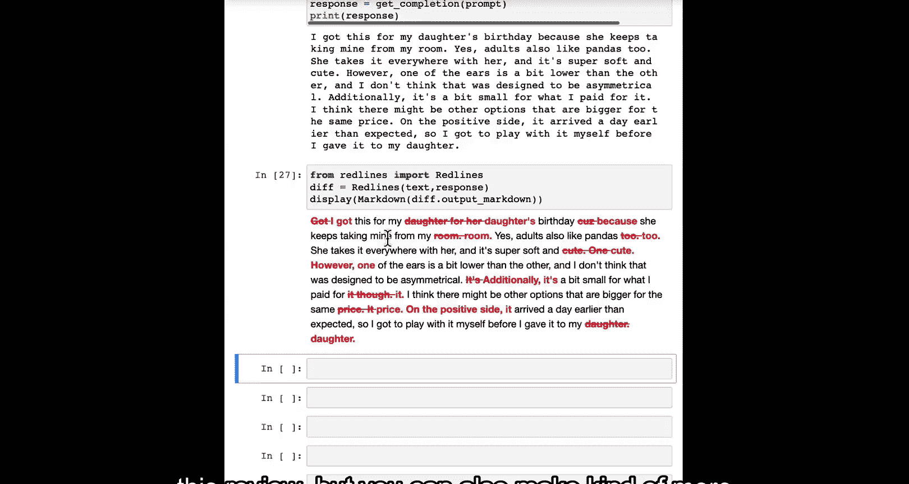

diff = Redlines(review, response)
display(Markdown(diff.output_markdown))
```

这将高亮显示所有被修改、添加或删除的部分。

---

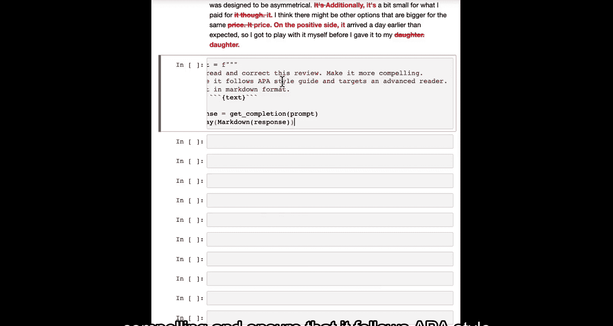

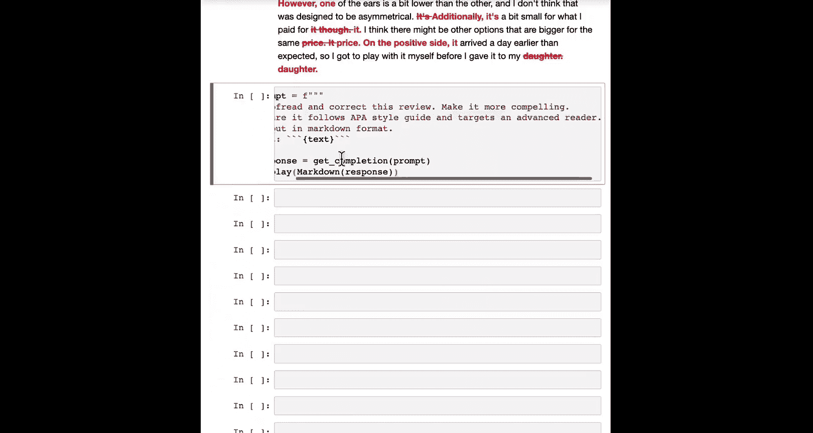

## 总结 📝

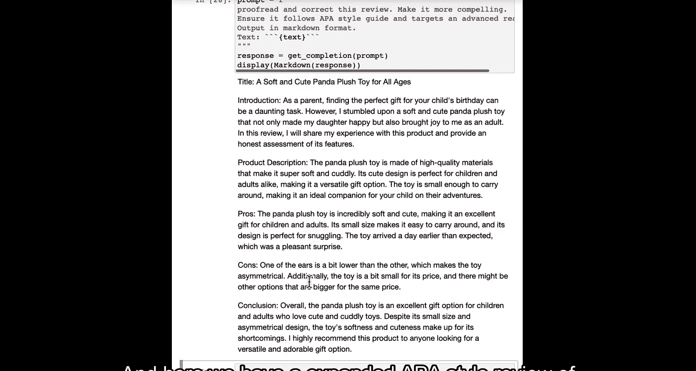

在本节课中，我们一起探索了大型语言模型在**转换任务**上的多种应用。我们学习了如何利用提示词引导模型完成：
*   **翻译**：包括基础翻译、语言识别、多语言翻译以及区分正式与非正式语气。
*   **语气转换**：例如将随意的俚语转换为正式的商务信函。
*   **格式转换**：例如将JSON数据转换为HTML表格。
*   **拼写与语法校正**：从基础纠错到结合特定风格（如APA）的高级润色。

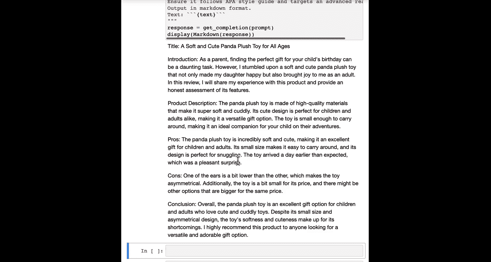

通过这些示例，我们可以看到，过去需要复杂编程才能实现的功能，现在通过精心设计的提示词和大型语言模型就能轻松完成。掌握这些转换技巧，能极大提升你在处理多语言内容、调整文本风格或格式化数据时的工作效率。

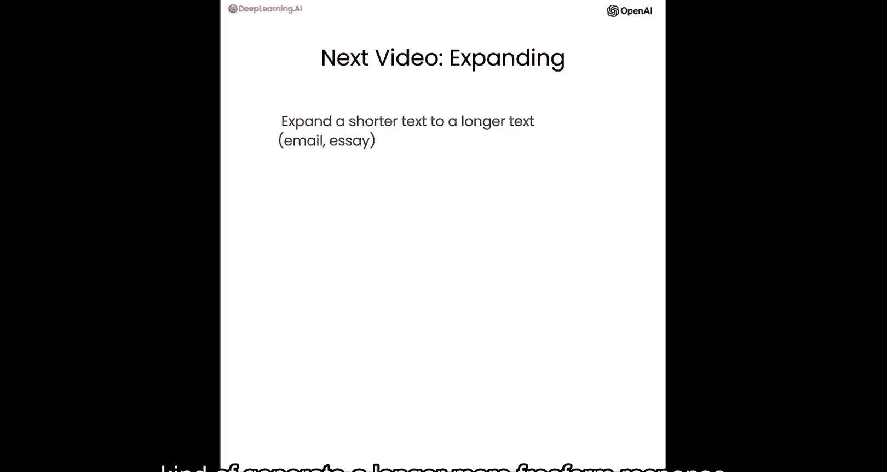

下一节课，我们将进入“扩展”任务的学习，看看如何从一个简短的提示出发，让模型生成更长、更自由的回应。