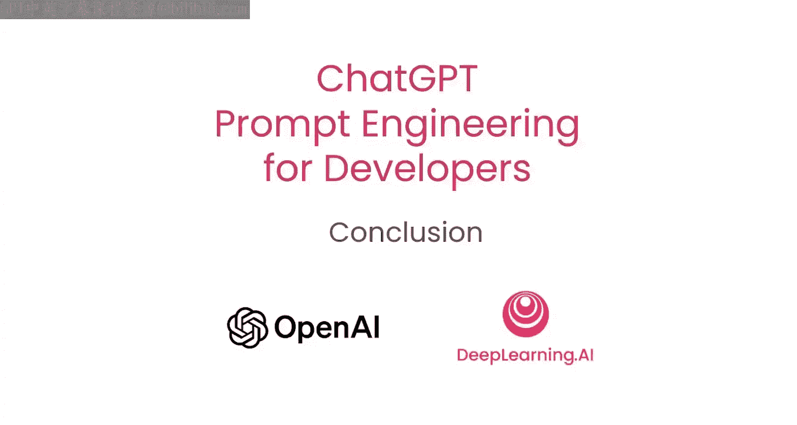
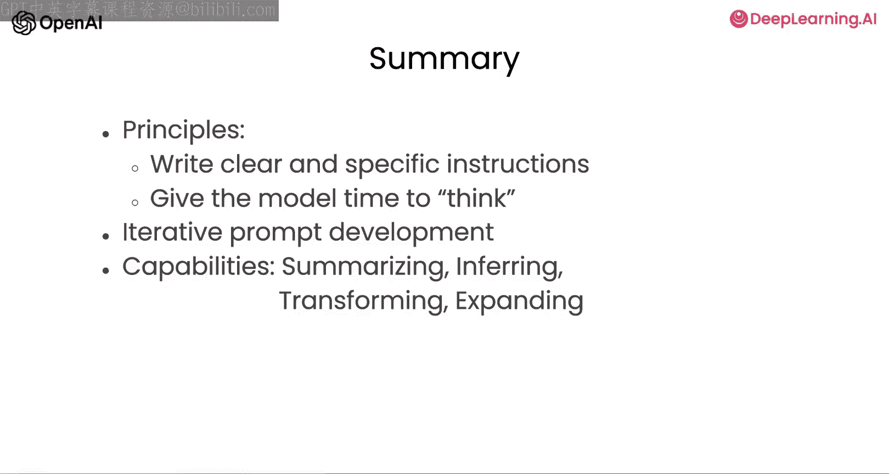

# 008：总结与展望 🎉

在本节课中，我们将对《面向开发者的ChatGPT提示工程》课程进行总结，回顾所学核心知识，并展望如何应用这些技能构建自己的项目。

恭喜你完成了这门简短课程的学习。总的来说，在这门课程中，你学到了关于提示工程的两个关键原则：**编写清晰、具体的指令**，以及在适当的时候**给予模型充分的思考时间**。你还学习了迭代式提示开发流程，并理解了通过系统化流程找到适合你应用程序的提示语是关键所在。

我们探讨了大语言模型在多种应用场景中有用的几项核心能力，特别是**总结**、**推断**、**转换**和**扩展**。此外，你也看到了如何构建一个**自定义聊天机器人**。

在如此短的一门课程中，你学到了很多内容。希望你享受学习这些材料的过程。我们希望你现在能想出一些可以自己构建的应用程序创意。

请去尝试实践，并告诉我们你的成果。任何应用都不嫌小。从一个非常小的项目开始完全可以，它可能只有一点实用性，或者甚至根本没用，只是有趣而已。我发现摆弄这些模型实际上真的很有趣。所以，去玩一玩吧。我同意，这是一个很好的周末活动，这是经验之谈。😊

请利用你从第一个项目中学到的经验，去构建一个更好的第二个项目，或许还能有更好的第三个项目，依此类推。我自己在使用这些模型的过程中也是这样逐步成长的。或者，如果你已经有一个更大的项目想法，那就直接去做吧。

提醒一下，这类大语言模型是一项非常强大的技术。因此，我们恳请你负责任地使用它们，并且只构建那些会产生积极影响的东西。我完全同意。我认为在这个时代，构建人工智能系统的人可以对他人产生巨大影响。因此，我们所有人都只负责任地使用这些工具比以往任何时候都更加重要。

我认为，基于大语言模型构建应用程序是一个非常令人兴奋且正在蓬勃发展的领域。现在你完成了这门课程，我认为你已经拥有了丰富的知识，可以构建出当今很少有人知道如何构建的东西。因此，我也希望你帮助我们传播这个课程，鼓励其他人也来学习。😊

最后，希望你喜欢这门课程，感谢你完成了学习。我和E都期待听到你将要创造的惊人成果。😊

---

**本节课总结**

本节课中我们一起回顾了课程的核心要点：
1.  **两大提示原则**：清晰具体与给予时间。
2.  **迭代开发流程**：找到合适提示的系统方法。
3.  **四大核心能力**：总结、推断、转换、扩展。
4.  **实践应用**：构建自定义聊天机器人。

课程鼓励你将所学知识付诸实践，从简单的项目开始，迭代改进，并始终以负责任的态度使用这项强大的技术。现在，你已具备在这个快速发展的领域中构建应用的知识基础。