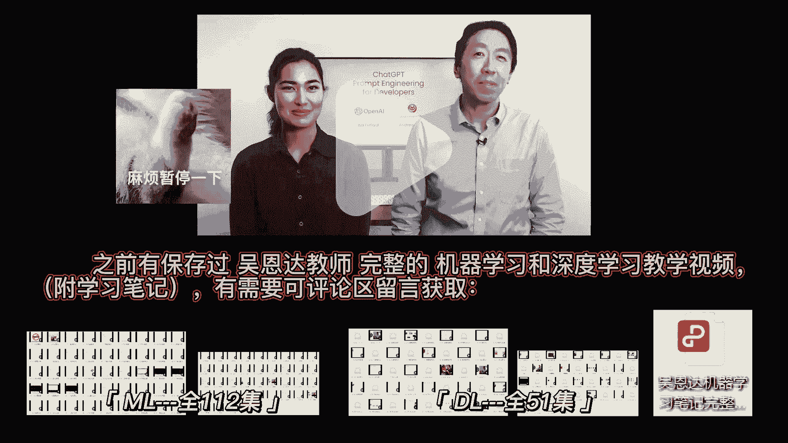
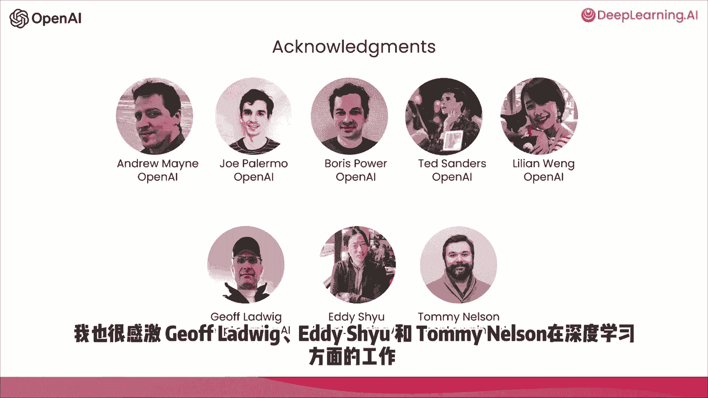

# 001：第1集 引言 🎬

在本节课中，我们将要学习大型语言模型（LLM）的基本概念，以及如何通过有效的提示工程来构建应用程序。课程将重点介绍指令调优型语言模型的最佳实践，并解释其相对于基础语言模型的优势。

---

欢迎来到面向开发人员的提示工程课程。Isaac 很高兴能与来自 OpenAI 的技术专家共同教授这门课程。她参与开发了流行的 ChatGPT 检索插件，其主要工作是教导人们如何在产品中应用 LLM 技术。她也是 OpenAI Cookbook 的贡献者，该资源旨在指导人们使用这些技术。很高兴她能参与教学，Isaac 也很高兴在此与大家分享一些鼓舞人心的最佳实践。

网络上存在大量关于提示的材料，例如“30个必知提示”这类文章。这些内容大多集中在 ChatGPT 的 Web 用户界面上，用于完成特定的、通常是一次性的任务。然而，我认为 LLM 对于开发者的真正力量在于：**通过 API 调用快速构建软件应用程序**。这一点目前仍然被低估。

事实上，我在 AI Fund（DeepLearning.AI 的姊妹公司）的团队一直在与众多初创公司合作，将这项技术应用于各种场景。我们看到，**LLM API 能让开发者极其快速地构建应用**。

因此，在本课程中，我们将与大家分享这些技术的可能性以及实现它们的最佳实践。我们将涵盖大量内容。

以下是本课程的主要学习路径：
*   您将首先学习软件开发中的一些最佳实践。
*   接着，我们将介绍几个常见的用例，包括：总结、推断、转换和扩展。
*   最后，您将使用 LLM 构建一个聊天机器人。

我们希望这能激发您对构建新型应用程序的想象力。

在大型语言模型的发展中，大致存在两种类型，我们称之为**基础 LLM** 和**指令调优 LLM**。

*   **基础 LLM** 基于文本训练数据预测下一个词。它通常在互联网等来源的大量数据上进行训练，以找出下一个最可能出现的词。例如，如果提示“从前，有一只独角兽”，它可能会补全为“它和所有独角兽朋友一起生活在一个神奇的森林里”。如果提示“法国的首都是”，它可能会根据网络文章补全为“法国最大的城市”或“法国的人口是？”，因为网络上的文章可能是关于法国的问答列表。
*   **指令调优 LLM** 则是当前研究和应用的主要方向。它被训练来遵循指令。例如，如果你问“法国的首都是什么？”，它更可能输出“法国的首都是巴黎”。

指令调优 LLM 的典型训练方式是：首先训练一个基础 LLM，然后使用**输入为指令、输出为遵循该指令的结果**的示例对其进行**微调**。之后，通常会采用一种称为 **RLHF（基于人类反馈的强化学习）** 的技术进一步改进，使系统更能提供帮助并遵循指令。

因为指令调优 LLM 被训练得乐于助人、诚实且无害，所以与基础 LLM 相比，它们输出有问题文本（如有毒内容）的可能性更低。许多实际应用场景已转向使用指令调优 LLM。

您在互联网上找到的一些最佳实践可能更适用于基础 LLM。但对于当今大多数实际应用，我们建议大多数人将重点放在指令调优 LLM 上。它们更易于使用，并且由于 OpenAI 及其他公司的努力，正变得更加安全、一致。因此，本课程将侧重于指令调优 LLM 的最佳实践。

在继续之前，我们建议您在大多数应用中使用指令调优 LLM。

Isaac 想感谢 OpenAI 和 DeepLearning.AI 的团队，他们帮助准备和展示了这些材料。特别感谢 Andrew Main、Joe Palermo、Boris Power、Ted Sanders、Lilian Weng 以及 OpenAI 的许多同事，他们共同构思、审查并整理了这门短期课程的材料。同时，也感谢 DeepLearning.AI 的 Geoff Ludwick、Eddy Shyu 和 Tommy Nelson 所做的工作。

当您使用指令调优 LLM 时，可以将其想象成在给一个聪明但不知晓您任务细节的人下达指令。因此，如果 LLM 未能按预期工作，有时是因为指令不够清晰。

例如，如果您说“请为我写一些关于艾伦·图灵的内容”，那么明确您希望文本侧重于他的科学工作、个人生活还是历史角色会更有帮助。同样，指定文本的语气（如专业记者风格还是随意便条风格）也很重要。

这就像您去找一位朋友帮忙。如果您能提前指定他们应该阅读哪些文本片段来撰写关于艾伦·图灵的文章，那么这位刚毕业的大学生助手就更有可能成功完成任务。

因此，在下一个视频中，您将看到**如何做到清晰和具体**，这是提示 LLM 的一个重要原则。您还将学习第二个激励原则：**给 LLM 时间进行思考**。

---

本节课中，我们一起学习了大型语言模型的基础与指令调优模型之间的区别，并理解了为何指令调优模型更适合大多数实际应用。我们还了解到，有效的提示类似于向一个聪明但需要明确指引的助手下达清晰的指令。下一节，我们将深入探讨如何构建清晰、具体的提示。