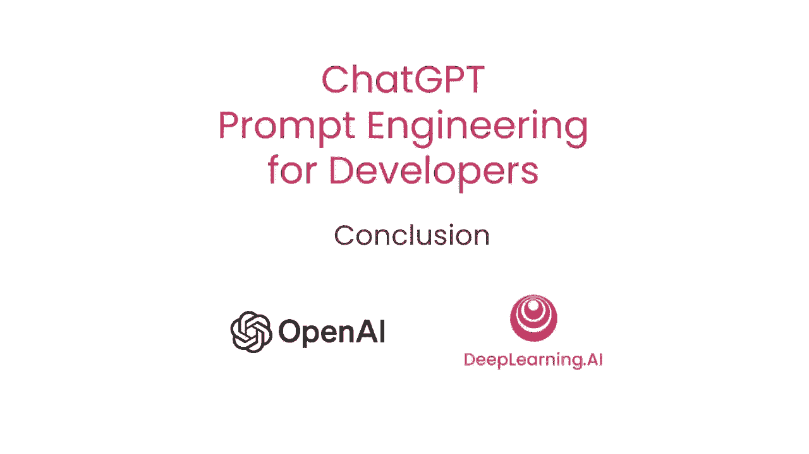
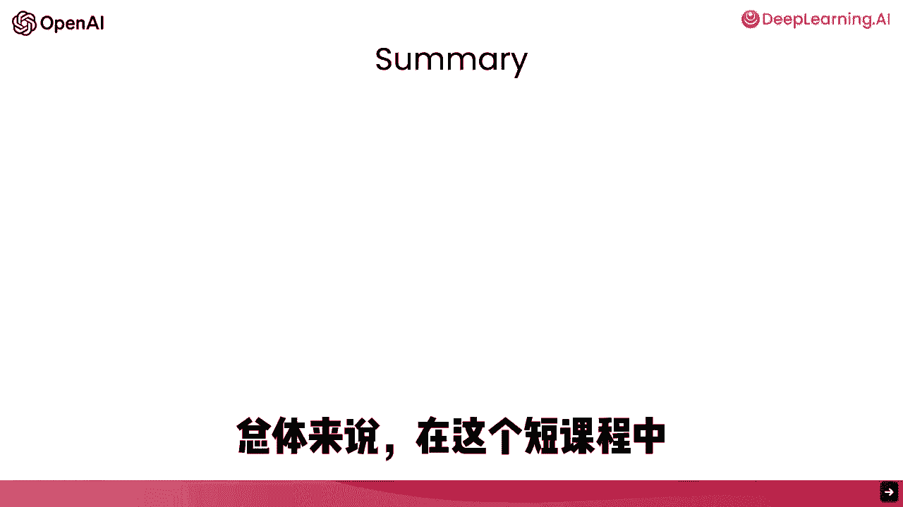
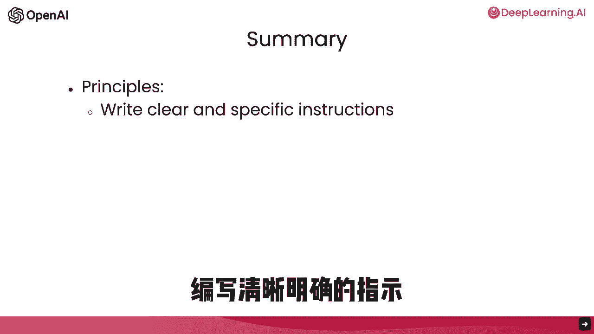
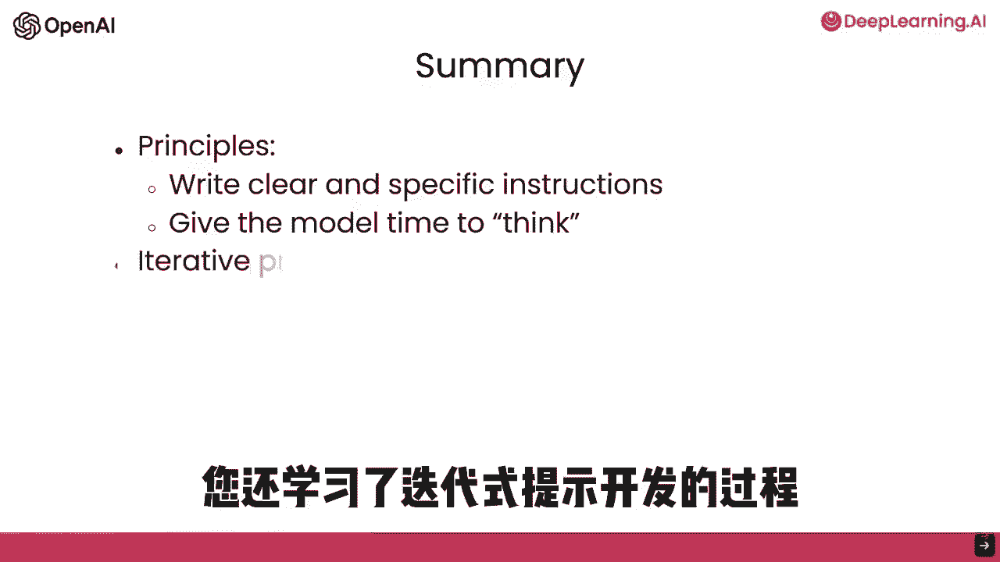
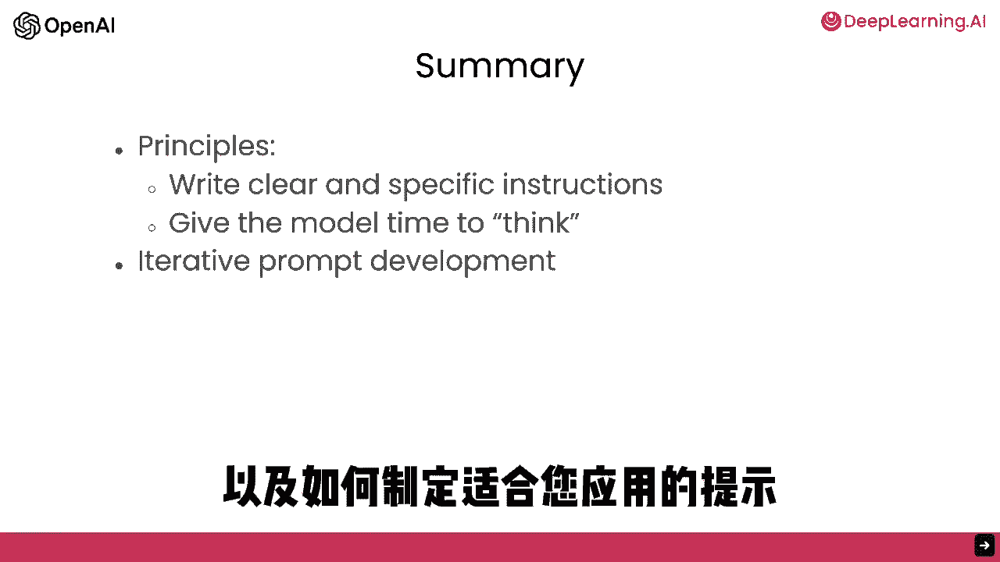
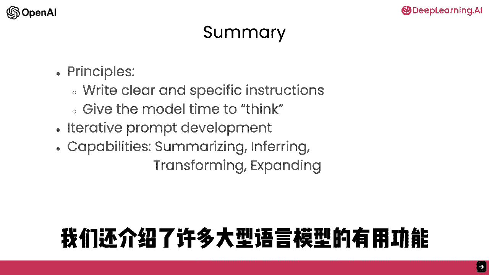
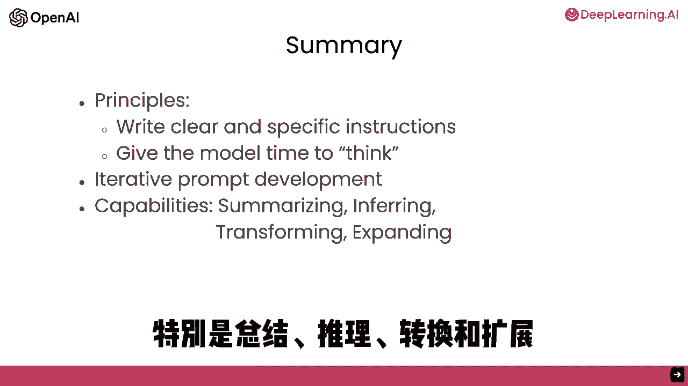

# 009：总结与展望

在本节课中，我们将对《ChatGPT提示词工程师》短课程的核心内容进行总结，并展望如何将所学知识应用于实际项目开发中。

---

祝贺你完成这门短课程。

在这门短课程中，你学习了两种关键的提示原则：**写清晰具体的指令**，以及在适当情况下**给模型充足的思考时间**。

上一节我们回顾了核心的提示原则，本节中我们来看看另一个关键的学习点。

你还学习了**迭代提示开发**的过程。以下是其核心思想：
*   找到一个正确的提示词，对于你的具体应用至关重要。

---

我们还浏览了大型语言模型的一些实用功能。

以下是四个主要的功能方向：
*   **总结**：将长文本浓缩为简短摘要。
*   **推理**：识别文本中的情感、主题等。
*   **转换**：如翻译、语气调整、格式转换等。
*   **扩展**：根据简短提示生成更长、更丰富的文本。

---

你也看到了如何构建自定义聊天机器人。

你在一节课中学到了很多内容。我们希望这些材料能激发你构建自己应用的想法。

请尝试并告诉我们你的想法。没有应用是微不足道的。

从一个小项目开始就很好。它可以有一点实用性，或者仅仅是有趣。我发现探索这些模型本身就充满乐趣。

所以，去实践吧。这是一个很好的周末活动。

---

请将你第一个项目的经验，用于构建更好的第二个、第三个项目。这就是我个人使用这些模型成长的方式。

如果你已经有一个更大的项目想法，那就直接开始吧。

---

需要提醒的是，大型语言模型是非常强大的技术。

因此，我们要求你负责任地使用它们，并且只构建那些能产生积极影响的应用。

我完全同意。在这个时代，构建人工智能系统的人可以对他人产生巨大影响。因此，我们所有人都有责任比以往更负责任地使用这些工具。

---

我认为构建基于大型语言模型的应用是一个令人兴奋且不断发展的领域。

现在你已经完成了这门课程，你拥有了丰富的知识，能够构建出当前只有少数人掌握如何构建的东西。

希望你也帮助我们宣传，鼓励他人参加这门课程。

最后，希望你学得开心。感谢你完成这门课程。

---

**本节课总结**

在本节课中，我们一起回顾了整个课程的核心要点：两大提示原则、迭代开发流程以及大模型的四大核心功能（总结、推理、转换、扩展）。我们鼓励你将所学知识付诸实践，从小项目开始，负责任地构建有积极影响的应用，并在这个令人兴奋的领域中持续学习和成长。