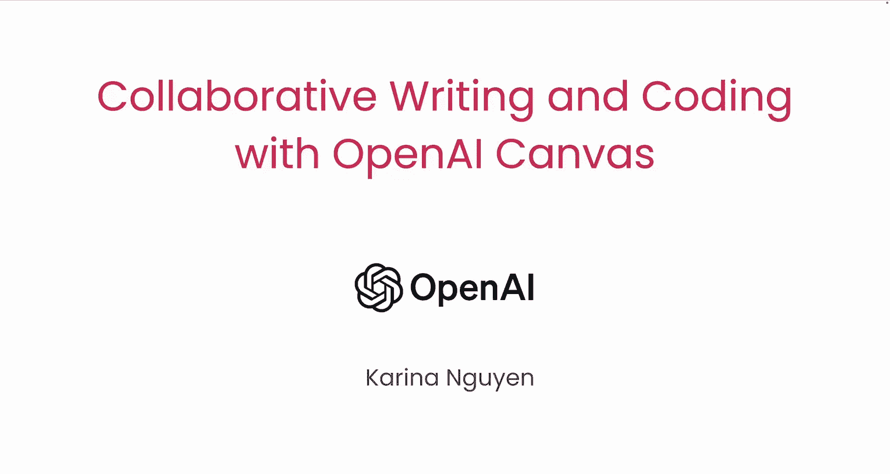
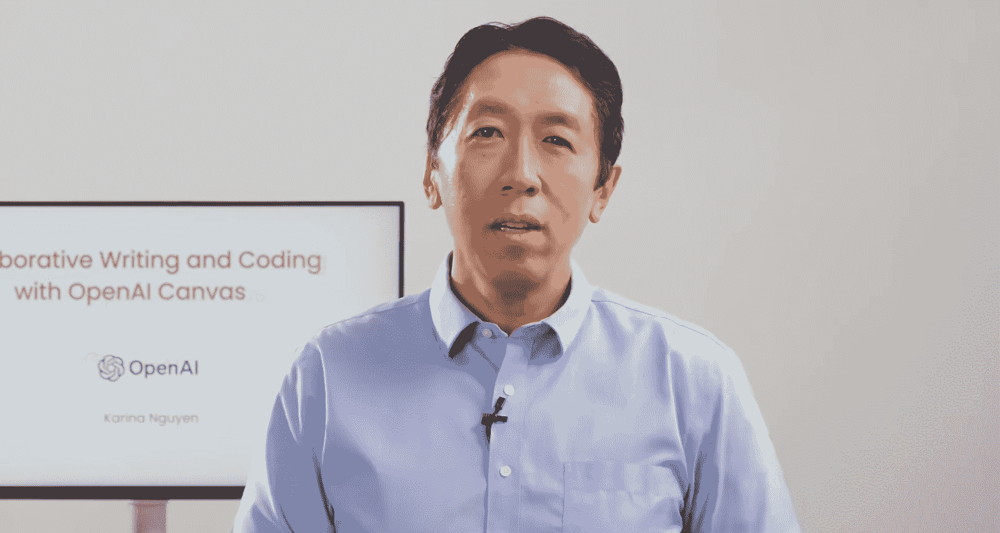
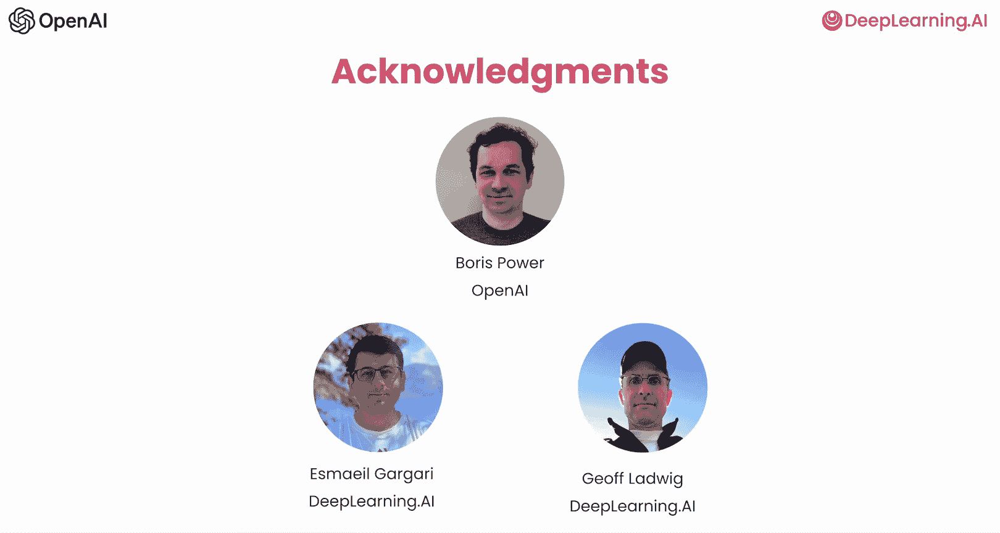

# 001：课程介绍

## 概述

在本节课中，我们将要学习一个由OpenAI与DeepLearning.AI合作推出的新工具——OpenAI Canvas。这是一个旨在让与AI协作进行写作和编程变得更加有趣和高效的简短入门课程。

## 什么是OpenAI Canvas？🎨

OpenAI Canvas是一个全新的交互界面。它提供了一个并排的工作空间，让你能够与ChatGPT并肩协作，共同编辑和完善文本或代码。这种设计使得头脑风暴、起草文稿以及迭代修改文本的过程变得更加自然和高效。

## 课程内容与目标 🎯

在本课程中，你将学习如何使用Canvas进行写作和编程。课程讲师Corinina Nuen是Canvas的联合创造者之一。

### Canvas在写作中的应用

对于写作，Canvas让与AI协作变得更加轻松。它允许你高亮文本的特定部分以进行针对性编辑。你还可以调整文本的长度和复杂度。此外，Canvas提供了语法检查和清晰度增强的工具。这些迭代功能使得在Canvas上进行写作更加灵活和高效。

以下是Canvas在写作中的主要功能：
*   **针对性编辑**：高亮文本的特定部分进行修改。
*   **文本调整**：调整文本的长度和复杂度。
*   **语法与清晰度**：应用语法检查并增强文本清晰度。

### Canvas在编程中的应用 💻

许多人已经在使用AI辅助编程。Canvas集成了多种工具，可以帮助你更好、更快地创建代码。

创建代码的第一个版本后，Canvas可以对其进行审查，并提供改进建议。例如，如果你的代码存在语法或逻辑错误，或者可以简化、优化以提高速度，Canvas会为你指出来。讲师本人坦言，他有时懒得写注释，而Canvas在这方面做得非常出色。

它还能通过让你添加日志来辅助调试，使查找和修复问题变得更加容易。另一个特色功能是能够通过几次点击，在不同编程语言（如Python、JavaScript和Java）之间翻译代码。

以下是Canvas在编程中的主要功能：
*   **代码审查与优化**：审查代码，提出简化、加速或修正错误的建议。
*   **自动生成注释**：帮助为代码生成注释。
*   **调试辅助**：通过添加日志辅助调试。
*   **代码翻译**：在不同编程语言间快速翻译代码。

## 实践项目与深入探索 🚀

你将通过创建像“太空飞船”这样的游戏，深入学习所有这些功能是如何工作的。你还将看到如何利用一张图片——比如一张数据库架构图——作为输入，让Canvas为你编写代码来实现该架构，并针对它编写SQL查询。

我们还将深入幕后，探讨训练一个能够创建像Canvas这样的界面模型需要什么。课程也会简要介绍使用合成数据来开发此类模型的最佳实践。

## 致谢与结语

许多人共同努力创建了这门课程。感谢来自OpenAI的Boris Power，以及来自DeepLearning.AI的Ashshb Gagari和Jeff Ladwig，他们也为本课程做出了贡献。

这门课程将会非常有趣。让我们进入下一个视频，正式开始学习吧！

## 总结

本节课我们一起学习了OpenAI Canvas的基本介绍。我们了解到Canvas是一个并排协作的AI工作空间，能显著提升写作和编程的效率和乐趣。在写作方面，它支持针对性编辑和文本优化；在编程方面，它提供代码审查、调试辅助和跨语言翻译等功能。接下来，我们将通过实际项目来深入探索这些功能。