# 002：协作写作 ✍️

在本节课中，我们将学习如何使用Canvas的交互式工具，使你的写作过程更加灵活、高效且充满乐趣。我们将从基础搜索开始，逐步探索如何利用Canvas进行内容创作、格式转换、风格调整，甚至生成图像和代码。

---

## 概述

本节课将演示如何利用Canvas工具进行协作式写作。我们将从一个具体的搜索任务开始，生成一篇研究文章，并展示如何通过Canvas的各种功能（如验证信息、调整文本、转换格式、生成图像等）来完善和丰富内容。之后，我们会将同样的工具应用于一个不同的场景——策划邀请邮件，并最终探索如何将Canvas用于分析图表和生成代码。

---

## 从搜索到文章创作

首先，我们使用Canvas内置的搜索工具，以要点形式查找梵高的绘画技巧。

以下是搜索到的结果要点：
*   厚涂法
*   点彩画法
*   **透视缩短法**

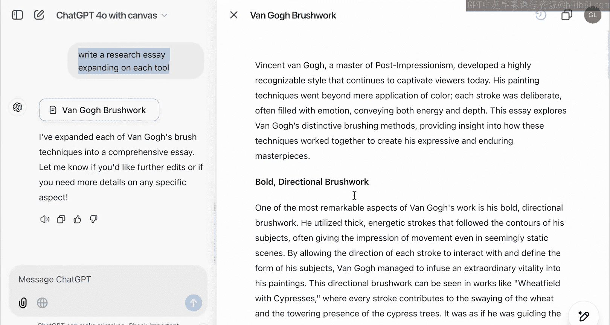

搜索完成后，我们可以要求模型基于这些要点扩展撰写一篇研究文章。

现在，我们看到模型已经在Canvas中创建了一篇包含这些内容的文章。

Canvas的一个功能是，我们可以直接在画布内选中文本，然后向ChatGPT提问。现在，我要求使用网络搜索工具来验证其中一项说法。

模型正在搜索网络以澄清和验证该说法，并会引用来源。

---

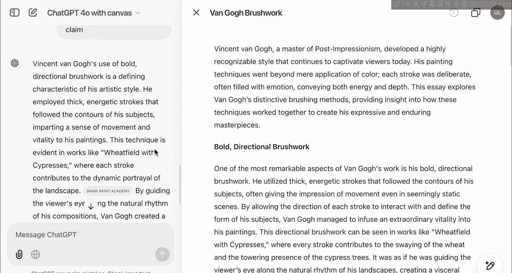

## 调整文本风格与长度

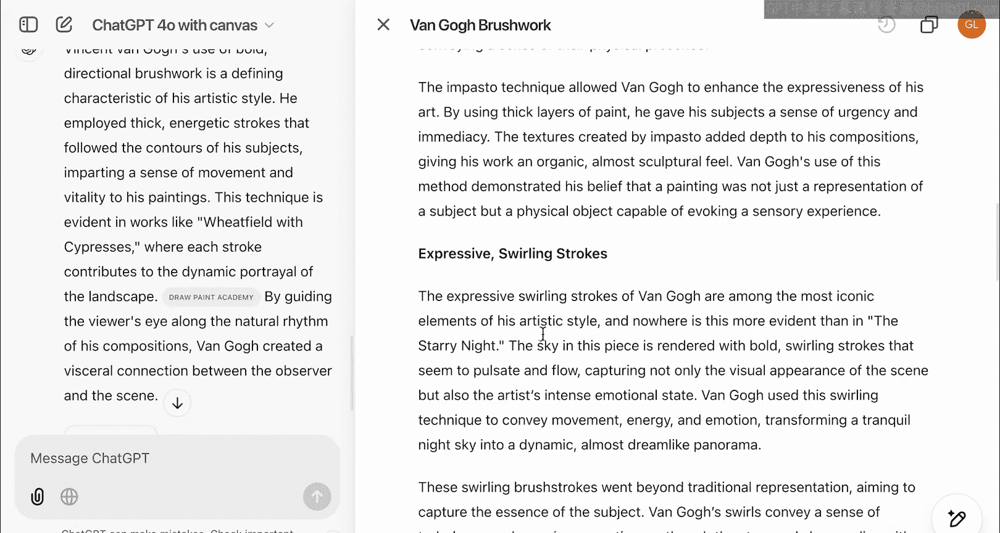

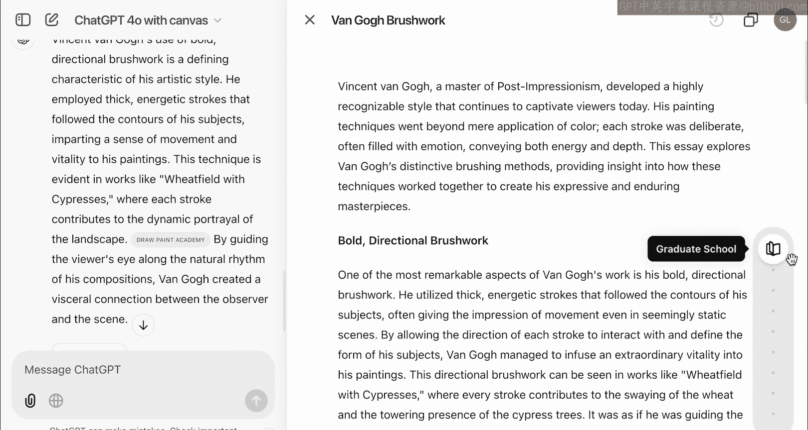

Canvas的另一个功能是使用滑块作为快速自动化工具，来调整文本长度或改变阅读难度。

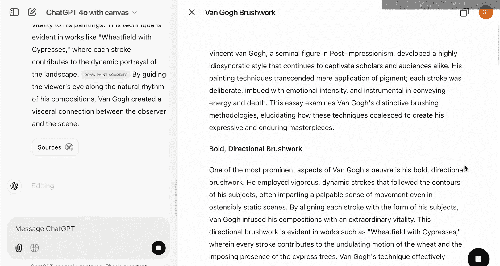

如果你点击“阅读等级”，会看到一个滑块，可以从幼儿园水平一直调整到研究生院水平。我们尝试将其设置为研究生院级别。

模型将开始重写文档，以适应研究生院的新风格。

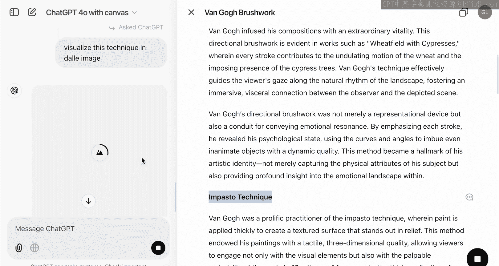

你还可以突出显示特定文本，并要求ChatGPT在DALL·E中可视化这项技术。

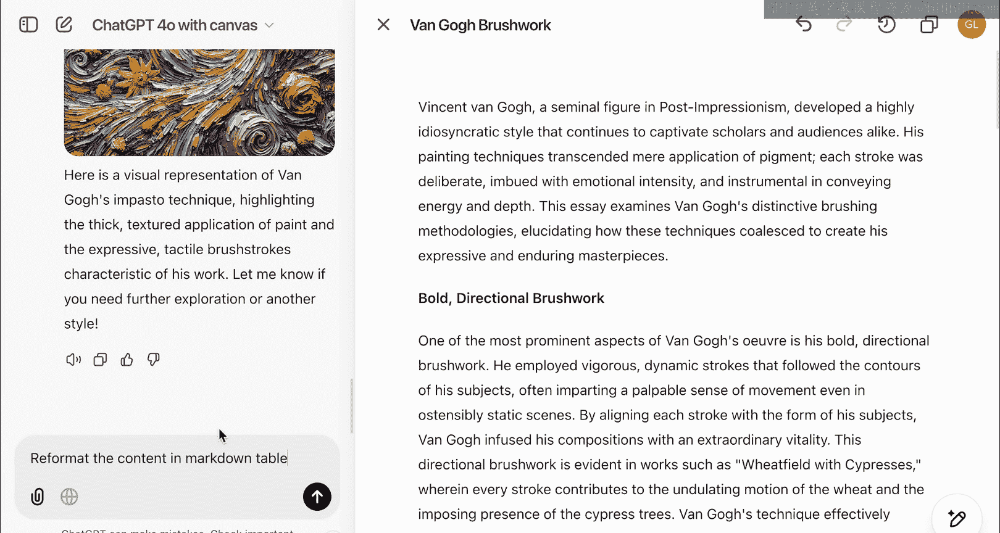

ChatGPT会尝试创建这项技术的DALL·E图像来进行可视化。如图所示，它使用了“厚涂法”技术来可视化其效果。

---

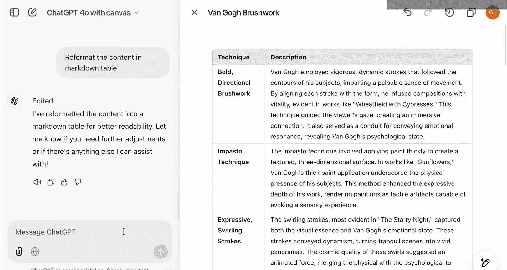

## 转换内容格式

我们可以要求模型根据需求重新格式化内容。这里，我要求将其放入Markdown表格中。

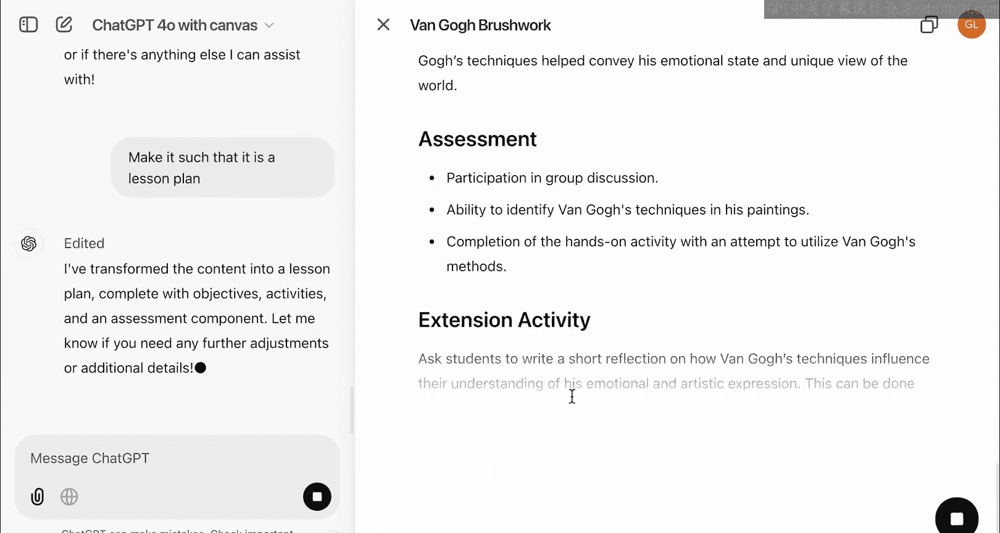

模型会自动将内容转换为Markdown表格。

我还可以要求将内容变得更像一堂课或一个教程。

Canvas模型将重新格式化或转换内容，使其更像一个课程计划。

由此可见，Canvas工具可用于转换格式、改变阅读等级。你也可以调整长度使其更短，从而实现对内容生成和与模型协作更精细的控制。

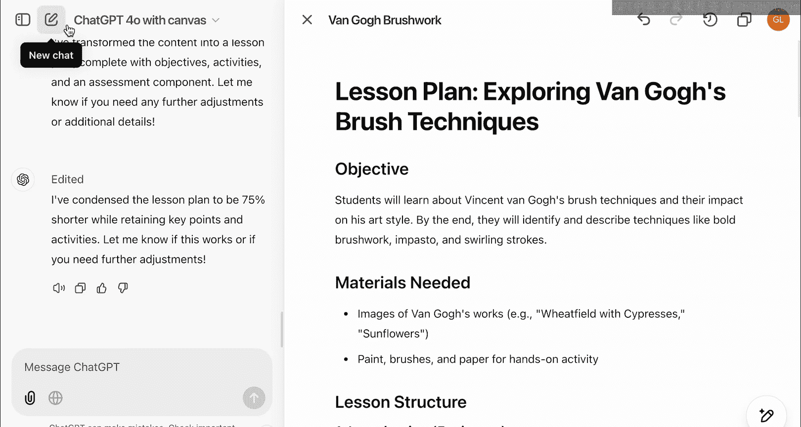

---

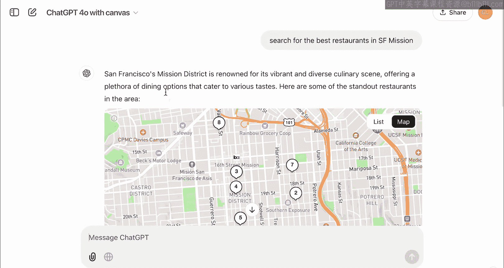

## 应用场景切换：策划邀请

看过了内容创作的例子，接下来我们进行一个非常相似但用例不同的操作。假设你在旧金山，想邀请朋友去该地区最好的餐厅。

我们让ChatGPT搜索旧金山使命区最好的餐厅。

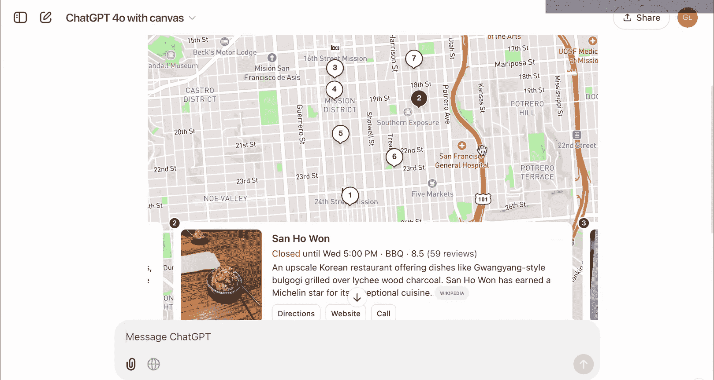

模型搜索了多个网站，并创建了一个交互式可视化列表，展示了各个地点。

我们可以浏览并选择想邀请朋友去的那一家。假设我想邀请朋友去吃韩国菜。

现在，我可以要求模型使用Canvas写一封邀请朋友去“San Hoan”餐厅的邮件。

模型将开始创建邮件。我也可以直接编辑内容本身。例如，我可以直接写上“Cheers, Tna”，而我朋友的名字是Katie，这些都可以直接在Canvas中编辑。

你还可以尝试突出显示特定部分，要求将其缩短或改为不同的语气。这里，我们可以说“让这个语气更有趣一点”。

你会看到模型将特别突出显示该部分并进行修改。

你也可以直接在聊天中要求模型“让第二段更友好一些”。模型会识别出第二段，并直接在Canvas工具中进行修改。

---

## 使用“最终润色”功能

现在，你可以找到名为“添加最终润色”的功能，它将尝试重新格式化或通过最终润色功能来增强你的写作。

现在，你可以看到在Canvas中所做的所有更改，然后可以复制邮件本身，粘贴到你的电子邮件中发送给朋友。

---

## 深入探索写作功能

接下来，我将展示一些其他强大的功能，说明如何将Canvas用于写作。你可以明确要求“打开一个新画布”，它会为你创建一个空白画布进行编辑。

假设我从之前的聊天记录中复制了内容，想把它作为普通文档粘贴到这里。我粘贴了内容，但实际上我想再润色一下，让它格式更好。

现在你看到了一个看起来好得多的日本旅行行程。我想让模型评论一下其中的写作。我会要求“建议如何改进这次旅行的写作风格”。

模型将开始创建评论，以此方式来评论文本。

你可以利用这个功能查看每一条评论，阅读ChatGPT的评估，然后选择“应用”或“拒绝”。这里，也许我们想应用它。

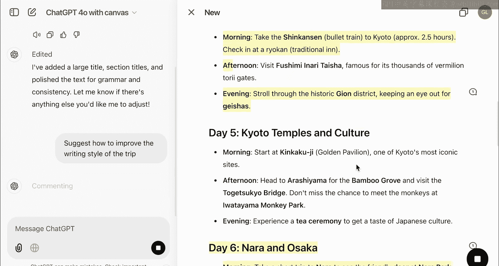

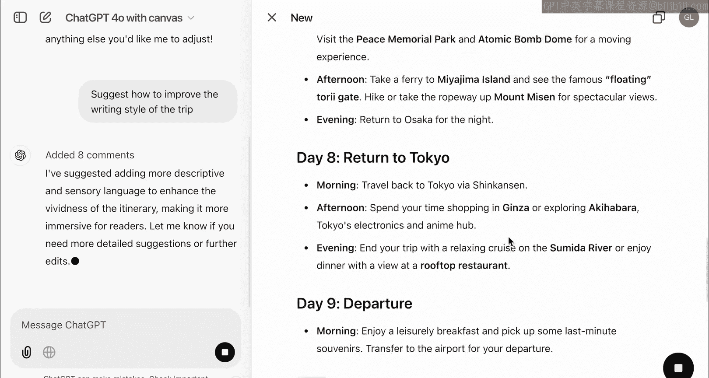
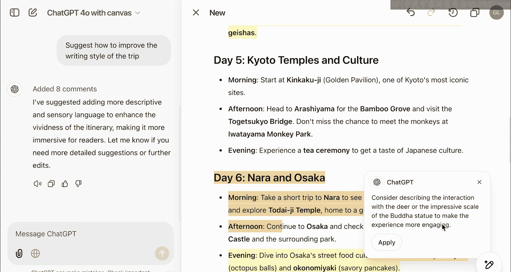
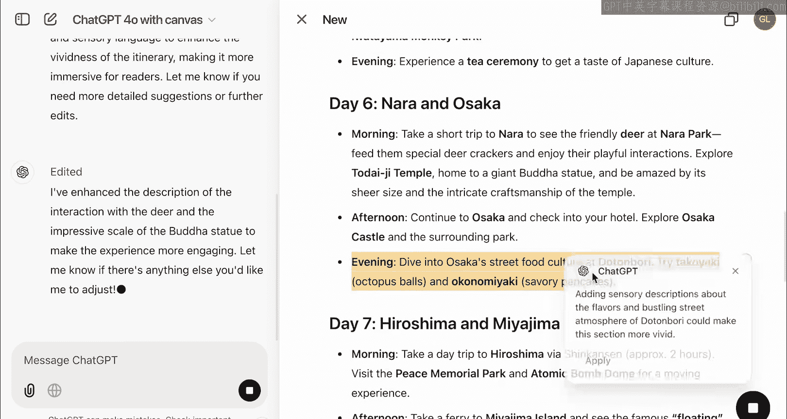

或者像这样拒绝它。我们可以对其他任何评论进行类似操作。也许我们可以在这里应用它。

你可以看到模型如何将其生成的评论实际应用到写作中。

现在，你还可以查看所做的更改。有一个“显示更改”功能，你可以看到所做的更改历史。在这里，你可以看到我拒绝了这条评论。

我们让模型将第二天改为在“Forta”。

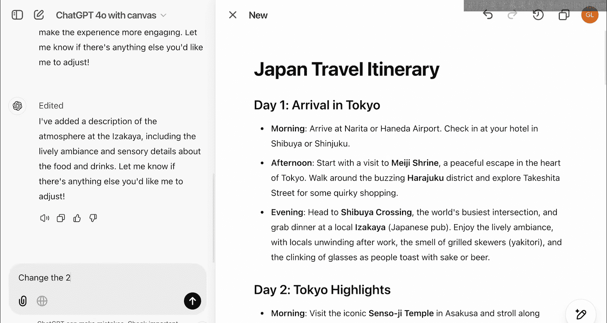

现在，我们可以使用“显示更改”来可视化模型所做的所有写作编辑。

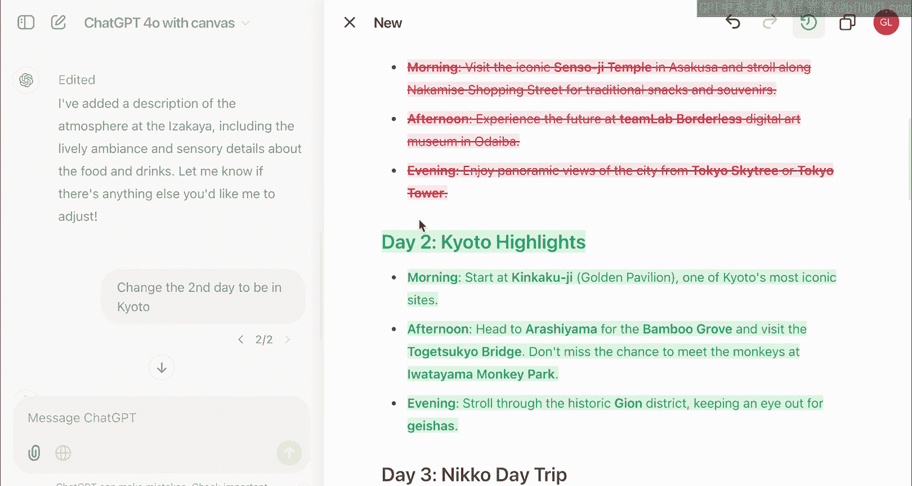

你可以使用此功能跟踪所有更改，或者如果需要，可以返回到之前的版本并恢复它，点击此处即可恢复。

如果你正在创建这个计划，也许你想看一些图片。你可以做的一件事是，比如选择这个地方，要求它查找图片，即“搜索这个地方的图片”。

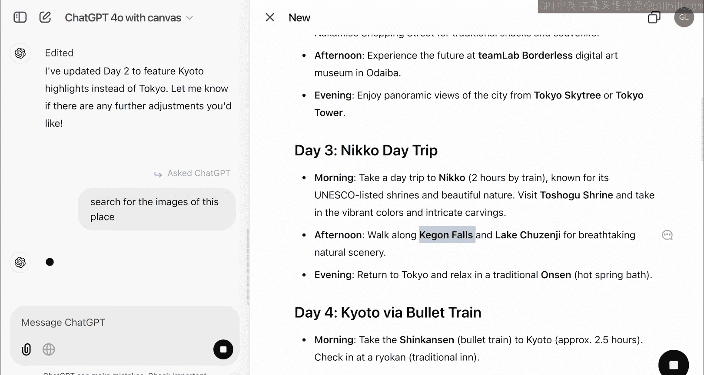

模型将使用搜索工具从公开可用的资源中提取一些图片，看看这个地方是什么样子。

假设你想将这个行程转变为博客文章。

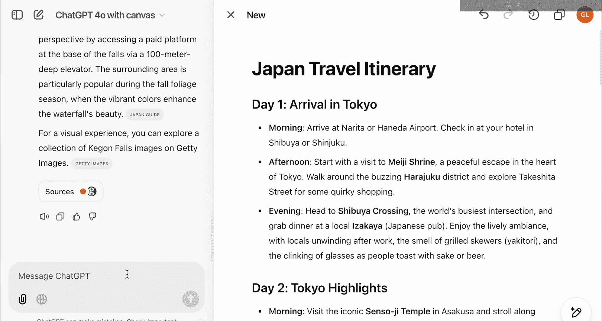

假设你想根据这篇博客文章创建一张DALL·E图片与朋友分享。我们可以要求模型创建一张DALL·E图片。

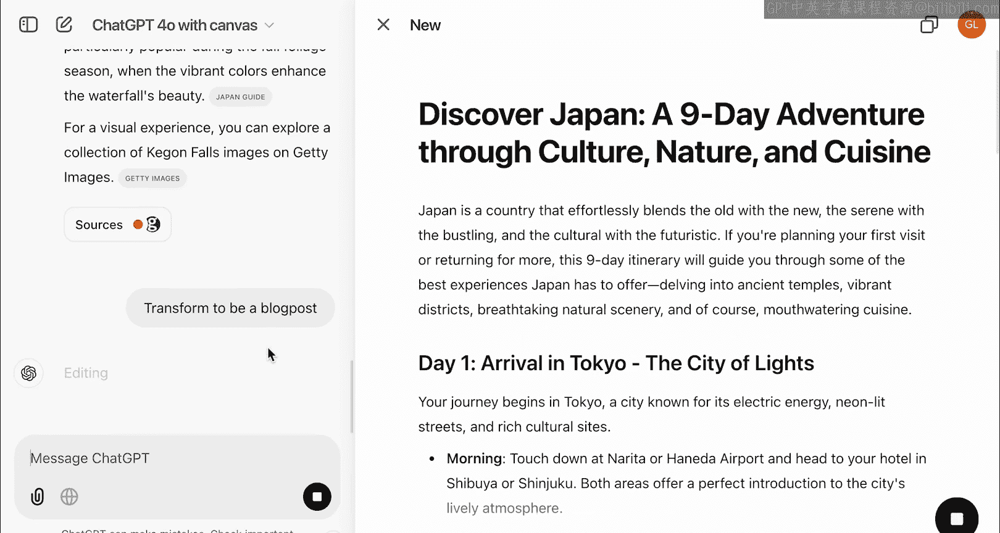
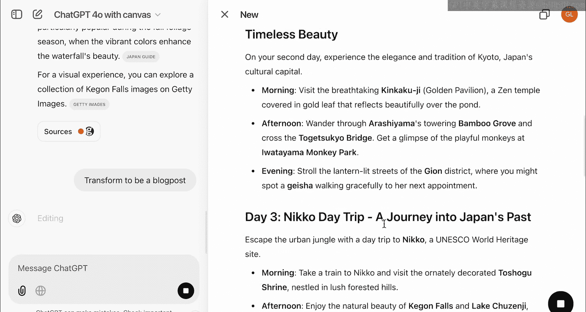

这张图片将概括这次旅行。

---

## 添加趣味元素：表情符号

一个有趣的功能滑块叫做“添加表情符号”，人们非常喜欢它，因为它是一个有趣的功能，你可以要求模型在你的文章中广泛添加各种表情符号。

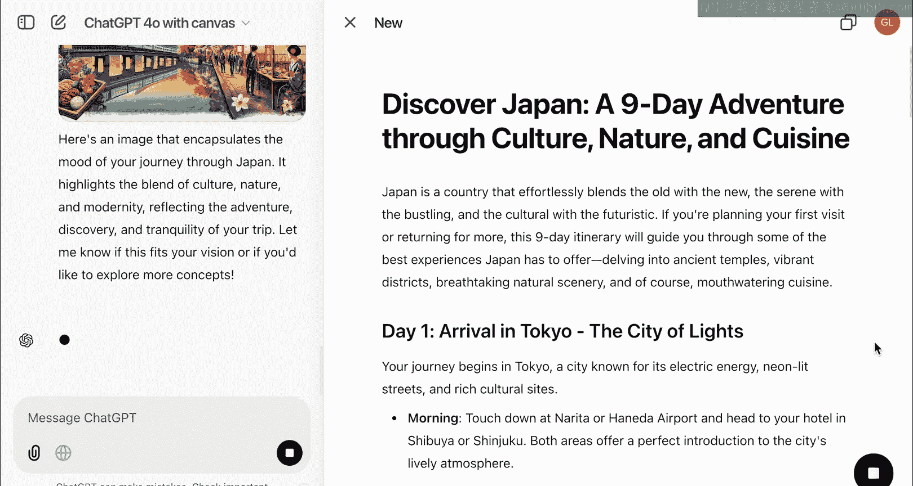
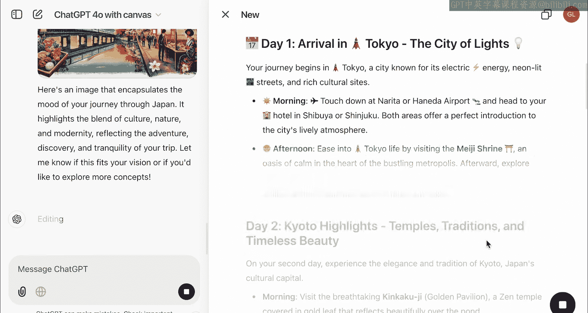

很好，现在你可以直接复制你的Canvas内容或博客文章，发布到你的平台上。

---

## 从图表分析到代码生成

假设我有一个想要在Canvas中可视化的图表。首先，我要截取屏幕截图。

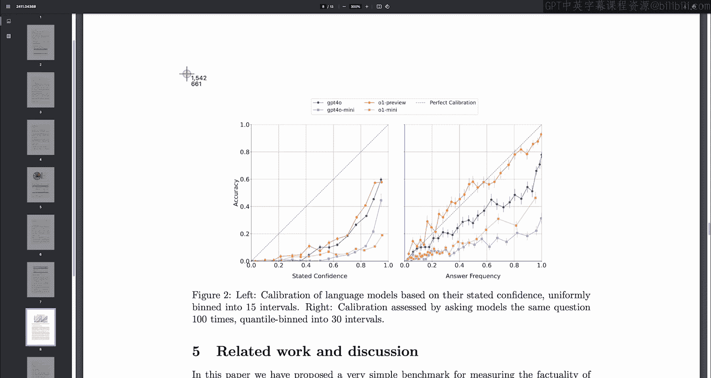

然后放入ChatGPT。我将要求模型分析这个图表，并在Canvas中撰写一份研究报告。

模型将尝试推断图表结果，并在Canvas工具中撰写一份小型分析。因此，你可以将其用作研究工具，甚至可以添加更多文献综述。

假设我想询问关于“校准”的问题。我想问“LLM中还有哪些其他校准方法？”

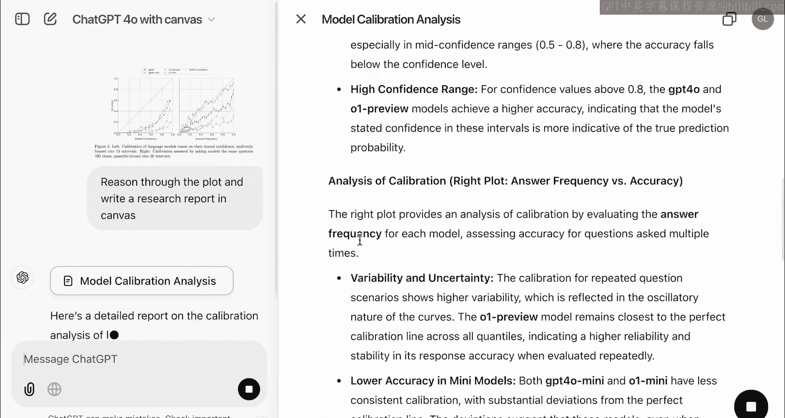

模型将在聊天中回答问题，而不是放入Canvas，因为Canvas有其自身独立的内容。但我也可以要求模型搜索一些相关文献，并在Canvas中撰写文献综述部分，例如“在Canvas中添加文献综述”。

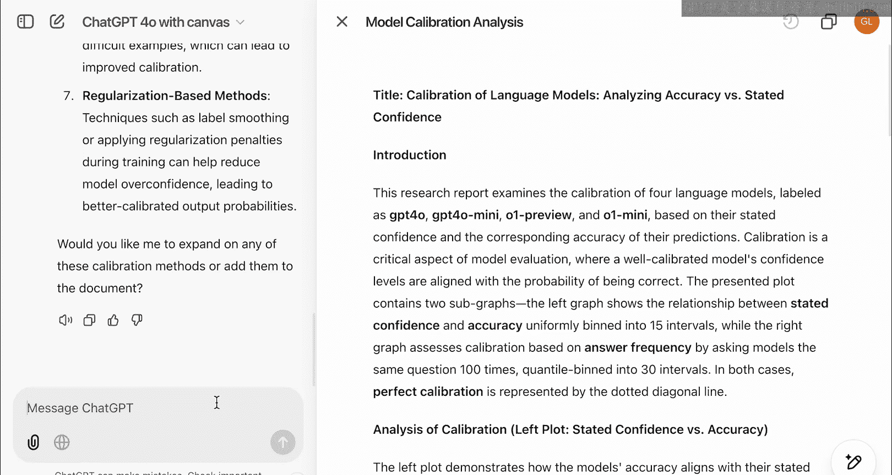

现在，基于这些方法，也许我想让模型进一步搜索，然后在Canvas中添加文献综述部分。

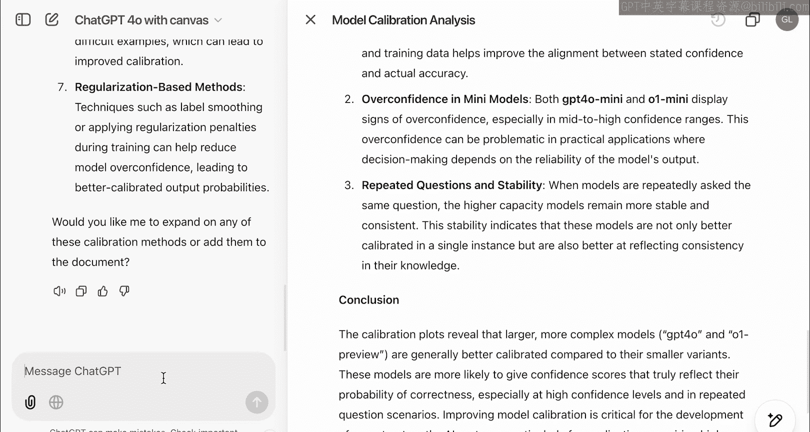

你可以要求“在Canvas中添加文献综述部分”。

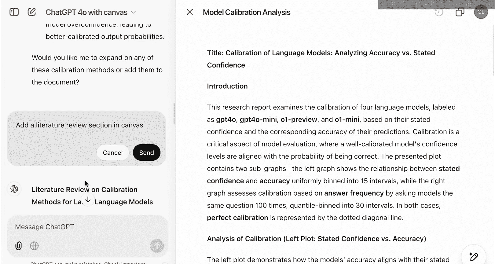

模型将直接为此添加一个新部分。

现在，基于我们之前拥有的图表，我想让模型用Python代码绘制左侧或一个预览模型。这是一行Python代码。

模型将为复制上述图表的Python代码生成一个新的Canvas。

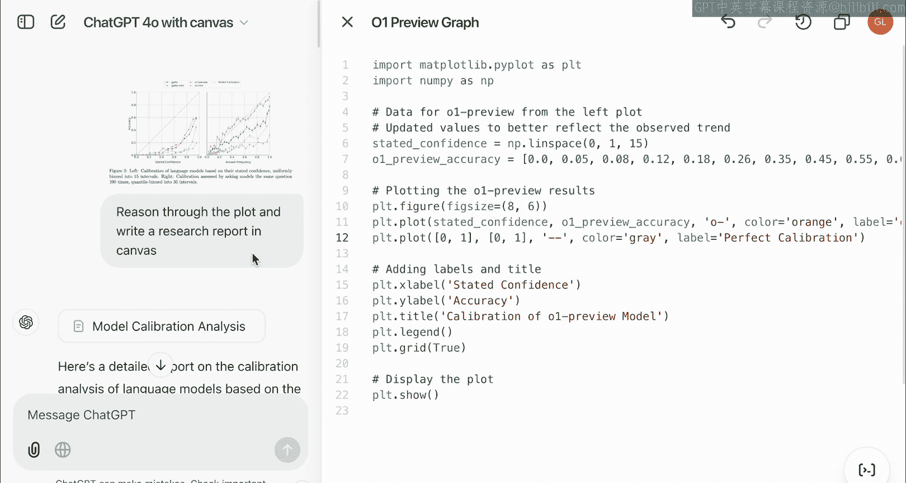

现在你有了这段代码，可以尝试在本地机器上使用它，并自己学习如何复现结果。虽然模型可能不完美，但你可以尝试复现它或进行迭代以重现结果。

---

## 总结

在本节课中，我们一起探索了OpenAI Canvas在协作写作方面的强大功能。我们从基础的网络搜索和信息验证开始，学习了如何利用Canvas调整文本的阅读等级和长度，转换内容格式（如转为Markdown表格或教程），以及生成可视化图像。随后，我们将这些工具应用于实际场景，如撰写邀请邮件，并展示了如何利用Canvas进行文本润色、修改跟踪和添加趣味元素（如表情符号）。最后，我们还看到了Canvas如何辅助研究分析，从解读图表到生成可复现的Python代码。通过Canvas，你可以获得对内容创作过程更精细的控制，并与AI模型进行高效、灵活的协作。