# 004：构建一个太空飞船游戏 🚀

在本节课中，我们将学习如何与AI模型协作，共同创建一个有趣的太空飞船对战游戏。我们将从生成基础代码开始，逐步添加游戏逻辑、失败机制、视觉特效，并最终实现一个可交互、有计分系统的完整游戏。

---

## 概述

我们将引导模型生成一个独立的HTML文件，其中包含一个具有复古未来主义风格的太空飞船对战游戏。游戏将包含一个竞争性的计分系统，并且非常具有交互性。在整个过程中，我们会通过“定向编辑”的方式与模型协作，逐步完善游戏功能。

---

## 生成基础游戏代码

首先，我们要求模型生成一个自包含的HTML文件，以便于我们运行和修改。我们同时要求模型添加一些日志，方便后续调试。

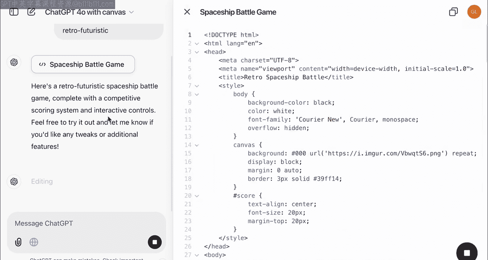

以下是模型生成的初始代码框架：

```html
<!DOCTYPE html>
<html lang="en">
<head>
    <meta charset="UTF-8">
    <title>Spaceship Battle Game</title>
    <style>
        /* 基础样式 */
        body { margin: 0; overflow: hidden; }
        canvas { display: block; }
    </style>
</head>
<body>
    <canvas id="gameCanvas"></canvas>
    <script>
        // 游戏主逻辑将在这里编写
        console.log('Game initializing...');
    </script>
</body>
</html>
```

我们将这段代码复制到一个新的HTML文件中并运行。初始版本可能包含一些无法访问的外部资源引用，例如背景图片。

---

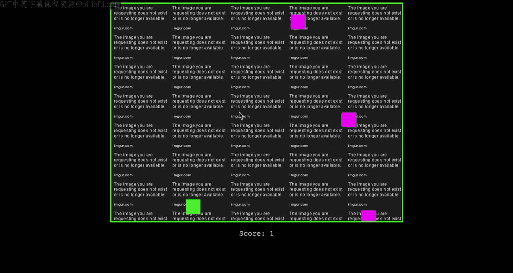

## 修复视觉元素

在运行初始代码后，我们发现游戏试图加载一个不存在的背景图片。为了解决这个问题，我们使用“定向编辑”功能，选中相关代码段，并指示模型将其替换为纯黑色背景。

**修改前**的代码片段可能类似于：
```javascript
ctx.drawImage(spaceBackground, 0, 0);
```

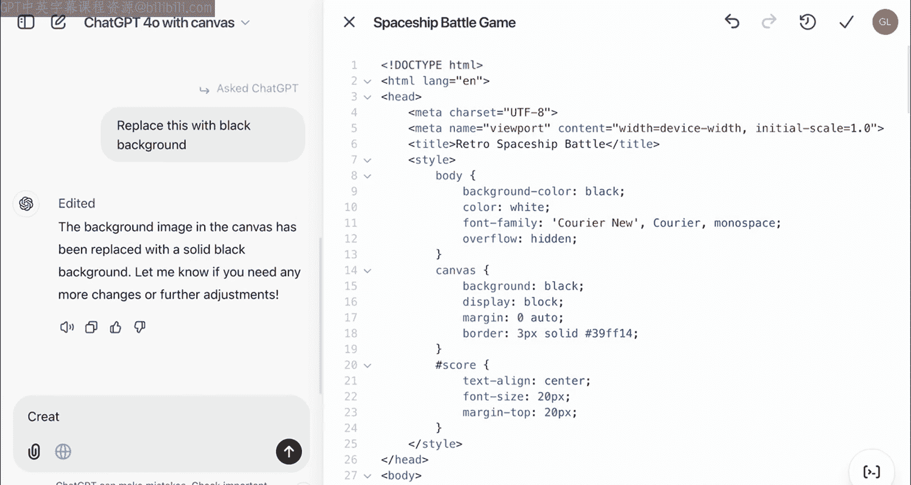

**我们给出的指令是**：“将背景替换为黑色。”

**修改后**，背景渲染代码变为：
```javascript
ctx.fillStyle = 'black';
ctx.fillRect(0, 0, canvas.width, canvas.height);
```

应用更改后，游戏背景成功变为黑色。此时，按下空格键，玩家飞船（绿色方块）可以开始发射子弹。

---

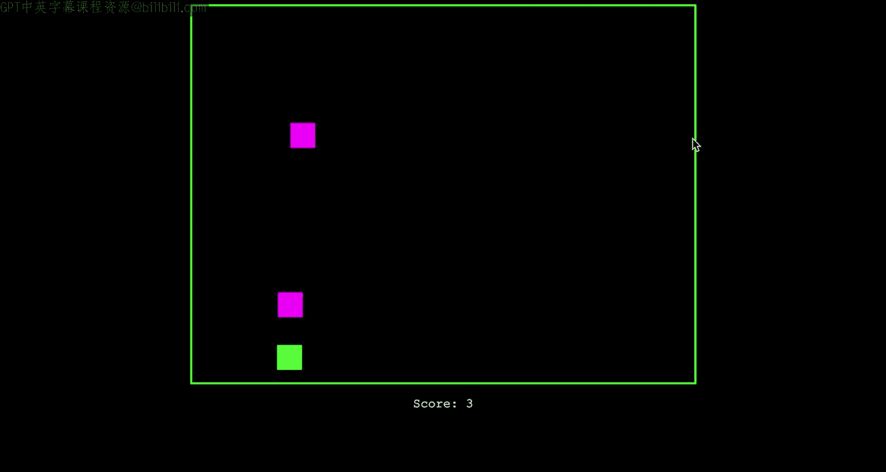

## 添加游戏失败逻辑

上一节我们实现了基础的射击功能，本节中我们来看看如何为游戏添加失败条件。我们希望当玩家的飞船（绿色方块）与敌舰（紫色方块）发生碰撞时，游戏结束。

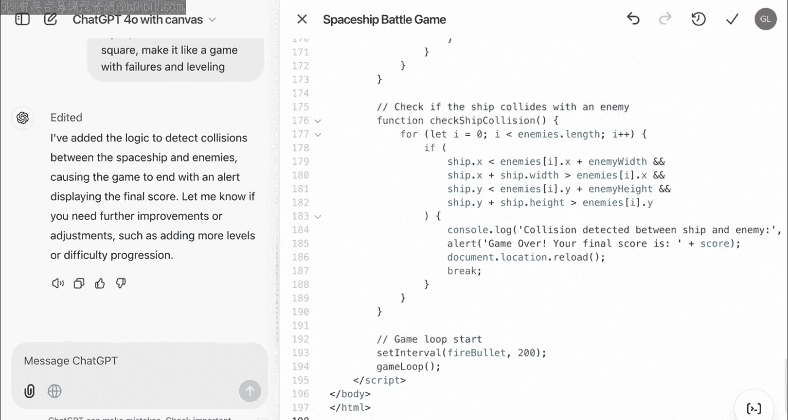

我们向模型提出以下需求：“实现一个失败逻辑：当我的方块撞到右边的方块时游戏失败。将其制作成一个有失败和等级概念的游戏。”

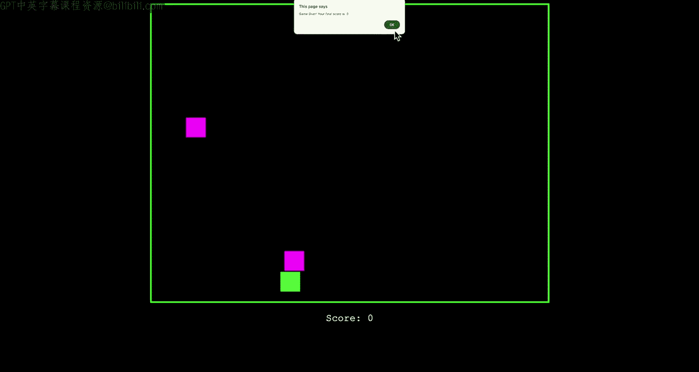

模型响应并创建了一个名为 `checkShipCollision` 的函数。该函数的核心逻辑是检测两个矩形（代表飞船）是否相交：

```javascript
function checkShipCollision(player, enemy) {
    return player.x < enemy.x + enemy.width &&
           player.x + player.width > enemy.x &&
           player.y < enemy.y + enemy.height &&
           player.y + player.height > enemy.y;
}
```

我们将此代码整合到游戏主循环中。现在，如果玩家飞船与敌舰相撞，游戏状态会变为“结束”。

---

## 完善游戏结束界面

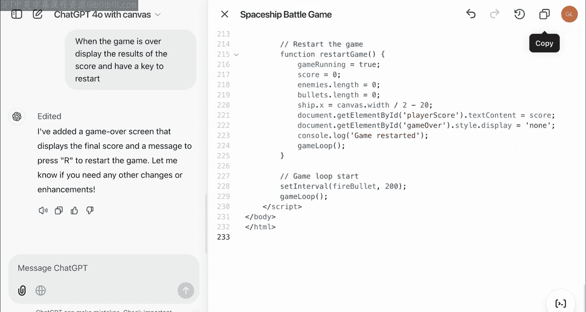

在实现了碰撞检测后，游戏会在碰撞时结束，但缺乏明确的反馈。因此，我们需要添加一个游戏结束界面，用于显示最终得分并允许玩家重新开始。

我们指示模型：“当游戏结束时，显示结果分数，并提供一个按键来重新开始游戏。”

模型添加了以下功能：
1.  在游戏画面上方叠加显示一个“游戏结束”的提示。
2.  显示最终得分。
3.  监听“R”键来重置游戏状态。

相关的代码更新包括：
```javascript
function drawGameOver() {
    ctx.fillStyle = 'rgba(0, 0, 0, 0.75)';
    ctx.fillRect(0, 0, canvas.width, canvas.height);
    ctx.fillStyle = 'white';
    ctx.font = '48px Arial';
    ctx.textAlign = 'center';
    ctx.fillText('Game Over', canvas.width / 2, canvas.height / 2 - 50);
    ctx.font = '24px Arial';
    ctx.fillText(`Your final score is ${score}.`, canvas.width / 2, canvas.height / 2);
    ctx.fillText('Press R to restart the game.', canvas.width / 2, canvas.height / 2 + 50);
}
```

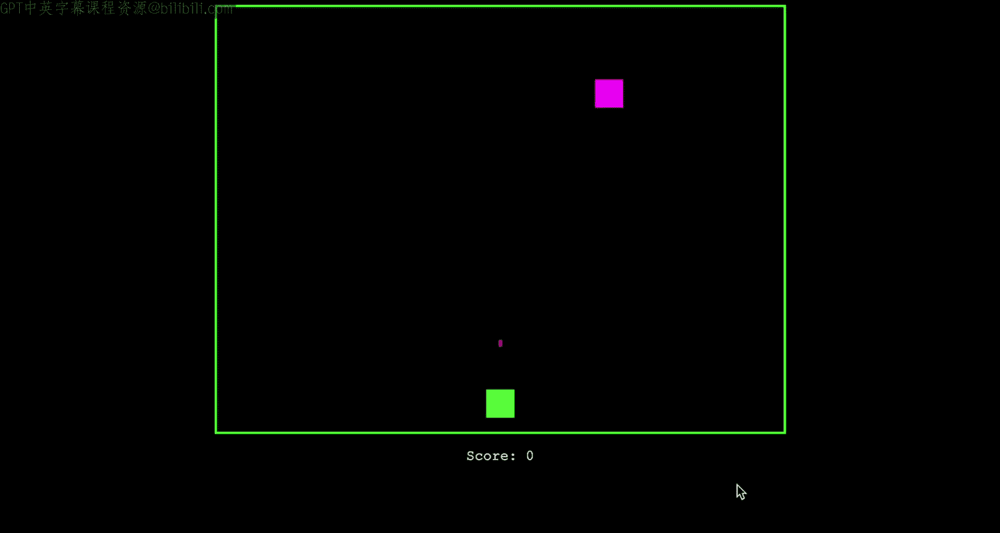

整合代码后，游戏体验变得更加完整：发生碰撞后，屏幕会显示得分和重启提示，按下“R”键即可开始新一局游戏。

---

## 增强视觉沉浸感

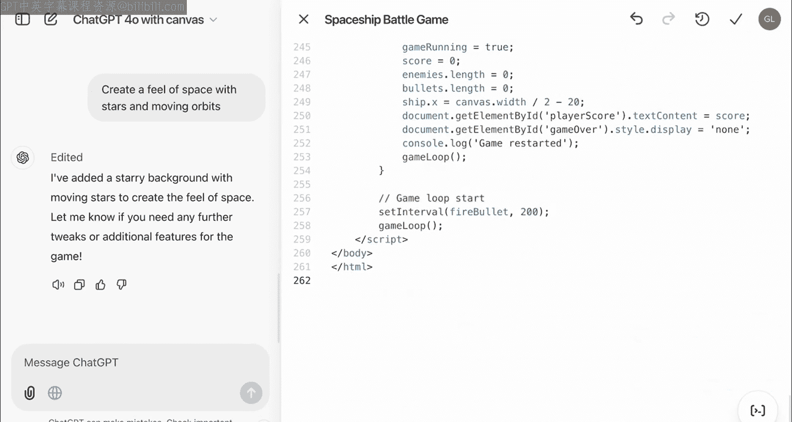

目前游戏画面较为简单。为了营造更强烈的太空战斗氛围，我们要求模型添加一些视觉特效，例如星空和移动的轨迹。

我们给出的提示是：“创建一种太空感，添加星星和移动的轨道。”

模型创建了一个 `drawStars` 函数，在黑色背景上绘制随机分布的白色星星，并通过每帧更新其垂直位置来模拟移动效果：

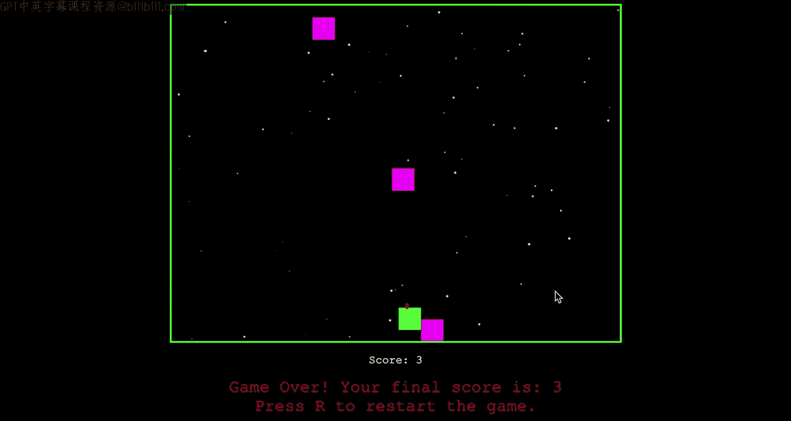

```javascript
function drawStars() {
    ctx.fillStyle = 'white';
    stars.forEach(star => {
        ctx.beginPath();
        ctx.arc(star.x, star.y, star.size, 0, Math.PI * 2);
        ctx.fill();
        // 更新星星位置，制造移动感
        star.y += star.speed;
        if (star.y > canvas.height) {
            star.y = 0;
            star.x = Math.random() * canvas.width;
        }
    });
}
```

这个函数被添加到主绘制循环中，且不影响原有的游戏逻辑。重启游戏后，背景中出现了缓缓下落的星星，大大增强了游戏的视觉吸引力。

---

## 增加游戏难度

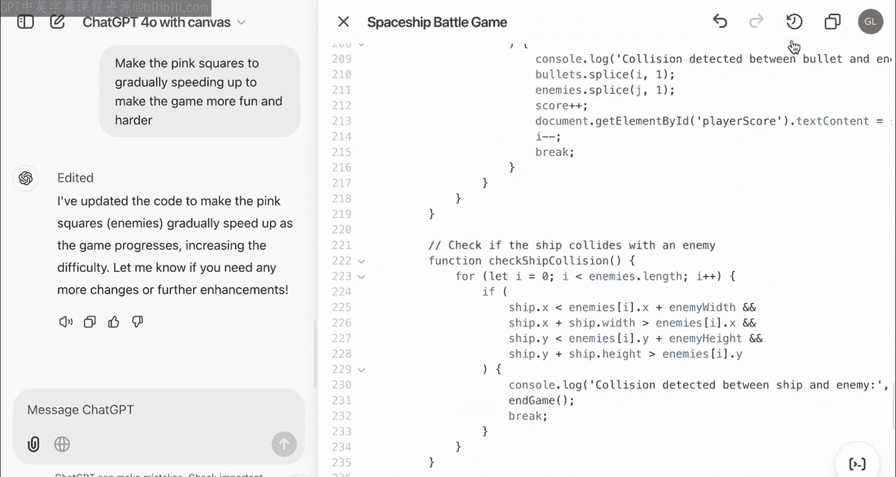

为了让游戏更具挑战性和趣味性，我们尝试让敌舰（粉色方块）的速度随着时间推移逐渐加快。

我们指示模型：“让敌人的飞船逐渐加速。”

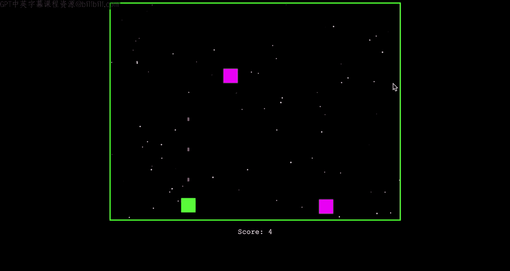

模型创建了一个 `updateEnemySpeed` 函数，尝试在每次敌舰移动时微增其速度变量。然而，初始实现可能效果不明显。我们可以通过“定向编辑”进一步调整加速系数。

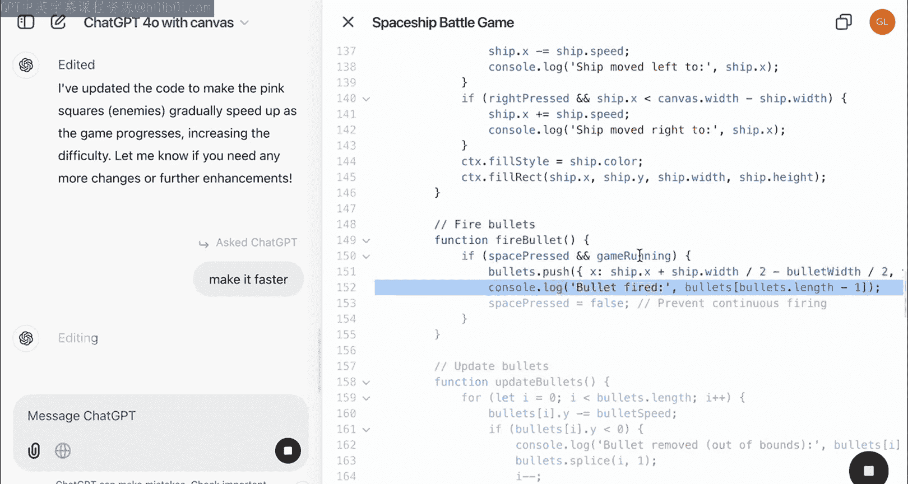

例如，将速度增量从 `0.001` 修改为 `0.01`：
```javascript
// 修改前
enemy.speedX += 0.001;
// 修改后
enemy.speedX += 0.01;
```

经过几次迭代调整，敌舰的速度会明显变得越来越快，从而增加了游戏的难度和紧张感。

---

## 总结

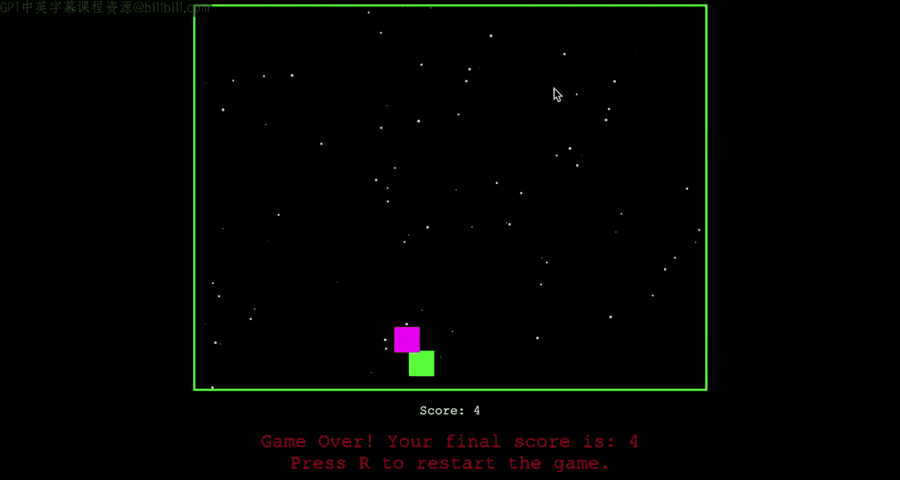

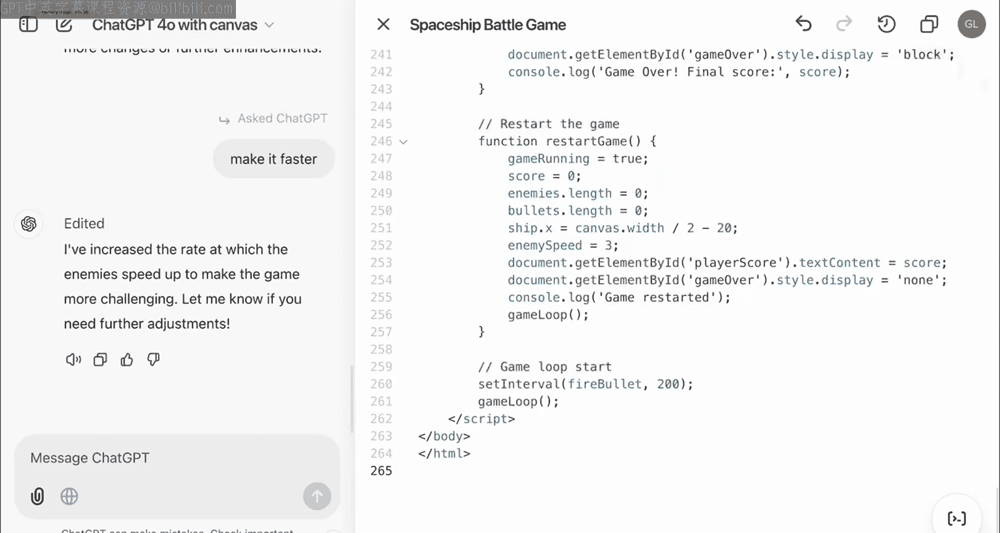

本节课中，我们一起学习了如何与AI模型协作，从零开始构建一个太空飞船游戏。我们经历了以下关键步骤：
1.  **生成基础代码**：获得一个可运行的游戏框架。
2.  **修复与定制**：通过定向编辑修改视觉元素（如背景）。
3.  **添加核心机制**：实现了碰撞检测和游戏失败逻辑。
4.  **完善用户体验**：添加了游戏结束界面和重启功能。
5.  **增强表现力**：引入了星空背景等视觉特效。
6.  **调整游戏性**：通过让敌舰加速来增加游戏难度。

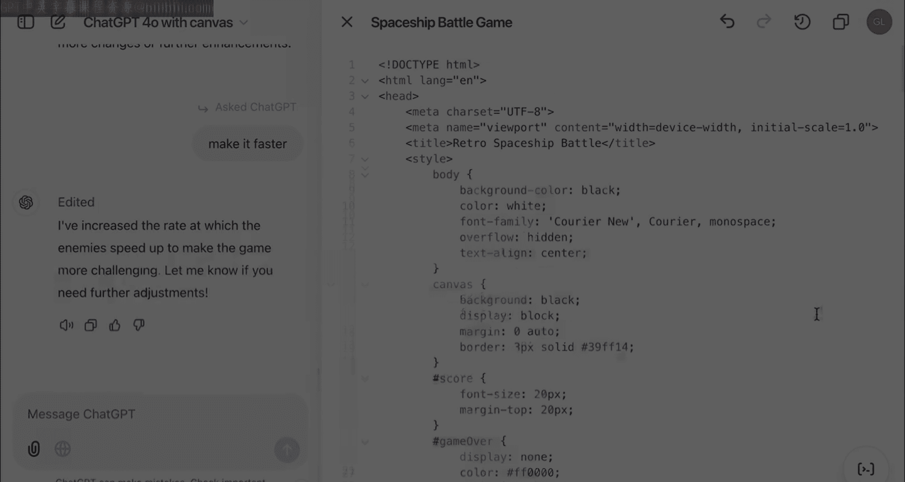

通过这个过程，我们不仅创建了一个可玩的游戏，也展示了如何通过清晰的指令和迭代式编辑，与AI进行高效协作，将创意快速转化为现实。你可以继续在此基础上进行迭代，添加更多功能（如多种敌人、能量道具、音效等），使其变得更加丰富和有趣。