# 005：从架构图创建SQL数据库 🗄️

在本节课中，我们将探索一个CGPT Canvas的实际应用场景：如何根据一张实体关系图（ER图）的截图，快速创建并操作一个SQL数据库。我们将学习如何利用AI工具将视觉化的架构设计转化为可执行的代码，并进行调试和查询。

## 概述

上一节我们介绍了CGPT Canvas的基本功能。本节中，我们来看看一个具体的应用：从一张数据库架构图出发，生成一个功能完整的SQL数据库。这个过程将涉及图像识别、代码生成、调试和交互式查询。

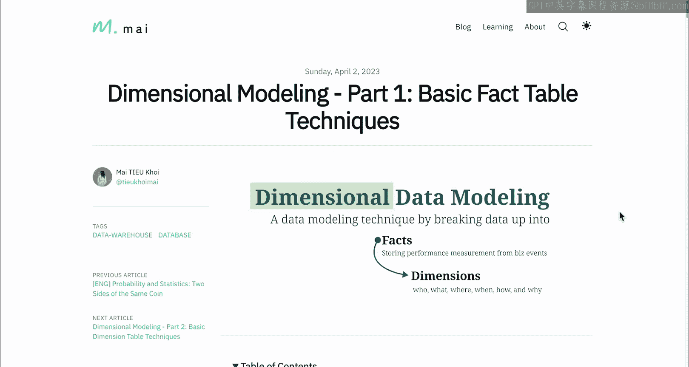

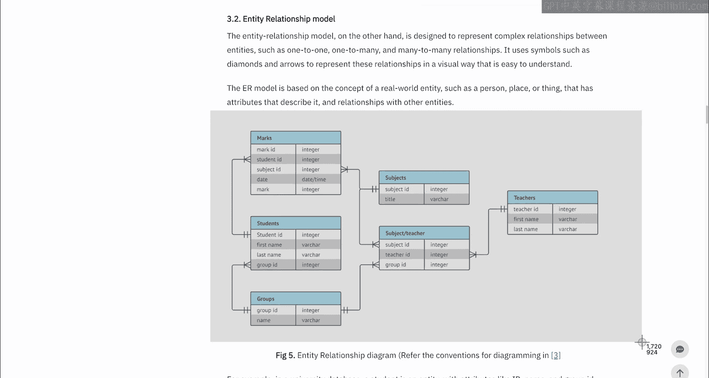

## 从图像到SQL代码

假设你正在阅读一篇关于维度建模的文章，并遇到了“实体关系模型”这个概念。你想进一步探索这个模型图。一个有效的方法是截取这张图，并请求ChatGPT将其转换为SQL数据库。

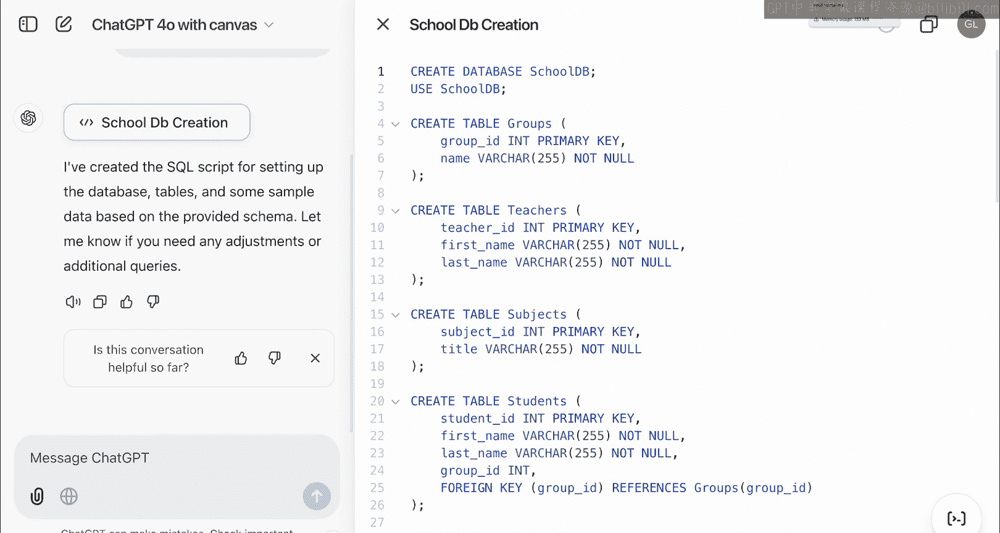

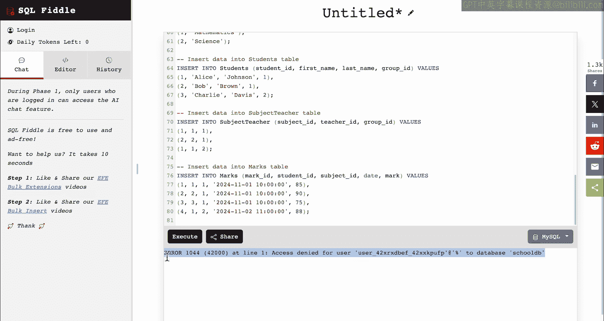

以下是操作步骤：

1.  **截图与上传**：首先，截取包含实体关系模型的图片，并将其上传至CGPT Canvas。
2.  **提出请求**：向模型发出明确的指令，要求其根据图片创建SQL数据库，并填充一些示例数据，以便进行交互。

    > 指令示例：请根据上图创建一个SQL数据库，并填充一些数据，以便更好地感受这个数据库。

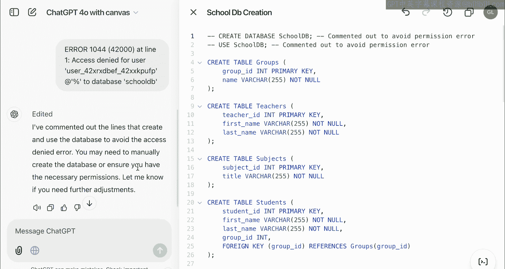

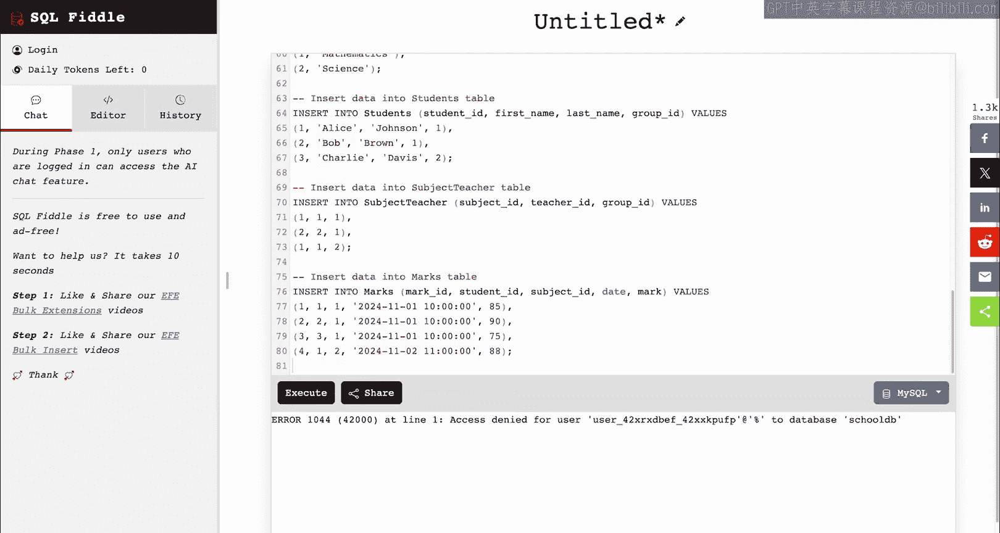

3.  **生成代码**：模型将生成一个包含`CREATE TABLE`语句和`INSERT`数据的SQL文件。

## 调试与修正代码

生成的初始代码可能包含语法错误。我们可以使用在线SQL编译器（如sqliteonline.com）进行测试和调试。

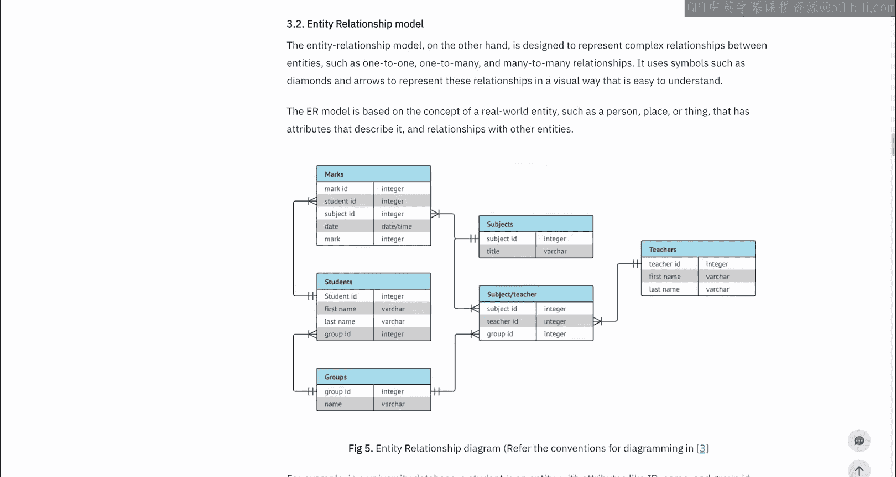

以下是调试过程：

1.  **复制代码并测试**：将生成的SQL代码复制到在线编译器中执行。
2.  **识别错误**：编译器可能会报告错误，例如表名或列名使用了保留字。
3.  **请求模型修正**：将错误信息复制并反馈给模型，请求其修正代码。例如，模型可能会通过为保留字添加引号来解决语法问题。
4.  **迭代修正**：重复此过程，直到所有表的创建语句都能成功执行。

    > 核心修正操作：当遇到“GROUP”这类保留字导致的错误时，模型会将其修改为带引号的标识符，例如 `“GROUP”`。

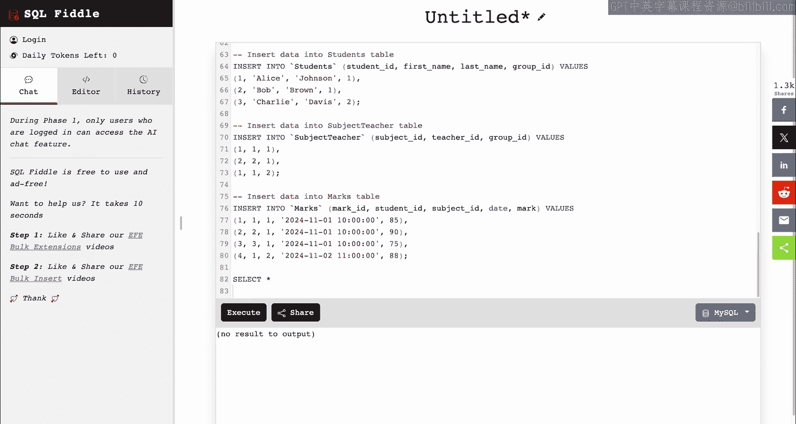

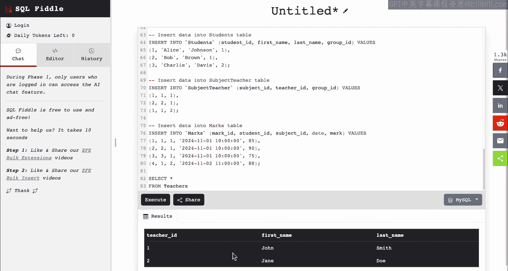

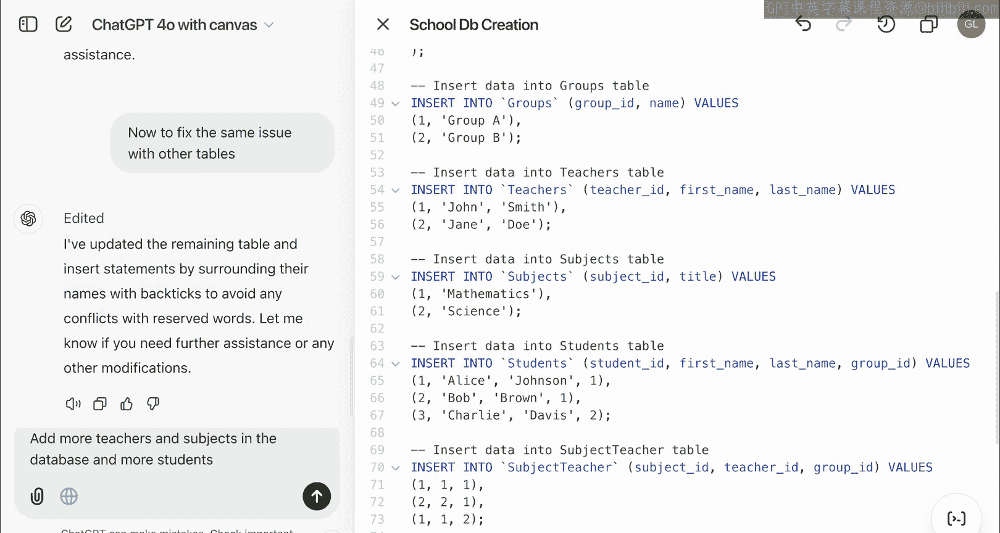

## 执行查询与扩展数据

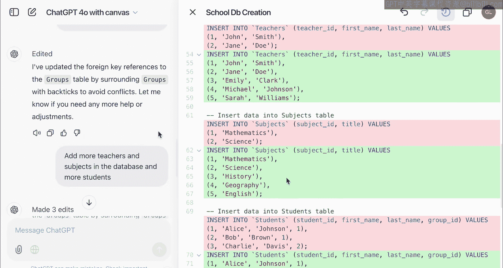

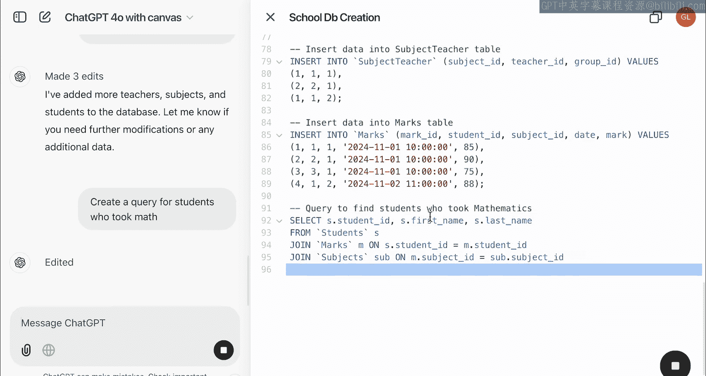

数据库成功创建后，我们就可以开始执行SQL查询了。

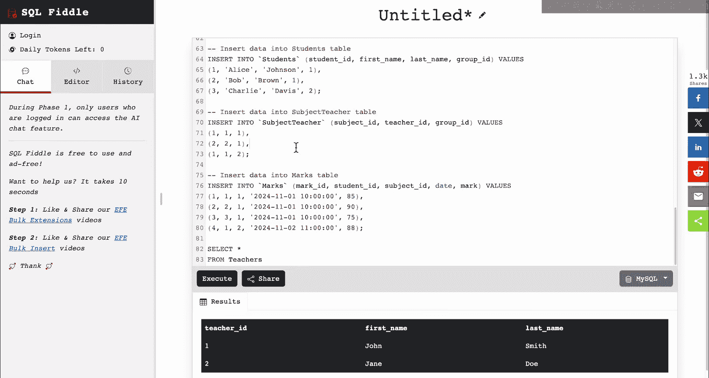

以下是查询与扩展的步骤：

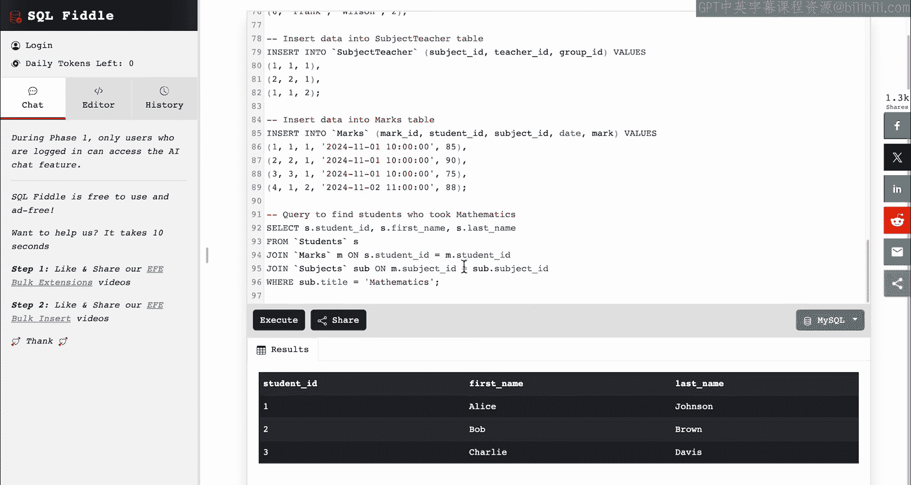

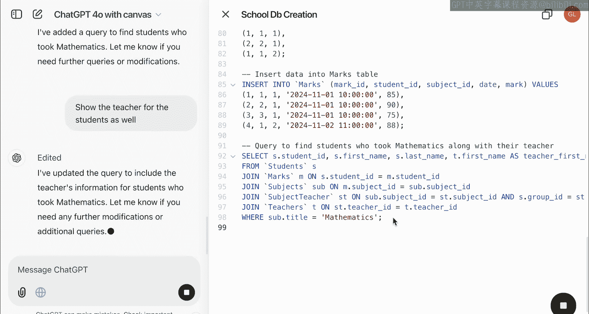

1.  **基础查询**：执行简单的查询来验证数据。例如，查询所有教师信息：
    ```sql
    SELECT * FROM teachers;
    ```
2.  **扩展数据**：为了让数据库更丰富，可以请求模型添加更多的教师、科目和学生数据。
3.  **复杂查询**：基于扩展后的数据，执行更复杂的查询。例如，查找所有选修了数学课的学生：
    ```sql
    SELECT s.student_name
    FROM students s
    JOIN enrollments e ON s.student_id = e.student_id
    JOIN subjects sub ON e.subject_id = sub.subject_id
    WHERE sub.subject_name = ‘Math’;
    ```
4.  **关联查询**：进一步，可以查询教授特定学生（如“Alice Johnson”）数学课的教师：
    ```sql
    SELECT t.teacher_name
    FROM teachers t
    JOIN subjects sub ON t.teacher_id = sub.teacher_id
    JOIN enrollments e ON sub.subject_id = e.subject_id
    JOIN students s ON e.student_id = s.student_id
    WHERE s.student_name = ‘Alice Johnson’ AND sub.subject_name = ‘Math’;
    ```

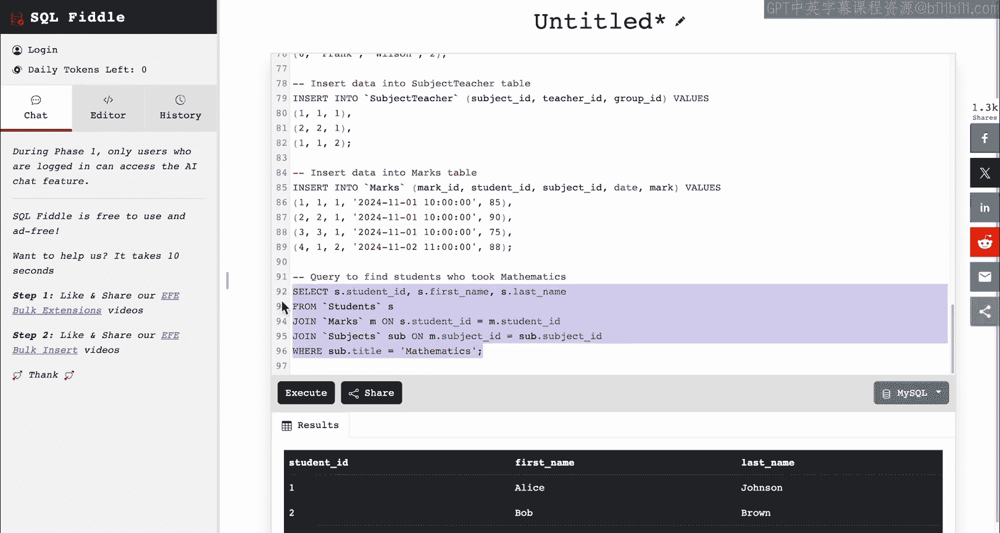

## 总结

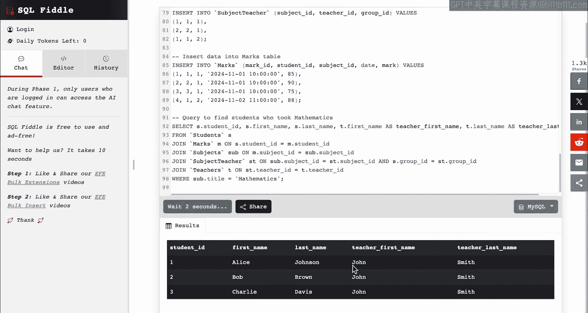

本节课中，我们一起学习了如何利用CGPT Canvas将一张实体关系图转化为可操作的SQL数据库。整个过程涵盖了从图像识别生成代码、调试修正语法错误，到执行查询和扩展数据的完整工作流。这个案例展示了AI如何帮助我们将视觉设计快速落地为可运行的原型。

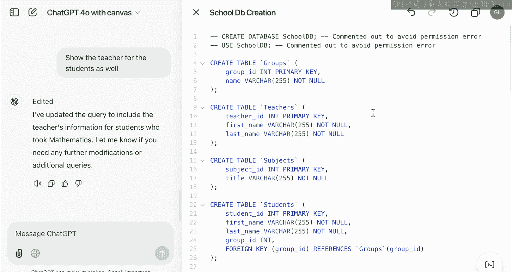

我鼓励你尝试更复杂的SQL查询，甚至可以为自己的应用创建数据库。你还可以尝试生成具有自定义规则和机制的完整游戏，并与朋友分享。