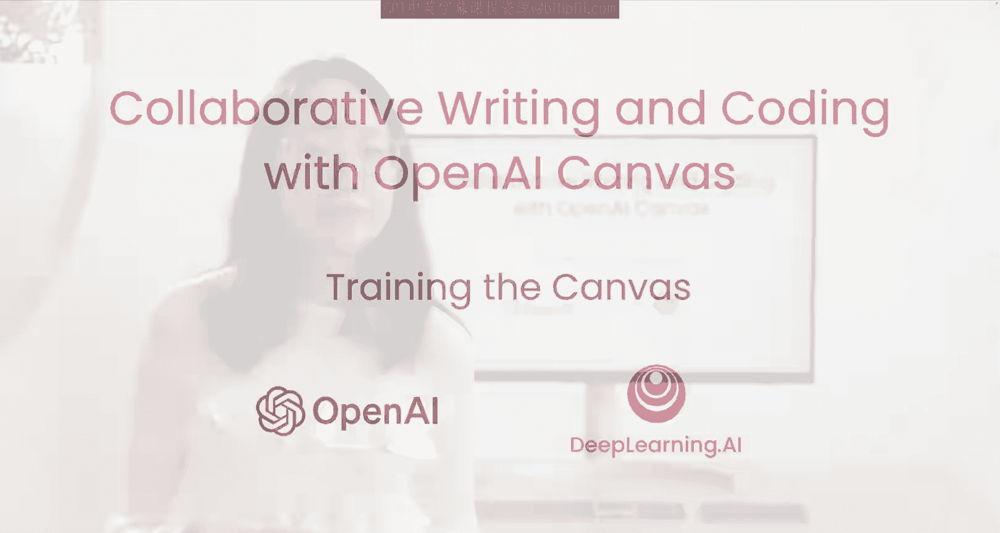
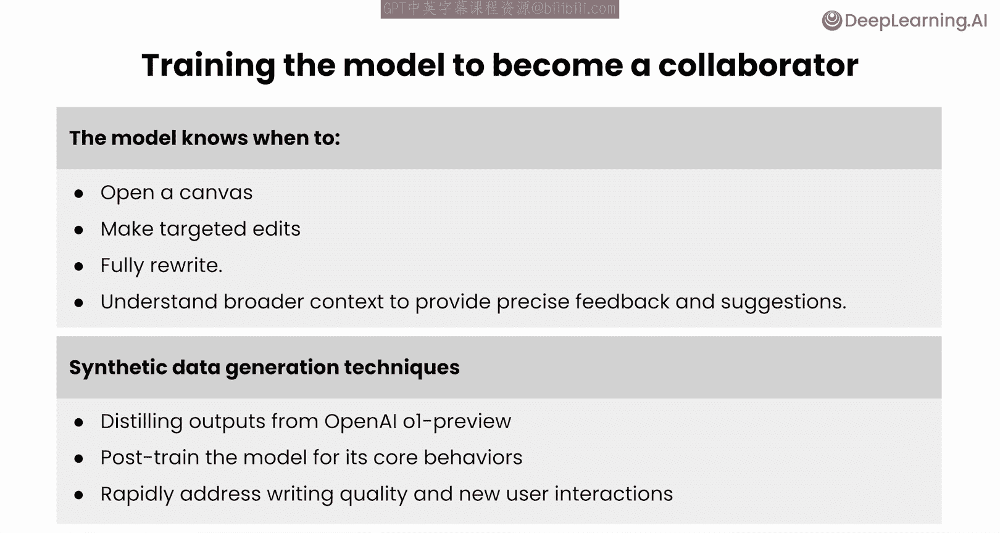
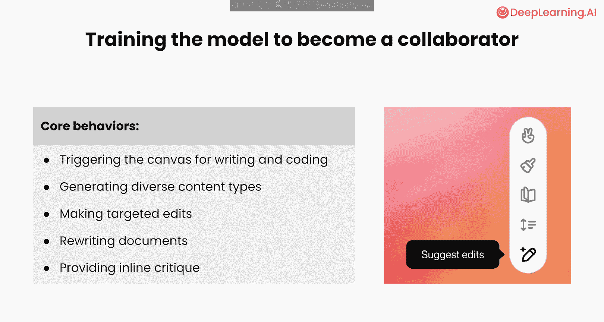
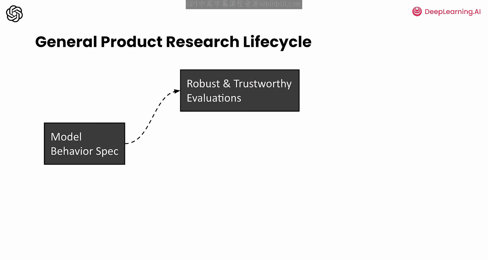
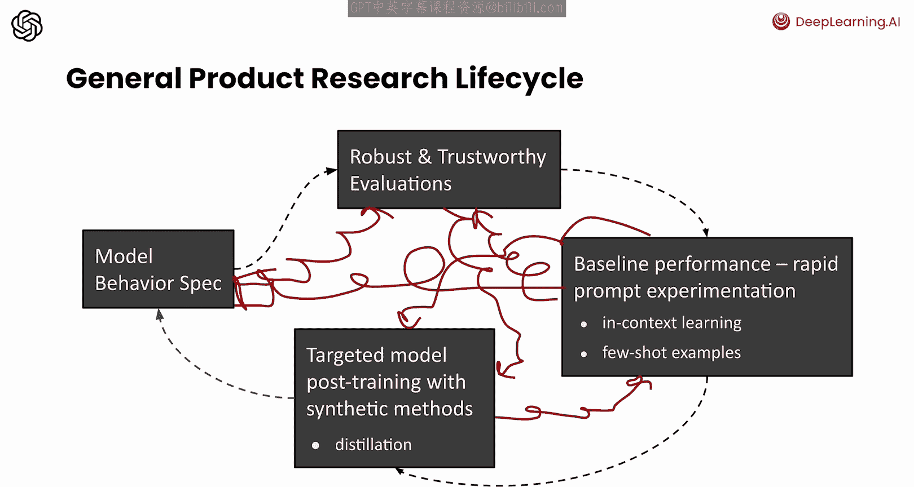
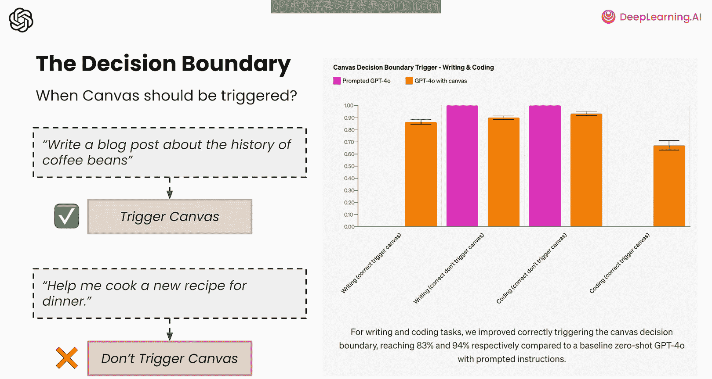
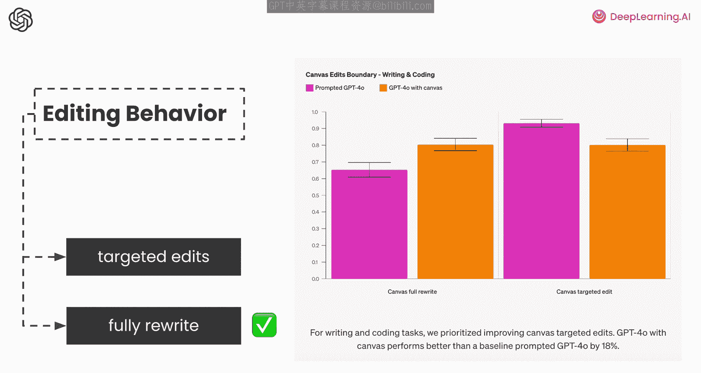
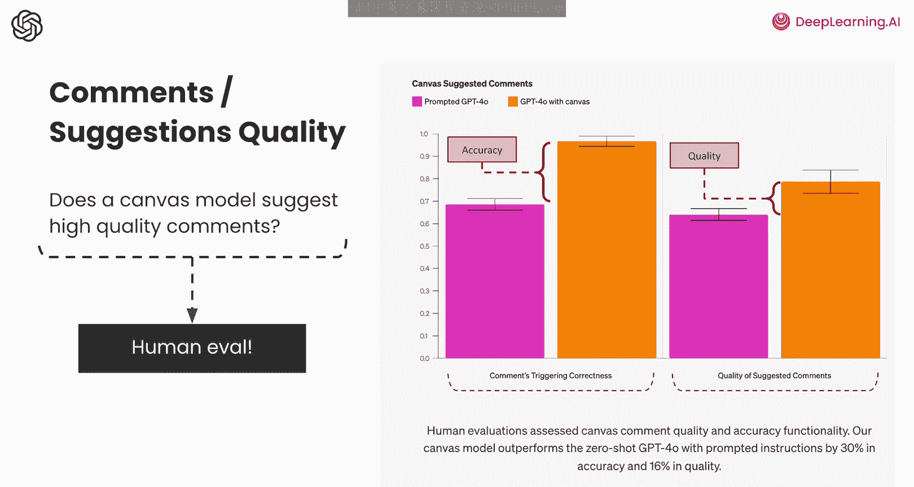

# 006：训练Canvas模型 🎯

在本节课中，我们将深入幕后，了解如何训练模型以创建像Canvas这样的交互界面。

## 概述

上一节我们探讨了Canvas的功能，本节中我们来看看其背后的模型是如何被训练的。我们将简要介绍模型开发的关键步骤，并解析定义其核心行为所面临的挑战。

我们训练了GPT-4模型，使其能作为一个创意伙伴进行协作。该模型知道何时打开Canvas、进行针对性编辑或完全重写。它还能理解更广泛的上下文，为你的文档提供精确的反馈和建议。Canvas模型的一个关键创新在于，**所有的后训练都是通过合成数据完成的**。我们使用了诸如从更强大的OpenAI预览模型蒸馏输出等技术，来塑造模型的核心行为。这种方法使我们能够快速提升写作质量和处理新的用户交互，而无需依赖人工生成或收集的数据。

因此，我们的研究团队为该模型开发了以下核心行为：

以下是模型的核心行为列表：
*   触发Canvas以进行写作和编码
*   生成多样化的内容类型
*   进行针对性编辑
*   重写文档
*   提供行内批评和其他功能

我们通过构建的20多项自动化内部评估来衡量进展，并在产品发布后持续评估更多指标。

## 产品研发与模型开发框架

Canvas是由一群设计师、工程师、研究员和产品经理共同开发的。我们从项目伊始到产品发布一直协同工作。在此过程中，我们建立了一个产品导向的模型开发框架，这可能对你也很有用。

开发像Canvas这样的产品功能，其通用的产品研究生命周期可能遵循以下形式：

以下是开发流程的四个阶段：
1.  **开发模型行为规范**：明确模型应该做什么。
2.  **设计稳健且可信的评估体系**：如何衡量模型表现。
3.  **通过快速提示迭代建立基线性能**：使用提示工程获得初步效果。
4.  **后训练以注入针对性行为**：通过训练固化模型能力。

在提示迭代阶段，你可以使用诸如**上下文学习**或**少量示例提示**等技术。最终，一旦你对产品功能建立了信心，就可以通过后训练将非常具体的行为注入模型中。更具体地说，在Canvas中，一切都是通过合成方法完成的，其中一种方法被称为**蒸馏**。

显然，现实中一切都要混乱得多，并不像我上一张幻灯片展示的那样线性。一旦你建立了基线性能，可能需要回到评估阶段。而当你发现新的边缘案例时，就需要回头更新模型行为规范，进而改变训练策略。因此，在现实世界中，模型的开发更像是一个迭代的过程。

## 深入探讨：定义模型行为

接下来，让我们更深入地探讨定义模型行为需要什么。

定义模型行为需要非常细致和注重细节的规范，需要考虑边缘案例以及整个系统的交互。例如，在Canvas中，我们必须思考该工具如何与搜索、图像生成等其他工具交互。随着模型变得更复杂，系统的复杂性也会增加，因此新模型行为规范的范围和复杂性也随之增加。

就个人而言，我还了解到，修复语言模型的行为通常涉及应用软件工程中的类似原则。我可以分享其中一些原则：

以下是三个关键原则：
*   **复现模型行为等同于复现软件缺陷**：通过这样做，你可以建立一个在未来可以优化的、更稳健和值得信赖的评估体系。
*   **剖析**：在软件工程中，这等同于隔离模型的不同组件部分，以找出问题的根本原因。
*   **整体性解决**：你必须在不破坏系统其他部分的情况下整体解决问题。这正是模型行为复杂性的来源，因为只有在训练过程中，你才可能观察到一些希望修复的错误或模型行为偏差。

## Canvas模型的具体后训练行为

更具体地说，让我们深入探讨Canvas模型具体接受了哪些行为的后训练。

### 挑战一：定义触发Canvas的时机

一个关键挑战是定义何时触发Canvas，我们称之为**决策边界**。我们教导模型为类似“写一篇关于咖啡豆历史的博客文章”这样的提示打开Canvas，同时避免对一般的问答任务（如“帮我做一个新的晚餐食谱”）过度触发。

对于写作任务，我们优先提高正确触发的比例，即使这会牺牲一些正确不触发的情况，最终达到了83%的正确触发率，对比基准是带有提示指令的零样本GPT-4。值得注意的是，右侧图表显示，此类基线的质量对你使用的提示高度敏感。使用不同的提示，基线可能仍然表现不佳，但会以不同的方式，例如在编码和写作任务中甚至更不准确，导致不同的错误分布和次优性能的其他形式。

对于编码任务，我们有意让模型偏向于不触发，以避免干扰我们的高级用户，我们将根据用户反馈继续调整这一点。

### 挑战二：调整模型的编辑行为

模型行为的第二个挑战涉及调整模型在Canvas被触发后的编辑行为，更具体地说，是决定何时进行非常针对性的特定编辑，而不是重写整个内容。对于像“将第二段改短一些”这样的提示，模型最好能专门选择第二段进行编辑，而不是重写全文。

因此，我们训练模型在用户明确选择文本或指令清晰指出要选择文本中的哪部分时，执行针对性编辑；否则倾向于重写。同样，这种行为也在随着我们优化模型开发而持续更新。

### 挑战三：生成高质量的评论和建议

最后，训练模型生成高质量的评论和建议需要仔细的迭代。与前两种模型行为案例不同（它们很容易通过自动化评估和人工审查来适应），以自动化方式衡量质量尤其具有挑战性。

因此，我们使用人工评估来评判评论质量、准确性以及触发建议和评论的时机。我们的Canvas模型在准确性上比带有提示指令的零样本GPT-4高出30%，在质量上高出16%，这表明与带有详细指令的零样本提示相比，合成训练显著提高了响应质量和行为表现。

## 总结

本节课中，我们一起学习了训练Canvas模型的一些基本原理。尽管本课程的重点显然是分享一些你在写作和编码任务中应该尝试的、令人愉悦的使用案例，并与深度学习社区的其他人分享，但了解其背后的训练过程能帮助我们更好地理解和使用这一强大工具。

😊

