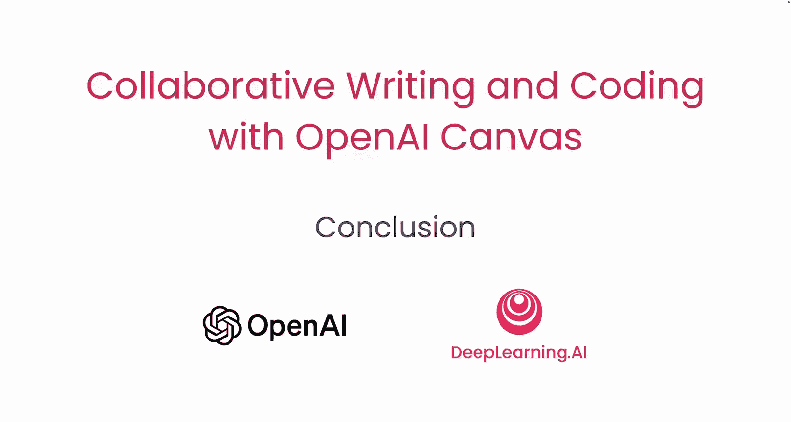

# 007：总结

在本课程中，我们一起学习了OpenAI Canvas如何帮助你更好、更快地进行写作和编码。

## 课程回顾

上一节我们探讨了AI模型的训练原理，现在让我们来回顾整个课程的核心内容。

以下是我们在课程中完成的主要学习任务：

*   你学会了使用Canvas来辅助写作和编程。
*   你创建了几个有趣的游戏项目。
*   你掌握了如何对代码进行注释、调试和优化。
*   你了解了支撑Canvas的AI模型是如何被训练的。

## 总结

本节课中，我们一起学习了OpenAI Canvas这一强大工具在协作写作与编码中的应用。从基础操作到项目实践，再到理解其背后的技术原理，我们完成了一次全面的探索。

我希望你喜欢这门课程，并期待看到你运用Canvas所构建出的精彩作品。😊