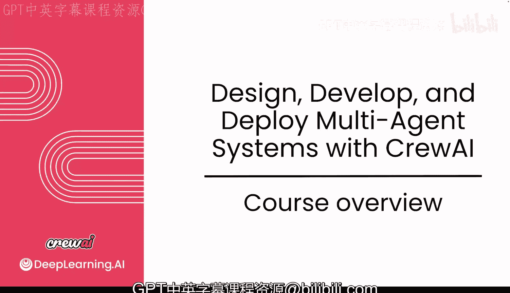
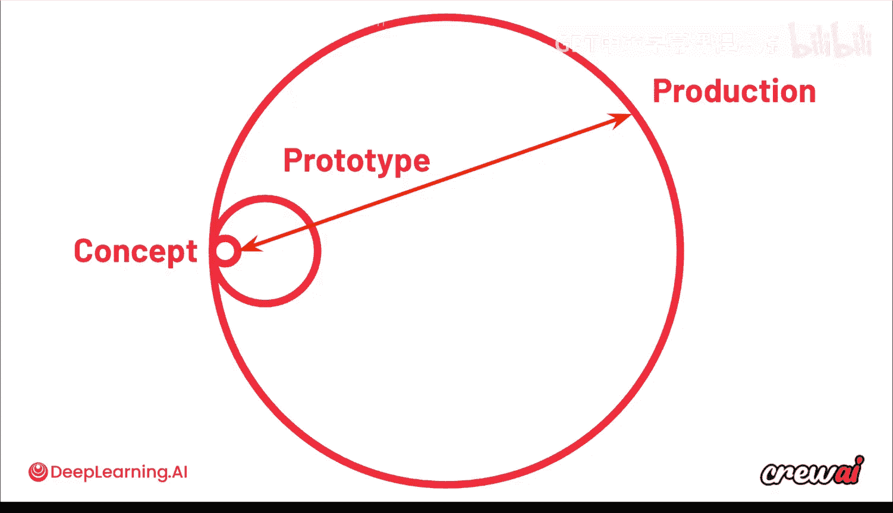
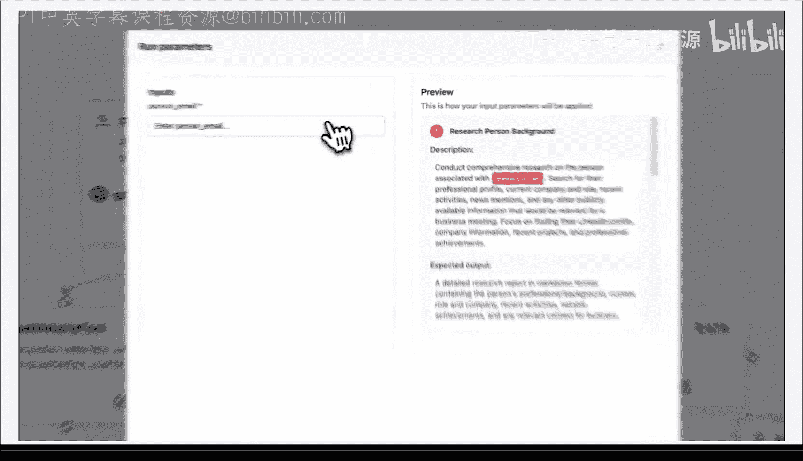
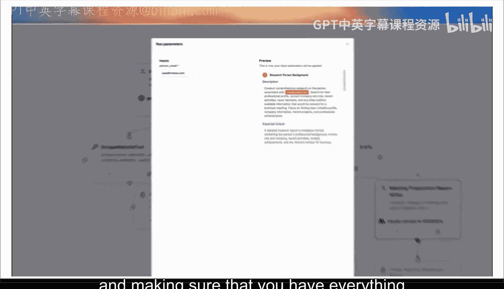
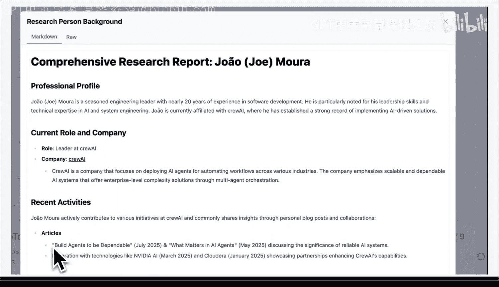
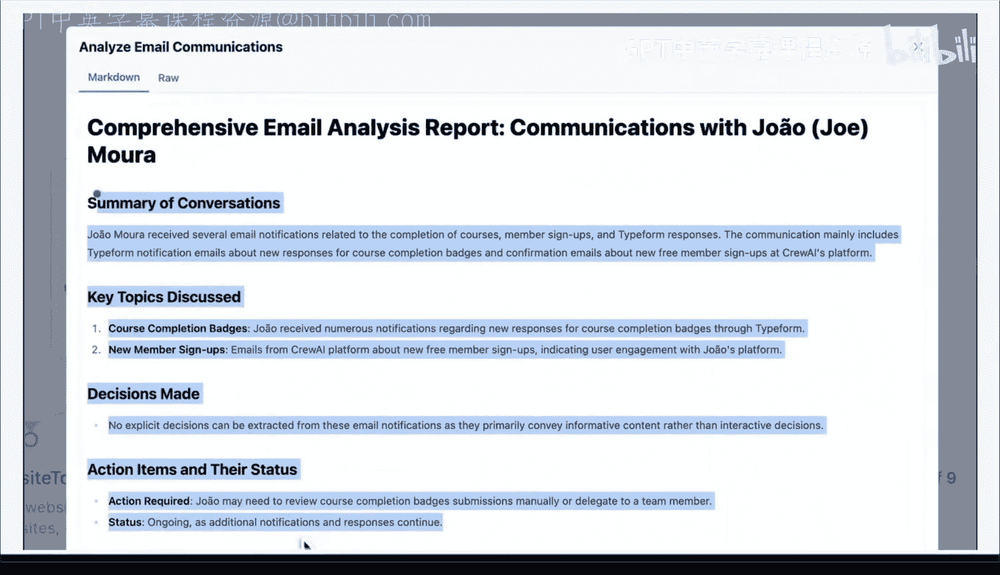
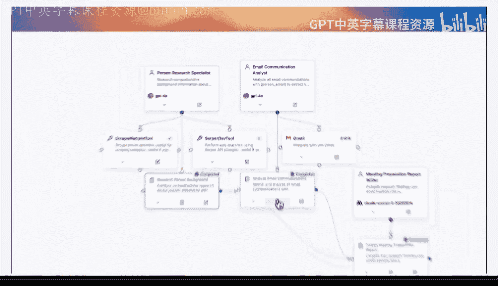
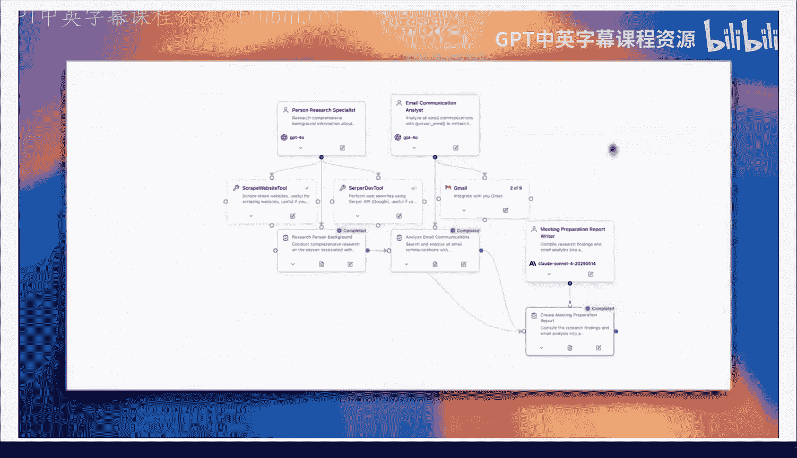
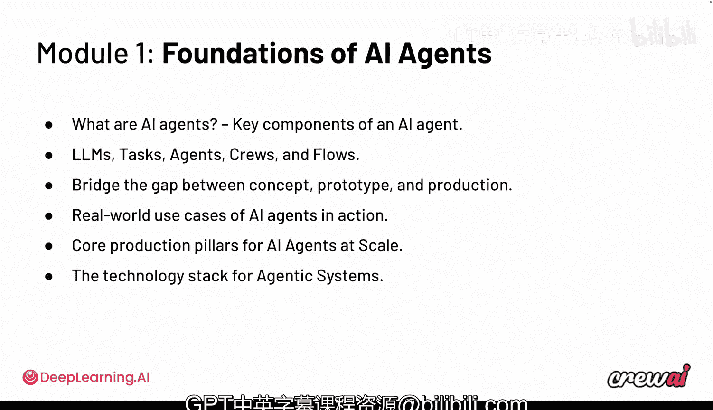

# 002：课程概述 🚀

在本节课中，我们将一起了解这门课程的整体框架和学习目标。我们将探讨课程涵盖的核心主题，并预览一个实际的多智能体系统应用案例，为后续的深入学习奠定基础。

欢迎来到本课程的第一个模块。

我们将探讨关于AI智能体的一切知识。

我们将学习如何构建AI智能体，从原型设计一直到生产部署。

课程内容将非常精彩，你将学到所需的一切知识。

让我们直接开始，以便立即投入学习。

以下是你可以从本课程中期待的内容。我们将涵盖很多方面。

你将学习如何构建你的第一个多智能体系统并对其进行改进。但不仅仅是构建。

你将学习如何管理不同规模的AI智能体，从从小规模开始，到扩展并进入生产阶段。

我们还将讨论评估，以及如何衡量智能体系统的性能。

但我们不会止步于此。我们希望探讨围绕智能体正在形成的新技术栈这一理念。

同时，我希望聚焦于一些更大、更具影响力的实际用例。

以及现实世界中正在运行的内容。公司实际在做的事情以及它们是如何运作的。

最后，我们将进行总结。

将本课程中学到的所有原则应用到你的职业生涯中，如何将你将在本课程中学到的一切回归到你可以自己构建的用例中。

因此，我对此感到非常兴奋。本课程的许多重点将围绕你如何从概念上思考这些智能体。

以及如何以允许你进入生产阶段的方式对它们进行原型设计。

当你构思一个用例时，其概念本身可能极其简单。

但从概念到原型的距离却非常巨大。

而当你进入生产阶段时，这个距离甚至更宽。

现在，为了让你从最初的概念出发，不仅要实现用例本身，还要实现所有的平衡、检查、监控和可观测性。

如果你没有从一开始就考虑这些，后续可能会遇到问题。

在继续之前，让我们先看看一个功能齐全的生产级智能体团队是什么样子。更重要的是，一个你能够在课程结束时自己构建，并能帮助你日常工作的团队。

让我们以准备会议这个用例来思考。

你将与某人会面，可能是销售会议或合作伙伴会议，但你需要做好准备。何不使用智能体来完成呢？

假设你将与我见面，你想了解更多关于我的信息，并确保在我们见面时一切准备就绪。

那么，你基本上可以在这里输入我的邮箱，启动你的智能体群组，它们将为你完成所有的研究工作。

在研究方面，你可以看到它找到了关于我的所有信息，包括我拥有多年的工程经验、曾任职的公司以及我贡献过的一些文章。

在邮件方面，它查看了我（在此案例中）与自己交换的任何电子邮件以及其中可能包含的信息。

然后，它整合出这份最终的会议报告，让我有信心为会议做好充分准备，以应对任何情况。

现在，这只是一个相对简单的用例。在本课程中，我们将一起讨论和构建更为复杂的用例。

在这第一个模块中，我只想简要说明一下你可以期待的内容。

首先要讨论的是，AI智能体究竟是什么。

以下是AI智能体的关键组成部分：
*   **大语言模型**：智能体的“大脑”，负责理解和生成信息。
*   **任务**：智能体需要执行的具体工作单元。
*   **智能体**：执行任务的独立实体。
*   **团队**：协同工作的智能体集合。
*   **工作流**：定义任务和智能体之间执行顺序的流程。

我们将讨论如何思考智能体的“代理性”和控制，以及如何弥合概念、原型和生产之间的差距。

同时，我们将聚焦于AI智能体在现实世界中的用例和实际应用，以及大规模AI智能体生产的核心支柱。

最后，我们希望确保通过这个正在形成的、面向智能体系统的新技术栈的视角和背景来审视这一切。

我非常期待与你一起学习第一个模块。让我们抓紧时间，立即开始。

我们稍后见。

---

**本节课总结**

在本节课中，我们一起学习了本课程的总体概述。我们明确了课程将指导你从零开始构建、改进并最终部署多智能体系统。课程内容不仅涵盖技术实现，还包括系统评估、规模化管理和新兴技术栈。通过一个会议准备的实例，我们初步看到了多智能体系统的实际应用潜力。接下来，我们将深入第一个模块，具体探讨AI智能体的核心概念与组成部分。